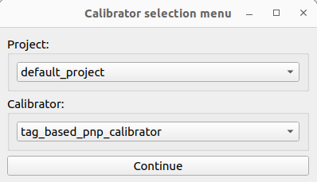
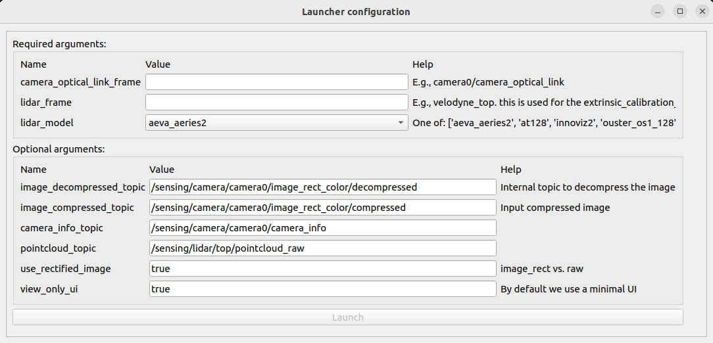
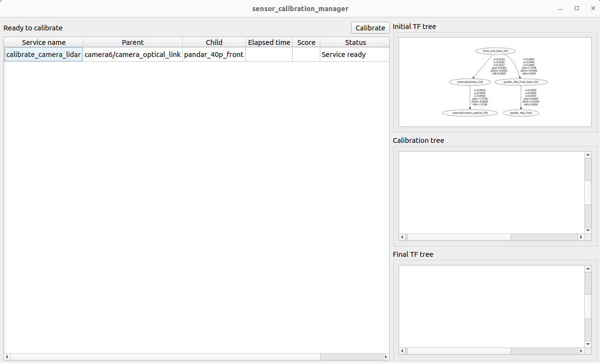
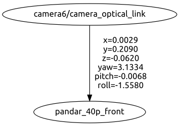
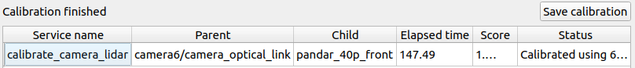

# Sensor Calibration Tools

Calibration tools for sensors used in autonomous driving and robotics (camera, lidar, and radar).

## Table of contents

- [Sensor Calibration Tools](#sensor-calibration-tools)
  - [Table of contents](#table-of-contents)
  - [Installation](#installation)
    - [Requirements](#requirements)
    - [Installation alongside autoware](#installation-alongside-autoware)
    - [Standalone installation (for non-autoware users)](#standalone-installation-for-non-autoware-users)
    - [Standalone installation using Docker (for non-autoware users)](#standalone-installation-using-docker-for-non-autoware-users)
  - [Available tools](#available-tools)
    - [Extrinsic calibration tools](#extrinsic-calibration-tools)
    - [Intrinsic calibration tools](#intrinsic-calibration-tools)
  - [Design](#design)
    - [Calibrator node](#calibrator-node)
    - [Sensor calibration manager](#sensor-calibration-manager)
      - [Projects and calibrators](#projects-and-calibrators)
      - [Calibrator interface](#calibrator-interface)
      - [Launch files](#launch-files)
      - [Launching the sensor calibration manager](#launching-the-sensor-calibration-manager)
  - [Integration](#integration)
    - [Using your vehicle/robot](#using-your-vehiclerobot)
    - [Create a new project](#create-a-new-project)
    - [Integrate a new calibrator](#integrate-a-new-calibrator)
  - [Troubleshooting & known issues](TROUBLESHOOTING.md)

## Installation

### Requirements

- Ubuntu 22.04
- ROS2 Humble <!--cSpell:ignore ROS2 -->

### Installation alongside autoware

After installing [autoware](https://github.com/tier4/autoware) (please see [source-installation](https://autowarefoundation.github.io/autoware-documentation/main/installation/autoware/source-installation/) page), execute the following commands:

```bash
cd autoware
wget https://raw.githubusercontent.com/tier4/CalibrationTools/tier4/universe/calibration_tools_autoware.repos
vcs import src < calibration_tools.repos
rosdep install -y --from-paths src --ignore-src --rosdistro $ROS_DISTRO
colcon build --symlink-install --cmake-args -DCMAKE_BUILD_TYPE=Release
```

### Standalone installation (for non-autoware users)

The sensor calibration tools are usually used as part of the autoware ecosystem. However, they can also be used for projects outside autoware, or even outside autonomous driving. Note: due to its use in autoware, even if it is possible to use the sensor calibration tools independently, due to some light dependencies, parts of autoware still need to be downloaded, even if they are not all compiled.

The following commands present an example of how to install the sensor calibration tools and their dependencies assuming you have a ROS2 workspace called `workspace` (if the workspace is new, the user must also create the `src` directory inside the `workspace`): <!--cSpell:ignore ROS2 -->

```bash
# Install vcs (if needed, follow the instructions from https://github.com/dirk-thomas/vcstool)
sudo apt-get install python3-vcstool

# Download the calibration tools and its dependencies
cd workspace
wget https://raw.githubusercontent.com/tier4/CalibrationTools/tier4/universe/calibration_tools_standalone.repos
vcs import src < calibration_tools_standalone.repos

# Install all the dependencies from rosdep
rosdep install -y --from-paths `colcon list --packages-up-to sensor_calibration_tools -p` --ignore-src

# Build the sensor calibration tools. sensor_calibration_tools is a meta package that guarantees that only the related packages are compiled
colcon build --symlink-install --cmake-args -DCMAKE_BUILD_TYPE=Release --packages-up-to sensor_calibration_tools
```

### Standalone installation using Docker (for non-autoware users)

With a similar motivation to that of the previous Section, in some cases, a native build is not possible nor convenient. To accommodate those situations, we also offer the sensor calibration tools as a docker image:

```bash
# Build
DOCKER_BUILDKIT=1 docker build --ssh default -t ghcr.io/tier4/sensor-calibration-tools:2.0 -f docker/Dockerfile ..

# Run - Modify if needed
docker run --gpus all --net=host -e ROS_DOMAIN_ID=$ROS_DOMAIN_ID -e DISPLAY=$DISPLAY -v /tmp/.X11-unix:/tmp/.X11-unix --device=/dev/dri:/dev/dri -it ghcr.io/tier4/sensor-calibration-tools:2.0 /bin/bash

# If user encounters issues like "Authorization required", use one of the alternatives below.
# Solution 1 (Not recommended):
xhost +local:docker

# Solution 2:
touch /tmp/.docker.xauth
chmod a+r /tmp/.docker.xauth

xauth nlist $DISPLAY | sed -e 's/^..../ffff/' | xauth -f /tmp/.docker.xauth nmerge -

docker run --gpus all --net=host \
  -e ROS_DOMAIN_ID=$ROS_DOMAIN_ID \
  -e DISPLAY=$DISPLAY \
  -e XAUTHORITY=/tmp/.docker.xauth \
  -v /tmp/.X11-unix:/tmp/.X11-unix \
  -v /tmp/.docker.xauth:/tmp/.docker.xauth \
  --device=/dev/dri:/dev/dri \
  -it ghcr.io/tier4/sensor-calibration-tools:2.0 /bin/bash
```

## Available tools

### Extrinsic calibration tools

| Name                                | Sensors calibrated | Feature type                | Calibration type   | Documentation                                               | Tutorial                                                |
| ----------------------------------- | ------------------ | --------------------------- | ------------------ | ----------------------------------------------------------- | ------------------------------------------------------- |
| ground plane calibrator             | base-lidar         | ground                      | roll, pitch, z     | N/A                                                         | N/A                                                     |
| interactive camera-lidar calibrator | camera-lidar       | manual correspondences      | full pose          | N/A                                                         | N/A                                                     |
| lidar-lidar 2d calibrator           | lidar-lidar        | natural features            | x, y, yaw          | N/A                                                         | N/A                                                     |
| mapping calibrator (lidar-lidar)    | lidar-lidar        | natural features            | full pose          | [Link](calibrators/mapping_based_calibrator/README.md)      | [Link](docs/tutorials/mapping_based_calibrator.md)      |
| mapping calibrator (base-lidar)     | base-lidar         | natural features and ground | roll, pitch, and z | N/A                                                         | N/A                                                     |
| marker radar-lidar calibrator       | radar-lidar        | marker                      | x, y, yaw          | [Link](calibrators/marker_radar_lidar_calibrator/README.md) | [Link](docs/tutorials/marker_radar_lidar_calibrator.md) |
| tag-based PnP calibrator            | camera-lidar       | marker                      | full pose          | [Link](calibrators/tag_based_pnp_calibrator/README.md)      | [Link](docs/tutorials/tag_based_pnp_calibrator.md)      |
| tag-based SfM calibrator            | camera-lidar-base  | marker                      | full pose          | [Link](calibrators/tag_based_sfm_calibrator/README.md)      | [Link](docs/tutorials/tag_based_sfm_calibrator.md)      |

### Intrinsic calibration tools

| Name                         | Sensors calibrated | Feature type       | Calibration type    | Documentation | Tutorial |
| ---------------------------- | ------------------ | ------------------ | ------------------- | ------------- | -------- |
| camera intrinsics calibrator | camera intrinsics  | calibration boards | OpenCV camera model | N/A           | N/A      |

## Design

The sensor calibration tools repository provides multiple alternatives for both intrinsic and extrinsic calibration. That being said, the rest of this document focuses only on extrinsic calibration since camera intrinsic calibration is a direct and easy-to-understand process.

The architecture of the extrinsic calibration process consists of two entities: the calibrator node itself and the sensor calibration manager (additional nodes may be used, but they do not participate directly in the calibration process). In what follows, we proceed to detail the roles of each one of these elements.

### Calibrator node

The calibrator node is a regular node that implements the [ExtrinsicCalibrator](common/tier4_calibration_msgs/srv/ExtrinsicCalibrator.srv) service:

```text
---
tier4_calibration_msgs/CalibrationResult[] results
```

where [CalibrationResult](common/tier4_calibration_msgs/msg/CalibrationResult.msg) contains a transformation between frames, a status flag, and optional scores and text messages for evaluation and debug purposes.

```text
geometry_msgs/TransformStamped transform_stamped
bool success
float32 score
std_msgs/String message
```

The design is intended to decouple the calibrator node and its internal logic as much as possible from the details of a particular calibration use-case and the `tf` structure used.
The code of the calibrator itself is agnostic to everything other than its particular task, with the service request not even containing the frames to calibrate. This way, all use-case-specific concerns are specified during node and launcher configuration implemented in the `sensor_calibration_manager` package, achieving a high level of separation of concerns and code reusability.

### Sensor calibration manager

Although the calibrator process can be performed directly via launching the calibrator node (which involves non-trivial parameterization) and using the service interface using the CLI (`ros2 service call ...`), it is highly recommended to automate the process using the `sensor_calibration_manager` package.
The `sensor_calibration_manager` implements a UI that allows the user to select a particular combination of `project` and `calibrator`, makes sure that the required `tf` and services are available, and processes/saves the calibration results.

#### Projects and calibrators

At TIER IV, we currently run several projects that use various types of sensors. However, we do not create calibrators nodes for each particular project, and instead reuse the same code, only modifying the parameters and helper nodes. To achieve this, in the `sensor_calibration_manager` package, we introduce the concepts of `projects` and `calibrators`. In this context, a `project` consists of a list of `calibrators` (note that in this context `calibrators` are different from calibrator nodes), with the same calibrator (semantically) being able to belong to multiple projects.

An example of the files involved in this scheme is:

```text
cd sensor_calibration_manager/sensor_calibration_manager/calibrators && find .
./projectA/
./projectA/calibratorA.py
./projectA/calibratorB.py
./projectA/__init__.py
./projectB/
./projectB/calibratorA.py
./projectB/calibratorB.py
./projectB/__init__.py
./projectC/
./projectC/calibratorC.py
./projectC/__init__.py
./__init__.py
```

In this example, the calibrators folder is placed inside the `sensor_calibration_manager` package, each `project` is organized in its own folder (e.g., `projectA`, `projectB`, and `projectC`), and inside each `project` folder, one or more `calibrators` are represented via python files (e.g., `calibratorA.py`, `calibratorB.py`, and `calibratorC.py`).

- Note how some `calibrators` are present in more than one `project`. This essentially means that said `calibrator` can be used in multiple `projects`, albeit with its own set of configuration files (more on this later). For example, we would like to calibrate buses and robo-taxis with the `tag-based PnP calibrator` method.
- `__init__.py` files are used to register the `projects` and `calibrators` within the `sensor_calibration_manager` package. How to write these files is explained in the [Integration](#integration) Section.

#### Calibrator interface

A calibrator interface is the representation of the calibration process inside the `sensor_calibration_manager` package. It specifies its `project`, the `calibrator` name, the `tf`s that are required during the calibration process, and the expected frames that the calibrator node should return.

Following the previous example, the `calibratorA.py` file could be implemented as follows:

```python
@CalibratorRegistry.register_calibrator(
    project_name="projectA", calibrator_name="calibratorA"
)
class CalibratorA(CalibratorBase):
    required_frames = ["calibration_parent_frame", "calibration_child_frame", "auxiliar_frame"]

    def __init__(self, ros_interface: RosInterface, **kwargs):
        super().__init__(ros_interface)

        self.add_calibrator(
            service_name="the_name_of_the_calibration_service",
            expected_calibration_frames=[
                FramePair(parent="calibration_parent_frame", child="calibration_child_frame"),
            ],
        )

```

In addition to specifying `required_frames` and `services_name`, the calibrator interfaces are also used to post-process the calibration results if needed to conform to robotics frame conventions and other project-specific requirements.

For example, camera-lidar calibration returns the `tf` from the `optical_link` to the `lidar` frame itself. However, in most scenarios, instead of the `optical_link`, the `camera_link` is preferred in configuration files (the `camera_link` has different axes), and for some lidars, integrators would prefer to use their `base_link` or footprint (not to be confused with the vehicle's `base_link`) since it allows them to work better with CAD files.

At TIER IV, most sensors are mounted in a structure called `sensor_kit` and most `tfs` that correspond to sensor calibration either start or end at this frame (e.g., `base_link` to `sensor_kit` or `sensor_kit` to `lidar_base_link`).

In particular, for the case of camera-lidar, the `tf` that represents the camera-lidar calibration in most of our projects is `sensor_kit_base_link` to `cameraX/camera_link`. To transform the `tf` that the calibrator returns (`cameraX/camera_optical_link` to `lidar`) to the one we need to save, the post-process step can be implemented as follows:

```python
# Taken from sensor_calibration_manager/sensor_calibration_manager/calibrators/xx1/tag_based_pnp_calibrator.py
def post_process(self, calibration_transforms: Dict[str, Dict[str, np.array]]):
    optical_link_to_lidar_transform = calibration_transforms[
        f"{self.camera_name}/camera_optical_link"
    ]["velodyne_top"]
    sensor_kit_to_lidar_transform = self.get_transform_matrix(
        "sensor_kit_base_link", "velodyne_top"
    )
    camera_to_optical_link_transform = self.get_transform_matrix(
        f"{self.camera_name}/camera_link", f"{self.camera_name}/camera_optical_link"
    )
    sensor_kit_camera_link_transform = np.linalg.inv(
        camera_to_optical_link_transform
        @ optical_link_to_lidar_transform
        @ np.linalg.inv(sensor_kit_to_lidar_transform)
    )

    result = {
        "sensor_kit_base_link": {
            f"{self.camera_name}/camera_link": sensor_kit_camera_link_transform
        }
    }
    return result
```

\*Note: in this example, `sensor_kit_to_lidar_transform` is assumed as known and is fixed, since it corresponds to a previous lidar-lidar calibration result or it is a hardcoded value.

#### Launch files

The calibrator interface does not implement any of the ROS logic in terms of the involved nodes. This part of the process is implemented by regular launch files that are called by the `sensor_calibration_manager` package.

Following the previous example, the launcher structure would be as follows:

```text
launch/
launch/projectA/
launch/projectA/calibratorA.launch.xml
launch/projectA/calibratorB.launch.xml
launch/projectB/
launch/projectB/calibratorA.launch.xml
launch/projectB/calibratorB.launch.xml
launch/projectC/
launch/projectC/calibratorC.launch.xml
```

\*Note: a `calibrator interface` with the values `project_name="projectA"` and `calibrator_name="calibratorA"` will launch `launch/projectA/calibratorA.launch.xml`

The launch file can have arguments with and without default arguments that will be automatically transformed into a configurable UI so the user can set them during start-up.
One point of note is that the service specified in the calibrator interface must be offered by a node in the launch file.

\*Note: the values of the arguments defined in the launcher file are accessible to the `calibration interface` via `kwargs`.

#### Launching the sensor calibration manager

To use the calibration manager, execute the following command (after sourcing the ROS workspace):

```bash
ros2 run sensor_calibration_manager sensor_calibration_manager
```

The following window will be displayed:

<p align="center">
  
</p>

Then, the user must select a combination of `project` and `calibrator` and press `Continue`, which will display the following menu:

<p align="center">
  
</p>

Here, the user must configure the launcher arguments as required. Since we are using the combination of `default_project` and `tag_based_pnp_calibrator`, the launcher file being parameterized under the hood is `sensor_calibration_manager/launch/default_project/tag_based_pnp_calibrator.launch.xml`. Once the user finishes setting the parameter, he must click the `Launch` button.

After this, the sensor calibrator manager will execute the previous launch file with the corresponding parameters and internally use `sensor_calibration_manager/sensor_calibration_manager/calibrators/default_project/tag_based_pnp_calibrator.py` as its calibrator interface. The following window will be displayed:

<p align="center">
  
</p>

If the calibrator node launches successfully, its service becomes available, and the required `tf` are all present, the `calibrate` button should become enabled. Clicking this calls the calibration service, and starts the process.

For visualization purposes, the sensor calibration manager displays the required `tf` specified in the calibrator interface as shown in the following image:

<p align="center">
  
</p>

Once the calibration finishes, the result from the `ExtrinsicCalibrator` is displayed in the `Calibration tree` widget as shown in the following image:

<p align="center">
  
</p>

If the calibrator interface had post-processing steps, the `Final TF tree` widget would show the processed results. In this case, since there is not a post-process step, both widgets are the same.

Finally, to save the results, press the `save calibration` button.

<p align="center">
  
</p>

## Integration

### Using your vehicle/robot

Although we provide several projects and examples, in most cases the user would need to modify several parts of this repository to create their calibration projects. To ease this process, we also created a `default_project` that exposes most of each calibrator's parameters so that users can use this repository without creating any new files. In turn, however, they must properly configure most of the calibrator's options in the `Launcher configuration` widget, which is mostly done automatically in our internal projects.

### Create a new project

If the default project is not enough or does not meet the needs of the user (for example, if they are going to start projects that require running the tools frequently), it is relatively easy to create new projects and calibrator interfaces. In what follows, we will create a new project titled `my_new_project` with a calibrator called `my_new_calibrator`.

First, to make `my_new_project` known within the `sensor_calibration_manager` package, add the following line to `sensor_calibration_manager/sensor_calibration_manager/calibrators/__init__.py`:

```python
from .my_new_project import *  # noqa: F401, F403
```

This will make the UI attempt to load all the calibration interfaces of `my_new_project`.
Then, create a file called `sensor_calibration_manager/sensor_calibration_manager/calibrators/my_new_project/__init__.py`.

```python
from .my_new_calibrator import MyNewCalibrator

__all__ = [
    "MyNewCalibrator",
]
```

This will make `MyNewCalibrator` to be imported when importing `my_new_project`.
After this, create a file called `sensor_calibration_manager/sensor_calibration_manager/calibrators/my_new_project/my_new_calibrator.py` with the following contents:

```python
from sensor_calibration_manager.calibrator_base import CalibratorBase
from sensor_calibration_manager.calibrator_registry import CalibratorRegistry
from sensor_calibration_manager.ros_interface import RosInterface
from sensor_calibration_manager.types import FramePair


@CalibratorRegistry.register_calibrator(
    project_name="my_new_project", calibrator_name="my_new_calibrator"
)
class MyNewCalibrator(CalibratorBase):
    required_frames = []

    def __init__(self, ros_interface: RosInterface, **kwargs):
        super().__init__(ros_interface)

        self.source_frame: str = kwargs["source_frame"]
        self.target_frame: str = kwargs["target_frame"]

        self.required_frames.extend([self.base_frame, self.source_frame, self.target_frame])

        self.add_calibrator(
            service_name="calibrate_service_name",
            expected_calibration_frames=[
                FramePair(parent=self.target_frame, child=self.source_frame),
            ],
        )

```

This calibrator will expect a calibrator between `source_frame` and `target_frame`, which are parameters provided by the user through the launcher file.

Finally, the user must create the correspondent launch file `sensor_calibration_manager/launch/my_new_project/my_new_calibrator.launch.xml`.
The launcher itself must contain the following arguments to match the calibrator interface:

```xml
<arg name="source_frame"/>
<arg name="target_frame"/>
```

Default values are optional, and somewhere within the launch file, the user needs to add a node that provides the `calibrate_service_name` to match the calibrator interface. Complete examples of the contents of the launcher and calibration interfaces can be found in our current `projects` and `calibrators`.

### Integrate a new calibrator

In the previous Section, we created a new calibrator interface and added it to the sensor calibration manager. However, that assumes that the user will use one of the calibrator packages offered by the sensor calibration tools.

In the case the user wants to integrate his own algorithms, he must comply with the following the instructions, which assume the reader knows and is used to creating ROS2 packages. <!--cSpell:ignore ROS2 -->

- Create a ROS2 package called `my_new_calibrator_package`. The node itself needs to be part of a multi-thread executor with at least two threads. This is due to the calibration service call only returning once the calibration process finishes.<!--cSpell:ignore ROS2 -->
- Add a dependency to the `tier4_calibration_msgs` package in `package.xml` to use the calibration services.
- In the node's header file add a calibration service.
- In most cases, creating a group exclusive to the services is also required.

In the header file:

```c++
...
rclcpp::Service<tier4_calibration_msgs::srv::ExtrinsicCalibrator>::SharedPtr service_server_;
rclcpp::CallbackGroup::SharedPtr srv_callback_group_
...
```

In the source file:

```c++
...
// The service server runs in a dedicated thread since it is a blocking call
srv_callback_group_ = create_callback_group(rclcpp::CallbackGroupType::MutuallyExclusive);

service_server_ = this->create_service<tier4_calibration_msgs::srv::ExtrinsicCalibrator>(
  "extrinsic_calibration_service_name",
  std::bind(
    &MyNewCalibratorPackage::requestReceivedCallback, this, std::placeholders::_1,
    std::placeholders::_2),
  rmw_qos_profile_services_default, srv_callback_group_);
  ...
```

In addition to this, the user must implement `requestReceivedCallback` to comply with the interface.
