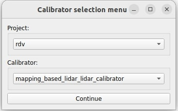

# mapping_based_calibrator

In this tutorial, we present a hands-on tutorial of the `mapping_based_calibrator`, in particular, of its lidar-lidar calibration capabilities. Although we provide pre-recorded rosbag, the flow of the tutorial is meant to show the user the steps they must perform in their own use cases with live sensors.

General documentation regarding this calibrator can be found [here](../../mapping_based_calibrator/README.md).

## Setup

This tutorial assumes that the user has already built the calibration tools.
Installation instructions can be found [here](../../README.md)

## Data preparation

Please download the data (rosbag) from [here](https://drive.google.com/drive/folders/1e0rajkGfXrKl-6E5oouALdbjeva1c5X1).

The rosbag includes four pointcloud topics published by different lidar sensors and also includes `tf_static` information.

## Environment preparation

### Overall calibration environment

The required space for calibration depends on the vehicle and sensors used. It is recommended to have a large enough space for the vehicle
to drive around 30 to 50 meters.

### Vehicle

Before starting the calibration, the user needs to drive the vehicle to collect the pointcloud `ros2 bag record -a` for building the map. While recording data during the experiment, slow down the vehicle's speed as much as possible. For instance, driving slower than 5 km/hr is good for recording quality data. Also, during the experiment, try to avoid people walking around the vehicle and aim to keep the surroundings static.

## Launching the tool

In this tutorial, we use the RDV of Tier IV (R&D Vehicle).
First, run the sensor calibration manager:

```text
ros2 run sensor_calibration_manager sensor_calibration_manager
```

In `project`, select `rdv`, and in `calibrator`, select `mapping_based_calibrator`. Then, press `Continue`.

<p align="center">
    
</p>

A menu titled `Launcher configuration` should appear in the UI, and the user may change any parameter he deems convenient. However, for this tutorial, we use the default values. After configuring the parameters, click `Launch`.

<p align="center">
    
</p>

The following UI should be displayed. When the `Calibrate` button becomes available, click it.
If it does not become available, it means that either the required `tf` or services are not available. In this case, since the `tf` are published by the provided rosbags, run it for a few seconds and then pause it (`ros2 bag play lidar_lidar.db3 --clock -r 0.1`).

<p align="center">
    
</p>

Note: In the `/calibration_tools/sensor/sensor_calibration_manager/launch/rdv/mapping_based_lidar_lidar_calibrator.launch.xml`, the RDV vehicle set the top lidar as `mapping lidar`, and other lidars as `calibration lidars`.

## Data collection (Mapping & Data paring)

Once you have clicked the `Calibrate` button, the first step of the calibration process will automatically start building the map by using the NDT/GICP algorithm with the `mapping lidar`. You can visualize the process of building the map on the `rviz`.

<p align="center">
    
</p>

You can also see the log in the console showing that the map is building.

```text
[mapping_based_calibrator-1] [calibration_mapper]: ROS: New pointcloud. Unprocessed=1 Frames=26 Keyframes=2
[mapping_based_calibrator-1] [calibration_mapper]: Registrator innovation=0.00. Score=0.04
[mapping_based_calibrator-1] [calibration_mapper]: New frame (id=26 | kid=-1). Distance=2.04 Delta_distance0.11 Delta_time0.10. Unprocessed=0 Frames=27 Keyframes=2 (mappingThreadWorker())
[mapping_based_calibrator-1] [calibration_mapper]: ROS: New pointcloud. Unprocessed=1 Frames=27 Keyframes=2
[mapping_based_calibrator-1] [calibration_mapper]: Registrator innovation=0.00. Score=0.04
[mapping_based_calibrator-1] [calibration_mapper]: New frame (id=27 | kid=3). Distance=2.15 Delta_distance0.11 Delta_time0.10. Unprocessed=0 Frames=28 Keyframes=3 (mappingThreadWorker())
[mapping_based_calibrator-1] [calibration_mapper]: ROS: New pointcloud. Unprocessed=1 Frames=28 Keyframes=3
[mapping_based_calibrator-1] [calibration_mapper]: Registrator innovation=0.00. Score=0.01
[mapping_based_calibrator-1] [calibration_mapper]: New frame (id=28 | kid=-1). Distance=2.26 Delta_distance0.11 Delta_time0.10. Unprocessed=0 Frames=29 Keyframes=3
```

When the rosbag has finished playing, you should see the pointcloud map and the path of the lidar frames, as shown in the picture below.

<p align="center">
    
</p>

## Calibration

Calibration starts when the user sends the command `ros2 service call /stop_mapping std_srvs/srv/Empty`. The user can send this command before the rosbag ends if they think the data collected is sufficient for calibration.

In this tutorial, we send the command after the rosbag runs until the end. Once the command is sent, the displayed text should be as follows:

```text
[mapping_based_calibrator-1] [mapping_based_calibrator_node]: Mapper stopped through service (operator()())
[mapping_based_calibrator-1] [calibration_mapper]: Mapping thread is exiting (mappingThreadWorker())
[mapping_based_calibrator-1] [mapping_based_calibrator_node]: Beginning lidar calibration for pandar_front (operator()())
```

The calibration process may take some time, as it involves multiple lidars. Users should remain patient and monitor the console output to track the progress of the calibration.

Once the calibration process is complete, the displayed text should be as follows:

```text
[mapping_based_calibrator-1] [lidar_calibrator(pandar_left)]: Calibration result as a tf main lidar -> lidar_calibrator(pandar_left)
[mapping_based_calibrator-1] [lidar_calibrator(pandar_left)]:  translation:
[mapping_based_calibrator-1] [lidar_calibrator(pandar_left)]:   x: -0.001519
[mapping_based_calibrator-1] [lidar_calibrator(pandar_left)]:   y: -0.609573
[mapping_based_calibrator-1] [lidar_calibrator(pandar_left)]:   z: -0.366957
[mapping_based_calibrator-1] [lidar_calibrator(pandar_left)]:  rotation:
[mapping_based_calibrator-1] [lidar_calibrator(pandar_left)]:   x: 0.346912
[mapping_based_calibrator-1] [lidar_calibrator(pandar_left)]:   y: 0.000018
[mapping_based_calibrator-1] [lidar_calibrator(pandar_left)]:   z: -0.005994
[mapping_based_calibrator-1] [lidar_calibrator(pandar_left)]:   w: 0.937887
[mapping_based_calibrator-1] [mapping_based_calibrator_node]: Lidar calibration for pandar_left finished
[mapping_based_calibrator-1] [mapping_based_calibrator_node]: Sending the results to the calibrator manager
```

The user can also see the three different colors of pointcloud in the `rviz`. white for the map from the `mapping lidar`, red for the initial map from the `calibration lidars`, and green for the calibrated map from the `calibration lidars`.

<p align="center">
    
</p>

## Results

After the calibration process finishes, the `sensor_calibration_manager` will display the results in the UI and allow the user to save the calibration data to a file.

In the UI of the RDV project, three different TF trees are displayed: `Initial TF Tree`, `Calibration Tree`, and `Final TF Tree`. The `Initial TF Tree` presents the initial TF connections between sensors needed for calibration. The `Calibration Tree` shows the calibrated transformation between sensors, in this tutorial, `pandar_top`, `pandar_front`, `pandar_right`and `pandar_left`. The `Final TF Tree` depicts the TF tree after incorporating the updated calibrated transformation. Since the transformations represented by the black arrows are fixed, the transformations between `sensor_kit_base_link`, `pandar_front_base_link`, `pandar_left_base_link`, and `pandar_right_base_link`, which are represented by the red arrows, can be calculated using the calibrated transformation.

<p align="center">
    
</p>

To evaluate the calibration results, users can measure static objects within the pointcloud map, such as stationary vehicles, traffic cones, and walls.

The image below displays the vehicle within the pointcloud, allowing for a comparison of results before and after calibration. It is evident that the initial pointcloud from `calibration lidars` (shown in red) has been successfully calibrated (shown in green) and is now aligned with the `mapping lidar` (shown in white).

<p align="center">
    
</p>

## FAQ

- Why does the calibration fail?

  1. Check the console first to see the error message.
  2. Check the rviz to see if any number on the path (keyframe number) is red (normally it is white). If it is red, there is a chance that the motion of the vehicle is not smooth. For instance, if the acceleration of the vehicle is too fast, the mapping might fail. We recommend the user calibrate with more stable movement again.
  3. Tune the parameters in the `Calibration criteria parameters` described in the [documentation](../../mapping_based_calibrator/README.md) if it is needed.
