# marker_radar_lidar_calibrator

In this tutorial, we present a hands-on tutorial of the `marker_radar_lidar_calibrator`. Although we provide a pre-recorded rosbag, the flow of the tutorial is meant to show the user the steps they must perform in their own use cases with live sensors.

General documentation regarding this calibrator can be found [here](../../marker_radar_lidar_calibrator/README.md).

## Setup

This tutorial assumes that the user has already built the calibration tools.
Installation instructions can be found [here](../../../README.md).

## Data preparation

Please download the data (rosbag) from [here](https://drive.google.com/drive/folders/1G1n2AV47gbQFKQtlzbHJPeV10m5_uMMk).

The rosbag includes three different topics: `/sensing/radar/front_center/objects_raw`, `/sensing/lidar/front_lower/pointcloud_raw`, and `tf_static`.

## Environment preparation

### Overall calibration environment

The required space for calibration depends on the vehicle and sensors used. Generally, an open space without any other objects is an ideal calibration environment. During the calibration, please always make sure that reflectors are detected by both radar and lidar. The user could always check whether the reflectors appear in the `rviz` with the corresponding topics.

### Radar reflector

It is recommended to utilize a tripod to adjust the height of the radar reflector and also modify its center to align with the radar sensor. More information about the radar reflector can be found in the [general documentation](../../marker_radar_lidar_calibrator/README.md#radar-reflector).

## Launching the tool

In this tutorial, we take the X2 project as an example.
First, run the sensor calibration manager:

```text
ros2 run sensor_calibration_manager sensor_calibration_manager
```

In `project`, select `x2`, and in `calibrator`, select `marker_radar_lidar_calibrator`. Then, press `Continue`.

<p align="center">
    
</p>

A menu titled `Launcher configuration` should appear in the UI, and the user may change any parameter he deems convenient.
For this tutorial, we modify the default value `radar_name` from `front_left` to `front_center`. After configuring the parameters, click `Launch`.

<p align="center">
    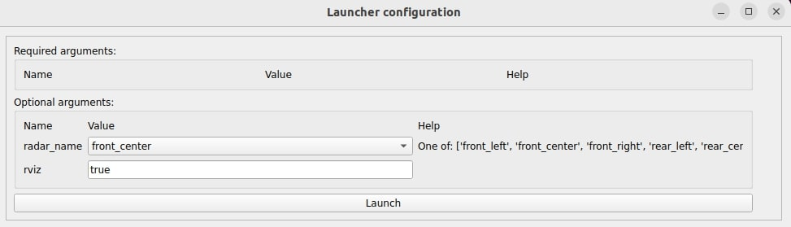
</p>

The following UI should be displayed. When the `Calibrate` button becomes available, click it.
If it does not become available, it means that either the required `tf` or services are not available. In this case, since the `tf` are published by the provided rosbag, run the bag with the command `ros2 bag play radar_lidar.db3 --clock -r 0.5` and click the `Calibrate` button.

<p align="center">
    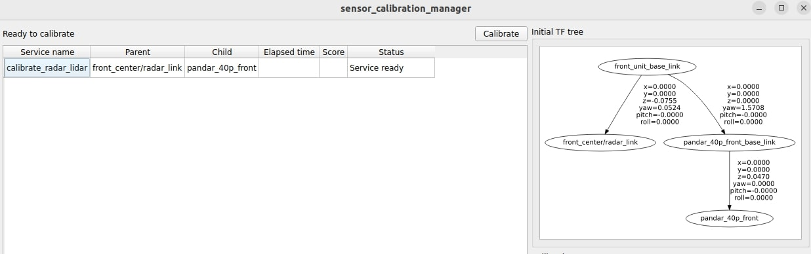
</p>

### Extract background model

Once the user starts running the tutorial rosbag, the pointcloud should appear in `rviz` as shown in the example below. Press the `Extract Background Model button` in the UI to start extracting the background.

Note that the user should remove the radar reflector from the calibration area before clicking the button. Ideally, there should not be any moving objects, such as humans or vehicles, in the calibration area.

<p align="center">
    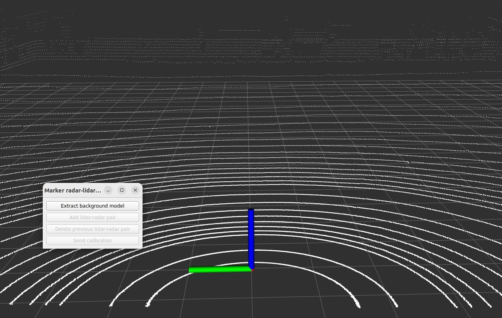
</p>

Once the user clicks the button, the result will appear as shown in the image below.

<p align="center">
    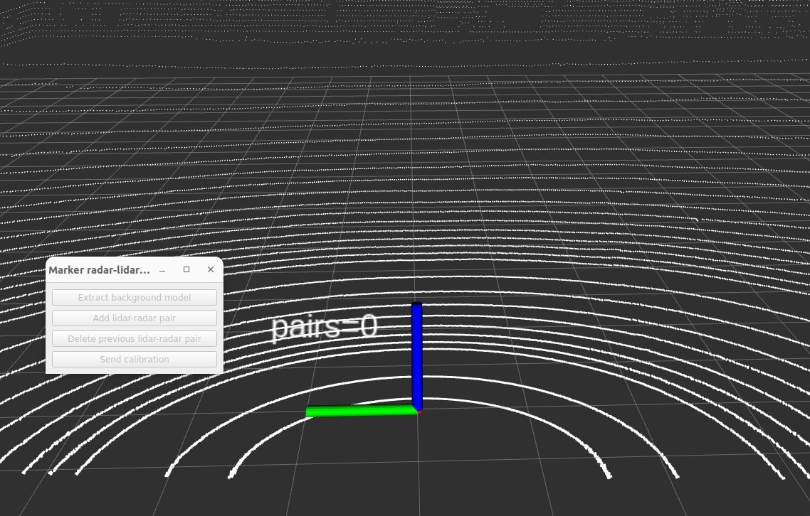
</p>

Once the background is extracted, the result will appear as shown in the image below. The user can see that the `Add lidar-radar pair` button is enabled.

<p align="center">
    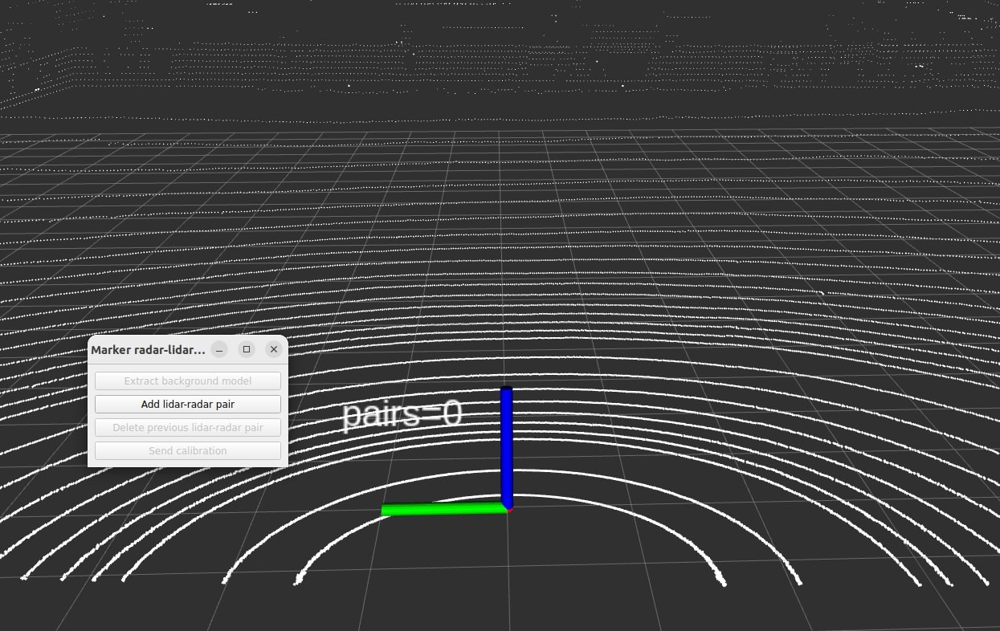
</p>

Also, the following text should be shown in the console.

```text
[marker_radar_lidar_calibrator]: Finished background model initialization
```

Additionally, the user can click the topics: `lidar_background_pointcloud`, `lidar_foreground_pointcloud`, `radar_foreground_pointcloud` and `radar_background_pointcloud` on the left bar of the `rviz` to visualize the output of background and foreground pointcloud. In the [documentation](../../marker_radar_lidar_calibrator/README.md), we referred to `radar foreground objects`; here, we call it radar_foreground_pointcloud for visualization purposes.

<table>
  <tr>
    <td>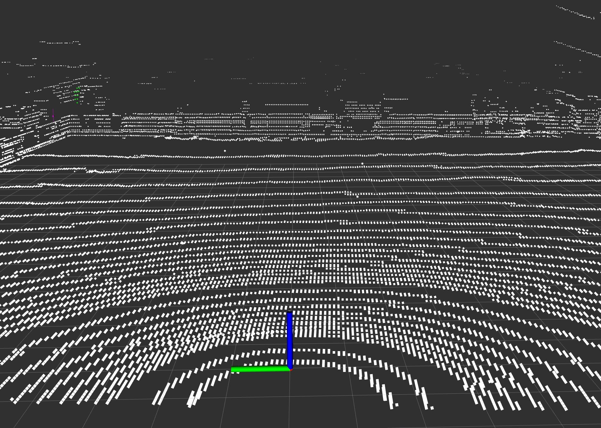</td>
    <td></td>
   </tr>
   <tr>
    <td><p style="text-align: center;">Lidar background pointcloud.</p></td>
    <td><p style="text-align: center;">Lidar foreground pointcloud</p></td>
  </tr>
</table>

<table>
  <tr>
    <td>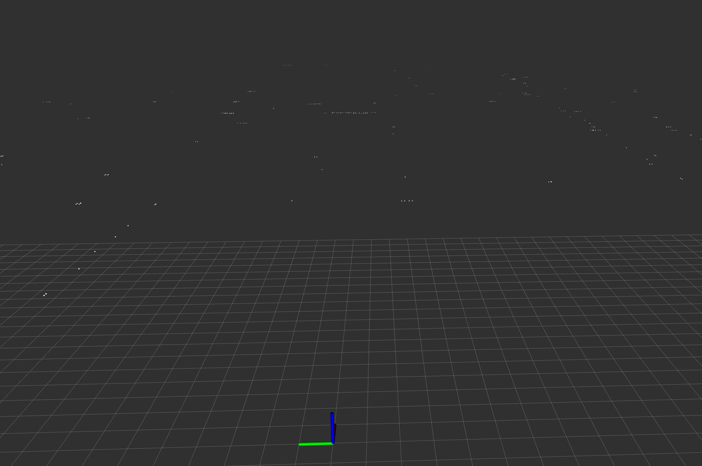</td>
    <td></td>
   </tr>
   <tr>
    <td><p style="text-align: center;">Radar background pointcloud.</p></td>
    <td><p style="text-align: center;">Radar foreground pointcloud (shown in purple lines). <br>The pointcloud appears as lines due to the radar's lack of elevation data.</p></td>
  </tr>
</table>

### Add lidar-radar pair

After the background model has been extracted, the user can carry the radar reflector (with the tripod) and place it in the [calibration area](../../marker_radar_lidar_calibrator/README.md#pro-tipsrecommendations). Once the reflector is positioned, the user should move away from it. In the tutorial rosbag, the user will see that both the human and the radar reflector (with tripod) are identified as foreground objects in the image below.

In the image, the colored points represent different lidar foreground clusters. The purple lines indicate radar foreground detections, appearing as lines due to the radar's lack of elevation data, making the z-axis unknown. The blue point is the estimated center of the radar reflector derived from the lidar pointcloud. There is no blue point on the human cluster because the calibrator filters out clusters where the highest point in the cluster exceeds the specified threshold.

<p align="center">
    
</p>

When the purple line connects the purple point (the radar estimation of the reflector) and the blue point (the lidar estimation of the reflector), the user can press the `Add lidar-radar pair` button to register them as a pair.

Afterward, if the pair that the user added converges, it will become a converged pair, which will then be used for calibration. Additionally, the colors of the markers will change: the white point indicates the lidar estimation, the red point marks the initial radar estimation, and the green point signifies the calibrated radar estimation."

<p align="center">
    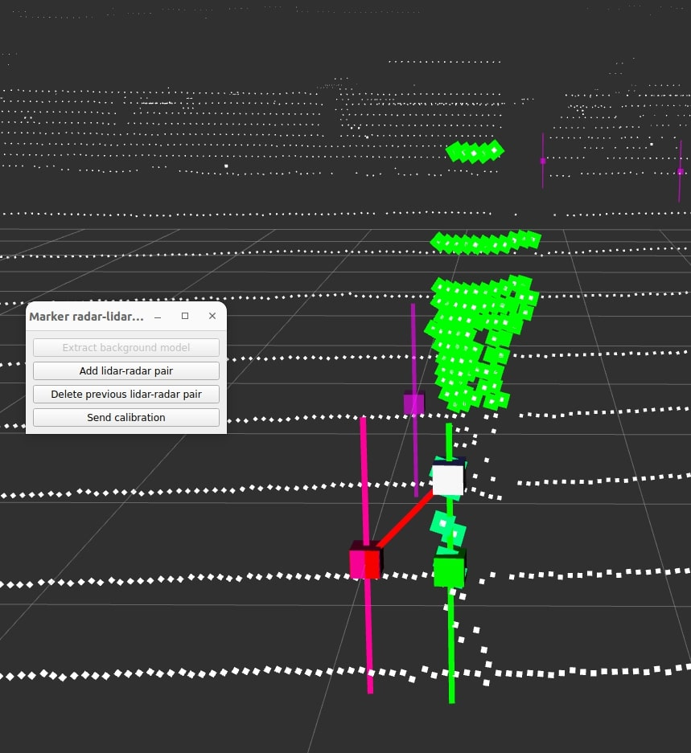
</p>

As described in the [Step 3: Matching and filtering](../../marker_radar_lidar_calibrator/README.md#step-3-matching-and-filtering) in the general documentation, we rely on the initial calibration to pair each lidar detection with its closest radar detection, and vice versa. Below, we show examples of good and bad initial calibration.

In both images, the calibrator detects one lidar detection (blue points) and two radar detections (purple lines). The radar detections identify two potential reflectors: a human and a radar reflector (located closer to the bottom of the image). In the good initial calibration image, the blue point from lidar detection will correctly match the radar detection, as they are the closest to each other. However, in the image of bad initial calibration, the lidar detection will incorrectly match the radar detection of the human.

<table>
  <tr>
    <td>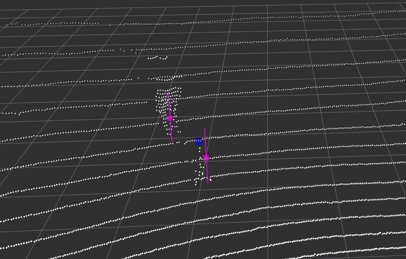</td>
    <td></td>
   </tr>
   <tr>
    <td><p style="text-align: center;">Good initial calibration.</p></td>
    <td><p style="text-align: center;">Bad initial calibration.</p></td>
  </tr>
</table>

### Delete previous lidar-radar pair

During the calibration, if there are any mismatched pairs (e.g., a human appearing in front of both the radar and lidar), the user can click the `Delete previous lidar-radar pair` button to remove the previous outlier pair.

Using the tutorial rosbag as an example, we can delete the latest radar and lidar pair by clicking this button. The before and after changes should look like the images shown below.

<table>
  <tr>
    <td>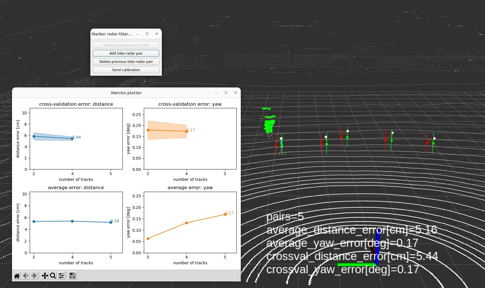</td>
    <td>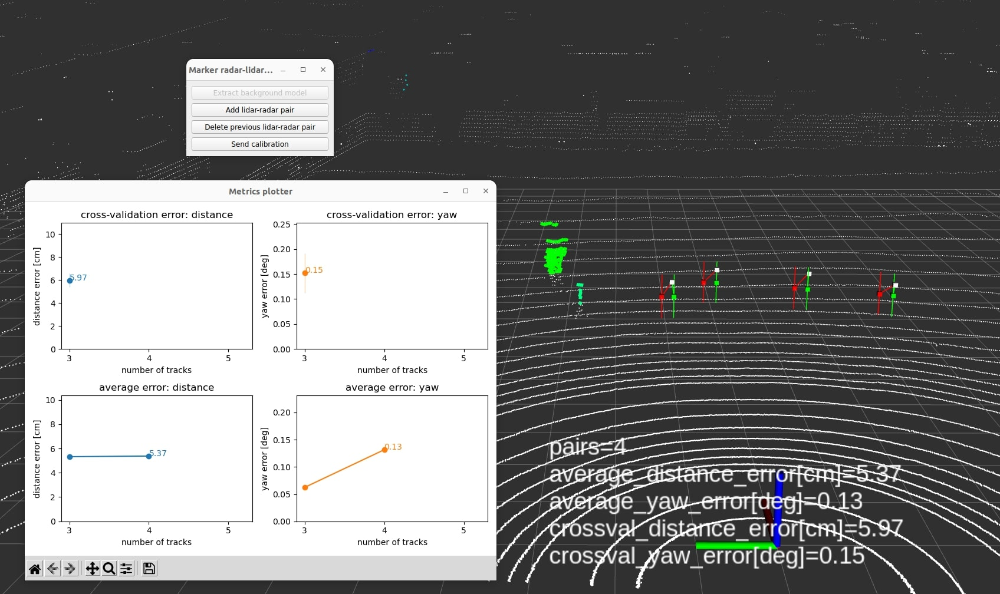</td>
   </tr>
   <tr>
    <td><p style="text-align: center;">Before deletion.</p></td>
    <td><p style="text-align: center;">After deletion.</p></td>
  </tr>
</table>

The console should also show the following text.

```text
[marker_radar_lidar_calibrator]: The last track was successfully deleted. Remaining converged tracks: 4
```

### Metric plotter

The tool also provides a metric plotter for real-time visualization shown below.

<p align="center">
    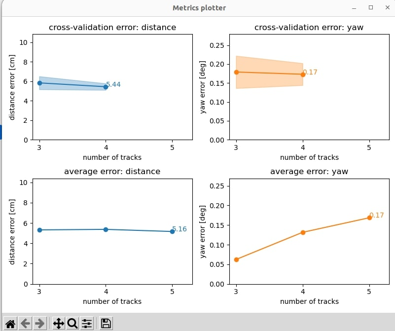
</p>

The subplots at the top display the cross-validation errors, while the bottom subplot shows the average errors in the calibration procedure. Plotting for the average errors begins after three pairs have been collected. For the cross-validation errors, plotting starts after four pairs have been collected.

Consider the left-top subplot, which plots the cross-validation errors for distances between radar estimation and lidar estimation, as an example of how these errors are calculated. When the x-axis value is 3, it indicates that we estimate the transformation using 3 samples from the 5 converged tracks. We then calculate the distance errors with all of the converged tracks. This process is repeated for 5 choose 3 (5C3) times, which totals 10 times, and the errors are then averaged. The light blue area represents the standard deviation of the 10 calculated distance errors.

### Send calibration

The user can click the `Send calibration` button once it is enabled. However, it is recommended to stop the calibration when the curve in the cross-validation error is converged. Therefore, in this tutorial, we run the calibration process until the bag is finished. Once the calibration is ended, the console should show a similar result as below.

```text
[marker_radar_lidar_calibrator]: Initial calibration error: detection2detection.distance=0.3279m yaw=1.5119 degrees
[marker_radar_lidar_calibrator]: Final calibration error: detection2detection.distance=0.0576m yaw=0.1642 degrees
[marker_radar_lidar_calibrator]: Final calibration error (rotation only): detection2detection.distance=0.0634m yaw=0.1774 degrees
[marker_radar_lidar_calibrator]: The 2D calibration pose was chosen as the output calibration pose
```

Once the `Send calibration` button is clicked, the result will be sent to the sensor calibration manager. No pairs can be added or deleted afterward like the image shown below. Please make sure you want to end the calibration process when you click the button.

<table>
  <tr>
    <td>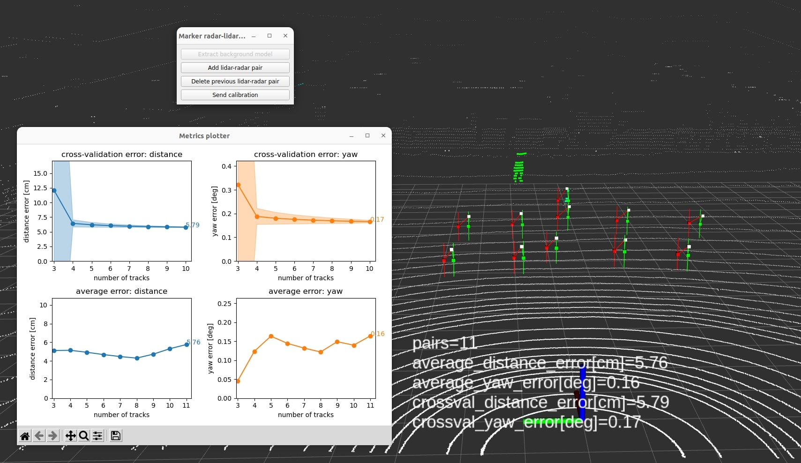</td>
    <td>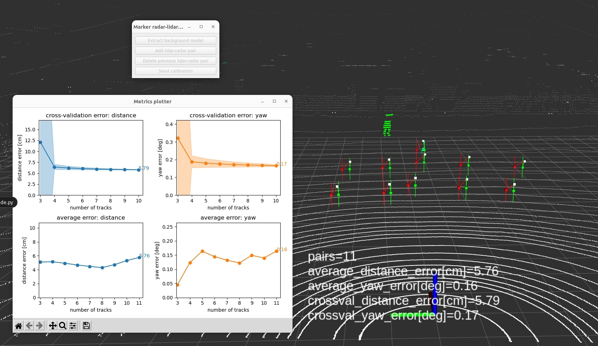</td>
   </tr>
   <tr>
    <td><p style="text-align: center;">Rosbag finished.</p></td>
    <td><p style="text-align: center;">After clicking send calibration.</p></td>
  </tr>
</table>

## Results

After the calibration process finishes, the `sensor_calibration_manager` will display the results in the UI and allow the user to save the calibration data to a file.

In the UI of the X2 project, three different TF trees are displayed: `Initial TF Tree`, `Calibration Tree`, and `Final TF Tree`.

- The `Initial TF Tree` presents the initial TF connections between sensors needed for calibration.
- The `Calibration Tree` shows the calibrated transformation between sensors, in this tutorial, `front_center/radar_link` to `pandar_40p_front`.
- The `Final TF Tree` depicts the TF tree after incorporating the updated calibrated transformation. As autoware utilizes the concept of [sensor_kit](https://autowarefoundation.github.io/autoware-documentation/main/how-to-guides/integrating-autoware/creating-vehicle-and-sensor-model/creating-sensor-model/), the final transformation required to comply to the specifications is `front_unit_base_link` to `front_center/radar_link`. This transformation is performed by the [calibrator interface](../../sensor_calibration_manager/sensor_calibration_manager/calibrators/x2/marker_radar_lidar_calibrator.py) related to this project. The red arrow indicates that the final transformation changed after the calibration process.

<p align="center">
    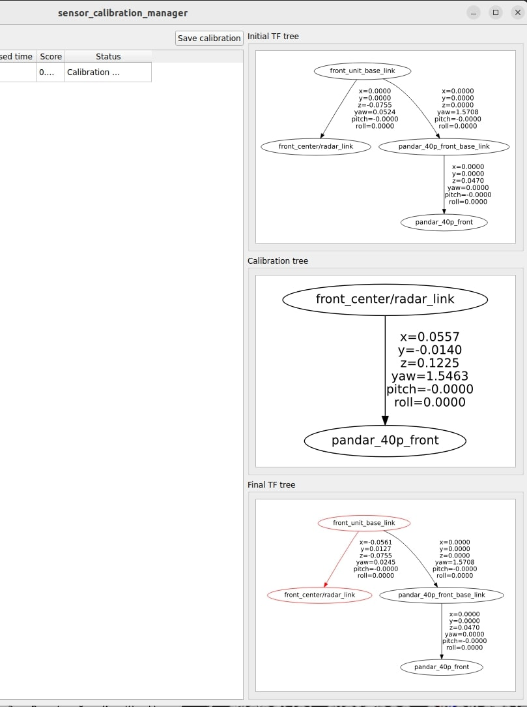
</p>

To evaluate the calibration result, the user can measure that the calibrated radar objects (green) are closer than the initial radar objects (red) to the lidar points (white).

## FAQ

- Why doesn't the reflector detection show on the rviz?

  - Make sure the center of the reflector faces toward the radar sensor, and the height of the reflector is enough for the radar to detect.
  - Make sure the height of the radar reflector is not larger than the `reflector_max_height` parameter.
  - Make sure the radar reflector is not in the background voxel (visualize the topic mentioned before.)

- Why doesn't the calibration error seem low enough?

  - Make sure that there are no outliers in the calibration pairs list.
  - Make sure that the initial calibration is good enough to match the lidar detection and radar detection correctly.
  - Radars like the ARS408 (the one we use in this tutorial) have a resolution of 0.2m. Given that, there is a theoretical limit to how low the calibration error can be. If the radar resolution is considerable, it will strongly limit the lower bound of the calibration error.

- When can I stop the calibration process?

  - It is recommended to stop the calibration when the curve in the cross-validation error is converged.
  - With more matched pairs without outliers, the calibration result should improve if the number of pairs increases.

- In the cross-validation plot, why does the standard deviation for a sample size of 3 increase significantly when the overall sample size increases?
  - When the overall number of samples increases, and we randomly select three samples to calculate the transformation, the likelihood of selecting three collinear samples also increases. This selection can lead to significant errors in the transformation for the remaining samples, resulting in a higher standard deviation.
