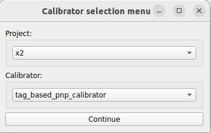

# tag_based_pnp_calibrator

In this tutorial, we present a hands-on tutorial of the `tag_based_pnp_calibrator`. Although we provide a pre-recorded rosbag, the flow of the tutorial is meant to show the user the steps they must perform in their own use cases with live sensors.

General documentation regarding this calibrator can be found [here](../../tag_based_pnp_calibrator/README.md).

## Setup

This tutorial assumes that the user has already built the calibration tools.
Installation instructions can be found [here](../../../README.md).

## Data preparation

Please download the data (rosbag) from [here](https://drive.google.com/drive/folders/1eO_B_fdBdc8uI5a5LYU4jrVUS0OzRVEq).

The provided rosbag includes four different topics: `/sensing/camera/camera6/camera_info`, `/sensing/camera/camera6/image_rect_color/compressed`, `/sensing/lidar/front_lower/pointcloud_raw`, and `/tf_static`.

## Environment preparation

### Overall calibration environment

The required space for calibration depends on the vehicle and sensors used. During calibration, please always make sure that tags are detected by both camera and lidar. This can be done by checking whether the tags appear in `rviz` and the `image view` UI. For instance, a cyan rhombus around the tag in `rviz` represents a successful detection by the lidar, as shown in the image below. For the camera, if the tag is visible in the `image view` UI, it should be detectable. So far, in our use cases, the tag is always detected as long as it is completely visible in the image.

<p align="center">
    
</p>

### Apriltag (Lidartag)

Details can be found in the [base documentation](../../tag_based_pnp_calibrator/README.md)

## Launching the tool

In this tutorial, we take the X2 project as an example.
First, run the sensor calibration manager:

```text
ros2 run sensor_calibration_manager sensor_calibration_manager
```

In `project`, select `x2`, and in `calibrator`, select `tag_based_pnp_calibrator`. Then, press `Continue`.

<p align="center">
    
</p>

A menu titled `Launcher configuration` should appear in the UI, and the user may change any parameter he deems convenient.
For this tutorial, we modify the default values `calibration_pairs` from `9` to `8` as the rosbag has 8 apriltag detections and also modify the `camera_name` from `camera0` to `camera6`. After configuring the parameters, click `Launch`.

<p align="center">
    
</p>

The following UI should be displayed. When the `Calibrate` button becomes available, click it.
If it does not become available, it means that either the required `tf` or services are not available. In this case, since the `tf` are published by the provided rosbag, run the bag with the command `ros2 bag play camera_lidar.db3 --clock -r 0.5` and click the `Calibrate` button.

<p align="center">
    
</p>

## Calibration

The calibration starts automatically after clicking the `Calibrate` button. It will keep calibrating the lidartag detections and apriltag detections until the number of the detections fits the user-defined `calibration_pairs` in the `Launcher configuration`.

When the user starts the calibration, `rviz` and the `image view` should be displayed like below.

<p align="center">
    
</p>

After the tool detects lidartags and apriltags, it will show the detection markers on `rviz` and the `image view` respectively. The text in `rviz` will also display the number of pairs of converged lidartag/apriltag detections so far.

<p align="center">
    
</p>

Once the user observes the number of pairs increases in `rviz`, he can start moving the tag to another position.

While moving the tag to another position, the user should move the tag decisively from one place to the other, not stopping and starting mid-way.
Please make sure that the new position is at least `calibration_min_pair_distance` from the closest detection in the set of converged detections and that the tag is in the FOV of both lidar and camera.

Depending on the mount and the ground surface, the tags can oscillate quite a bit, which can be detrimental to the calibration process. In this case, the user can stop the tag with its hand.

At the end of the calibration, we should get 8 detection pairs which are shown below.


The output in the console should be as follows (variations in the numerical results may occur due to the nature of ROS):

```text
[tag_based_pnp_calibrator_node]:  Initial reprojection error=15.41
[tag_based_pnp_calibrator_node]:  Current reprojection error=1.09
[tag_based_pnp_calibrator_node]:  Filtered reprojection error=1.10
```

## Results

After the calibration process finishes, the `sensor_calibration_manager` will display the results in the UI and allow the user to save the calibration data to a file.

In the UI of the X2 project, three different TF trees are displayed: `Initial TF Tree`, `Calibration Tree`, and `Final TF Tree`.

- The `Initial TF Tree` presents the initial TF connections between sensors needed for calibration.
- The `Calibration Tree` shows the calibrated transformation between sensors, in this tutorial, `camera6/camera_optical_link` to `pandar_40p_front`.
- The `Final TF Tree` depicts the TF tree after incorporating the updated calibrated transformation. As autoware utilizes the concept of [sensor_kit](https://autowarefoundation.github.io/autoware-documentation/main/how-to-guides/integrating-autoware/creating-vehicle-and-sensor-model/creating-sensor-model/), the final transformation required to comply to the specifications is `front_unit_base_link` to `camera6/camera_link`. This transformation is performed by the [calibrator interface](../../sensor_calibration_manager/sensor_calibration_manager/calibrators/x2/tag_based_pnp_calibrator.py) related to this project. The red arrow indicates that the final transformation changed after the calibration process.

<p align="center">
    
</p>

During or at the end of the calibration, the user can modify the `visualization options` on the right side of the `image view`. Setting the `Marker size (m)` to `0.04` and setting the `PC subsample factor` to `1` can help the user visualize the projected pointcloud on the image.

<p align="center">
    
</p>

After setting the options above, change the `/initial_tf` (in the `visualization options`) to `/current_tf` to measure the difference after the calibration.

The images below show that with the calibrated transformation, the projected pointcloud aligns correctly with the image.

<table>
  <tr>
    <td></td>
    <td></td>
   </tr>
   <tr>
    <td><p style="text-align: center;">Before Calibration.</p></td>
    <td><p style="text-align: center;">After Calibration.</p></td>
  </tr>
</table>

## FAQ

- Why does the tool not add calibration pairs?

  - One possible reason is that the current pair is too close to previously collected data. In that case, the current data is not accepted.
  - The timestamps of the lidar and camera are not synchronized, this can be checked with `ros2 topic echo [topic_name] --field header.stamp`. Setting the parameter `use_receive_time` to `True` might help to solve the issue but is not recommended as a long-term solution.
  - The detections are not stable enough. This can happen due to the following reasons:
    - The detection rate is not stable. The lidar points inside the lidar frames are not sufficient for the algorithm to detect the tags reliably, which usually happens when the tag is far away from the sensor or outside is high-density zone. Please move the tag to a position where enough points (scan lines) hit the tag. If the user forcefully calibrates under these conditions, the results can be compromised.
    - The tag is physically unstable due to wind, mounting issues, or other external factors. Even if the detector functions correctly, these conditions prevent the detection from converging. If this occurs, please eliminate these external factors before attempting calibration. Forcefully calibrating under these conditions can compromise the results.

- Why does the UI not launch?

  - Check with `ros2 node list` if the relevant nodes have been started. It is possible that the provided parameters do not match any of the valid arguments.
  - If the UI crashes (check the console for details), it is probably due to a bad PySide installation, invalid intrinsic parameters, invalid extrinsic parameters, etc.
  - The timestamps of the lidar and camera are not synchronized.

- Why does the reprojection error increase when more data is collected?

  - When there are few samples, the model will fit the available data the best it can, even in the presence of noise (over-fitting). The more data is collected, the error may increase to a certain extent, but that corresponds to the model attempting to fit all the data, this time unable to fit the noise, resulting in a higher error. However, it should reach a more-or-less table peak with about 10-15 pairs (depending on the data collection pattern/sampling).

- Why does the reprojection error seem high?

  - The intrinsics may not be accurate, thus limiting the performance of the method.
  - The boards are not appropriate (are bent).
  - The boards moved too much while calibrating.
  - The lidar detections were not very good. Try collecting detections in areas where there is more resolution.
  - There are some outliers when the user forces the calibrator to detect far-away lidar tags or the quality of the lidar is not good for lidartag detection.
