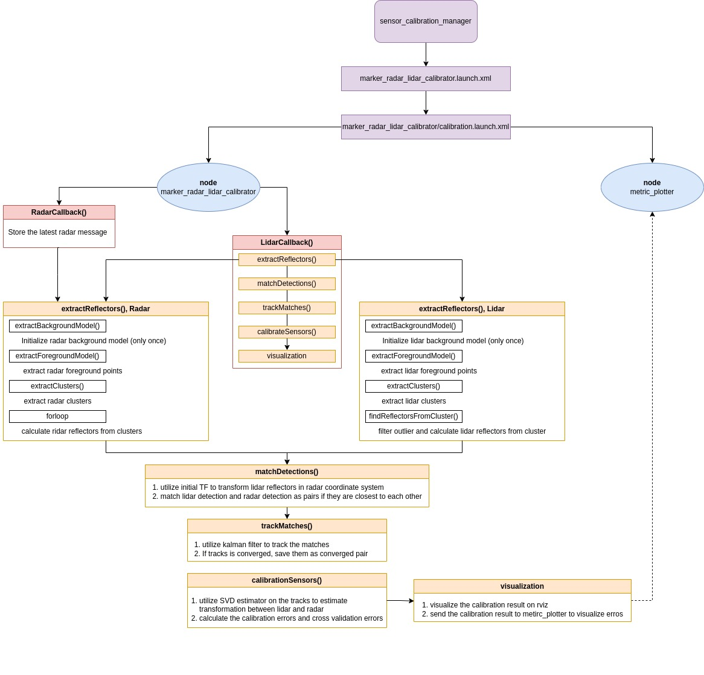
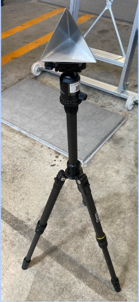

# marker_radar_lidar_calibrator

A tutorial for this calibrator can be found [here](../../docs/tutorials/marker_radar_lidar_calibrator.md)

## Purpose

The package `marker_radar_lidar_calibrator` performs extrinsic calibration between radar and 3d lidar sensors used in autonomous driving and robotics.

Currently, the calibrator only supports radars whose detection interface includes distance and azimuth angle, but do not offer elevation angle. For example, ARS408 radars can be calibrated with this tool. Also, note that the 3d lidar should have a high enough resolution to present several returns on the [radar reflector](#radar-reflector) (calibration target).

## Inner-workings / Algorithms

The calibrator computes the center of the reflectors from the pointcloud and pairs them to the radar objects/tracks. Afterwards, both an SVD-based and a yaw-only rotation estimation algorithm are applied to these matched points to estimate the rigid transformation between sensors.

Due to the complexity of the problem, the process in split in the following steps: constructing a background model, extracting the foreground to detect reflectors, matching and filtering the lidar and radar detections, and estimating the rigid transformation between the radar and lidar sensors.

In what follows, we proceed to explain each step, making a point to put emphasis on the parts that the user must take into consideration to use phis package effectively.

\*Note: although the radar can provide either detections and/or objects/tracks, we treat them as points in this package, and as such may refer to the radar pointcloud when needed.

### Step 1: Background model construction

Detecting corner reflectors in an unknown environment, without imposing impractical restrictions on the reflectors themselves, the operators, or the environment, it a challenging problem. From the perspective of the lidar, radar reflectors may be confused with the floor or other metallic objects, and from the radar's perspective, although corner reflectors are detected by the sensor (the user must confirm it themselves before attempting to use this tool!), other objects are also detected, with no practical way to tell them apart most of the time.

For these reasons, we avoid addressing the full problem an instead leverage the use of background models. To do this, the user must first present the sensors an environment with no radar reflectors nor any dynamic objects (mostly persons) in the space that is to be used for calibration. The tool will collect data for a set period of time or until there is no new information. For each modality, this data is then turned into voxels, marking the space of each occupied voxel as `background` in the following steps.

### Step 2: Foreground extraction and reflector detection

Once the background models for both sensors have been prepared, new data gets filtered using the background models to leave only the foreground.

Before placing radar reflectors, the foreground data should ideally be empty, and once placing them, only the reflectors and the people holding them should appear as foreground. In practice, however, even small variations in the load of the vehicle can cause ground points to escape the background models and be marked as foreground (a phenomenon exclusive to the lidars). To address this issue, we also employ a RANSAC-based ground segmentation algorithm to avoid these ground points being processed in downstream steps.

All foreground radar objects are automatically categorized as potential reflector detections. For foreground lidar points, however, the [reflector](#radar-reflector) detection process involves more steps:

- We first apply a clustering algorithm on the lidar foreground points and discard clusters with a number of points below a predefined threshold.
- Compute the highest point of each cluster and discard it if the highest point exceeds `reflector_max_height`. This is required to discard the clusters corresponding to users (we assume the operators are taller than the reflectors).
- Finally, we average all points within a `reflector_radius` from the highest point to estimate the center point of the reflector.

The following images illustrate the background construction and foreground extraction process respectively. Although the radar pre-processing is presented, the process remains the same for the lidar.

During background model construction (left image), the blue voxels (presented as 2d grid for visualization purposes) are marked as background since sensor data is present in said voxels.

Once background model construction finishes and the foreground extraction process begins (right image), only points that fall outside previous background-marked voxels are considered as foreground. In this example, the points hitting the corner reflector and a human are marked as foreground (note that those points' voxels, here marked in green are disjoint with those of the background).

<table>
  <tr>
    <td></td>
    <td></td>
   </tr>
   <tr>
    <td>
Background model construction.
</td>
    <td>
Foreground extraction
</td>
  </tr>
</table>

### Step 3: Matching and filtering

The output of the previous step consists of two lists of points of potentials radar reflector candidates for each sensor. However, it is not possible to directly match points among these lists, and they are expected to contain a high number of false positives on both sensors.

To address this issue, we rely on a heuristic that leverages the accuracy of initial calibration. Usually, robot/vehicle CAD designs allow an initial calibration with an accuracy of a few centimeters/degrees, and direct sensor calibration is only used to refine it.

Using the initial radar-lidar calibration, we project each lidar corner reflector candidate into the radar coordinates and for each candidate we compute the closest candidate from the other modality. We consider real radar-lidar pairs of corner reflectors those pairs who are mutually their closest candidate.

Matches using this heuristic can still contain incorrect pairs and false positives, which is why we employ a Kalman filter to both improve the estimations and check for temporal consistency (false positives are not usually consistent in time).

Once matches' estimations converge (using a covariance matrix criteria), they are added to the calibration list.

### Step 4: Rigid transformation estimation

After matching detection pairs, we apply rigid transformation estimation algorithms to those pairs to estimate the transformation between the radar and lidar sensors. We currently support two algorithms: a 2d SVD-based method and a yaw-only rotation method.

### 2d SVD-based method

In this method, we reduce the problem to a 2d transformation estimation since radar detections lack a z component (elevation is fixed to zero).

However, because lidar detections are in the lidar frame and likely involve a 3d transformation (non-zero roll and\or pitch) to the radar frame, we transform the lidar detections to a frame dubbed the `radar parallel` frame and then set their z component to zero. The `radar parallel` frame has only a 2d transformation (x, y, yaw) relative to the radar frame. By dropping the z-component we explicitly give up on computing a 3D pose, which was not possible due to the nature of the radar.

In autonomous vehicles, radars are mounted in a way designed to minimize pitch and roll angles, maximizing their performance and measurement range. This means the radar sensors are aligned as parallel as possible to the ground plane, making the `base_link` a suitable choice for the `radar parallel` frame.

\*\*Note: this assumes that the lidar to `radar parallel` frame is either hardcoded or previously calibrated

Next, we apply the SVD-based rigid transformation estimation algorithm between the lidar detections in the radar parallel frame and the radar detections in the radar frame. This allows us to estimate the transformation between the lidar and radar by multiplying the radar-to-radar-parallel transformation (calibrated) with the radar-parallel-to-lidar transformation (known before-handed). The SVD-based algorithm, provided by PCL, leverages SVD to find the optimal rotation component and then computes the translation component based on the rotation.

### Yaw-only rotation method

This method, on the other hand, utilizes the initial radar-to-lidar transformation to calculate lidar detections in the radar frame. We then calculate the average yaw angle difference of all pairs, considering only yaw rotation between the lidar and radar detections in the radar frame, to estimate a yaw-only rotation transformation in the radar frame. Finally, we estimate the transformation between the lidar and radar by multiplying the yaw-only rotation transformation with the initial radar-to-lidar transformation.

Generally, the 2d SVD-based method is preferred when valid; otherwise, the yaw-only rotation method is used as the calibration output.

### Diagram

Below, you can see how the algorithm is implemented in the `marker_radar_lidar_calibrator` package.

## ROS Interfaces

### Input

| Name                     | Type                            | Description               |
| ------------------------ | ------------------------------- | ------------------------- |
| `input_lidar_pointcloud` | `sensor_msgs::msg::PointCloud2` | Lidar pointcloud's topic. |
| `input_radar_msg`        | `radar_msgs::msg::RadarTracks`  | Radar objects' topic.     |

### Output

| Name                          | Type                                   | Description                                               |
| ----------------------------- | -------------------------------------- | --------------------------------------------------------- |
| `lidar_background_pointcloud` | `sensor_msgs::msg::PointCloud2`        | Lidar's background pointcloud.                            |
| `lidar_foreground_pointcloud` | `sensor_msgs::msg::PointCloud2`        | Lidar's foreground pointcloud.                            |
| `lidar_colored_clusters`      | `sensor_msgs::msg::PointCloud2`        | Lidar's colored pointcloud clusters.                      |
| `lidar_detection_markers`     | `visualization_msgs::msg::MarkerArray` | Lidar detections.                                         |
| `radar_background_pointcloud` | `sensor_msgs::msg::PointCloud2`        | Radar's background pointcloud from the radar.             |
| `radar_foreground_pointcloud` | `sensor_msgs::msg::PointCloud2`        | Radar's foreground pointcloud from the radar.             |
| `radar_detection_markers`     | `visualization_msgs::msg::MarkerArray` | Radar detections.                                         |
| `matches_markers`             | `visualization_msgs::msg::MarkerArray` | Matched lidar and radar detections.                       |
| `tracking_markers`            | `visualization_msgs::msg::MarkerArray` | Reflectors' tracks.                                       |
| `text_markers`                | `visualization_msgs::msg::Marker`      | Calibration metrics' markers.                             |
| `calibration_metrics`         | `std_msgs::msg::Float32MultiArray`     | Calibration metrics as vector for visualization purposes. |

### Services

| Name                       | Type                                                  | Description                                                                                          |
| -------------------------- | ----------------------------------------------------- | ---------------------------------------------------------------------------------------------------- |
| `extrinsic_calibration`    | `tier4_calibration_msgs::` `srv::ExtrinsicCalibrator` | Generic calibration service. The call is blocked until the calibration process finishes.             |
| `extract_background_model` | `std_srvs::srv::Empty`                                | Starts to extract the background model from radar and lidar data.                                    |
| `add_lidar_radar_pair`     | `std_srvs::srv::Empty`                                | Adds lidar-radar pairs for calibration.                                                              |
| `delete_lidar_radar_pair`  | `std_srvs::srv::Empty`                                | Deletes the latest lidar-radar pair.                                                                 |
| `send_calibration`         | `std_srvs::srv::Empty`                                | Finishes the calibration process and sends the calibration result to the sensor calibration manager. |

## Parameters

### Core Parameters

| Name                                        | Type          | Default Value                                                 | Description                                                                                                                                                        |
| ------------------------------------------- | ------------- | ------------------------------------------------------------- | ------------------------------------------------------------------------------------------------------------------------------------------------------------------ |
| `radar_parallel_frame`                      | `std::string` | `base_link`                                                   | Auxiliar frame used in the 2d SVD-based method.                                                                                                                    |
| `msg_type`                                  | `std::string` | `radar tracks` / `radar scan`                                 | The type of input radar objects. (Not available yet, currently only support radar tracks.)                                                                         |
| `transformation_type`                       | `std::string` | `yaw_only_rotation_2d` / `svd_2d` / `svd_3d` / `roll_zero_3d` | Specifies the algorithm used to optimize the transformation between the radar frame and the radar parallel frame. (Not available yet.)                             |
| `use_lidar_initial_crop_box_filter`         | `bool`        | `true`                                                        | Enables or disables the initial cropping filter for lidar data processing.                                                                                         |
| `lidar_initial_crop_box_min_x`              | `double`      | `-50.0`                                                       | Minimum x-coordinate in meters for the initial lidar calibration area.                                                                                             |
| `lidar_initial_crop_box_min_y`              | `double`      | `-50.0`                                                       | Minimum y-coordinate in meters for the initial lidar calibration area.                                                                                             |
| `lidar_initial_crop_box_min_z`              | `double`      | `-50.0`                                                       | Minimum z-coordinate in meters for the initial lidar calibration area.                                                                                             |
| `lidar_initial_crop_box_max_x`              | `double`      | `50.0`                                                        | Maximum x-coordinate in meters for the initial lidar calibration area.                                                                                             |
| `lidar_initial_crop_box_max_y`              | `double`      | `50.0`                                                        | Maximum y-coordinate in meters for the initial lidar calibration area.                                                                                             |
| `lidar_initial_crop_box_max_z`              | `double`      | `50.0`                                                        | Maximum z-coordinate in meters for the initial lidar calibration area.                                                                                             |
| `use_radar_initial_crop_box_filter`         | `bool`        | `true`                                                        | Enables or disables the initial cropping filter for radar data processing.                                                                                         |
| `radar_initial_crop_box_min_x`              | `double`      | `-50.0`                                                       | Minimum x-coordinate in meters for the initial radar calibration area.                                                                                             |
| `radar_initial_crop_box_min_y`              | `double`      | `-50.0`                                                       | Minimum y-coordinate in meters for the initial radar calibration area.                                                                                             |
| `radar_initial_crop_box_min_z`              | `double`      | `-50.0`                                                       | Minimum z-coordinate in meters for the initial radar calibration area.                                                                                             |
| `radar_initial_crop_box_max_x`              | `double`      | `50.0`                                                        | Maximum x-coordinate in meters for the initial radar calibration area.                                                                                             |
| `radar_initial_crop_box_max_y`              | `double`      | `50.0`                                                        | Maximum y-coordinate in meters for the initial radar calibration area.                                                                                             |
| `radar_initial_crop_box_max_z`              | `double`      | `50.0`                                                        | Maximum z-coordinate in meters for the initial radar calibration area.                                                                                             |
| `lidar_background_model_leaf_size`          | `double`      | `0.1`                                                         | Voxel size in meters for the lidar background model.                                                                                                               |
| `radar_background_model_leaf_size`          | `double`      | `0.1`                                                         | Voxel size in meters for the radar background model.                                                                                                               |
| `max_calibration_range`                     | `double`      | `50.0`                                                        | Maximum range for calibration in meters.                                                                                                                           |
| `background_model_timeout`                  | `double`      | `5.0`                                                         | The background model will terminate if there are no new points in the background within this period, measured in seconds.                                          |
| `min_foreground_distance`                   | `double`      | `0.4`                                                         | Minimum distance in meters for extracting foreground points.                                                                                                       |
| `background_extraction_timeout`             | `double`      | `15.0`                                                        | Timeout in seconds for background extraction processes.                                                                                                            |
| `ransac_threshold`                          | `double`      | `0.2`                                                         | Distance threshold in meters for the ground segmentation model.                                                                                                    |
| `ransac_max_iterations`                     | `int`         | `100`                                                         | The maximum number of iterations for the ground segmentation model.                                                                                                |
| `lidar_cluster_max_tolerance`               | `double`      | `0.5`                                                         | Maximum cluster tolerance in meters for extracting lidar cluster.                                                                                                  |
| `lidar_cluster_min_points`                  | `int`         | `3`                                                           | The minimum number of points required to form a valid lidar cluster.                                                                                               |
| `lidar_cluster_max_points`                  | `int`         | `2000`                                                        | The maximum number of points allowed in a lidar cluster.                                                                                                           |
| `radar_cluster_max_tolerance`               | `double`      | `0.5`                                                         | Maximum cluster tolerance in meters for extracting radar cluster.                                                                                                  |
| `radar_cluster_min_points`                  | `int`         | `1`                                                           | The minimum number of points required to form a valid radar cluster.                                                                                               |
| `radar_cluster_max_points`                  | `int`         | `10`                                                          | The maximum number of points allowed in a radar cluster.                                                                                                           |
| `reflector_radius`                          | `double`      | `0.1`                                                         | The radius of the reflector in meters.                                                                                                                             |
| `reflector_max_height`                      | `double`      | `1.2`                                                         | The maximum height in meters of the reflector in meters.                                                                                                           |
| `max_matching_distance`                     | `double`      | `1.0`                                                         | Maximum distance threshold in meters for matching lidar and radar.                                                                                                 |
| `max_initial_calibration_translation_error` | `double`      | `1.0`                                                         | Maximum allowable translation error in meters in the calibration process. If this error exceeds the specified value, a warning message will appear in the console. |
| `max_initial_calibration_rotation_error`    | `double`      | `45.0`                                                        | Maximum allowable rotation error in degrees in the calibration process. If this error exceeds the specified value, a warning message will appear in the console.   |
| `max_number_of_combination_samples`         | `int`         | `10000`                                                       | The maximum number of samples from combinations that are used for cross-validation during the calibration process.                                                 |

## Requirements

### Radar reflector

The type of reflector shown in the image below is crucial for our calibration because it has a highly reliable and consistent response to radar waves. The triangular shape, often composed of three metal plates arranged in a prism form, ensures that the reflector returns signals in specific, predictable ways.

It is recommended that the user mount the radar reflector on a tripod and ensure it remains stable and secure. Additionally, nothing should be attached above the radar reflector; it must be the highest object on the entire calibration target. Furthermore, make sure the height of the radar reflector does not exceed the `reflector_max_height` parameter.

    

## Known issues/limitations

- While extracting the background model, ensure that no reflector, person, or moving object is present in the calibration area.

- The calibrator provides a button to delete any mismatched pairs (e.g., an object detected by both radar and lidar). However, some outliers may not be easily detectable by human eyes, leading to inaccurate results as the calibration proceeds even with these anomalies present. Future enhancements will aim to improve outlier detection, thereby refining the calibration accuracy.

- The calibrator should be able to handle different lidar and radar sensors. So far, We calibrated the Velodyne VLS-128 lidar sensor, Pandar-40P lidar sensor, and ARS 408 radar sensor with good calibration results.

## Pro tips/recommendations

- During calibration, all radar reflectors and the radar itself must lie on the same plane. This requirement does not apply to the lidar.
- Position the reflectors at various locations within the lidar's and radar's field of view (FOV). Additionally, ensure that the center of each radar reflector always faces the radar sensor, as illustrated in the image below.

    

