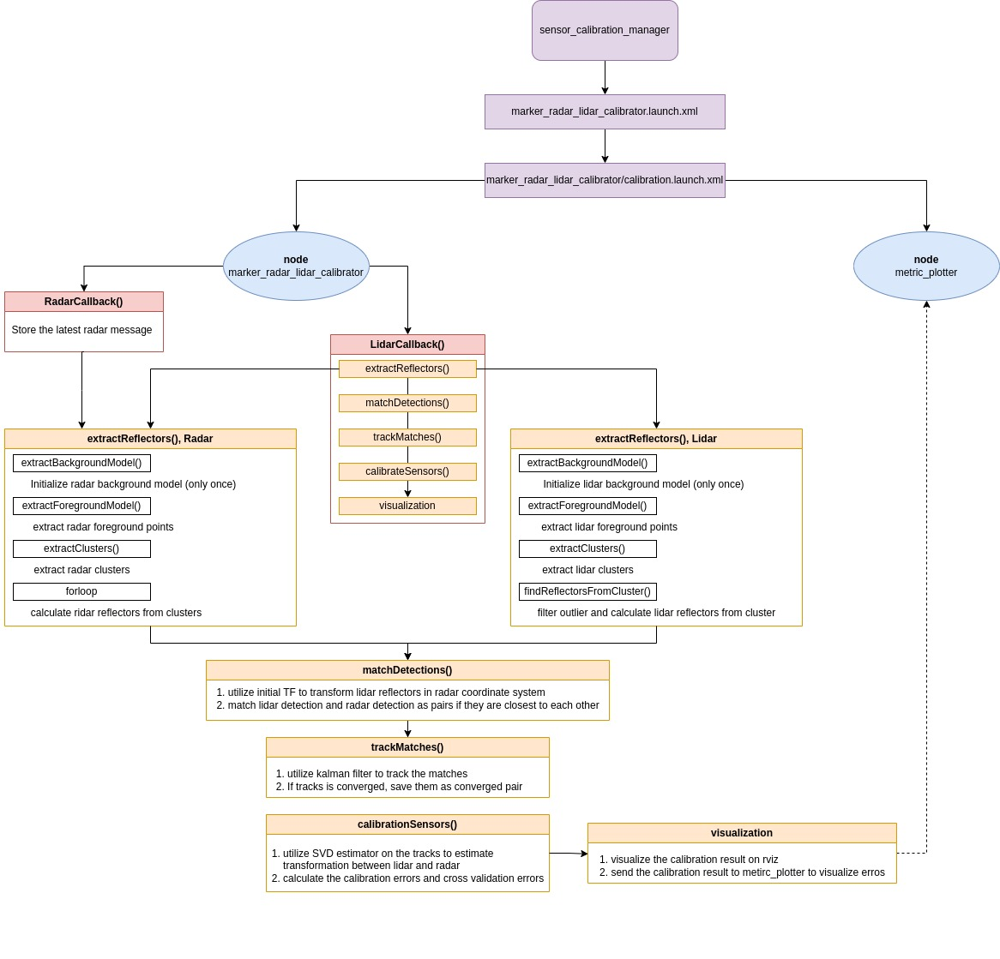
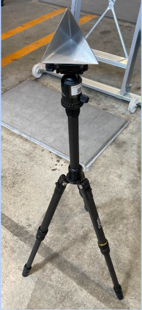

# marker_radar_lidar_calibrator

A tutorial for this calibrator can be found [here](../docs/tutorials/marker_radar_lidar_calibrator.md)

## Purpose

The package `marker_radar_lidar_calibrator` allows extrinsic calibration between radar and 3d lidar sensors used in autonomous driving and robotics.

Currently, the calibrator only supports radars whose detection interface includes distance and azimuth angle, but do not offer elevation angle. For example, ARS 408 radars can be calibrated with this tool. Also, note that the 3d lidar should have a resolution that is high enough to scan several points on the [radar reflector](#radar-reflector) (calibration target).

## Inner-workings / Algorithms

The calibrator is designed to estimate the transformation between radar and lidar sensors. It starts by estimating the center points of reflectors within lidar pointclouds and radar objects and then aligns these points for precise matching. An SVD-based and a yaw-only rotation estimation algorithm are applied to these matched points to estimate the rigid transformation between sensors.

Specifically, the calibration process consists of four primary steps: constructing a background model, extracting the foreground to detect reflectors, matching and filtering the lidar and radar detections, and estimating the rigid transformation between the radar and lidar sensors.

### Step 1: Background model construction

Given the challenge of reliably detecting reflectors, such as when the radar outputs numerous objects, making it difficult to identify the reflector among them, background models for both lidar and radar are constructed from the lidar pointclouds and radar objects within a user-defined calibration area, which lacks any calibration targets (such as radar reflectors). More specifically, these background models consist of uniform binary voxel grids that denote whether each voxel represents the background.

### Step 2: Foreground extraction and reflector detection

After the background models for the lidar and radar are constructed, we compare the incoming lidar pointcloud and radar objects with their respective background models, extract those that do not belong to background voxels, and call them foreground lidar points and foreground radar objects respectively. Additionally, we apply ground segmentation to filter out some foreground lidar points and foreground radar objects caused by changes in the vehicle's pitch, as these ground points and objects may not be included in the background model.

All foreground radar objects are automatically categorized as potential reflector detections. For foreground lidar points, however, the [reflector](#radar-reflector) detection process involves more steps. We first apply a clustering algorithm on the lidar foreground points, then find the highest point in each cluster, and filter out the cluster if the highest point exceeds `reflector_max_height`. Next, we average all points within a `reflector_radius` from the highest point to estimate the center point of the reflector.

The images below illustrate the process of radar background model construction and radar foreground extraction described in Step 1 and Step 2.
The blue 3d voxels, which are shown in a 2d grid in the images, are denoted as background voxels if any radar object falls into them during the background model construction. Once the background model is constructed, it becomes straightforward to extract the foreground objects in the calibration area. For the lidar, the background model and foreground extraction process are the same as the radar process described above.

<table>
  <tr>
    <td></td>
    <td></td>
   </tr>
   <tr>
    <td>
Background model construction.
</td>
    <td>
Foreground extraction
</td>
  </tr>
</table>

### Step 3: Matching and filtering

Since it is not possible to directly differentiate individual reflector detections, discern the number of targets in the calibration area, nor determine if the detections correspond to humans or radar reflectors, we rely on the initial calibration to pair each lidar detection with its closest radar detection, and vice versa. A detection pair is accepted if they are mutually their closest matches. Once a match is made, it is evaluated against existing hypotheses (monitored by a Kalman filter): if it aligns with an existing hypothesis, that hypothesis is updated; if it does not align with any, a new hypothesis is created. When a hypothesis achieves convergence, it is added to the calibration list.

### Step 4: Rigid transformation estimation

After matching detection pairs, we apply rigid transformation estimation algorithms to those pairs to estimate the transformation between the radar and lidar sensors. We currently support two algorithms: a 2d SVD-based method and a yaw-only rotation method.

For the 2d SVD-based method, we reduce the problem to 2d transformation estimation since radar detections lack a z component. However, because lidar detections are in the lidar frame and likely involve a 3d transformation to the radar frame, we transform the lidar detections to a `radar parallel` frame and then set the z component to zero. The `radar parallel` frame has only a 2d transformation (x, y, yaw) relative to the radar frame. In autonomous vehicles, radars are mounted to minimize pitch and roll angles, maximizing their performance and ensuring accurate distance measurements. This means the radar sensors are aligned as parallel as possible to the ground plane, making the `base_link` a suitable choice for the `radar parallel` frame.

Next, we apply the SVD-based rigid transformation estimation algorithm between the lidar detections in the radar parallel frame and the radar detections in the radar frame. This allows us to estimate the transformation between the lidar and radar by multiplying the radar-to-radar-parallel transformation with the radar-parallel-to-lidar transformation. The SVD-based algorithm, provided by PCL, leverages SVD to find the optimal rotation component and then calculates the translation component based on the rotation.

The yaw-only rotation method, on the other hand, utilizes the initial radar-to-lidar transformation to calculate lidar detections in the radar frame. We then calculate the average yaw angle difference of all pairs, considering only yaw rotation between the lidar and radar detections in the radar frame, to estimate a yaw-only rotation transformation in the radar frame. Finally, we estimate the transformation between the lidar and radar by multiplying the yaw-only rotation transformation with the initial radar-to-lidar transformation.

Generally, the 2d SVD-based method is preferred when valid; otherwise, the yaw-only rotation method is used as the calibration output.

### Diagram

Below, you can see how the algorithm is implemented in the `marker_radar_lidar_calibrator` package.

## ROS Interfaces

### Input

| Name                     | Type                            | Description                                |
| ------------------------ | ------------------------------- | ------------------------------------------ |
| `input_lidar_pointcloud` | `sensor_msgs::msg::PointCloud2` | Topic of lidar pointcloud for calibration. |
| `input_radar_msg`        | `radar_msgs::msg::RadarTracks`  | Topic of radar objects for calibration.    |

### Output

| Name                          | Type                                   | Description                                     |
| ----------------------------- | -------------------------------------- | ----------------------------------------------- |
| `lidar_background_pointcloud` | `sensor_msgs::msg::PointCloud2`        | Background pointcloud from the lidar.           |
| `lidar_foreground_pointcloud` | `sensor_msgs::msg::PointCloud2`        | Foreground pointcloud from the lidar.           |
| `lidar_colored_clusters`      | `sensor_msgs::msg::PointCloud2`        | Colored pointcloud clusters from the lidar.     |
| `lidar_detection_markers`     | `visualization_msgs::msg::MarkerArray` | Lidar detections.                               |
| `radar_background_pointcloud` | `sensor_msgs::msg::PointCloud2`        | Background pointcloud from the radar.           |
| `radar_foreground_pointcloud` | `sensor_msgs::msg::PointCloud2`        | Foreground pointcloud from the radar.           |
| `radar_detection_markers`     | `visualization_msgs::msg::MarkerArray` | Radar detections.                               |
| `matches_markers`             | `visualization_msgs::msg::MarkerArray` | Matched lidar and radar detection.              |
| `tracking_markers`            | `visualization_msgs::msg::MarkerArray` | Reflectors' tracks.                             |
| `text_markers`                | `visualization_msgs::msg::Marker`      | Text markers that show the calibration metrics. |
| `calibration_metrics`         | `std_msgs::msg::Float32MultiArray`     | Calibration metrics.                            |

### Services

| Name                       | Type                                                  | Description                                                                              |
| -------------------------- | ----------------------------------------------------- | ---------------------------------------------------------------------------------------- |
| `extrinsic_calibration`    | `tier4_calibration_msgs::` `srv::ExtrinsicCalibrator` | Generic calibration service. The call is blocked until the calibration process finishes. |
| `extract_background_model` | `std_srvs::srv::Empty`                                | Starts to extract the background model from radar and lidar data.                        |
| `add_lidar_radar_pair`     | `std_srvs::srv::Empty`                                | Adds lidar-radar pairs for calibration.                                                  |
| `delete_lidar_radar_pair`  | `std_srvs::srv::Empty`                                | Deletes the previous lidar-radar pair.                                                   |
| `send_calibration`         | `std_srvs::srv::Empty`                                | Sends the calibration result to the sensor calibration manager.                          |

## Parameters

### Core Parameters

| Name                                        | Type          | Default Value                                           | Description                                                                                                                                                        |
| ------------------------------------------- | ------------- | ------------------------------------------------------- | ------------------------------------------------------------------------------------------------------------------------------------------------------------------ |
| `radar_parallel_frame`                      | `std::string` | `base_link`                                             | The reference frame to which the radar optimizes its transformation.                                                                                               |
| `msg_type`                                  | `std::string` | `radar tracks`/`radar scan`                             | The type of the input radar objects. (Not available yet, currently only support radar tracks.)                                                                     |
| `transformation_type`                       | `std::string` | `yaw_only_rotation_2d`/`svd_2d`/`svd_3d`/`roll_zero_3d` | Specifies the algorithm used to optimize the transformation between the radar frame and the radar parallel frame. (Not available yet.)                             |
| `use_lidar_initial_crop_box_filter`         | `bool`        | `true`                                                  | Enables or disables the initial cropping filter for lidar data processing.                                                                                         |
| `lidar_initial_crop_box_min_x`              | `double`      | `-50.0`                                                 | Minimum x-coordinate in meters for the initial lidar calibration area.                                                                                             |
| `lidar_initial_crop_box_min_y`              | `double`      | `-50.0`                                                 | Minimum y-coordinate in meters for the initial lidar calibration area.                                                                                             |
| `lidar_initial_crop_box_min_z`              | `double`      | `-50.0`                                                 | Minimum z-coordinate in meters for the initial lidar calibration area.                                                                                             |
| `lidar_initial_crop_box_max_x`              | `double`      | `50.0`                                                  | Maximum x-coordinate in meters for the initial lidar calibration area.                                                                                             |
| `lidar_initial_crop_box_max_y`              | `double`      | `50.0`                                                  | Maximum y-coordinate in meters for the initial lidar calibration area.                                                                                             |
| `lidar_initial_crop_box_max_z`              | `double`      | `50.0`                                                  | Maximum z-coordinate in meters for the initial lidar calibration area.                                                                                             |
| `use_radar_initial_crop_box_filter`         | `bool`        | `true`                                                  | Enables or disables the initial cropping filter for radar data processing.                                                                                         |
| `radar_initial_crop_box_min_x`              | `double`      | `-50.0`                                                 | Minimum x-coordinate in meters for the initial radar calibration area.                                                                                             |
| `radar_initial_crop_box_min_y`              | `double`      | `-50.0`                                                 | Minimum y-coordinate in meters for the initial radar calibration area.                                                                                             |
| `radar_initial_crop_box_min_z`              | `double`      | `-50.0`                                                 | Minimum z-coordinate in meters for the initial radar calibration area.                                                                                             |
| `radar_initial_crop_box_max_x`              | `double`      | `50.0`                                                  | Maximum x-coordinate in meters for the initial radar calibration area.                                                                                             |
| `radar_initial_crop_box_max_y`              | `double`      | `50.0`                                                  | Maximum y-coordinate in meters for the initial radar calibration area.                                                                                             |
| `radar_initial_crop_box_max_z`              | `double`      | `50.0`                                                  | Maximum z-coordinate in meters for the initial radar calibration area.                                                                                             |
| `lidar_background_model_leaf_size`          | `double`      | `0.1`                                                   | Voxel size in meters for the lidar background model.                                                                                                               |
| `radar_background_model_leaf_size`          | `double`      | `0.1`                                                   | Voxel size in meters for the radar background model.                                                                                                               |
| `max_calibration_range`                     | `double`      | `50.0`                                                  | Maximum range for calibration in meters.                                                                                                                           |
| `background_model_timeout`                  | `double`      | `5.0`                                                   | The background model will terminate if there are no new points in the background within this period, measured in seconds.                                          |
| `min_foreground_distance`                   | `double`      | `0.4`                                                   | Minimum distance in meters for extracting foreground points.                                                                                                       |
| `background_extraction_timeout`             | `double`      | `15.0`                                                  | Timeout in seconds for background extraction processes.                                                                                                            |
| `ransac_threshold`                          | `double`      | `0.2`                                                   | Distance threshold in meters for the ground segmentation model.                                                                                                    |
| `ransac_max_iterations`                     | `int`         | `100`                                                   | Maximum number of iterations for the ground segmentation model.                                                                                                    |
| `lidar_cluster_max_tolerance`               | `double`      | `0.5`                                                   | Maximum cluster tolerance in meters for extracting lidar cluster.                                                                                                  |
| `lidar_cluster_min_points`                  | `int`         | `3`                                                     | Minimum number of points required to form a valid lidar cluster.                                                                                                   |
| `lidar_cluster_max_points`                  | `int`         | `2000`                                                  | Maximum number of points allowed in a lidar cluster.                                                                                                               |
| `radar_cluster_max_tolerance`               | `double`      | `0.5`                                                   | Maximum cluster tolerance in meters for extracting radar cluster.                                                                                                  |
| `radar_cluster_min_points`                  | `int`         | `1`                                                     | Minimum number of points required to form a valid radar cluster.                                                                                                   |
| `radar_cluster_max_points`                  | `int`         | `10`                                                    | Maximum number of points allowed in a radar cluster.                                                                                                               |
| `reflector_radius`                          | `double`      | `0.1`                                                   | Radius of the reflector in meters.                                                                                                                                 |
| `reflector_max_height`                      | `double`      | `1.2`                                                   | Maximum height in meters of the reflector in meters.                                                                                                               |
| `max_matching_distance`                     | `double`      | `1.0`                                                   | Maximum distance threshold in meters for matching lidar and radar.                                                                                                 |
| `max_initial_calibration_translation_error` | `double`      | `1.0`                                                   | Maximum allowable translation error in meters in the calibration process. If this error exceeds the specified value, a warning message will appear in the console. |
| `max_initial_calibration_rotation_error`    | `double`      | `45.0`                                                  | Maximum allowable rotation error in degrees in the calibration process. If this error exceeds the specified value, a warning message will appear in the console.   |
| `max_number_of_combination_samples`         | `int`         | `10000`                                                 | Maximum number of samples from combinations that are used for cross-validation during the calibration process.                                                     |

## Requirements

### Radar reflector

The type of reflector shown in the image below is crucial for our calibration because it has a highly reliable and consistent response to radar waves. The triangular shape, often composed of three metal plates arranged in a prism form, ensures that the reflector returns signals in specific, predictable ways.

It is recommended that the user mount the radar reflector on a tripod and ensure it remains stable and secure. Additionally, nothing should be attached above the radar reflector; it must be the highest object on the entire calibration target. Furthermore, make sure the height of the radar reflector does not exceed the `reflector_max_height` parameter.

    

## Known issues/limitations

- While extracting the background model, ensure that no reflector, person, or moving object is present in the calibration area.

- The calibrator provides a button to delete any mismatched pairs (e.g., an object detected by both radar and lidar). However, some outliers may not be easily detectable by human eyes, leading to inaccurate results as the calibration proceeds even with these anomalies present. Future enhancements will aim to improve outlier detection, thereby refining the calibration accuracy.

- The calibrator should be able to handle different lidar and radar sensors. So far, We calibrated the Velodyne VLS-128 lidar sensor, Pandar-40P lidar sensor, and ARS408 radar sensor with good calibration results.

## Pro tips/recommendations

- During calibration, all radar reflectors and the radar itself must lie on the same plane. This requirement does not apply to the lidar.
- Position the reflectors at various locations within the lidar's and radar's field of view (FOV). Additionally, ensure that the center of each radar reflector always faces the radar sensor, as illustrated in the image below.

    

