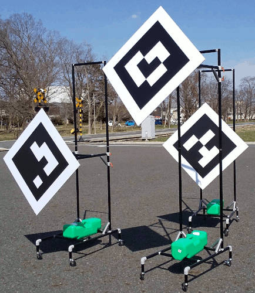

# tag_based_pnp_calibrator

A tutorial for this calibrator can be found [here](../../docs/tutorials/tag_based_pnp_calibrator.md).

## Purpose

The package `tag_based_pnp_calibrator` performs extrinsic calibration between camera and 3d lidar sensors used in autonomous driving and robotics.

Note that the 3d lidar should have a resolution that is high enough to detect the lidartag [1] or be among the [compatible](https://github.com/tier4/LiDARTag/tree/humble/config) models.

## Inner-workings / Algorithms

The `tag_based_pnp_calibrator` package utilizes the PnP (Perspective-n-Point) algorithm, a computer vision technique that is used to estimate the transformation between a set of correspondences of 2d and 3d points (in this case 2d points come from the camera and 3d points come from the lidar). This package also makes use of the `apriltag_ros` and `lidartag` packages, which are executed automatically by this package's launcher files.

The `apriltag_ros` package detects `apriltag` markers from an image and outputs the detection results. Conversely, the `lidartag` package detects `lidartag` markers and outputs its detection results. `apriltag` and `lidartag` differ in that in every `lidartag` there is an `apriltag` payload, but the opposite is not guaranteed. It follows that for the same physical marker, the detection's sizes are different, which is compensated during calibration.

The `tag_based_pnp_calibrator` utilizes the detections from both the `apriltag_ros` and `lidartag` packages, employing a Kalman filter to monitor these detections. If the detections converge, the calibrator applies the SQPnP [2] algorithm provided by OpenCV to estimate the transformation between the image points from the `apriltag` markers and the object points from the `lidartag` markers, which is effectively the transformation from camera to lidar.

### Diagram

The following figure presents a diagram of the nodes, launchers and relevant methods involved in the calibration process:

## ROS Interfaces

### Input

| Name                        | Type                                         | Description                                              |
| --------------------------- | -------------------------------------------- | -------------------------------------------------------- |
| `camera_info`               | `sensor_msgs::msg::CameraInfo`               | Intrinsic parameters of the camera.                      |
| `lidartag/detections_array` | `lidartag_msgs::msg::LidarTagDetectionArray` | Lidartag detections published by `lidartag` package.     |
| `apriltag/detection_array`  | `apriltag_msgs::msg::AprilTagDetectionArray` | Apriltag detections published by `apriltag_ros` package. |

### Output

| Name                   | Type                                             | Description                               |
| ---------------------- | ------------------------------------------------ | ----------------------------------------- |
| `filtered_projections` | `visualization_msgs::msg::MarkerArray`           | Calibration markers for visualization.    |
| `calibration_points`   | `tier4_calibration_msgs::msg::CalibrationPoints` | Corresponding points used in calibration. |

### Services

| Name                    | Type                                                  | Description                                                                              |
| ----------------------- | ----------------------------------------------------- | ---------------------------------------------------------------------------------------- |
| `extrinsic_calibration` | `tier4_calibration_msgs::` `srv::ExtrinsicCalibrator` | Generic calibration service. The call is blocked until the calibration process finishes. |

## Parameters

### Core Parameters

| Name                                          | Type                  | Default Value                    | Description                                                                                                                                                                                                                                                                                   |
| --------------------------------------------- | --------------------- | -------------------------------- | --------------------------------------------------------------------------------------------------------------------------------------------------------------------------------------------------------------------------------------------------------------------------------------------- |
| `calib_rate`                                  | `double`              | `10.0`                           | The frequency in Hz at which the calibration callback is invoked.                                                                                                                                                                                                                             |
| `base_frame`                                  | `std::string`         | `base_link`                      | The `base_frame` is used for visualization.                                                                                                                                                                                                                                                   |
| `min_tag_size`                                | `double`              | `0.6`                            | The size of the apriltag in meters (payload).                                                                                                                                                                                                                                                 |
| `max_tag_distance`                            | `double`              | `20.0`                           | Maximum allowed distance in meters from the camera to the tags.                                                                                                                                                                                                                               |
| `max_allowed_homography_error`                | `double`              | `0.5`                            | Apriltag detections are discarded if the homography error is larger than `max_allowed_homography_error`.                                                                                                                                                                                      |
| `use_receive_time`                            | `bool`                | `false`                          | Flag to determine whether to use the receive time instead of the header timestamps.                                                                                                                                                                                                           |
| `use_rectified_image`                         | `bool`                | `true`                           | Flag to determine whether the input images are treated as rectified or not.                                                                                                                                                                                                                   |
| `calibration_crossvalidation_training_ratio`  | `double`              | `0.7`                            | The ratio of data used for training versus validation during the calibration's cross-validation process.                                                                                                                                                                                      |
| `calibration_convergence_min_pairs`           | `int`                 | `9`                              | The minimum number of apriltag and lidartag detection pairs required to consider the calibration process as potentially converged.                                                                                                                                                            |
| `calibration_convergence_min_area_percentage` | `double`              | `0.005`                          | The minimum ratio of the area that needs to be covered by detections.                                                                                                                                                                                                                         |
| `min_pnp_points`                              | `int`                 | `8`                              | The minimum number of points required for the Perspective-n-Point problem used in calibration to solve the pose estimation.                                                                                                                                                                   |
| `min_convergence_time`                        | `double`              | `6.0`                            | Minimum time in seconds required for the active hypotheses to be considered as converged.                                                                                                                                                                                                     |
| `max_no_observation_time`                     | `double`              | `3.0`                            | Hypotheses can timeout when a new observation arrives and the time difference (dt) in seconds exceeds the `max_no_observation_time` threshold for the same tag ID, or when the time difference in seconds between the latest observation and the earlier observation surpasses the threshold. |
| `new_hypothesis_distance`                     | `double`              | `1.5`                            | A new hypothesis is only created from a detection, when its distance with other hypotheses is larger than this threshold (in meters).                                                                                                                                                         |
| `tag_ids`                                     | `std::vector<int>`    | `[0, 1, 2, 3, 4, 5]`             | The list of tag IDs that are used in the calibration process.                                                                                                                                                                                                                                 |
| `tag_sizes`                                   | `std::vector<double>` | `[0.6, 0.6, 0.6, 0.6, 0.6, 0.6]` | Payload sizes in meters corresponding to the tag IDs defined in `tag_ids`.                                                                                                                                                                                                                    |
| `lidartag_max_convergence_translation`        | `double`              | `0.05`                           | Threshold in meters for the translation component of the Kalman filter's covariance matrix to consider the hypothesis as converged.                                                                                                                                                           |
| `lidartag_max_convergence_translation_dot`    | `double`              | `0.03`                           | Threshold in meters/second for the velocity component of the Kalman filter's covariance matrix to consider the hypothesis as converged.                                                                                                                                                       |
| `lidartag_max_convergence_rotation`           | `double`              | `3.0`                            | Threshold in degrees for the rotation component of the Kalman filter's covariance matrix to consider the hypothesis as converged.                                                                                                                                                             |
| `lidartag_max_convergence_rotation_dot`       | `double`              | `2.5`                            | Threshold in degrees/second for the angular velocity component of the Kalman filter's covariance matrix to consider the hypothesis as converged.                                                                                                                                              |
| `lidartag_new_hypothesis_translation`         | `double`              | `0.1`                            | Translation threshold in meters for generating a new hypothesis in lidartag tracking.                                                                                                                                                                                                         |
| `lidartag_new_hypothesis_rotation`            | `double`              | `15.0`                           | Rotation threshold in degrees for generating a new hypothesis in lidartag tracking.                                                                                                                                                                                                           |
| `lidartag_measurement_noise_translation`      | `double`              | `0.05`                           | Lidartag's measurement noise (translation) in meters used in the Kalman filter's measurement noise covariance matrix (R).                                                                                                                                                                     |
| `lidartag_measurement_noise_rotation`         | `double`              | `5.0`                            | Lidartag's measurement noise (rotation) in degrees used in the Kalman filter's measurement noise covariance matrix (R).                                                                                                                                                                       |
| `lidartag_process_noise_translation`          | `double`              | `0.01`                           | Lidartag's process noise (translation) in meters used in the Kalman filter's process noise covariance matrix (Q).                                                                                                                                                                             |
| `lidartag_process_noise_translation_dot`      | `double`              | `0.001`                          | Lidartag's process noise (translation velocity) in meters/second used in the Kalman filter's process noise covariance matrix (Q).                                                                                                                                                             |
| `lidartag_process_noise_rotation`             | `double`              | `1.0`                            | Lidartag's process noise (rotation) in degrees used in the Kalman filter's process noise covariance matrix (Q).                                                                                                                                                                               |
| `lidartag_process_noise_rotation_dot`         | `double`              | `0.1`                            | Lidartag's process noise (rotation velocity) in degrees/second used in the Kalman filter's process noise covariance matrix (Q).                                                                                                                                                               |
| `apriltag_max_convergence_translation`        | `double`              | `2.0`                            | Maximum threshold in pixels for corners Kalman filter's covariance matrix to consider the hypothesis as converged.                                                                                                                                                                            |
| `apriltag_new_hypothesis_translation`         | `double`              | `20.0`                           | Translation threshold in pixels for generating a new hypothesis in apriltag tracking.                                                                                                                                                                                                         |
| `apriltag_measurement_noise_translation`      | `double`              | `0.2`                            | Apriltag's measurement noise (translation) in meters used in the Kalman filter's measurement noise covariance matrix (R).                                                                                                                                                                     |
| `apriltag_process_noise_translation`          | `double`              | `0.02`                           | Apriltag's process noise (translation) in meters used in the Kalman filter's process noise covariance matrix (Q).                                                                                                                                                                             |

## Requirements

### lidartag

To perform camera-lidar calibration using this tool, it is necessary to prepare lidartags and lidars with intensity measures. To ensure that no object obstructs the tag detection and to achieve the most stable detection possible, it is highly recommended to also prepare fixed mounts for these tags, as shown below.

Note that the lidartags we used have a size of 0.8 meters (edge size). This means their apriltag payload is 0.6 meters (black frame's edge size). We have also tried with lidartags with smaller sizes (e.g., edge size of 0.6 meters), but to use them the user is required to set several parameters by himself.

    

## Calibration process

A complete example with real data is provided in our [tutorial](../../docs/tutorials/tag_based_pnp_calibrator.md), so we recommend users interested in this tools to get hands-on-experience directly with that example. Nevertheless, the calibration process consists of the following steps:

- Place the available tags within the field-of-view of the sensors (see the [Pro tips/recommendations](#pro-tipsrecommendations) for more information).
- Ensure that both sensors detect the tags, and wait until the detections converge.
- Once the detections are added to the calibration data, move the tags to a new location, making sure to fulfill the `new_hypothesis_distance` criteria.
- If needed, just after moving the tag, stop its oscilattions with your hand.
- Repeat the process until `calibration_convergence_min_pairs` pairs have been obtained and the calibration process finishes.

## Known issues/limitations

- The tool uses a basic OpenCV camera model for calibration.
- Only lidars with an intensity channel can be used (lidartag requirement).

## Pro tips/recommendations

- During calibration, ensure that the lidar scan covers the tag similar to the first example shown in the image below. However, if the tag resolution is low, as in the second example, and the lidar detects the tag, it may still be acceptable, yet should be avoided when possible. The third example demonstrates a scenario where the lidar scan fails to cover the tag, resulting in the inability to detect the lidartag.

    

- It is highly recommended to place the tag perpendicular to the lidar as shown in the following image:

    

- As in the previous image, it is is important to spread the tag samples throughout the calibration area, making sure it covers the field-of-view of the camera, and encompasses multiple distances to minimize the error incurred due to imperfect camera models.

## Regarding the reprojection error and its relation to the calibration error

This method formulates camera-lidar as an optimization problem that minimizes the reprojection error between camera and lidar points. Achieving perfect reprojection error would imply a perfect calibration (pose between sensors), but that can only be achieved when both detectors and the camera model are also perfect. If this is not the case, even though the reprojection errors acts as a proxy for the real 3d pose error, there is no direct correspondence / translation.

In our experiments using lenses with an horizontal field-of-view between 30 and 90 degrees, up to 2 radial distortion coefficients, and HD resolution, we can achieve sub pixel reprojection error upon convergence.

For higher resolution cameras, usually the reprojection error increases almost linearly with the resolution, indicating that the bottleneck lies between the lidar detection accuracy and the lens model. When using wider lenses, more complex camera models are needed. If this requisite is not met, the reprojection error will likely not converge to an adequate value or may even cause the optimizer to fail.

## References

[1] Jiunn-Kai (Bruce) Huang, Shoutian Wang, Maani Ghaffari, and Jessy W. Grizzle, "LiDARTag: A Real-Time Fiducial Tag System for Point Clouds," in IEEE Robotics and Automation Letters. Volume: 6, Issue: 3, July 2021. <!--cSpell:ignore Jiunn,Shoutian,Jessy,Ghaffari,Maani -->

[2] G. Terzakis and M. Lourakis, "A Consistently Fast and Globally Optimal Solution to the Perspective-n-Point Problem" in ECCV 2020. Lecture Notes in Computer Science, vol 12346. <!--cSpell: ignore Terzakis Lourakis -->
