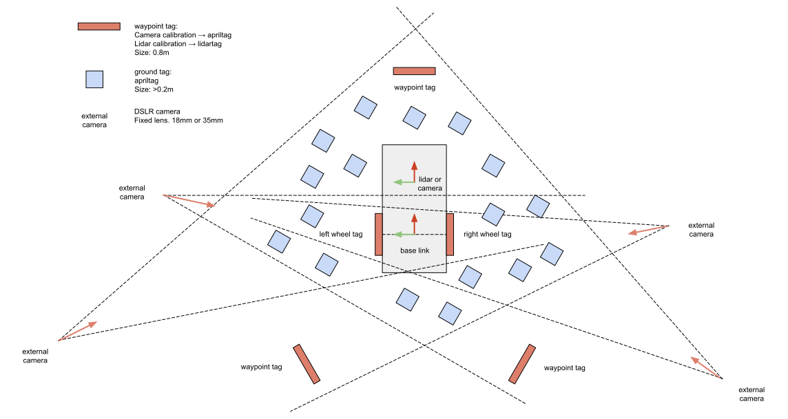
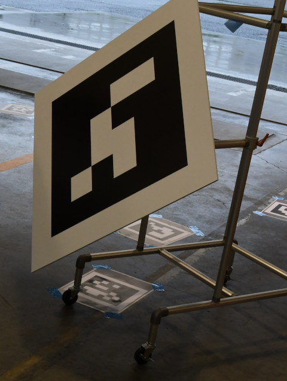
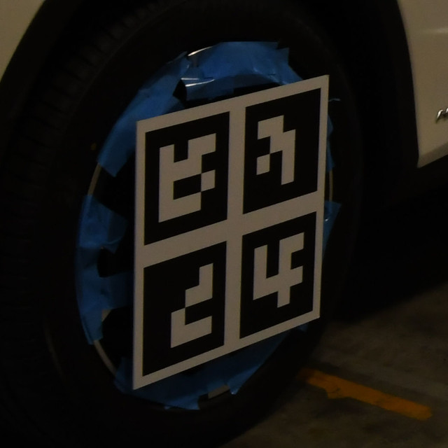
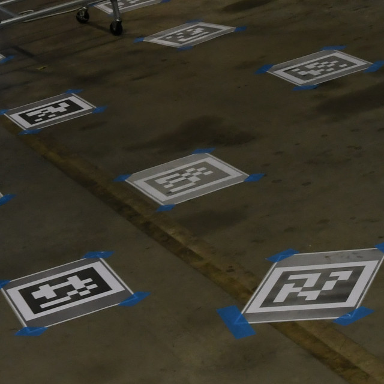
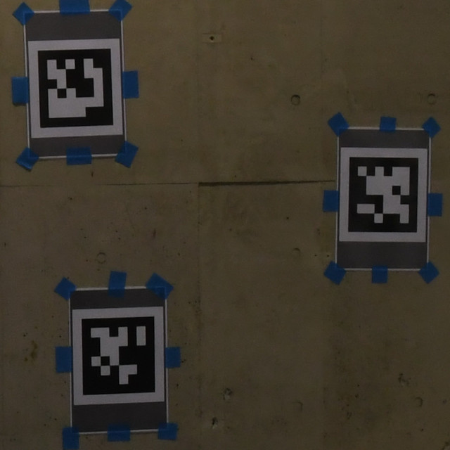

# tag_based_sfm_calibrator

A tutorial for this calibrator can be found [here](../docs/tutorials/tag_based_sfm_calibrator.md).

## Purpose

The package `tag_based_sfm_calibrator` allows extrinsic calibration among most sensors and frames used in autonomous driving and robotics.
In particular, it allows the following extrinsic calibrations:

- base_frame (e.g., `base_link`)
- cameras
- lidars (see the compatibility list in Lidartag [1])

Note: depending on how this tool is configured it can perform the following calibrations:

- base-lidar(s)
- base-camera(s)
- camera(s)-lidar(s)
- lidar-lidar(s)
- camera(s)-lidar(s)
- base-camera(s)-lidar(s)

## Inner-workings / Algorithms

As per the name of the calibrator, this tool relies upon SfM (Structure from Motion) to find the extrinsics between different sensors. However, since we prioritize precision, we do not use natural features and local descriptors, but fiducial systems (in our case apriltags). Furthermore, since the sensors are attached to a still vehicle, we employ an additional camera (from now on dubbed the `external camera`), which we use to create a graph and connect the different vehicle's sensors, which we optimize using standard bundling adjustment.
By using a particular sensor as the origin during bundle adjustment, the other sensor's poses correspond to the desired extrinsics.

Base calibration, on the other hand, can not be directly formulated as a sensor calibration problem (since the base is not a sensor !). We instead formulate an indirect approach to find the `base_link` by using its definitions: a frame between the rear axle projected to the ground. We place two tags in each of the rear wheels and then define the `base_link` as the intersection between these two tags projected into the ground.

## ROS Interfaces

### Input

| Name                                     | Type                                            | Description                                                                                                                                                               |
| ---------------------------------------- | ----------------------------------------------- | ------------------------------------------------------------------------------------------------------------------------------------------------------------------------- |
| `{calibration_lidar_detections_topics}`  | `lidartag_msgs::msg::` `LidarTagDetectionArray` | Lidartag detections. `calibration_lidar_detections_topics` is provided via parameters                                                                                     |
| `{calibration_camera_detections_topics}` | `apriltag_msgs::msg::` `AprilTagDetectionArray` | Apriltag detections. `calibration_camera_detections_topics` is provided via parameters                                                                                    |
| `{calibration_compressed_image_topics}`  | `sensor_msgs::msg::` `CompressedImage`          | Calibration cameras' image topics. Not used directly for calibration but for debugging and evaluation. `{calibration_compressed_image_topics}` is provided via parameters |
| `{calibration_camera_info_topics}`       | `sensor_msgs::msg::` `CameraInfo`               | Intrinsic parameters for the calibration cameras . `calibration_camera_info_topics` is provided via parameters                                                            |

### Output

| Name                     | Type                                   | Description         |
| ------------------------ | -------------------------------------- | ------------------- |
| `markers`                | `visualization_msgs::msg::MarkerArray` | Calibration markers |
| `raw_detections_markers` | `visualization_msgs::msg::MarkerArray` | Detection markers   |

### Services

| Name                                                | Type                                                  | Description                                                                                                 |
| --------------------------------------------------- | ----------------------------------------------------- | ----------------------------------------------------------------------------------------------------------- |
| `extrinsic_calibration`                             | `tier4_calibration_msgs::` `srv::ExtrinsicCalibrator` | Generic calibration service. The call is blocking until the calibration process finishes                    |
| `add_external_camera_` `images_to_scenes`           | `tier4_calibration_msgs::` `srv::FilesListSrv`        | Provides a list of external camera images' files for each `scene`                                           |
| `add_calibration_sensor_` `detections_to_new_scene` | `tier4_calibration_msgs::srv::Empty`                  | Creates a new `scene` from the latest detections received by the node                                       |
| `load_external_camera_intrinsics`                   | `tier4_calibration_msgs::srv::FilesSrv`               | Provides a file containing previously computed external camera intrinsics                                   |
| `save_external_camera_intrinsics`                   | `tier4_calibration_msgs::srv::FilesSrv`               | Provides a path to save the computed external camera intrinsics                                             |
| `calibrate_external_camera_intrinsics`              | `tier4_calibration_msgs::srv::FilesSrv`               | Provides a list of files of external camera images to perform intrinsic calibration for the external camera |
| `process_scenes`                                    | `tier4_calibration_msgs::srv::Empty`                  | Processes all the obtained `scenes`, mainly applying the tag detector to the external images                |
| `calibrate`                                         | `tier4_calibration_msgs::srv::Empty`                  | Uses the processed `scenes` to perform `bundling adjustment` optimization                                   |
| `load_database`                                     | `tier4_calibration_msgs::srv::FilesSrv`               | For debugging purposes. Load a processed database of `scenes`                                               |
| `save_database`                                     | `tier4_calibration_msgs::srv::FilesSrv`               | For debugging purposes. Saves a processed database of `scenes`                                              |

## Parameters

### Core Parameters

| Name                                                        | Type                       | Default Value | Description                                                                                                                                     |
| ----------------------------------------------------------- | -------------------------- | ------------- | ----------------------------------------------------------------------------------------------------------------------------------------------- |
| `publish_tfs`                                               | `bool`                     |               | Flag to optionally publish the resulting calibration as tfs                                                                                     |
| `write_debug_images`                                        | `bool`                     |               | Flag to optionally create images with resulting calibration poses and detections                                                                |
| `base_frame`                                                | `std::string`              | `base_link`   | The `base_frame` is used to compare the initial and calibrated values                                                                           |
| `main_calibration_sensor_frame`                             | `std::string`              |               | The sensor whose frame will become the origin during optimization                                                                               |
| `calibration_lidar_frames`                                  | `std::vector<std::string>` |               | List of the frames corresponding to the calibration lidars                                                                                      |
| `calibration_camera_frames`                                 | `std::vector<std::string>` |               | List of the frames corresponding to the calibration cameras                                                                                     |
| `lidartag_to_apriltag_scale`                                | `double`                   |               | The scale factor for converting lidartag detection sizes to apriltag detection sizes                                                            |
| `auxiliar_tag.family`                                       | `std::string`              |               | The family name of the auxiliary tags                                                                                                           |
| `auxiliar_tag.rows`                                         | `int`                      |               | The number of rows in the auxiliary tags                                                                                                        |
| `auxiliar_tag.cols`                                         | `int`                      |               | The number of columns in the auxiliary tags                                                                                                     |
| `auxiliar_tag.size`                                         | `double`                   |               | The size of the auxiliary tags in meters                                                                                                        |
| `auxiliar_tag.spacing`                                      | `double`                   |               | The spacing between auxiliary tags (as a proportion to relative to the tag size). Only relevant when rows or cols is greater than one           |
| `auxiliar_tag.ids`                                          | `std::vector<int64_t>`     |               | The IDs of the auxiliary tags                                                                                                                   |
| `waypoint_tag.family`                                       | `std::string`              |               | The family name of the waypoint tag                                                                                                             |
| `waypoint_tag.rows`                                         | `int`                      |               | The number of rows in the waypoint tag                                                                                                          |
| `waypoint_tag.cols`                                         | `int`                      |               | The number of columns in the waypoint tag                                                                                                       |
| `waypoint_tag.size`                                         | `double`                   |               | The size of the waypoint tag in meters                                                                                                          |
| `waypoint_tag.spacing`                                      | `double`                   |               | The spacing between waypoint tags (as a proportion to relative to the tag size). Only relevant when rows or cols is greater than one            |
| `waypoint_tag.ids`                                          | `std::vector<int64_t>`     |               | The IDs of the waypoint tags                                                                                                                    |
| `ground_tag.family`                                         | `std::string`              |               | The family name of the ground tag                                                                                                               |
| `ground_tag.rows`                                           | `int`                      |               | The number of rows in the ground tag                                                                                                            |
| `ground_tag.cols`                                           | `int`                      |               | The number of columns in the ground tag                                                                                                         |
| `ground_tag.size`                                           | `double`                   |               | The size of the ground tag in meters                                                                                                            |
| `ground_tag.spacing`                                        | `double`                   |               | The spacing between ground tags (as a proportion to relative to the tag size). Only relevant when rows or cols is greater than one              |
| `ground_tag.ids`                                            | `std::vector<int64_t>`     |               | The IDs of the ground tags                                                                                                                      |
| `wheel_tag.family`                                          | `std::string`              |               | The family name of the wheel tag                                                                                                                |
| `wheel_tag.rows`                                            | `int`                      |               | The number of rows in the wheel tag                                                                                                             |
| `wheel_tag.cols`                                            | `int`                      |               | The number of columns in the wheel tag                                                                                                          |
| `wheel_tag.size`                                            | `double`                   |               | The size of the wheel tag in meters                                                                                                             |
| `wheel_tag.spacing`                                         | `double`                   |               | The spacing between wheel tags (as a proportion to relative to the tag size). Only relevant when rows or cols is greater than one               |
| `left_wheel_tag_id`                                         | `int`                      |               | The ID of the left wheel tag                                                                                                                    |
| `right_wheel_tag_id`                                        | `int`                      |               | The ID of the right wheel tag                                                                                                                   |
| `ba.optimize_intrinsics`                                    | `bool`                     |               | Flag to optimize the external camera intrinsics during bundle optimization                                                                      |
| `ba.share_intrinsics`                                       | `bool`                     |               | Flag to share intrinsics between different external camera images                                                                               |
| `ba.force_shared_ground_plane`                              | `bool`                     |               | Flag to force the use of a shared ground plane model among the ground tags during bundle optimization                                           |
| `ba.virtual_lidar_f`                                        | `double`                   |               | The focal length of the virtual pinhole model for lidars used in bundle adjustment optimization                                                 |
| `ba.calibration_camera_` `optimization_weight`              | `double`                   |               | The weight of the camera calibration term in bundle adjustment optimization                                                                     |
| `ba.calibration_lidar_` `optimization_weight`               | `double`                   |               | The weight of the lidar calibration term in bundle adjustment optimization                                                                      |
| `ba.external_camera_` `optimization_weight`                 | `double`                   |               | The weight of the external camera calibration term in bundle adjustment optimization                                                            |
| `ba.fixed_ground_plane_model`                               | `bool`                     | `false`       | Flag to fix the ground plane model during optimization using the values from the initial calibration                                            |
| `initial_intrinsic_calibration.` `board_type`               | `std::string`              |               | The type of calibration board used for initial intrinsic calibration for the external camera                                                    |
| `initial_intrinsic_calibration.` `tangent_distortion`       | `bool`                     |               | Flag to enable tangent distortion in initial intrinsic calibration for the external camera                                                      |
| `initial_intrinsic_calibration.` `radial_distortion_coeffs` | `int`                      |               | The number of radial distortion coefficients used in initial intrinsic calibration for the external camera                                      |
| `initial_intrinsic_` `calibration.debug`                    | `bool`                     |               | Flag to enable debug mode in initial intrinsic calibration for the external camera                                                              |
| `initial_intrinsic_` `calibration.tag.family`               | `std::string`              |               | The family name of the tags used in initial intrinsic calibration for the external camera                                                       |
| `initial_intrinsic_` `calibration.` `tag.rows`              | `int`                      |               | The number of rows in the tags used in initial intrinsic calibration for the external camera                                                    |
| `initial_intrinsic_` `calibration.tag.cols`                 | `int`                      |               | The number of columns in the tags used in initial intrinsic calibration for the external camera                                                 |
| `initial_intrinsic_` `calibration.tag.size`                 | `double`                   |               | The size of the tags used in initial intrinsic calibration in meters for the external camera                                                    |
| `initial_intrinsic_` `calibration.tag.spacing`              | `double`                   |               | The spacing between tags used in initial intrinsic calibration in meters for the external camera                                                |
| `initial_intrinsic_` `calibration.tag.ids`                  | `std::vector<int64_t>`     | `[0]`         | The IDs of the tags used in initial intrinsic calibration for the external camera                                                               |
| `initial_intrinsic_` `calibration.board_cols`               | `int`                      |               | The number of columns in the calibration board used for initial intrinsic calibration for the external camera. Only valid for chess-like boards |
| `initial_intrinsic_` `calibration.board_rows`               | `int`                      |               | The number of rows in the calibration board used for initial intrinsic calibration for the external camera. Only valid for chess-like boards    |
| `apriltag.max_hamming`                                      | `int`                      |               | The maximum allowed Hamming distance for apriltag detection                                                                                     |
| `apriltag.min_margin`                                       | `double`                   |               | The minimum required margin for apriltag detection                                                                                              |
| `apriltag.max_out_of_plane_angle`                           | `double`                   |               | The maximum allowed out-of-plane angle for apriltag detection                                                                                   |
| `apriltag.max_reprojection_error`                           | `double`                   |               | The maximum allowed reprojection error for apriltag detection                                                                                   |
| `apriltag.max_homography_error`                             | `double`                   |               | The maximum allowed homography error for apriltag detection                                                                                     |
| `apriltag.quad_decimate`                                    | `double`                   |               | The decimation factor for quad detection in apriltag detection                                                                                  |
| `apriltag.quad_sigma`                                       | `double`                   |               | The sigma value for quad detection in apriltag detection                                                                                        |
| `apriltag.nthreads`                                         | `int`                      |               | The number of threads to use for apriltag detection                                                                                             |
| `apriltag.debug`                                            | `bool`                     |               | Flag to enable debug mode in apriltag detection                                                                                                 |
| `apriltag.refine_edges`                                     | `bool`                     |               | Flag to enable edge refinement in apriltag detection                                                                                            |

## Requirements

The following figure presents the elements involved in the calibration process:

### Waypoint tag

Waypoint tags are meant to be detected by both lidars and cameras.
Since lidar can not detect the tags if they are in the same plane as other elements, an additional structure is needed to allow the detector algorithm to segment it from other objects (see Figure 2).

Considerations:

- Among all the tags in the environment, waypoints are the only ones that can be moved during experiments (please read the provided tutorial and the concept of scenes).
- The orientation of the waypoint tags should be so that the line that connects the calibration sensors and the waypoint tag is perpendicular to the waypoint tag plane. This is recommended since lidartag detection presents worse performance when this is not the case (more than the detector, it is a limitation of most lidars).
- We so far have used 800mmx800mm (complete board size) waypoints, and have worked well for most lidars/configurations in our projects.
  No matter the setting, there should be at least one waypoint tag. However, in practice, the more waypoint tags (tags that the calibration sensors can detect) the faster the calibration process becomes.

### Wheel tag

Wheel tags are what allow us to find the `base_link` via solving the bundle adjustment problem.

Considerations:

- They usually can not be detected by the calibration sensors (instead they are detected by the external camera).
- Since the number of images that contain wheel tags is expected to be low, it is convenient to use grids of individual tags to increase the number of features (tag corners) corresponding to the wheels. An example of a 2x2 tag is presented in Figure 3.
- Since the wheel tags determine the base link, their center should coincide with the axle as much as possible (at least in the x-axis seen from the `base_link`).

### Ground tag

Ground tags are essential during the calibration of the `base_link` since it defines the plane that the `base_link` lives in (an example is presented in Figure 4).

Considerations:

- The surface (ground) in which the vehicle and the ground tags are placed need to be as flat as possible (plane).
- For this particular tag, the width of the tag is relevant. If it can not be assumed to be null, the final `base_link` pose needs to be offsetted manually.
- The ground tags can be printed using normal paper and when attached via tape to the floor. The user needs to be careful not to move them during the experiment while talking.
- The ground tags can be laminated for reuse, but the reflections caused by it can make it difficult or impossible to detect.
  Auxiliary tag
  Auxiliary tags are tags that do not have restrictions on their placement and use and were added to improve the observation distribution in the bundle adjustment graph. If it were not for the auxiliary tags, most of the tags would be on a single plane, save a few observations corresponding to the waypoints and the wheel tags.

Considerations:

- It is recommended to place them in positions and orientations without sufficient samples otherwise. A good examples are walls, for which an example is presented in Figure 5.

### External camera

The role of the external camera is to connect the sensors and their detections creating the graph required for bundle adjustment.

Considerations:

- The camera must behave like a pinhole + distortion model. That is to say, the lenses must be "fixed" during the experiment.
- The highest "real" resolution the better. So far we have tried with Nikon DSLRs (half frame) with moving and fixed lenses, and a simple point-and-shot camera.
- In the pro-tips / recommendations section, more suggestions regarding the camera settings have been provided.

### Initial (external) camera intrinsics calibration board

To use the external camera in bundle adjustment, it is necessary to know, to a certain degree, its intrinsics.
Any board that can be used for this purpose is acceptable but circle-patterned chess boards and apriltags are supported directly by this tool.

<table>
  <tr>
    <td></td>
    <td></td>
    <td></td>
    <td></td>
   </tr>
   <tr>
    <td>
Figure 2. Waypoint tag
</td>
    <td>
Figure 3. Wheel tag
</td>
    <td>
Figure 4. Ground tag
</td>
    <td>
Figure 5. Auxiliar tag
</td>
  </tr>
</table>

## References/External links

[1] Jiunn-Kai (Bruce) Huang, Shoutian Wang, Maani Ghaffari, and Jessy W. Grizzle, "LiDARTag: A Real-Time Fiducial Tag System for Point Clouds," in IEEE Robotics and Automation Letters. Volume: 6, Issue: 3, July 2021.

## Known issues/limitations

- Our version of lidartag only supports the family `16h5`.
- Our codebase only supports apriltag detections for `36h11`.
- Ground tags are assumed to have no width. If that is not the base, you can directly compensate the width in the final extrinsics.
- We only use 2 wheel tags. The quality of the calibration could improve, mainly in the yaw component, if we were to use tags in the four wheels.

## Pro tips/recommendations

- If the `base_link` seems flipped in yaw by 180 degrees, it is probably because you mistook the left and right wheel tags.
- For an optimal depth of field, use the highest f-number possible of the camera and focus to infinity.
- Prefer fixed lenses and do not forget to turn off auto zoom.
- One of the biggest concerns is motion blur when using the external camera. Since a high f-number is recommended, instead of increasing the exposure, prefer using a higher ISO or just under-exposed images.
- Images taken from the external cameras should have as many possible detections in each image. The absolute minimum is 2, but under 3 are discarded.
- Detections from the external camera should whenever possible have the least amount of out-of-plane rotation. This is due to how the pose estimation gets distorted in extreme cases.
- The sampling of the scene by the external camera should focus on the waypoints and wheel tags whenever possible. In terms of usefulness for calibration, images that contain both waypoints and wheel tags are highly coveted. This is due to how they form the closest possible connection between the calibration sensors and the wheels.
