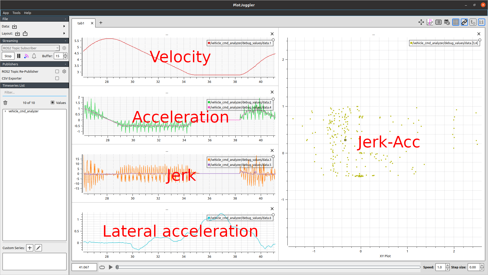
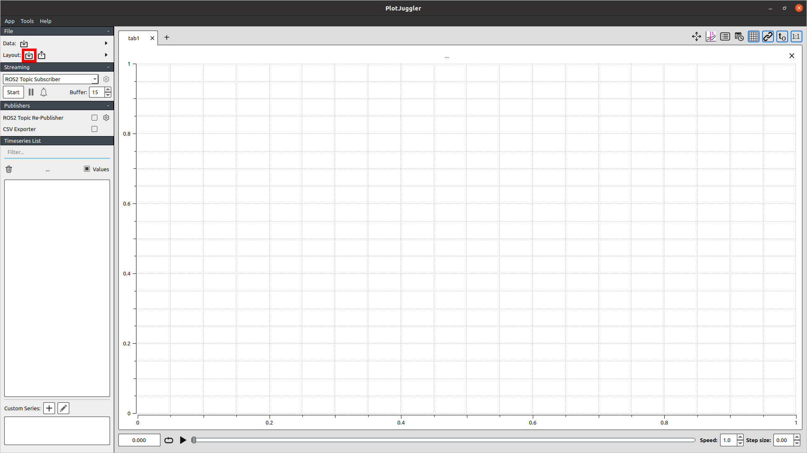
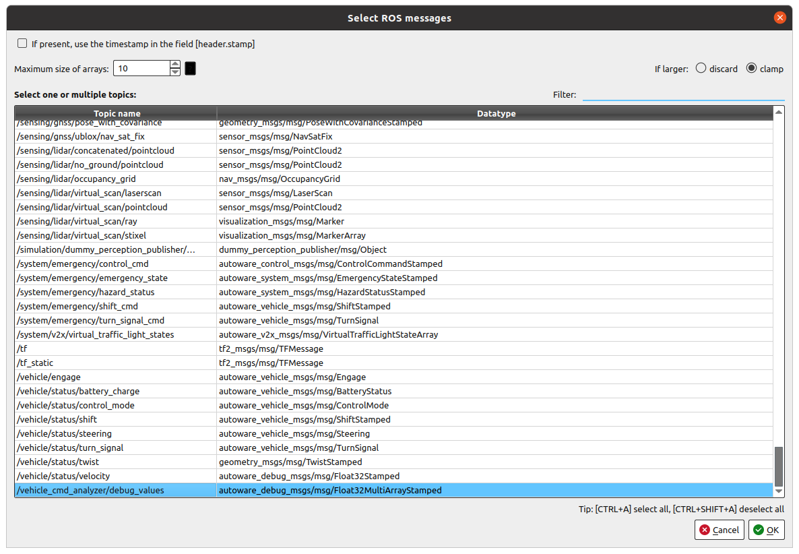

# Vehicle Command Analyzer description

## Overview

This is a visualization tool for vehicle commands.
You need [plotjuggler](https://github.com/facontidavide/PlotJuggler) to plot.

The following time series data will be plotted on the left side.

- Velocity
- Acceleration (acceleration and derivative of velocity)
- Jerk (derivative of acceleration and second derivative of velocity)
- Lateral acceleration

The following data will be plotted on the right side.

- XY plot of jerk-acceleration



## How to use

1. Launch the node.

   ```Shell
   ros2 launch vehicle_cmd_analyzer vehicle_cmd_analyzer.launch.xml vehicle_model:=lexus
   ```

2. Launch plotjuggler.

   ```Shell
   ros2 run plotjuggler plotjuggler
   ```

3. Load layout.xml from File->Layout.
   
4. Press ok in the confirmation dialog.
5. Select`/vehicle_cmd_analyzer/debug_values`.
   
