# marker_radar_lidar_calibrator

In this tutorial, we present a hands-on tutorial of the `marker_radar_lidar_calibrator`. Although we provide a pre-recorded rosbag, the flow of the tutorial is meant to show the user the steps they must perform in their own use cases with live sensors.

General documentation regarding this calibrator can be found [here](../../marker_radar_lidar_calibrator/README.md).

## Setup

This tutorial assumes that the user has already built the calibration tools.
Installation instructions can be found [here](../../../README.md).

## Data preparation

Please download the data (rosbag) from this [link](https://drive.google.com/drive/folders/1G1n2AV47gbQFKQtlzbHJPeV10m5_uMMk).

The rosbag includes three different topics: `/sensing/radar/front_center/objects_raw`, `/sensing/lidar/front_lower/pointcloud_raw`, and `/tf_static`.

## Environment preparation

### Overall calibration environment

The required space for calibration depends on the vehicle and sensors used. An empty and open space in which the ground acts as a plane provides an ideal calibration environment.

Static objects are allowed as they they are ignored with background models during calibration. However moving objects will difficult the process and may require action from the operator (e.g., if a moving object is deemed a corner reflector, the user will need to manually discard said data).

On the other side, the ground being leveled is not always a hard requirement. However, but if not met, the user will have to dedicate time to evaluate if ground segmentation is needed, and if indeed it is, tune the parameters until foreground extraction works correctly.

### Radar reflector

It is recommended to utilize a tripod to adjust the height of the radar reflector and also modify its center to align with the radar sensor. More information about the radar reflector can be found in the [general documentation](../../marker_radar_lidar_calibrator/README.md#radar-reflector).

Before attempting to take calibration data from the reflectors, make sure that they can be detected by both sensors, which can be done visually with `RViz`.

## Launching the tool

In this tutorial, we use the X2 project as an example.
First, run the sensor calibration manager by executing the following command:

```text
ros2 run sensor_calibration_manager sensor_calibration_manager
```

In `Project`, select `x2`, and in `Calibrator`, select `marker_radar_lidar_calibrator`. Then, press `Continue`.

<p align="center">
    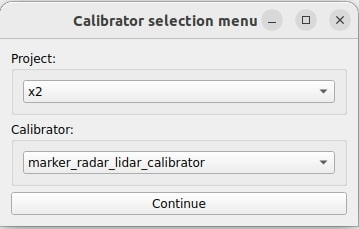
</p>

A menu titled `Launcher configuration` should appear in the UI, and the user may change any parameter he deems convenient.
For this tutorial, we modify the default value of `radar_name` from `front_left` to `front_center`. After configuring the parameters, click `Launch`.

<p align="center">
    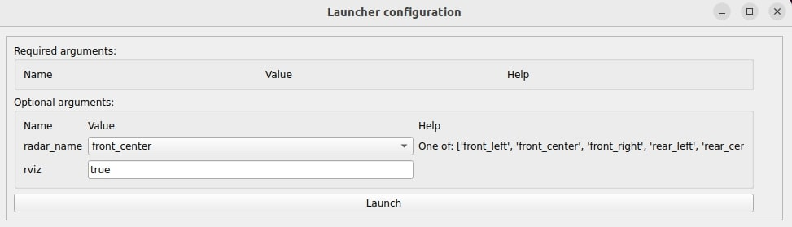
</p>

The following UI should be displayed, and when the `Calibrate` button becomes available, click it to start the calibration process.
However, if it does not become available, it means that either the required `tfs` or services are not available. In this case, since the `tfs` are published by the provided rosbag, run the bag with the command `ros2 bag play radar_lidar.db3 --clock -r 0.5` and click the `Calibrate` button.

<p align="center">
    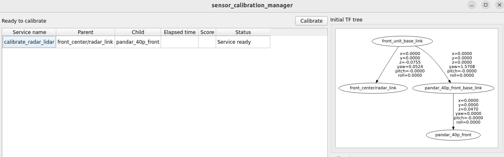
</p>

### Extracting the background models

Once the user starts playing the tutorial rosbag, the pointcloud should appear in `RViz` as shown in the example below. Press the `Extract Background Model` button in the UI to initiate the background extraction process.

Note that the user should remove the radar reflector from the calibration area before this step. If any moving object enters the calibration area at this point, the area that these objects pass through will be marked as background and thus will not be usable for calibration in later steps.

<p align="center">
    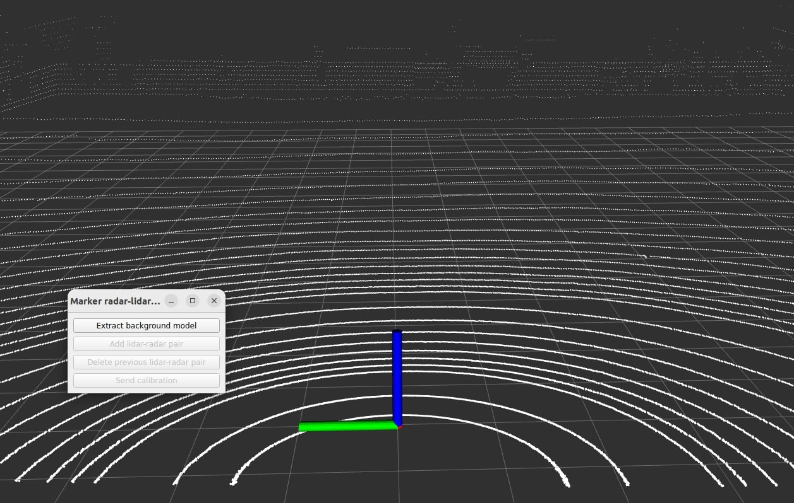
</p>

Once the user clicks the button, it will become unavailable in the UI until the process finishes. For a more detailed status of the background extraction process, the user can check the console logs.

<p align="center">
    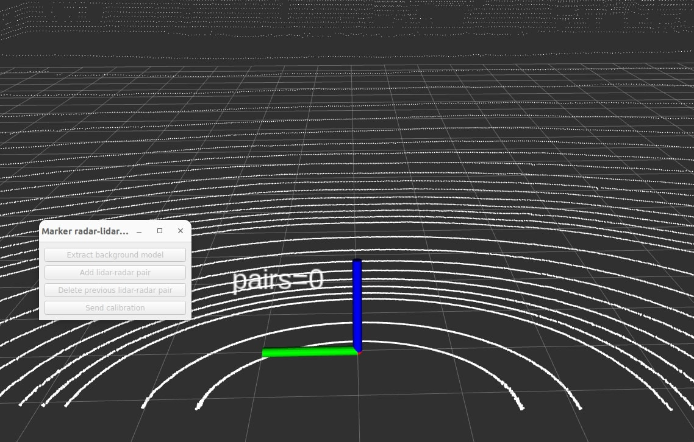
</p>

Once the background is extracted, the `Add lidar-radar pair` button will become enabled, as shown in the following image. After this, the user can start moving radar reflectors into the calibration area.

<p align="center">
    
</p>

Another way to confirm that the background model extraction finished, is to check the console output. The following text should be displayed upon completion:

```text
[marker_radar_lidar_calibrator]: Finished background model initialization
```

To visually confirm the results of the background extraction process, a pointcloud representation of the background models is published in the `lidar_background_pointcloud` and `lidar_foreground_pointcloud` topics. Since their visualization can confuse the user during calibration, they are not rendered by default and the user needs to enable them in `RViz` if needed. In the following image (upper left and lower left) examples of the background model are presented, where each point represents a background voxel.

In the same fashion, the upper right and lower right images correspond to the `lidar_foreground_pointcloud` and `radar_foreground_pointcloud` topics respectively.

<table>
  <tr>
    <td>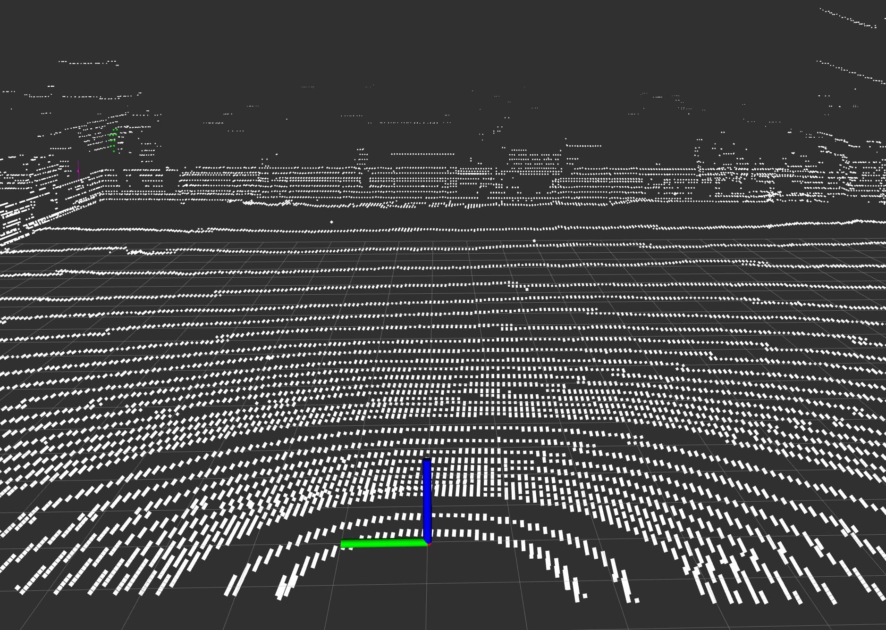</td>
    <td>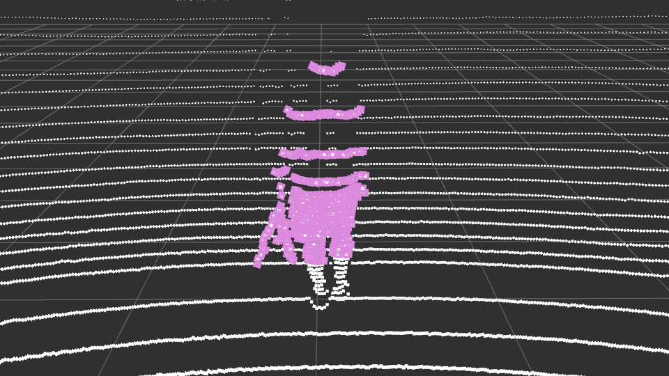</td>
   </tr>
   <tr>
    <td><p style="text-align: center;">Lidar background pointcloud (in white).</p></td>
    <td><p style="text-align: center;">Lidar foreground pointcloud (in magenta). <br>The raw lidar pointcloud (in white) is shown for visualization purposes.</p></td>
  </tr>
</table>

<table>
  <tr>
    <td>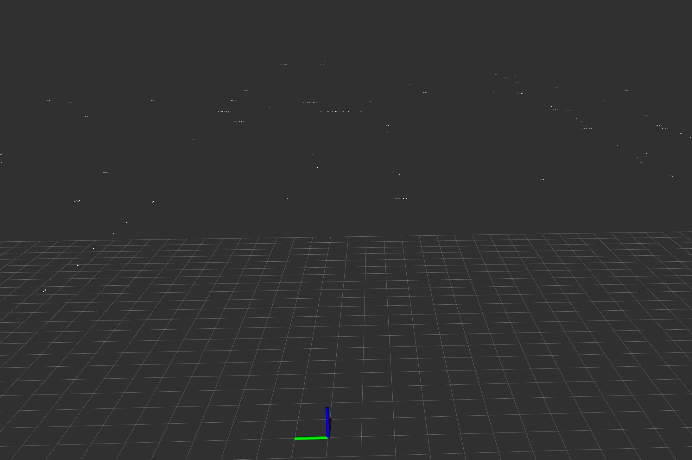</td>
    <td>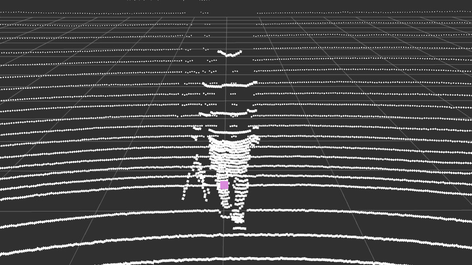</td>
   </tr>
   <tr>
    <td><p style="text-align: center;">Radar background pointcloud (in white).</p></td>
    <td><p style="text-align: center;">Radar foreground pointcloud (in magenta). <br>The raw lidar pointcloud (in white) is shown for visualization purposes.</p></td>
  </tr>
</table>

### Adding lidar-radar pairs

After the background model has been extracted, the user can carry the radar reflector (with the tripod) and place it in the [calibration area](../../marker_radar_lidar_calibrator/README.md#pro-tipsrecommendations). Once the reflector is positioned, the user should move away from it to avoid (otherwise, there is a hight risk of both objects coming part of the same cluster).

In the tutorial rosbag, the user will see that both the human and the radar reflector (with a tripod) are identified as foreground objects in the image below.

In the image, the colored points represent different lidar foreground clusters. The purple lines indicate radar foreground detections, appearing as lines due to the radar's lack of elevation data, making the z-axis unknown. The blue point is the estimated center of the radar reflector derived from the lidar pointcloud. There is no blue point on the human cluster because the calibrator filters out clusters where the highest point in the cluster exceeds the specified threshold.

<p align="center">
    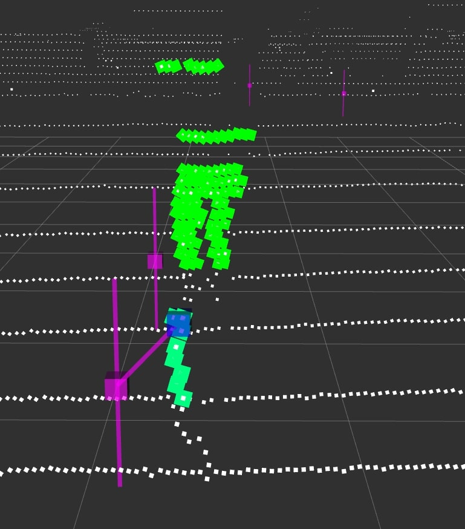
</p>

When a purple line connects the purple point (the radar estimation of the reflector) and the blue point (the lidar estimation of the reflector), the user can press the `Add lidar-radar pair` button to register them as a pair. The line represents that the detections in each modality recognize each other as their best match, thus forming a valid pair. If this does not happen, the initial calibration may be too far from the real value for the pairing heuristic to succeed.

Afterward, if the pair that the user added converges, it will be added to the data used for calibration. Additionally, the colors of the markers will change: the white point indicates the lidar estimation, the red point marks the initial radar estimation, and the green point signifies the calibrated radar estimation.

<p align="center">
    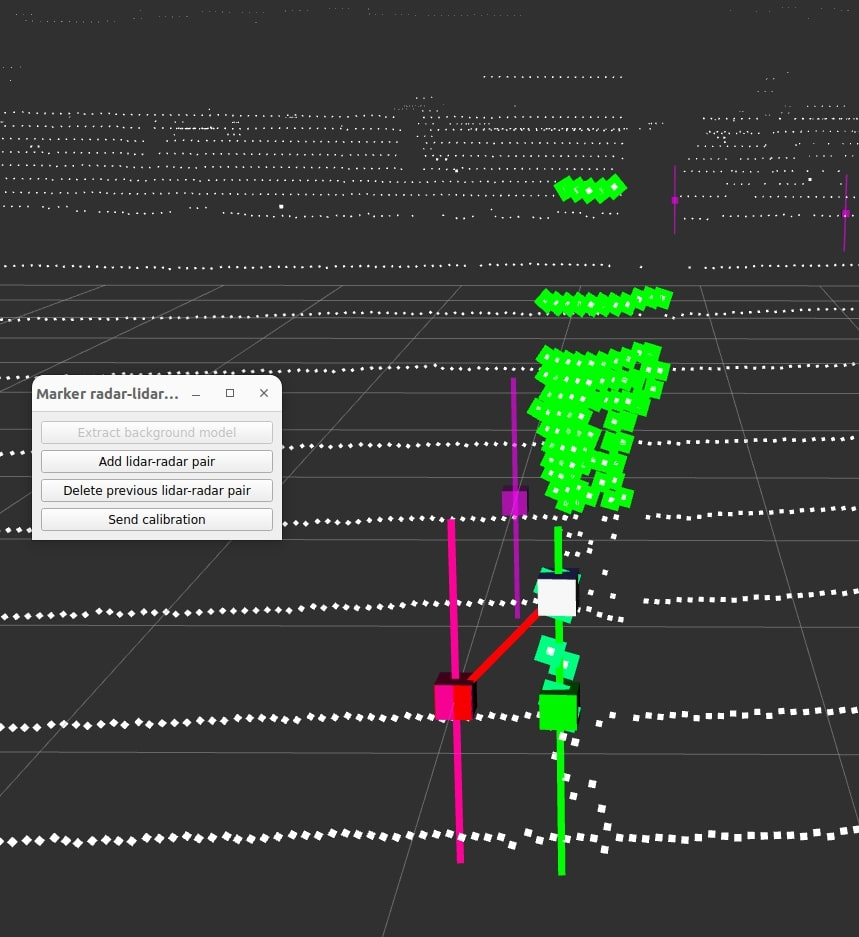
</p>

As described in the [Step 3: Matching and filtering](../../marker_radar_lidar_calibrator/README.md#step-3-matching-and-filtering) in the general documentation, we rely on the initial calibration to pair each lidar detection with its closest radar detection, and vice versa. Below, we show examples of good and bad initial calibration.

In both images, the calibrator detects one lidar detection (blue points) and two radar detections (purple lines). The radar detections identify two potential reflectors: a human and a radar reflector (located closer to the bottom of the image). In the good initial calibration image, the blue point from lidar detection will correctly match the radar detection, as they are the closest to each other. However, in the image of bad initial calibration, the lidar detection will incorrectly match the radar detection of the human. If the user identifies that the initial calibration is not good enough for the matching process to succeed, he will need to address this issue before attempting to continue with this process.

<table>
  <tr>
    <td>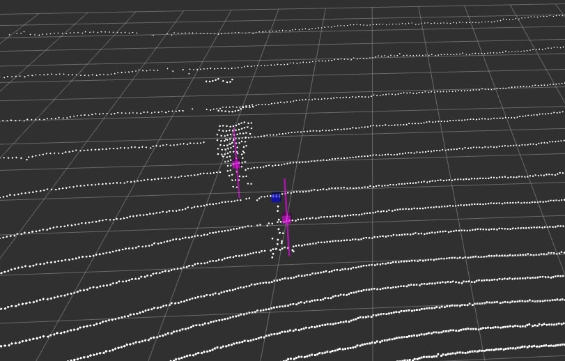</td>
    <td>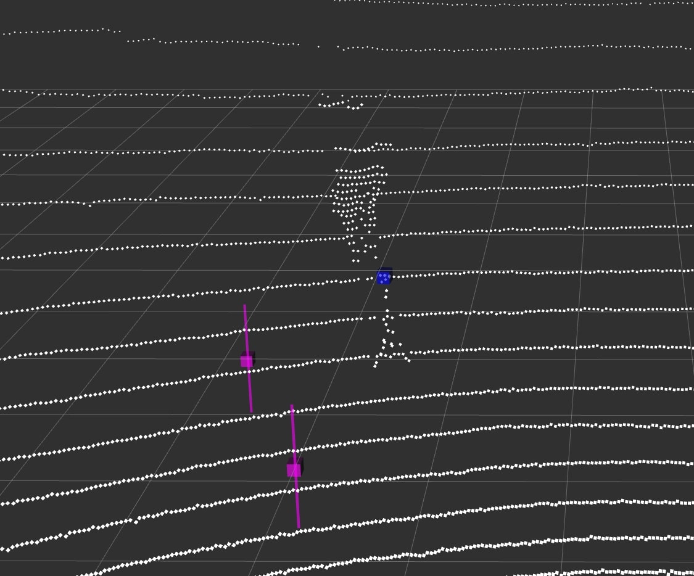</td>
   </tr>
   <tr>
    <td><p style="text-align: center;">Good initial calibration.</p></td>
    <td><p style="text-align: center;">Bad initial calibration.</p></td>
  </tr>
</table>

### Deleting previous lidar-radar pairs

During the calibration, if there are any mismatched pairs (e.g., a human appearing in front of both the radar and lidar), the user can click the `Delete previous lidar-radar pair` button to remove the previous outlier pair.

To test this feature, the user can click the previous button to delete the latest pair. An example of the status before and after using this feature is presented in the following image:

<table>
  <tr>
    <td>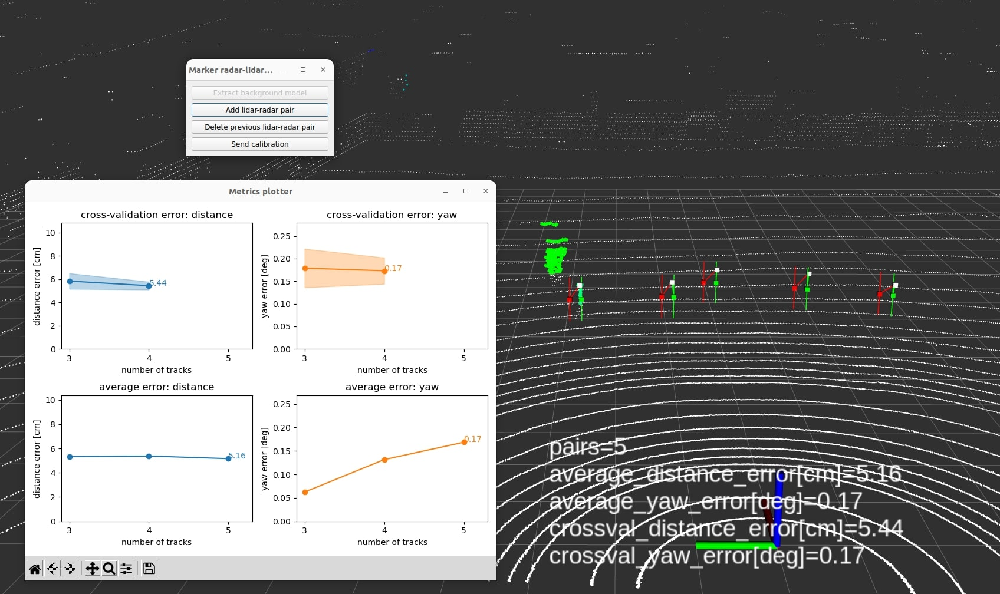</td>
    <td>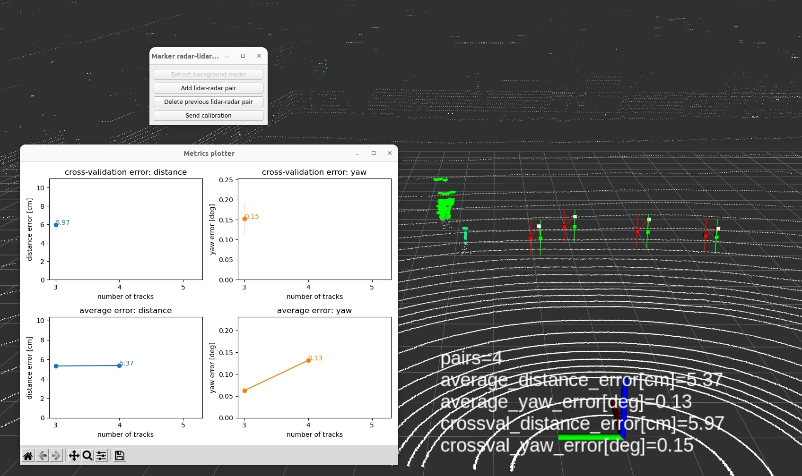</td>
   </tr>
   <tr>
    <td><p style="text-align: center;">Before deletion.</p></td>
    <td><p style="text-align: center;">After deletion.</p></td>
  </tr>
</table>

The console should also show the following text.

```text
[marker_radar_lidar_calibrator]: The last track was successfully deleted. Remaining converged tracks: 4
```

### Calibration error metrics

This package also provides a metric plotter for real-time visualization to help users determine whether enough samples have been collected and identify potential errors in sampling or the presence of outliers.

<p align="center">
    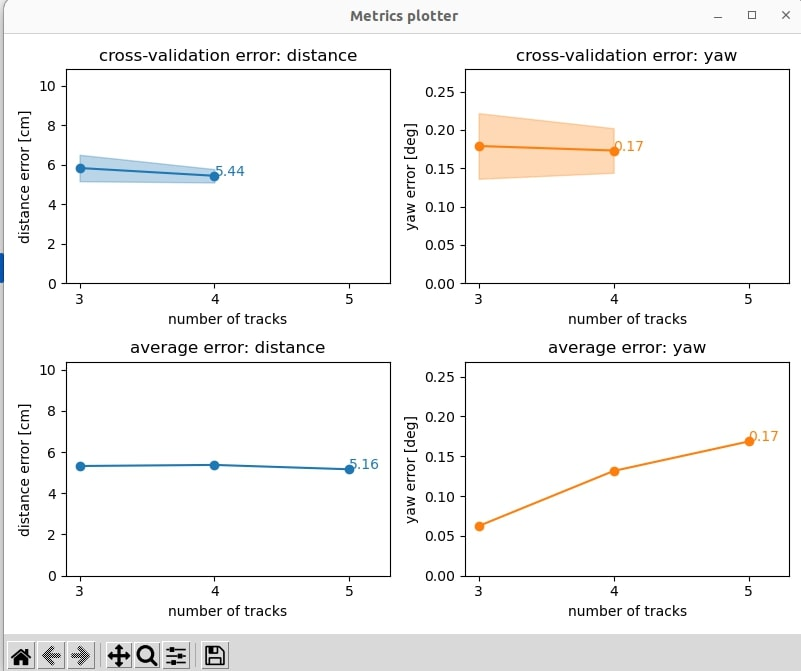
</p>

The top subplots display the cross-validation errors, while the bottom subplot shows the average errors in the calibration procedure. Plotting for the average errors begins after three pairs have been collected. For the cross-validation errors, plotting starts after four pairs have been collected.

The cross-validation error is computed as follows: At any points in time, N pairs have been collected (5 in the previous example), and the cross-validation error is computed for every number of pairs K between 3 and N-1. For every value of K, all potential combinations of size K (NCK or N choose K) are computed, calibration is attempted using those K pairs, and the calibration error is computed over the remaining N - K pairs. Finally, the value of the cross-validation error at `x=K` is the averaged calibration error with the area shown representing the standard deviation of said calibration error.

Note that the value of `x=N-1` represents the leave-on-out cross-validation strategy. Additionally, it is normal for the first few values in the graph to present high cross-validation errors when the number of total samples (N) increase, due to the possibility of having degenerate samples of small sizes (e.g., radar pairs all in the same straight line from the sensors).

The previous process is valid for both cross-validation distance and angle errors, and the users can use these values to determine when to stop the calibration process. When the cross-validation converges both in mean and has a low standard deviation, it can be considered a good point to stop calibrating. The particular criteria is left up to the user, since depending on the use cases, the required accuracy is also affected.

### Sending the calibration result to the sensor calibration manager

The user can click the `Send calibration` button once it is enabled. However, it is recommended to stop the calibration when the curve in the cross-validation error has converged. Therefore, in this tutorial, we run the calibration process until the bag is finished. Once the calibration has ended, the console should show similar message to the following ones:

```text
[marker_radar_lidar_calibrator]: Initial calibration error: detection2detection.distance=0.3279m yaw=1.5119 degrees
[marker_radar_lidar_calibrator]: Final calibration error: detection2detection.distance=0.0576m yaw=0.1642 degrees
[marker_radar_lidar_calibrator]: Final calibration error (rotation only): detection2detection.distance=0.0634m yaw=0.1774 degrees
[marker_radar_lidar_calibrator]: The 2D calibration pose was chosen as the output calibration pose
```

Once the `Send calibration` button is clicked, the result will be sent to the sensor calibration manager. Afterward, no pairs can be added or deleted, as shown in the image below. Please make sure you want to end the calibration process before clicking the button.

<table>
  <tr>
    <td>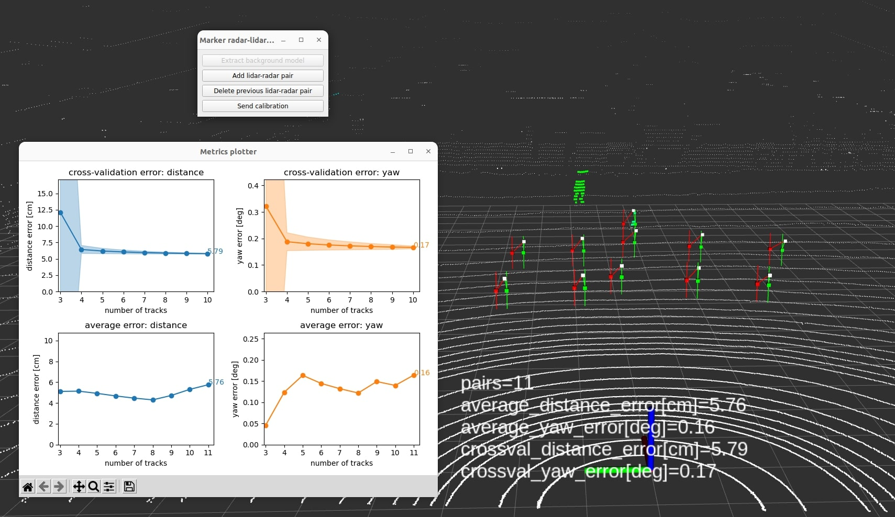</td>
    <td>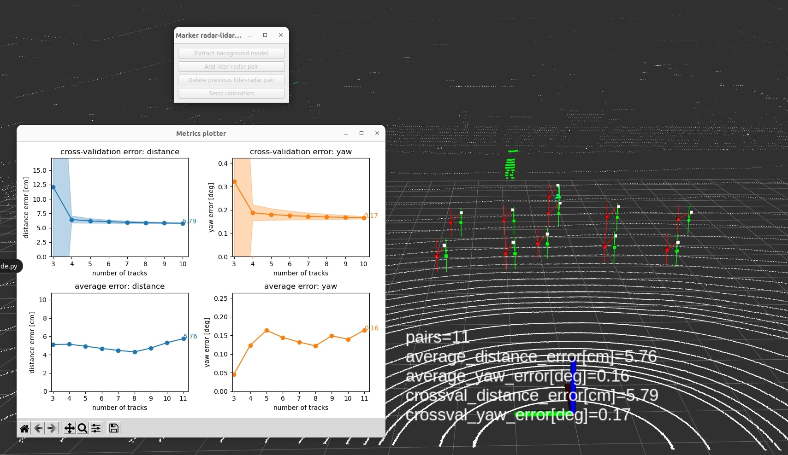</td>
   </tr>
   <tr>
    <td><p style="text-align: center;">Rosbag finished.</p></td>
    <td><p style="text-align: center;">After clicking send calibration.</p></td>
  </tr>
</table>

## Results

After the calibration process finishes, the `sensor_calibration_manager` will display the results in the UI and allow the user to save the calibration data to a file.

In the UI of the X2 project, three different TF trees are displayed: `Initial TF Tree`, `Calibration Tree`, and `Final TF Tree`.

- The `Initial TF Tree` presents the initial TF connections between sensors needed for calibration.
- The `Calibration Tree` shows the calibrated transformation between sensors, in this tutorial, `front_center/radar_link` to `pandar_40p_front`.
- The `Final TF Tree` depicts the TF tree after incorporating the updated calibrated transformation. As autoware utilizes the concept of [sensor_kit](https://autowarefoundation.github.io/autoware-documentation/main/how-to-guides/integrating-autoware/creating-vehicle-and-sensor-model/creating-sensor-model/), the final transformation required to comply to the specifications is `front_unit_base_link` to `front_center/radar_link`. This transformation is performed by the [calibrator interface](../../sensor_calibration_manager/sensor_calibration_manager/calibrators/x2/marker_radar_lidar_calibrator.py) related to this project. The red arrow indicates that the final transformation changed after the calibration process.

<p align="center">
    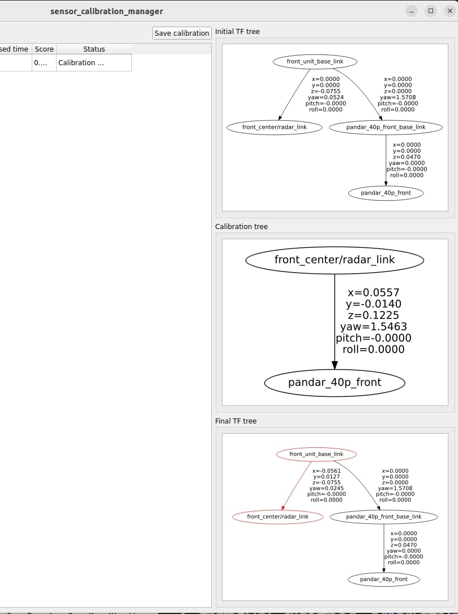
</p>

To evaluate the calibration result, the user can check that the calibrated radar objects (green) are closer than the initial radar objects (red) to the lidar points (white).

## FAQ

- Why does the reflector detection not appear on `RViz`?

  - Make sure the center of the reflector faces toward the radar sensor, and the height of the reflector matches the radar's.
  - Make sure the height of the radar reflector is not larger than the `reflector_max_height` parameter.
  - Make sure the radar reflector is not in the background voxel (visualize the topic mentioned before).

- Why does the calibration error seem high?

  - Make sure that there are no outliers in the calibration pairs list.
  - Make sure that the initial calibration is good enough to match the lidar detection and radar detection correctly.
  - Radars like the ARS408 (the one we use in this tutorial) have a resolution of 0.2m. Given that, there is a theoretical limit to how low the calibration error can be. If the radar resolution is low, it will strongly limit the lower bound of the calibration error.

- When can I stop the calibration process?

  - It is recommended to stop the calibration when the curve in the cross-validation error has converged.
  - With more matched pairs without outliers, the calibration result should improve if the number of pairs increases.

- In the cross-validation plot, why does the standard deviation for a sample size of 3 increase significantly when the overall sample size increases?
  - When the overall number of samples increases, and we randomly select three samples to calculate the transformation, the likelihood of selecting three collinear samples also increases. This selection can lead to significant errors in the transformation for the remaining samples, resulting in a higher standard deviation.
