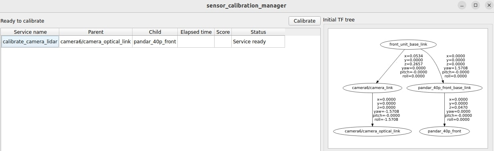
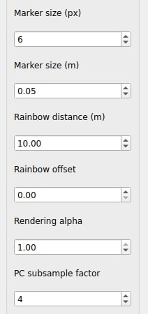

# tag_based_pnp_calibrator

In this tutorial, we present a hands-on tutorial of the `tag_based_pnp_calibrator`. Although we provide a pre-recorded rosbag, the flow of the tutorial is meant to show the user the steps they must perform in their own use cases with live sensors.

General documentation regarding this calibrator can be found [here](../../calibrators/tag_based_pnp_calibrator/README.md).

## Setup

This tutorial assumes that the user has already built the calibration tools.
Installation instructions can be found [here](../../README.md).

## Data preparation

Please download the data (rosbag) from this [link](https://drive.google.com/drive/folders/1eO_B_fdBdc8uI5a5LYU4jrVUS0OzRVEq).

The provided rosbag includes four different topics: `/sensing/camera/camera6/camera_info`, `/sensing/camera/camera6/image_rect_color/compressed`, `/sensing/lidar/front_lower/pointcloud_raw`, and `/tf_static`.

## Environment preparation

### Overall calibration environment

The required space for calibration depends on the vehicle and sensors used. During calibration, please always make sure that tags are detected by both camera and lidar. This can be done by checking whether the tags appear in `RViz` and the `image view` UI. For instance, a cyan rhombus around the tag in `RViz` represents a successful detection by the lidar, as shown in the image below. For the camera detections, if the tag is completely visible (black frame) in the `image view` UI, it should be detectable. So far, in our use cases, the tag is always detected as long as it is completely visible in the image.

<p align="center">
    
</p>

### Apriltag & Lidartag

Details can be found in the [base documentation](../../calibrators/tag_based_pnp_calibrator/README.md)

## Launching the tool

In this tutorial, we use the X2 project as an example.
First, run the sensor calibration manager:

```text
ros2 run sensor_calibration_manager sensor_calibration_manager
```

In `Project`, select `x2`, and in `Calibrator`, select `tag_based_pnp_calibrator`. Then, press `Continue`.

<p align="center">
    
</p>

A menu titled `Launcher configuration` should appear in the UI, and the user may change any parameter he deems convenient.
For this tutorial, we modify the default value of `calibration_pairs` from `9` to `8` as the rosbag contains `8` pairs of detections. We also modify the `camera_name` from `camera0` to `camera6`. After configuring the parameters, click `Launch`.

<p align="center">
    
</p>

The following UI should be displayed. When the `Calibrate` button becomes available, click it.
If it does not become available, it means that either the required `tf` or services are not available. In this case, since the `tf` are published by the provided rosbag, run the bag with the command `ros2 bag play camera_lidar.db3 --clock -r 0.5` and click the `Calibrate` button.

<p align="center">
    
</p>

## Calibration

The calibration starts automatically after clicking the `Calibrate` button. The process will continue until the number of calibration detection pairs reaches the user-defined `calibration_pairs` in the `Launcher configuration`.

When the user starts the calibration process and the sensor data is available, `RViz` and the `image view` should be displayed as shown below.

<p align="center">
    
</p>

After the tool detects enough lidartags and apriltags (the total of calibration points is at least `min_pnp_points`, considering that each tag provides 4 points), it will show the detection markers on `RViz` and the `image view` respectively. The text in `RViz` will also display the number of pairs of converged lidartag/apriltag detections so far.

\*Note: in `RViz`, cyan-colored markers represent raw `lidartag` detections, whereas green ones correspond to tracked ones, and yellow ones represent tracked `apriltag` (camera) tracks. For the `image view`, cyan markers correspond to `apriltag` calibration points whereas magenta ones represent `lidartag` ones.

<p align="center">
    
</p>

Once the user observes the number of pairs increases in `RViz`, he should move the tag(s) to other positions to collect additional calibration data.

**While moving the tag to another position, the user should move the tag decisively from one place to the other, not stopping and starting mid-way.**
Please make sure that the new position is at least `calibration_min_pair_distance` from the closest detection in the set of converged detections and that the tag is in the FOV of both lidar and camera.

Depending on the mount and the ground surface, the tags can oscillate considerably, which can be detrimental to the calibration process. In this case, the user should stop the tag with its hand.

At the end of the calibration, we should get 8 detection pairs, as shown below.


The output in the console should be as follows (variations in the numerical results may occur due to the nature of ROS):

```text
[tag_based_pnp_calibrator_node]:  Initial reprojection error=15.41
[tag_based_pnp_calibrator_node]:  Current reprojection error=1.09
[tag_based_pnp_calibrator_node]:  Filtered reprojection error=1.10
```

## Results

After the calibration process finishes, the `sensor_calibration_manager` will display the outcome in the UI and allow the user to save the calibration results to a file.

In the UI of the X2 project, three different TF trees are displayed: `Initial TF Tree`, `Calibration Tree`, and `Final TF Tree`.

- The `Initial TF Tree` presents the initial TF connections between sensors needed for calibration.
- The `Calibration Tree` shows the calibrated transformation between sensors, in this tutorial, `camera6/camera_optical_link` to `pandar_40p_front`.
- The `Final TF Tree` depicts the TF tree after incorporating the updated calibrated transformation. As autoware utilizes the concept of [sensor_kit](https://autowarefoundation.github.io/autoware-documentation/main/how-to-guides/integrating-autoware/creating-vehicle-and-sensor-model/creating-sensor-model/), the final transformation required to comply to the specifications is `front_unit_base_link` to `camera6/camera_link`. This transformation is performed by the [calibrator interface](../../sensor_calibration_manager/sensor_calibration_manager/calibrators/x2/tag_based_pnp_calibrator.py) related to this project. The red arrow indicates that the final transformation changed after the calibration process.

<p align="center">
    
</p>

At any point, the user can modify the `visualization options` on the right side of the `image view`. Setting the `Marker size (m)` to `0.04` and setting the `PC subsample factor` to `1` can help the user visualize the projected pointcloud on the image.

<p align="center">
    
</p>

Similarly, the `/initial_tf` (in the `visualization options`) can be set to `/current_tf` to observe how the detections are projected into the image before/during/after the calibration process, which constitutes a visual way to inspect the reprojection error and identify any potential errors.

In the following images we can see how the projection looks using the initial calibration and the one obtained through this process. Note how the difference between cyan and magenta markers is either small or imperceptible.

<table>
  <tr>
    <td></td>
    <td></td>
   </tr>
   <tr>
    <td><p style="text-align: center;">Before calibration.</p></td>
    <td><p style="text-align: center;">After calibration.</p></td>
  </tr>
</table>

## FAQ

- Why does the tool fail to add calibration pairs?

  - One possible reason is that the detections are too close to the previously collected data. In this case, the new detections are deemed redundant, and thus not accepted.
  - The timestamps of the lidar and camera are not synchronized. This can be checked with `ros2 topic echo [topic_name] --field header.stamp`. Setting the parameter `use_receive_time` to `True` might help to solve the issue, but is not recommended as a long-term solution.
  - The detections are not stable enough. This can happen due to the following reasons:
    - The detection rate is not stable: this can happen when the lidar points inside the tag frames are not sufficient for the algorithm to detect them reliably, which usually happens when the tag is either far away from the sensor or outside its high-density zone (when applicable). In these cases, please move the tag to a position where enough points (scan lines) hit the tag. If the user forcefully calibrates under undesirable conditions, the results can get compromised.
    - The tag is physically unstable due to wind, mounting issues, or other external factors. Even if the detector functions correctly, these conditions prevent the detection from converging. If this is the case, please eliminate all unwelcome external factors before attempting calibration. Forcefully calibrating under these conditions can compromise the results.

- Why does the UI not launch?

  - Check with `ros2 node list` if the relevant nodes have been launched. It is possible that the provided parameters do not match any of the valid arguments among other standard ROS issues.
  - If the UI crashes (check the console for details), it is probably due to a bad PySide installation, invalid intrinsic parameters, invalid extrinsic parameters, etc.
  - The timestamps of the lidar and camera are not synchronized.

- Why does the reprojection error increase when more data is collected?

  - When there are few samples, the model will fit the available data the best it can, even in the presence of noise (over-fitting) or wrong detections. When more data is collected, the error may increase to a certain extent, but that corresponds to the model attempting to fit all the data, this time unable to fit the noise, resulting in a higher error. However, it should reach a more-or-less table peak with about 10-15 pairs (depending on the data collection pattern/sampling).

- Why does the reprojection error seem high?

  - The intrinsics may not be accurate, thus limiting the performance of the method.
  - The boards are not appropriate (are bent).
  - The boards moved too much while calibrating.
  - The lidar detections presented bad accuracy. Try collecting detections in areas where there is more resolution.
  - There are some outliers when the user forces the calibrator to detect far-away lidar tags or the quality of the lidar is not good for lidartag detection.
