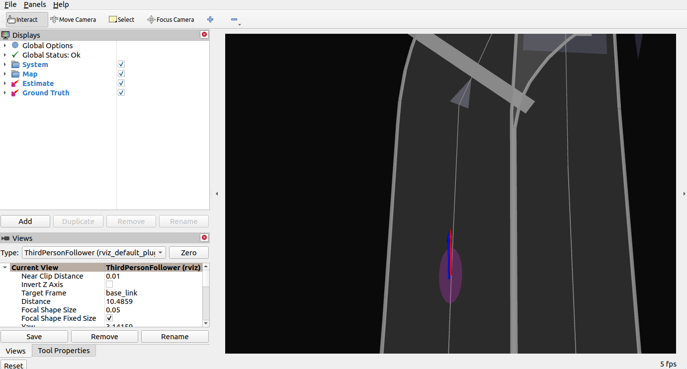

# deviation_estimation_tools

## 1. Quick start

This repository consists of three main tools implemented on ROS2.

1. Deviation Estimator
2. Deviation Evaluator
3. Deviation Evaluation Visualizer

### A. Estimation step

Here you estimate the following parameters using `deviation_estimator`.

- the standard deviation of velocity and yaw rate
- the bias of velocity and yaw rate

Launch the node with the following command. Make sure you set the correct parameters (see Sec. 2).

```sh
ros2 launch deviation_estimator deviation_estimator.launch.xml
```

Then, you need to run either ROS bag or `autoware_launch` to provide `pose` and `twist` to `deviation_estimator`.

If you are using rosbag, it should contain the following topics:

- Raw IMU data (default: `/sensing/imu/tamagawa/imu_raw`)
- Raw velocity data (default: `/vehicle/status/velocity_status`)
- `/localization/pose_estimator/pose_with_covariance`
- `/clock`
- `/tf_static` (that contains transform from `base_link` to `imu_link`)

NOTE that the pose and twist must be estimated with default parameters (see `known issues` section for detail).

Play the rosbag in a different terminal:

```sh
ros2 bag play YOUR_BAG # You can also play in a faster rate, e.g. -r 5
```

You can check the results in the following three output files:

1. IMU parameters (default: `$HOME/imu_corrector.param.yaml`)
2. Velocity parameters (default: `$HOME/vehicle_velocity_converter.param.yaml`)
3. Logs (default: `$HOME/output.txt`)

<details><summary>sample input (rosbag)</summary>
<p>

```sh
Files:             localized_sensors_0.db3
Bag size:          9.6 MiB
Storage id:        sqlite3
Duration:          76.539s
Start:             Jul  8 2022 11:21:41.220 (1657246901.220)
End:               Jul  8 2022 11:22:57.759 (1657246977.759)
Messages:          32855
Topic information: Topic: /localization/pose_estimator/pose_with_covariance | Type: geometry_msgs/msg/PoseWithCovarianceStamped | Count: 2162 | Serialization Format: cdr
                   Topic: /clock | Type: rosgraph_msgs/msg/Clock | Count: 57309 | Serialization Format: cdr
                   Topic: /tf_static | Type: tf2_msgs/msg/TFMessage | Count: 2 | Serialization Format: cdr
                   Topic: /sensing/imu/tamagawa/imu_raw | Type: sensor_msgs/msg/Imu | Count: 8076 | Serialization Format: cdr
                   Topic: /vehicle/status/velocity_status | Type: autoware_auto_vehicle_msgs/msg/VelocityReport | Count: 8275 | Serialization Format: cdr

```

</p>
</details>

<details><summary>sample output (output.txt)</summary>
<p>

```sh
# Validation results
# value: [min, max]
[OK] coef_vx: [0.99538, 0.99593]
[OK] stddev_vx: [0.17192, 0.19161]
[OK] angular_velocity_offset_x: [-0.00742, -0.00727]
[OK] angular_velocity_offset_y: [-0.00119, -0.00115]
[OK] angular_velocity_offset_z: [0.00635, 0.00641]
[OK] angular_velocity_stddev_xx: [0.04151, 0.04258]
[OK] angular_velocity_stddev_yy: [0.04151, 0.04258]
[OK] angular_velocity_stddev_zz: [0.04151, 0.04258]
```

</p>
</details>

<details><summary>sample output (imu_corrector.param.yaml)</summary>

```sh
# Estimated by deviation_estimator
/**:
  ros__parameters:
    angular_velocity_stddev_xx: 0.01798
    angular_velocity_stddev_yy: 0.01798
    angular_velocity_stddev_zz: 0.01798
    angular_velocity_offset_x: -0.00952
    angular_velocity_offset_y: -0.00095
    angular_velocity_offset_z: 0.00607
```

<p>
</details>

<details><summary>sample output (vehicle_velocity_converter.param.yaml)</summary>

```sh
# Estimated by deviation_estimator
/**:
  ros__parameters:
    speed_scale_factor: 0.99507
    velocity_stddev_xx: 0.16708
    velocity_stddev_xx: 0.1 # Default value
    frame_id: base_link # Default value
```

<p>
</details>

<details><summary>unit tool</summary>

If you build normally, a binary will be generated under `install/deviation_estimator/lib/`.

```sh
colcon build --symlink-install --cmake-args -DCMAKE_BUILD_TYPE=Release --packages-up-to deviation_estimator
source ~/autoware/install/setup.bash
~/autoware/install/deviation_estimator/lib/deviation_estimator/deviation_estimator_unit_tool <path_to_rosbag>
```

<p>
</details>

### B. Evaluation step

Here, you can evaluate the estimated standard deviation and bias using a package `deviation_evaluator`.
Execute the following command:

```sh
ros2 launch deviation_evaluator deviation_evaluator.launch.xml map_path:=MAP_PATH rviz:=true in_imu:=YOUR_IMU_TOPIC_NAME in_wheel_odometry:=YOUR_VELOCITY_TOPIC_NAME
ros2 bag play YOUR_BAG
```

### C. Visualization step

After the evaluation, run the following command to generate the final results in `$HOME/deviation_evaluator_sample`.

```sh
pip3 install -r requirements.txt
ros2 launch deviation_evaluator deviation_evaluation_visualizer.launch.xml
```

Done!

## 2. Description of Deviation Estimator

### Overview

The **Deviation Estimator** estimates the standard deviation and bias for velocity and yaw bias, by comparing the velocity and gyro observations with ground truth poses (e.g. from LiDAR-based localization).

Here are some assumptions made for input data:

- The data should have accurate localization results. It doesn't need to be strictly precise, but data that is obviously incorrect should be avoided. In case of NDT in Autoware, it should not have any TP or NVTL warnings from the ndt_scan_matcher.
- The data should cover a reasonable duration of driving. A few minutes of data is sufficient. It is desirable to have a distance of approximately 500 meters. (For example, around 2 minutes at a speed of 15 km/h).
- The data should include sections of driving in a straight line. This is necessary for estimating velocity-related parameters. Having at least one minute of straight line driving is enough.
- The data should cover the expected speed range during operation.
- [Optional] Ideally, the data should be recorded as recently as possible. Especially in cases where IMU or tire replacement has occurred, data recorded before those changes may not provide accurate estimations.
- [Optional] The data should cover various driving behaviors expected during operation, such as right turns, left turns, acceleration, and deceleration.

### Launch

The `deviation_estimator` can be launched with the following command.

```sh
ros2 launch deviation_estimator deviation_estimator.launch.xml
ros2 bag play YOUR_BAG # You can also play in a faster rate, e.g. -r 5
```

The parameters and input topic names can be seen in the `deviation_estimator.launch.xml` file.
`YOUR_BAG` should include all the required inputs written below.

### Inputs / Outputs

#### Input

| Name                     | Type                                              | Description          |
| ------------------------ | ------------------------------------------------- | -------------------- |
| `in_pose_with_covariance | `geometry_msgs::msg::PoseWithCovarianceStamped`   | Input pose           |
| `in_imu`                 | `sensor_msgs::msg::Imu`                           | Input IMU data       |
| `in_wheel_odometry`      | `autoware_auto_vehicle_msgs::msg::VelocityReport` | Input wheel odometry |

#### Output

| Name                                 | Type                        | Description                                      |
| ------------------------------------ | --------------------------- | ------------------------------------------------ |
| `/estimated_stddev_vx`               | `std_msgs::msg::Float64`    | estimated standard deviation of vx               |
| `/estimated_stddev_angular_velocity` | `geometry_msgs/msg/Vector3` | estimated standard deviation of angular velocity |
| `/estimated_coef_vx`                 | `std_msgs::msg::Float64`    | coef of vx                                       |
| `/estimated_bias_angular_velocity`   | `geometry_msgs/msg/Vector3` | bias of angular velocity                         |

### Parameters for deviation estimator

| Name                                           | Type   | Description                                                         | Default value |
| ---------------------------------------------- | ------ | ------------------------------------------------------------------- | ------------- |
| show_debug_info                                | bool   | Flag to display debug info                                          | true          |
| t_design                                       | double | Maximum expected duration of dead-reckoning [s]                     | 10.0          |
| x_design                                       | double | Maximum expected trajectory length of dead-reckoning [m]            | 30.0          |
| time_window                                    | double | Estimation period [s]                                               | 4.0           |
| results_dir                                    | string | Text path where the estimated results will be stored                | "$(env HOME)" |
| gyro_estimation.only_use_straight              | bool   | Flag to use only straight sections for gyro estimation              | true          |
| gyro_estimation.only_use_moving                | bool   | Flag to use only moving sections for gyro estimation                | true          |
| gyro_estimation.only_use_constant_velocity     | bool   | Flag to use only constant velocity sections for gyro estimation     | true          |
| velocity_estimation.only_use_straight          | bool   | Flag to use only straight sections for velocity estimation          | true          |
| velocity_estimation.only_use_moving            | bool   | Flag to use only moving sections for velocity estimation            | true          |
| velocity_estimation.only_use_constant_velocity | bool   | Flag to use only constant velocity sections for velocity estimation | true          |

### Functions

#### Bias estimation

By assuming that the pose information is a ground truth, the node estimates the bias of velocity and yaw rate.

#### Standard deviation estimation

The node also estimates the standard deviation of velocity and yaw rate. This can be used as a parameter in `ekf_localizer`.
Note that the final estimation takes into account the bias.

## 3. Description of Deviation Evaluator

You can use `deviation_evaluator` for evaluating the estimated standard deviation parameters.
This can be run with the following command:

```sh
ros2 launch deviation_evaluator deviation_evaluator.launch.xml map_path:=MAP_PATH rviz:=true in_imu:=YOUR_IMU_TOPIC_NAME in_wheel_odometry:=YOUR_VELOCITY_TOPIC_NAME
ros2 bag play YOUR_BAG
```

All the ros2bag and config files will be stored in `$HOME/deviation_evaluator_sample` (you can change this with `save_dir` parameter in the launch file).

### Features

#### A. Visualization of confidence ellipse

`deviation_evaluator` supports rviz visualization. To use this feature, set `rviz:=true` and `map_path:=/path/to/map_folder`.

<p align="left">
    
</p>

#### B. Check the compatibility with a threshold in `localization_error_monitor`

The `deviation_evaluator` also checks the compatibility of the estimated parameters and the threshold in `localization_error_monitor`.

Concretely, it checks if the two following statement holds:

1. `localization_error_monitor` would NOT diagnose the system as `WARN` nor `ERROR` as long as the NDT is available.
2. `localization_error_monitor` detects the anomaly with a recall over 0.99.

Given the result of this validation, the users can verify that the estimated parameters in `deviation_estimator` can be safely applied to Autoware.

Here, note that the `localization_error_monitor` treat the system as an anomaly if either of error along long-axis of confidence ellipse or error along lateral direction is over threshold. Please refer to the package in autoware.universe for detail.

### Architecture of `deviation_evaluator`

The architecture of `deviation_evaluator` is shown below. It launches two `ekf_localizer`, one for ground truth estimation and one for (partially) dead reckoning estimation. Outputs of both `ekf_localizer` will be recorded and analyzed with `deviation_evaluation_visualizer`.

<p align="left">
    
</p>

### Inputs / Outputs

#### Input

| Name                          | Type                                            | Description                |
| ----------------------------- | ----------------------------------------------- | -------------------------- |
| `in_ndt_pose_with_covariance` | `geometry_msgs::msg::PoseWithCovarianceStamped` | Input pose                 |
| `in_ekf_dr_odom`              | `nav_msgs::msg::Odometry`                       | dead-reckoning EKF outputs |
| `in_ekf_gt_odom`              | `nav_msgs::msg::Odometry`                       | ground-truth EKF outputs   |

#### Output

| Name                               | Type                                            | Description                                      |
| ---------------------------------- | ----------------------------------------------- | ------------------------------------------------ |
| `out_pose_with_covariance_dr`      | `geometry_msgs::msg::PoseWithCovarianceStamped` | Output pose (for dead reckoning `ekf_localizer`) |
| `out_pose_with_covariance_gt`      | `geometry_msgs::msg::PoseWithCovarianceStamped` | Output pose (for ground truth `ekf_localizer`)   |
| `out_initial_pose_with_covariance` | `geometry_msgs::msg::PoseWithCovarianceStamped` | Output initial pose (for both `ekf_localizer`)   |

### Parameters for deviation evaluator

| Name     | Type       | Description                                                                | Default value                             |
| -------- | ---------- | -------------------------------------------------------------------------- | ----------------------------------------- |
| rviz     | bool       | Show rviz if true                                                          | false                                     |
| map_path | string     | Path to the directory where map data (OpenStreetMap or .osm data) is saved | ""                                        |
| save_dir | string     | Output directory where figures, parameter files, and scores are saved      | "$(env HOME)/deviation_evaluator_sample"  |
| period   | double [s] | Duration of cycle                                                          | 10 (in `config/deviation_evaluator.yaml`) |
| cut      | double [s] | Duration of ndt-cut-off                                                    | 9 (in `config/deviation_evaluator.yaml`)  |

## 4. Reflect the estimated parameters in Autoware

The results of `deviation_estimator` is stored in two scripts:

- `imu_corrector` param file (default: `$HOME/imu_corrector.param.yaml`)
- `vehicle_velocity_converter` param file (default: `$HOME/vehicle_velocity_converter.param.yaml`)

Please modify your Autoware configuration so that it will launch using the above two parameter files.

## 5. Known issues

- The plot of `deviation_evaluator.png` generated by `deviation_evaluation_visualizer` may diverge, possibly due to the large covariance caused by a failure in localization.
- `ekf_localizer` in `deviation_evaluator` may not start properly. As for now, please launch `deviation_evaluator` first and then run `ros2 bag play` to provide pose and twist data.
