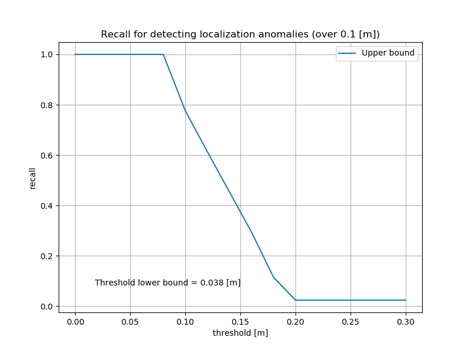

# deviation_estimation_tools

## 1. Quick start

This repository consists of three main tools implemented on ROS2.

1. Deviation Estimator
2. Deviation Evaluator
3. Deviation Evaluation Visualizer

### A. Estimation step

Here you estimate the following parameters using `deviation_estimator`.

- the standard deviation of velocity and yaw rate
- the bias of velocity and yaw rate

Launch the node with the following command. Make sure you set the correct parameters (see Sec. 2).

```sh
ros2 launch deviation_estimator deviation_estimator.launch.xml
```

Then, you need to run either ROS bag or `autoware_launch` to provide `pose` and `twist` to `deviation_estimator`.
You can check the estimated results either by looking at the output of `/estimated_*` ROS topics, or a text file saved in the designated path (default: `$(env HOME)/output.txt`).

If you are using rosbag, it should contain the following topics:

- /localization/twist_estimator/twist_with_covariance_raw
- /localization/pose_estimator/pose_with_covariance
- /clock
- /tf_static (that contains transform from `base_link` to `imu_link`)
- (/localization/twist_estimator/twist_with_covariance: required in the next step)

NOTE that the pose and twist must be estimated with default parameters (see `known issues` section for detail).

Play the rosbag in a different terminal:

```sh
ros2 bag play YOUR_BAG # You can also play in a faster rate, e.g. -r 5
```

<details><summary>sample input (rosbag)</summary>
<p>

```sh
Files:             localized_not_calibrated_0.db3
Bag size:          9.6 MiB
Storage id:        sqlite3
Duration:          76.539s
Start:             Jul  8 2022 11:21:41.220 (1657246901.220)
End:               Jul  8 2022 11:22:57.759 (1657246977.759)
Messages:          32855
Topic information: Topic: /localization/twist_estimator/twist_with_covariance_raw | Type: geometry_msgs/msg/TwistWithCovarianceStamped | Count: 2139 | Serialization Format: cdr
                   Topic: /localization/kinematic_state | Type: nav_msgs/msg/Odometry | Count: 3792 | Serialization Format: cdr
                   Topic: /localization/twist_estimator/twist_with_covariance | Type: geometry_msgs/msg/TwistWithCovarianceStamped | Count: 2139 | Serialization Format: cdr
                   Topic: /clock | Type: rosgraph_msgs/msg/Clock | Count: 15308 | Serialization Format: cdr
                   Topic: /tf | Type: tf2_msgs/msg/TFMessage | Count: 4950 | Serialization Format: cdr
                   Topic: /localization/pose_twist_fusion_filter/kinematic_state | Type: nav_msgs/msg/Odometry | Count: 3792 | Serialization Format: cdr
                   Topic: /localization/pose_estimator/pose_with_covariance | Type: geometry_msgs/msg/PoseWithCovarianceStamped | Count: 731 | Serialization Format: cdr
                   Topic: /tf_static | Type: tf2_msgs/msg/TFMessage | Count: 4 | Serialization Format: cdr

```

</p>
</details>

<details><summary>sample output (.txt)</summary>
<p>

```sh
# Results expressed in base_link
# Copy the following to deviation_evaluator.param.yaml
stddev_vx: 0.1609
stddev_wz: 0.01034
coef_vx: 1.0158
bias_wz: 0.00052

# Results expressed in imu_link
# Copy the following to imu_corrector.param.yaml
angular_velocity_stddev_xx: 0.01034
angular_velocity_stddev_yy: 0.01034
angular_velocity_stddev_zz: 0.01034
angular_velocity_offset_x: -0.005781
angular_velocity_offset_y: -0.006554
angular_velocity_offset_z: -0.000597

```

</p>
</details>

### B. Evaluation step

Here, you can evaluate the estimated standard deviation and bias using a package `deviation_evaluator`.

First, fill the estimated results of `deviation_estimator` in `config/deviation_evaluator.yaml`.

```sh
    # Parameters that you want to evaluate
    stddev_vx: 0.3 # [m/s]
    stddev_wz: 0.02 # [rad/s]
    coef_vx: 1.0 # [m/s]
    bias_wz: 0.0 # [-]
```

Then, execute the following command:

```sh
ros2 launch deviation_evaluator deviation_evaluator.launch.xml map_path:=MAP_PATH
ros2 bag play YOUR_BAG
```

### C. Visualization step

After the evaluation, run the following command to generate the final results in `$HOME/deviation_evaluator_sample`.

```sh
pip3 install -r requirements.txt
ros2 launch deviation_evaluator deviation_evaluation_visualizer.launch.xml
```

Done!

## 2. Description of Deviation Estimator

### Overview

The **Deviation Estimator** estimates the standard deviation and bias for velocity and yaw bias.

### Launch

The `deviation_estimator` can be launched with the following command.

```sh
ros2 launch deviation_estimator deviation_estimator.launch.xml
ros2 bag play YOUR_BAG # You can also play in a faster rate, e.g. -r 5
```

The parameters and input topic names can be seen in the `deviation_estimator.launch.xml` file.
`YOUR_BAG` should include all the required inputs written below.

### Inputs / Outputs

#### Input

| Name                                                  | Type                                             | Description           |
| ----------------------------------------------------- | ------------------------------------------------ | --------------------- |
| `/localization/pose_estimator/pose_with_covariance`   | `geometry_msgs::msg::PoseWithCovarianceStamped`  | Input pose (default)  |
| `/localization/pose_estimator/pose`                   | `geometry_msgs::msg::PoseStamped`                | Input pose            |
| `/localization/twist_estimator/twist_with_covariance` | `geometry_msgs::msg::TwistWithCovarianceStamped` | Input twist (default) |
| `/localization/twist_estimator/twist`                 | `geometry_msgs::msg::TwistStamped`               | Input twist           |

#### Output

| Name                                 | Type                        | Description                                      |
| ------------------------------------ | --------------------------- | ------------------------------------------------ |
| `/estimated_stddev_vx`               | `std_msgs::msg::Float64`    | estimated standard deviation of vx               |
| `/estimated_stddev_angular_velocity` | `geometry_msgs/msg/Vector3` | estimated standard deviation of angular velocity |
| `/estimated_coef_vx`                 | `std_msgs::msg::Float64`    | coef of vx                                       |
| `/estimated_bias_angular_velocity`   | `geometry_msgs/msg/Vector3` | bias of angular velocity                         |

### Parameters for deviation estimator

| Name                      | Type   | Description                                                                                 | Default value                  |
| ------------------------- | ------ | ------------------------------------------------------------------------------------------- | ------------------------------ |
| show_debug_info           | bool   | Flag to display debug info                                                                  | true                           |
| use_pose_with_covariance  | bool   | Flag to use PoseWithCovarianceStamped rostopic for pose. Use PoseStamped if false.          | true                           |
| use_twist_with_covariance | bool   | Flag to use TwistWithCovarianceStamped rostopic for pose. Use TwistStamped if false.        | true                           |
| t_design                  | double | Maximum expected duration of dead-reckoning [s]                                             | 10.0                           |
| x_design                  | double | Maximum expected trajectory length of dead-reckoning [m]                                    | 30.0                           |
| estimation_freq           | double | Estimation frequency [Hz]                                                                   | 0.5                            |
| results_path              | string | Text path where the estimated results will be stored (No output if results_path="" (blank)) | "$(env HOME)/output.txt"       |
| imu_link_frame            | string | The name of IMU link frame                                                                  | "tamagawa/imu_link"            |

### Functions

#### Bias estimation

By assuming that the pose information is a ground truth, the node estimates the bias of velocity and yaw rate.

#### Standard deviation estimation

The node also estimates the standard deviation of velocity and yaw rate. This can be used as a parameter in `ekf_localizer`.
Note that the final estimation takes into account the bias.

## 3. Description of Deviation Evaluator

You can use `deviation_evaluator` for evaluating the estimated standard deviation parameters.
This can be run with the following command:

```sh
ros2 launch deviation_evaluator deviation_evaluator.launch.xml map_path:=MAP_PATH
ros2 bag play YOUR_BAG
```

All the ros2bag and config files will be stored in `$HOME/deviation_evaluator_sample` (you can change this with `save_dir` parameter in the launch file).

### Features

#### A. Visualization of confidence ellipse

`deviation_evaluator` supports rviz visualization. To use this feature, set `rviz:=true` and `map_path:=/path/to/map_folder`.

<p align="left">
    
</p>

<!-- ### B. Analysis on estimated parameters in `deviation_estimator`
`deviation_evaluator` evaluates the parameters estimated in `deviation_estimator`.
The tool stores Mahalanobis distance, and calculates how much of the scores were in X% confidence interval. The scores are stored in `log.txt` in the following format:
```
Confidence interval[%], Actual distribution[%]
50.0, a
75.0, b
95.0, c
```
Make sure that `c>95`. -->

#### B. Materials for determining the threshold

The `deviation_evaluator` also supports you determining the threshold in `localization_error_monitor`.

In order to do so, run `deviation_evaluation_visualizer.py` to visualize the results of `deviation_evaluator` with the following command.

```sh
pip3 install -r requirements.txt
ros2 launch deviation_evaluator deviation_evaluation_visualizer.launch.xml
```

In case of determining a threshold along the long radius (`warn_ellipse_size` or `error_ellipse_size`), see `deviation_evaluator_sample/long_radius`.  
In case of determining a threshold along the lateral direction of the body frame ( `warn_ellipse_size_lateral_direction` or `error_ellipse_size_lateral_direction`), see `deviation_evaluator_sample/body_frame`.

In the directory, you can find a threshold-recall plot for each error threshold (see the below example figure).
The blue line in the plot shows the relationship between recall and threshold. If the recall is 1, it indicates that you have 0.0 [%] of false negative.
You can also find the lower bound of the threshold in the plot. Choose a proper threshold so that

1. **it is above the lower bound** (in the sample, it is 0.038 [m])
2. **recall is high enough** (in the sample, recall will be 1.0 if you choose 0.05[m])

<p align="left">
    
</p>

### Inputs / Outputs

#### Input

| Name                                                     | Type                                             | Description                                                     |
| -------------------------------------------------------- | ------------------------------------------------ | --------------------------------------------------------------- |
| `/localization/twist_estimator/twist_with_covariance`    | `geometry_msgs::msg::TwistWithCovarianceStamped` | Input twist                                                     |
| `/localization/pose_estimator/pose_with_covariance`      | `geometry_msgs::msg::PoseWithCovarianceStamped`  | Input pose                                                      |

#### Output

| Name                                                                      | Type                                             | Description                                       |
| ------------------------------------------------------------------------- | ------------------------------------------------ | ------------------------------------------------- |
| `/deviation_evaluator/twist_estimator/twist_with_covariance`              | `geometry_msgs::msg::TwistWithCovarianceStamped` | Output twist (for `ekf_localizer`)                |
| `/deviation_evaluator/dead_reckoning/pose_estimator/pose_with_covariance` | `geometry_msgs::msg::PoseWithCovarianceStamped`  | Output pose (for dead reckoning `ekf_localizer`)  |
| `/deviation_evaluator/ground_truth/pose_estimator/pose_with_covariance`   | `geometry_msgs::msg::PoseWithCovarianceStamped`  | Output pose (for ground truth `ekf_localizer`)    |
| `/deviation_evaluator/initialpose3d`                                      | `geometry_msgs::msg::PoseWithCovarianceStamped`  | Output initial pose (for both `ekf_localizer`)    |

### Parameters for deviation evaluator

| Name      | Type       | Description                                                                | Default value                                  |
| --------- | ---------- | -------------------------------------------------------------------------- | ---------------------------------------------- |
| rviz      | bool       | Show rviz if true                                                          | false                                          |
| map_path  | string     | Path to the directory where map data (OpenStreetMap or .osm data) is saved | ""                                             |
| save_dir  | string     | Output directory where figures, parameter files, and scores are saved      | "$(env HOME)/deviation_evaluator_sample"       |
| stddev_vx | double     | Standard deviation of vx                                                   | 0.8 (in `config/deviation_evaluator.yaml`)     |
| stddev_wz | double     | Standard deviation of wz                                                   | 0.01 (in `config/deviation_evaluator.yaml`)    |
| coef_vx   | double     | Velocity bias                                                              | 1 (in `config/deviation_evaluator.yaml`)       |
| bias_wz   | double     | Yaw rate bias                                                              | 0 (in `config/deviation_evaluator.yaml`)       |
| period    | double [s] | Duration of cycle                                                          | 10 (in `config/deviation_evaluator.yaml`)      |
| cut       | double [s] | Duration of ndt-cut-off                                                    | 9 (in `config/deviation_evaluator.yaml`)       |

## 4. Reflect the estimated parameters in Autoware

### Results of Deviation Estimator

- standard deviation of velocity (stddev_vx): the first value of `twist_covariance` in `vehicle_velocity_converter.param.yaml`
- standard deviation of yaw rate (stddev_wz): `angular_velocity_stddev_zz` in `imu_corrector.param.yaml`
- coefficient of velocity (coef_vx): depends on the type of the vehicles
- bias of yaw rate (bias_wz): `angular_velocity_offset_z` in `imu_corrector.param.yaml`

### Results of Deviation Evaluator

- threshold along long radius: `*_ellipse_size` in `localization_error_monitor`
- threshold along lateral direction of the body frame: `*_ellipse_size_lateral_direction` in `localization_error_monitor`

## 5. Known issues

- The plot of `deviation_evaluator.png` generated by `deviation_evaluation_visualizer` may diverge, possibly due to the large covariance caused by a failure in localization.
- `ekf_localizer` in `deviation_evaluator` may start properly. As for now, please launch `deviation_evaluator` first and then run `ros2 bag play` to provide pose and twist data.
- The twist and pose used for the calibration must be estimated with DEFAULT dead reckoning calibration parameters. Using non-default values would result in wrong calibration, since this tool currently assumes that the pose and twist data is estimated using default parameters. In case of `sample_vehicle` in Autoware tutorial, leave the two following parameters as default (e.g. by setting `VEHICLE_ID` to `default`):
  - `speed_scale_factor` in pacmod interface (default: 1.0)
  - `angular_velocity_offset_*` in `imu_corrector.param.yaml` (default: 0.0)
