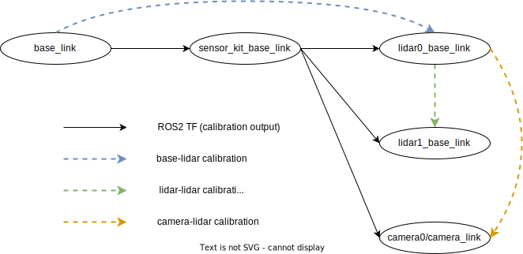
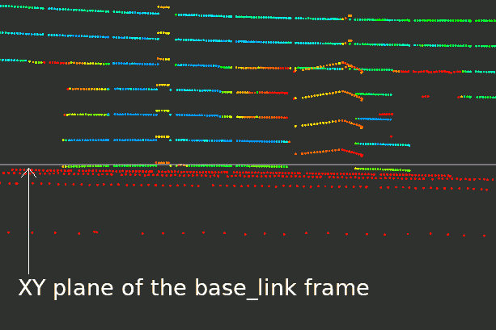
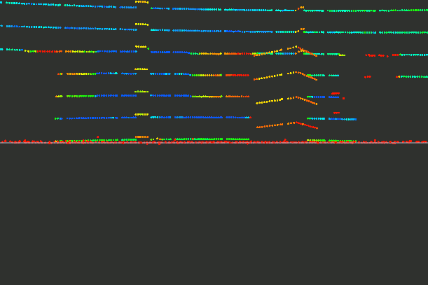
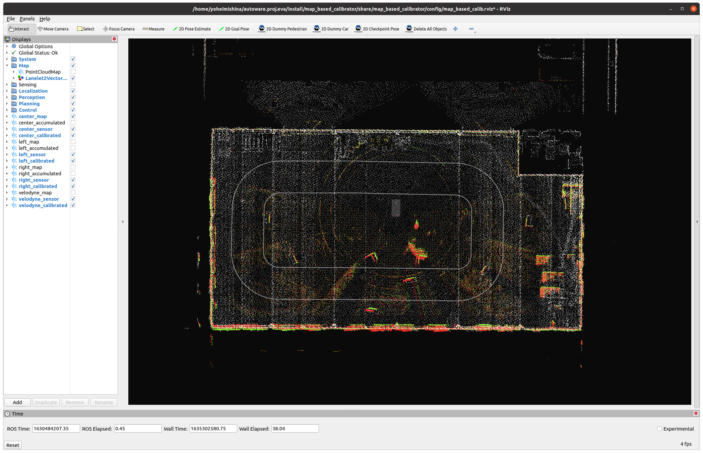
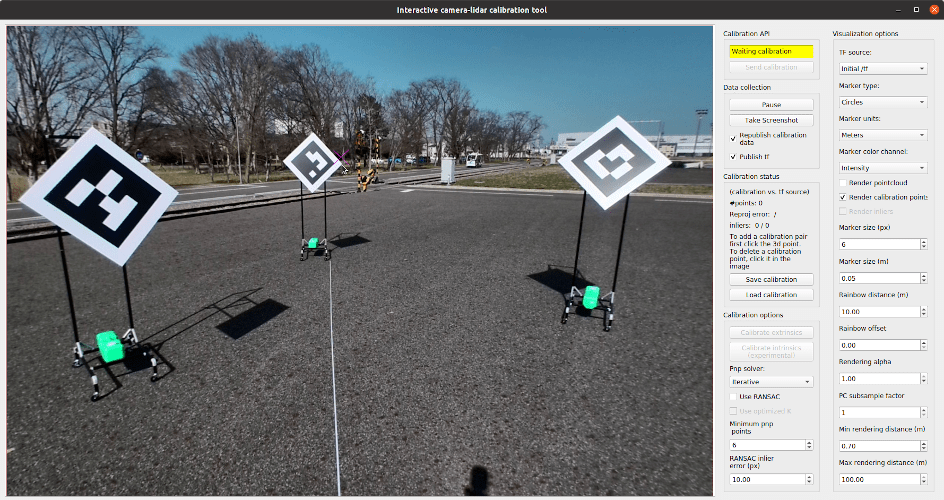
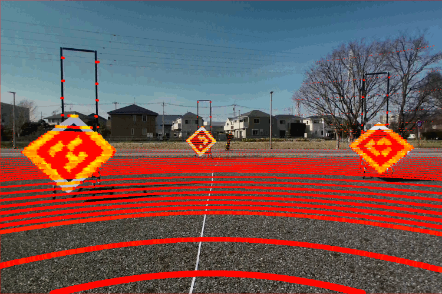

# Sensor Calibration Tools

Sensor calibration can be split into two categories: intrinsic sensor calibration and extrinsic sensor calibration. In our calibration tools, we implement different methods for both categories.

## Extrinsic Calibration

Extrinsic calibration refers to the relative poses among sensors that are provided to ROS2 nodes using the TF interface. Our calibration tools assume a TF diagram like the one presented in Figure 1.

<figure align="center">
   
   <figcaption align="center">Figure 1. Extrinsic calibration diagram</figcaption>
</figure>

In our design, `base_link` corresponds to the projection on the ground of the vehicle's rear axis and each vehicle may possess one or more sensor kits, which is a physical location on the vehicle where sensors are mounted. For example, a normal car would possess one sensor kit mounted on its top, whereas larger vehicles (e.g., a bus) would have several sensor kits distributed along the vehicle.

Although in the diagram present in Figure 1 the TFs from the base to the sensor kits, and from each kit to its sensors are provided, these are not the calibration targets. Instead, we calibrate from the `base_link` to a particular lidar, then from said lidar to the rest of the lidars, and finally from lidars to cameras. In order to comply with the diagram from Figure 1, the final output of the calibration process becomes:

$T(\text{sensor\_kit\_base\_link}, \text{lidar0\_base\_link}) = T(\text{base\_link}, \text{sensor\_kit\_base\_link})^{-1} \times T(\text{base\_link}, \text{lidar0\_base\_link})$

$T(\text{sensor\_kit\_base\_link}, \text{lidar1\_base\_link}) = T(\text{sensor\_kit\_base\_link}, \text{lidar0\_base\_link}) \times T(\text{lidar0\_base\_link}, \text{lidar1\_base\_link})$

$T(\text{sensor\_kit\_base\_link}, \text{camera0/camera\_link}) = T(\text{sensor\_kit\_base\_link}, \text{lidar0\_base\_link}) \times T(\text{lidar0\_base\_link}, \text{camera0/camera\_link})$

where the $T(\text{base\_link}, \text{sensor\_kit\_base\_link})$ is usually provided by a CAD model or can be simply approximated since it is a convenient frame and does not affect other computations.

Looking at the diagram from Figure 1, we could also directly calibrate all the sensors with respect to the `base_link`. However, we believe that sensor-sensor calibration provides more accurate and consistent results so we only use one `base_link` to sensor calibration and from then all other calibrations are performed via pairs of sensors.

### Generic calibration

- [Extrinsic manual calibration](docs/how_to_extrinsic_manual.md)

Intended as a proof-of-concept of our calibration API and as a baseline to which to compare automatic calibration tools, this method allows us to directly modify the values of the TF tree with a rviz view to evaluate the tfs and calibration.

<figure align="center">
   
   <figcaption align="center">Figure 2. Manual calibration</figcaption>
</figure>

### Base-lidar calibration

- [Ground-plane base-lidar calibration](docs/how_to_extrinsic_ground_plane.md)

This calibration method assumes the floor around the vehicle forms a plane and adjusts the calibration tf so that the points corresponding to the ground of the point cloud lie on the XY plane of the `base_link`. As such, only the `z`, `roll`, and `pitch` values of the tf are calibrated, with the remaining `x`, `y`, and `yaw` values needing to be calibrated via other methods such as manual calibration.

<figure align="center">
   
   
   <figcaption align="center">Figure 3. Ground-plane base-lidar calibration (before and after calibration)</figcaption>
</figure>

### Lidar-lidar calibration

- [Map-based lidar-lidar calibration](docs/how_to_extrinsic_map_based.md)

To calibrate pairs of lidars, this method uses standard point cloud registration. However, due to the sparsity of traditional lidars, direct registration proves difficult. To address this issue, this method uses an additional point cloud map and a localization system to solvent this limitation during registration.

<figure align="center">
   
   <figcaption align="center">Figure 4. Map-based calibration</figcaption>
</figure>

### Camera-lidar calibration

- [Extrinsic interactive camera-lidar calibration](docs/how_to_extrinsic_interactive.md)

To calibrate camera-lidar pairs of sensors, a common practice is to compute corresponding pairs of points and then minimize their reprojection error. This calibration method implements a UI to help the selection of these pairs and evaluate their performance interactively.

<figure align="center">
   
   <figcaption align="center">Fig 5. Interactive camera-lidar calibration UI</figcaption>
</figure>

- [Tag-based camera-lidar calibration](docs/how_to_extrinsic_tag_based.md)

This calibration method extends the interactive calibration by performing the corresponding points acquisition automatically via moving a known tag (lidartag) through the shared field of view.

<figure align="center">
   
   <figcaption align="center">Fig 6. Tag-based camera-lidar calibration</figcaption>
</figure>

## Intrinsic Calibration

Intrinsic calibration is the process of obtaining the parameters that allow us to transform raw sensor information into a coordinate system. In the case of cameras, it refers to the camera matrix and the distortion parameters, whereas in lidars it can refer to the offset and spacing of beams. In our repository, we focus only on camera calibration, since lidar intrinsic calibration is usually vendor-specific (and either the direct parameters or instructions are usually provided by them).

### Intrinsic camera calibration

- [Camera calibration](docs/how_to_camera.md)

Based on the traditional ROS camera calibration procedure, we add extra visualizations to aid the calibration process and support for apriltag boards.

- [Camera calibration via camera-lidar calibration](docs/how_to_extrinsic_interactive.md)

Traditionally, camera calibration is performed by detecting several views of planar boards in an image, and so, by knowing the board's dimensions, the camera matrix and distortion can be computed. However, this same process can also be performed by obtaining generic camera-object pairs, like the ones obtained during camera-lidar calibration. By reutilizing the calibration points from camera-lidar calibration, we can perform camera intrinsic calibration and camera-lidar extrinsic calibration simultaneously.
