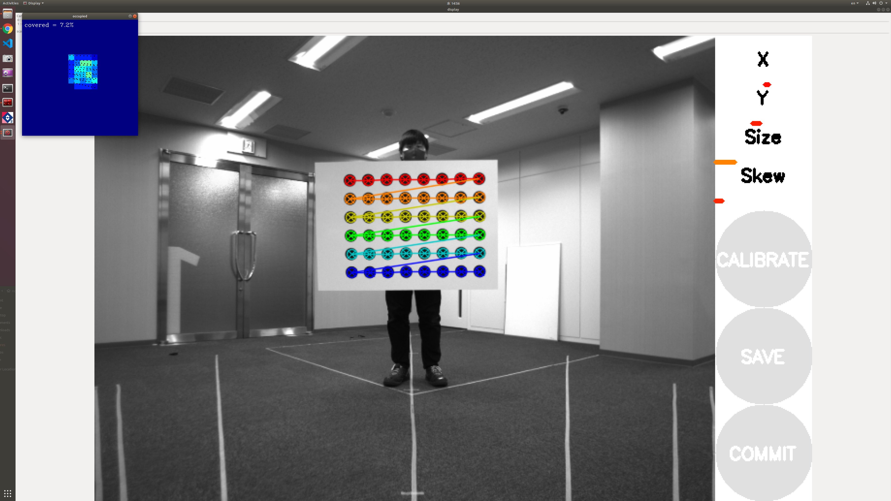
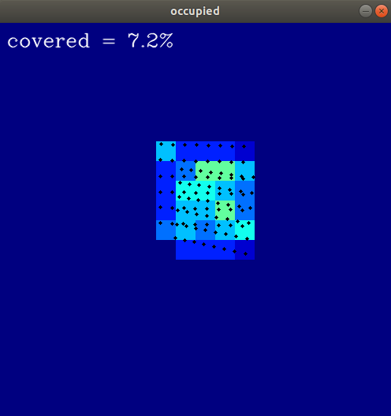
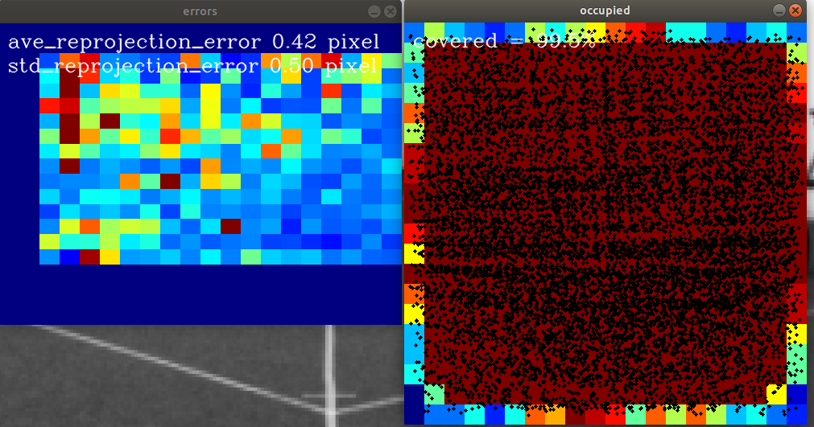

# Camera Calibration

## 1. Prepare Calibration

1. Print out the [PDF](resource/circle_8x6.pdf) as a calibration board.

   NOTE: It is recommended that the board be A0 size and made of a hard material.

2. Connect the camera to be calibrated to the PC.

   NOTE: Currently, the parameters are suitable for the following camera models.

   - FLIR Blackfly S BFS-PGE-16S2C-CS
   - Leopard Imaging LI-USB30-IMX490

   To use the Blackfly S, install the [Spinnaker SDK](https://www.flir.jp/support-center/iis/machine-vision/downloads/spinnaker-sdk-flycapture-and-firmware-download/) and build Autoware.

## 2. Launch Calibration Tools

Launch camera calibration with the following command.

```sh
ros2 launch intrinsic_camera_calibration calibration.launch.xml \
  camera_type:=<camera_type> camera_name:=<camera_name>
```

For Blackfly S,

```sh
ros2 launch intrinsic_camera_calibration calibration.launch.xml \
  camera_type:=bfs camera_name:=camera0
```

For Leopard Imaging,

```sh
ros2 launch intrinsic_camera_calibration calibration.launch.xml \
  camera_type:=li camera_name:=traffic_light
```

Now you are ready to start.

## 3. Camera Calibration Process

1. Hold the board in your hand and stand in front of the camera.
2. Make sure the board is detected and start moving the board slowly.

   

   NOTE

   - It is recommended that you move the board within the following range.
   - Distance: 1 ~ 5 m distance from the camera
   - Tilt: &plusmn;30 degrees of tilt of the board relative to the camera
   - Move the board across the entire field of view so that the coverage shown in the window is at least 90%.

   

3. After the data acquisition is complete, press the CALIBRATE button to start the calibration calculation.

4. After the calibration calculation is completed, the result screen will be displayed.

   

5. Check the output file in `$HOME/*.tar.gz`.
