# Extrinsic Interactive Calibration (camera-lidar)

## 1. Capture rosbag

Capture a rosbag including all the sensor topics. It is highly recommended to record data in a static environment to calibrate but it is not a hard requirement. This tool can also serve as a way to evaluate the current calibration as it implements several visualization options.

The duration is arbitrary, but due to the requirement of object-image pairs of points, the captured data must include several identifiable objects/textures to serve as the beforementioned pairs.

Additionally, by default, this tool requires both the lidars and the camera intrinsics to be calibrated before attempting to calibrate camera-lidar pairs. In the case of not having calibrated the lidars beforehand, the user must disable the use of the `concatenated pointcloud`, and in the case of not having the camera intrinsics calibrated, this tool provides an (experimental) way to calibrate them.

<details><summary>ROSBAG Example</summary>
<p>

```sh
ros2 bag info f8c99b4f-a605-4178-97ef-58bfc39eabe9_2022-02-07-14-23-31_0.db3

[INFO] [1632971360.501197002] [rosbag2_storage]: Opened database 'f8c99b4f-a605-4178-97ef-58bfc39eabe9_2022-02-07-14-23-31_0.db3' for READ_ONLY.

Files:             f8c99b4f-a605-4178-97ef-58bfc39eabe9_2022-02-07-14-23-31_0.db3
Bag size:          3.7 GiB
Storage id:        sqlite3
Duration:          51.59s
Start:             Feb  7 2022 14:23:32.345 (1644211412.345)
End:               Feb  7 2022 14:24:23.404 (1644211463.404)
Messages:          252554
Topic information: Topic: /awapi/autoware/put/engage | Type: autoware_auto_vehicle_msgs/msg/Engage | Count: 0 | Serialization Format: cdr
                   Topic: /sensing/camera/camera1/camera_info | Type: sensor_msgs/msg/CameraInfo | Count: 489 | Serialization Format: cdr
                   Topic: /sensing/camera/camera1/trigger_time | Type: builtin_interfaces/msg/Time | Count: 497 | Serialization Format: cdr
                   Topic: /sensing/camera/camera6/camera_info | Type: sensor_msgs/msg/CameraInfo | Count: 463 | Serialization Format: cdr
                   Topic: /sensing/camera/camera6/trigger_time | Type: builtin_interfaces/msg/Time | Count: 498 | Serialization Format: cdr
                   Topic: /sensing/camera/camera4/camera_info | Type: sensor_msgs/msg/CameraInfo | Count: 479 | Serialization Format: cdr
                   Topic: /sensing/camera/camera0/trigger_time | Type: builtin_interfaces/msg/Time | Count: 498 | Serialization Format: cdr
                   Topic: /sensing/camera/camera4/image_raw/compressed | Type: sensor_msgs/msg/CompressedImage | Count: 446 | Serialization Format: cdr
                   Topic: /sensing/camera/camera1/image_raw/compressed | Type: sensor_msgs/msg/CompressedImage | Count: 491 | Serialization Format: cdr
                   Topic: /sensing/lidar/left_upper/pandar_packets | Type: pandar_msgs/msg/PandarScan | Count: 502 | Serialization Format: cdr
                   Topic: /sensing/lidar/right_lower/pandar_packets | Type: pandar_msgs/msg/PandarScan | Count: 502 | Serialization Format: cdr
                   Topic: /sensing/lidar/right_upper/pandar_packets | Type: pandar_msgs/msg/PandarScan | Count: 502 | Serialization Format: cdr
                   Topic: /sensing/camera/camera3/camera_info | Type: sensor_msgs/msg/CameraInfo | Count: 985 | Serialization Format: cdr
                   Topic: /sensing/camera/camera0/camera_info | Type: sensor_msgs/msg/CameraInfo | Count: 388 | Serialization Format: cdr
                   Topic: /sensing/camera/camera3/image_raw/compressed | Type: sensor_msgs/msg/CompressedImage | Count: 900 | Serialization Format: cdr
                   Topic: /sensing/lidar/front_lower/pandar_packets | Type: pandar_msgs/msg/PandarScan | Count: 506 | Serialization Format: cdr
                   Topic: /sensing/camera/camera2/image_raw/compressed | Type: sensor_msgs/msg/CompressedImage | Count: 436 | Serialization Format: cdr
                   Topic: /sensing/camera/camera4/trigger_time | Type: builtin_interfaces/msg/Time | Count: 498 | Serialization Format: cdr
                   Topic: /sensing/lidar/rear_lower/pandar_packets | Type: pandar_msgs/msg/PandarScan | Count: 507 | Serialization Format: cdr
                   Topic: /sensing/lidar/rear_upper/pandar_packets | Type: pandar_msgs/msg/PandarScan | Count: 506 | Serialization Format: cdr
                   Topic: /sensing/camera/camera6/image_raw/compressed | Type: sensor_msgs/msg/CompressedImage | Count: 380 | Serialization Format: cdr
                   Topic: /sensing/lidar/left_lower/pandar_packets | Type: pandar_msgs/msg/PandarScan | Count: 509 | Serialization Format: cdr
                   Topic: /sensing/camera/camera2/trigger_time | Type: builtin_interfaces/msg/Time | Count: 498 | Serialization Format: cdr
                   Topic: /sensing/lidar/front_upper/pandar_packets | Type: pandar_msgs/msg/PandarScan | Count: 505 | Serialization Format: cdr
                   Topic: /sensing/camera/camera0/image_raw/compressed | Type: sensor_msgs/msg/CompressedImage | Count: 382 | Serialization Format: cdr
                   Topic: /sensing/camera/camera2/camera_info | Type: sensor_msgs/msg/CameraInfo | Count: 473 | Serialization Format: cdr
                   Topic: /sensing/camera/camera3/trigger_time | Type: builtin_interfaces/msg/Time | Count: 503 | Serialization Format: cdr
```

</p>
</details>

## 2. Launch Calibration Tools

To launch the extrinsic interactive calibration tool, use the following command (on terminal 1).

```sh
ros2 launch extrinsic_calibration_manager calibration.launch.xml \
  mode:=interactive sensor_model:=<sensor_model> vehicle_model:=<vehicle_model> camera_name:=<camera_name>
```

For example,

```sh
ros2 launch extrinsic_calibration_manager calibration.launch.xml \
  mode:=interactive sensor_model:=aip_x2 vehicle_model:=gsm8 vehicle_id:=ps1 camera_name:=camera1
```

The, play the recorded calibration rosbag (on terminal 2).

```sh
ros2 bag play <rosbag_path> --clock -l -r 0.2 \
  --remap /tf:=/null/tf /tf_static:=/null/tf_static
```

Once the calibration process ends, the results are written in the `$HOME` folder. In order for Autoware to use them, they must be placed in the corresponding `individual_params` package's `config` folder. For example:

```sh
$HOME/pilot-auto/src/autoware/individual_params/individual_params/config/default/aip_x2
```

**\*Notes**: By default this tool uses the `concatenated_pointcloud`. In the case the user prefers to use a single point cloud, the additional launcher parameters `interactive_use_concatenated` must be set to `false`

## 3. Camera-lidar calibration

Calibrating a camera-lidar pair (i.e., finding the extrinsics) makes the lidar points get projected into the image correctly (See Fig. 1). Conversely, an incorrect calibration culminates in the objects of the point cloud being projected incorrectly (See Fig. 2).

|  |  |
| :---------------------------------------------------------------------: | :-------------------------------------------------------------------------: |
|                       Fig 1. Correct calibration                        |                        Fig 2. Incorrect calibration                         |

The difference between a point in the image (p<sub>image</sub>), and the projection (p<sub>projected</sub>) in the image of its corresponding object point in lidar coordinates (p<sub>object</sub>) is denoted as the reprojection error and can be observed graphically in Figure 3.

<figure align="center">
   
   <figcaption align="center">Fig 3. Reprojection error</figcaption>
</figure>

It follows that to calibrate the extrinsics of the camera-lidar pair of sensors, the reprojection error must be minimized in a set of corresponding pairs of points. The acquisition of the calibration pairs of points can be performed either automatically via a computer vision system or manually, and in this case, the pairs are selected by the user interactively until the calibration achieves a user-defined criterion (e.g., visual confirmation that the projections appear correctly on the image).

## 3. Interactive Calibration Process

After launching the calibrator and receiving synchronized data (image and point cloud), the Interactive calibrator UI appears as presented in Figure 4. The UI includes several functionalities to perform the calibration process and evaluate its results, which will be presented in this manual.

<figure align="center">
   
   <figcaption align="center">Fig 4. Interactive calibration UI</figcaption>
</figure>

It is not necessary to have an initial calibration to use this tool, but it may make the process easier.
For example, Figure 5 shows an example in which an insufficiently good calibration causes posts and road marks projections to be visibly off, yet is still good enough to clearly identify which parts of the calibration are wrong.

<figure align="center">
   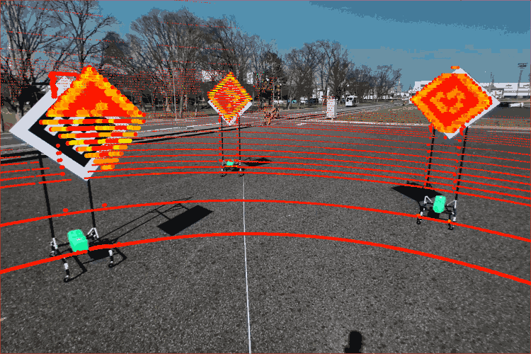
   <figcaption align="center">Fig 5. Initial calibration</figcaption>
</figure>

To initiate the calibration process, in the `rviz` UI, the user must first select an object point by pressing `Publish point` and then clicking the point in the point cloud as presented in Figure 6.

An `Rviz` instance with the profile already set up should launch together with the calibrator UI, but the use of any other profile and configuration is possible. The point can be selected in any frame as long as there exists a `tf` to the lidar frame.

Easy to select object points are corner-like points placed in high-resolution zones of the lidar, which is why it is convenient to use texture-right environments for calibration purposes.

**Note 1:** Since the camera and lidar have different fields of view, the user must be careful not to mistakenly select points that are occluded in one of the sensors.

**Note 2:** Since the optimization function is the reprojection error, although far-away object points have intrinsically less resolution and are more difficult to select, small errors impact less the calibration error than the same error for closer points.

<figure align="center">
   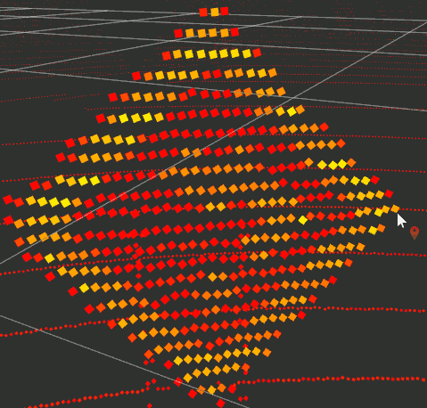
   <figcaption align="center">Fig 6. Object point selection in rviz</figcaption>
</figure>

After selecting the object point, the user must select the corresponding image point in the Interactive calibrator UI as shown in Figure 7. To visually aid the selection, the previously selected object point is projected using the current calibration and displayed in a magenta-colored cross.

<figure align="center">
   
   <figcaption align="center">Fig 7. Image point selection</figcaption>
</figure>

Once a calibration pair is selected, it is displayed in the image as two points connected by a line as shown in Figure 8. The image point is displayed as a green circle and the projected object point is displayed as a red circle. The length of the line represents the reprojection error of the `tf` used for visualization (In Figure 8, the lidar is not displayed. To do so, the `Render pointcloud` checkbox was checked off).

<figure align="center">
   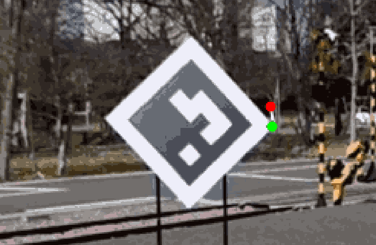
   <figcaption align="center">Fig 8. Calibration point visualization</figcaption>
</figure>

After selecting one calibration pair, the user must repeat the process a number of times to gather enough calibration points as shown in Figure 9. Depending on the optimization algorithm, the minimum number of points to perform the optimization varies, but in general terms, at least 6 points are required, and the greater the number of points and the more widespread the points are the better the optimization result.

<figure align="center">
   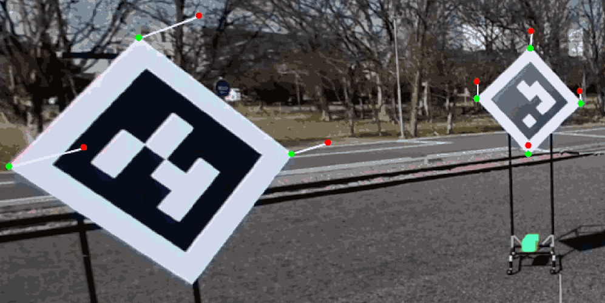
   <figcaption align="center">Fig 9. Calibration points visualization</figcaption>
</figure>

Once a sufficient amount of points is gathered, the user must press `Calibrate extrinsics` button to perform the calibration optimization. However, this does not make the new calibration result to be displayed. To do so, the user must change the `tf` used for visualization by selecting `Calibrator` as shown in Figure 10.

<figure align="center">
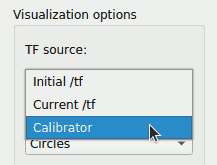
<figcaption align="center">Fig 10. Change of visualization tf</figcaption>
</figure>

After pressing `Calibrate extrinsics` and selecting `Calibrator` as the visualization `tf`, the projected points in red change and get closer to their corresponding green points as shown in Figure 11.

<figure align="center">
   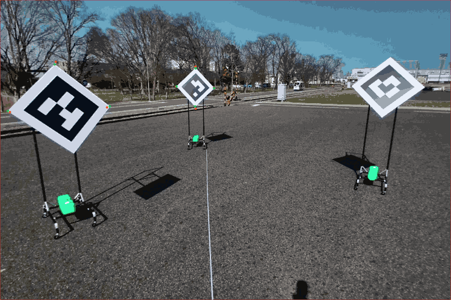
   <figcaption align="center">Fig 11. Calibration points after extrinsic optimization</figcaption>
</figure>

Additionally if we enable again `Render pointcloud`, we can observe how the calibration improves by visually evaluating the new projected point cloud (see Figure 12)

<figure align="center">
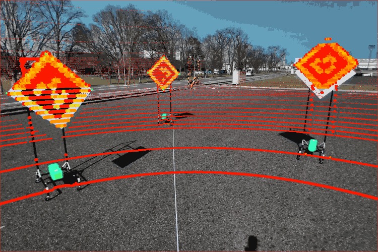
<figcaption align="center">Fig 12. Projected point cloud after calibration</figcaption>
</figure>

Although compared with the initial calibration from Figure 5, the new one from Figure 12 is visually better, it can be easily checked that the calibration is mostly correct only near the points used for calibration. That is why it is useful to place calibration points throughout the image when possible.

In this case, given this calibration, the user can simply improve it by interactively adding calibration points until the results satisfy him. In this case, by adding additional points in the road marks, whose projections were off, it is possible to improve the calibration from Figure 13 to the one from Figure 14.

**\*Note:** When the number of calibration points is low, the algorithm overfits the extrinsics to fit those points, and small errors of the points and incorrect camera intrinsics cause the result not to generalize to areas far from the calibration points. Although adding more points may increase the calibration error, this is normal and the final evaluation must be the visual confirmation of the projected point cloud.

| 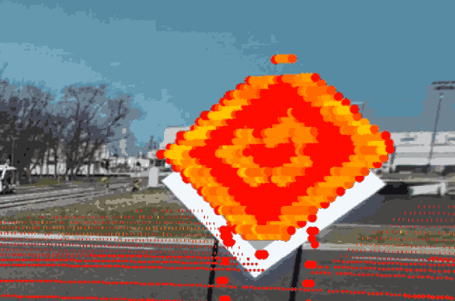 | 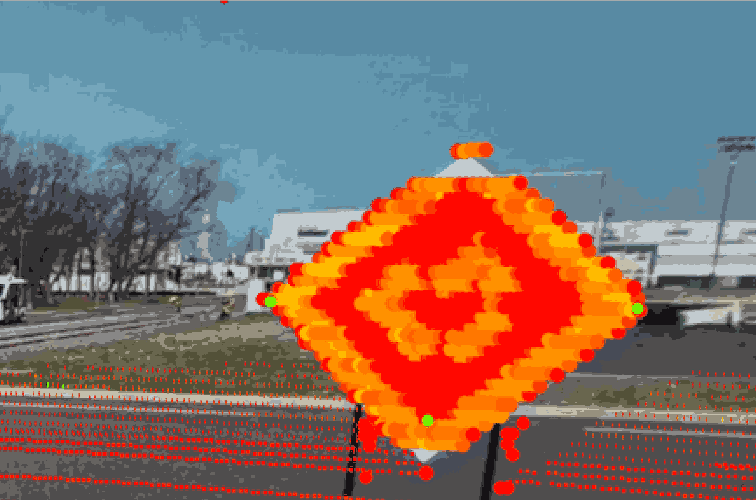 |
| :-----------------------------------------------------------: | :-------------------------------------------------------------: |
|             Fig 13. Calibration before refinement             |               Fig 14.Calibration after refinement               |

Finally, after adding more points near the areas where the calibration is off, the result looks like the one presented in Figure 15. Then, to signal the `calibration manager` that the calibration should end and output the calibration file, the user must press the `Send calibration` button.

<figure align="center">
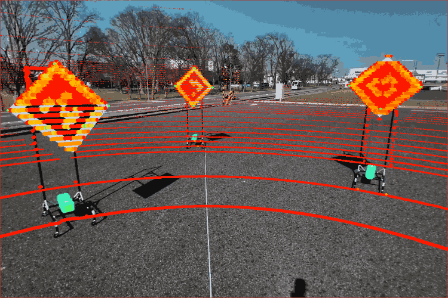
<figcaption align="center">Fig 15. Final calibration</figcaption>
</figure>

## 4. Outliers and deleting calibration points

During calibration, it may occur that an incorrect pair of points is added. In this case, since the algorithm does not mode outliers, the calibration gets strongly affected. One, albeit extreme example, is presented in Figure 16.

<figure align="center">
   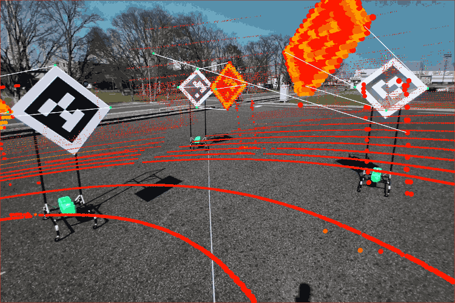
   <figcaption align="center">Fig 16. Calibration result after adding an incorrect calibration pair (outlier)</figcaption>
</figure>

In these, easy to notice examples, the user can simply delete a calibration pair by clicking on it as presented in Image 17 (the user must click the image point displayed in green with clicks on the object points displayed in red having no effect whatsoever).

<figure align="center">
   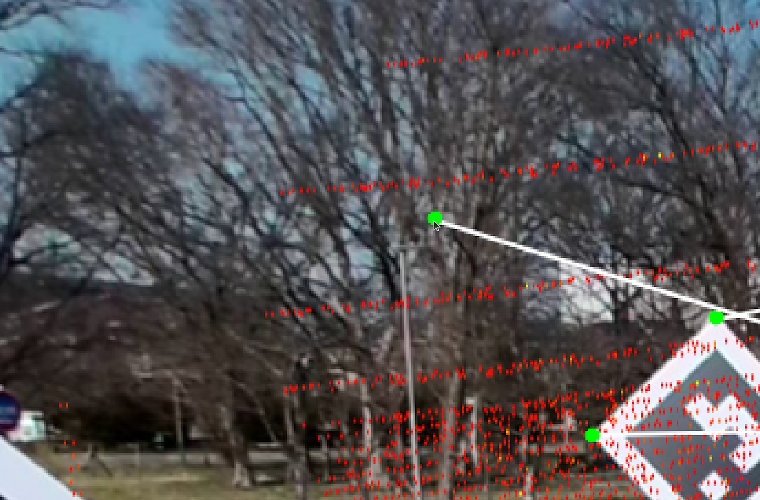
   <figcaption align="center">Fig 17. Calibration pair removal</figcaption>
</figure>

In addition to manually identifying and deleting incorrect calibration pairs, the Interactive calibration tool also implements an additional outlier detection functionality, which is explained later in the manual.

## 5. (Experimental) Camera Intrinsics & Extrinsics Joint Calibration

In several cases, no matter how many calibration pairs of points are, the calibration itself does not improve. If the calibration points are correct, it may be then that the camera intrinsics are incorrect, as they affect the calculation of the reprojection error as shown in Figure 18, where the camera intrinsics are represented by the camera matrix `K`.

<figure align="center">

<figcaption align="center">Fig 18. Camera-lidar extrinsics optimization pipeline</figcaption>
</figure>

Normally, the camera intrinsics are previously calibrated and fixed during the camera-lidar calibration process. However, in the cases where the main source of error comes from the camera intrinsics it is possible to calibrate both the intrinsics and extrinsics together as shown in Figure 19, by jointly optimizing them in a nested fashion (black box optimization in an outer loop and PNP optimization in the inner loop).

<figure align="center">

<figcaption align="center">Fig 19. Camera-lidar intrinsics-extrinsics optimization pipeline</figcaption>
</figure>

It is possible to employ the beforementioned joint optimization in the Interactive calibrator UI by clicking `Calibrate Intrinsics (experimental)`, `Use optimized K`, and `Calibrate Extrinsics` sequentially. An example of the effect of calibrating only the extrinsics with slightly incorrect intrinsics can be observed in Figure 20, whereas the same example where both the intrinsics and extrinsics were calibrated by this tool is presented in Figure 21.

<center>

|  |  |
| ------------------------------------------------------------- | :-------------------------------------------------------------: |
| Fig 20. Extrinsic calibration only                            |               Fig 21.Calibration after refinement               |

</center>

**\*Note:** The implementation of this module assumes distortion-less cameras (null distortion coefficients), where essentially the camera matrix `K` and projection matrix `P` are the same (are only populated by `fx`, `fy`, `cx`, and `cy`).

## 6. Other functionalities

### Calibration Tools API

The interactive calibrator UI, although can be used in a standalone fashion, was designed as a part of the Calibration Tools API, and as such provides a server of the type `ExtrinsicCalibrator` and displays its status as follows:

1. `Disconnected`: The Interactive calibrator UI is advertising the service, but the `Calibrator manager` has not sent a request yet.
2. `Waiting for calibration`: The `Calibration manager` sent a `ExtrinsicCalibrator` request, but the Interactive calibrator UI has not sent the result yet. To do so, the user must first calibrate the extrinsics and then press the 'Send calibration' button (the button itself will be grayed out until there is a calibration available to send).
3. `Calibration sent`: The user has already sent the calibration result, prompting the calibration manager to sever the connection. If the user wants to send the calibration again, it must first restart the Interactive calibrator UI and the `Calibration manager`.

<figure align="center">
   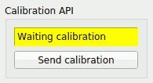
   <figcaption align="center">Fig 22. Calibration API UI</figcaption>
</figure>

### Data collection tools

The `Data collection tools` implement several optional functionalities meant to help the user to both perform the calibration itself and to evaluate it.

1. `Pause/Play`: Whether or not the Interactive calibration tool listens to new data from the sensor topics. It is useful for debugging, evaluation, and calibration purposes, since it enables the user to focus on a single time step of synchronized data.
2. `Take screenshot`: Takes a screenshot of the widget of the UI and the image with the drawings and saves them into the current folder.
3. `Republish calibration data`: Whether or not the synchronized data that is displayed in the Interactive calibrator UI is republished. The advantange of using this feature is that used together with the `Paused/Play` button, the user can calibrate on a fixed pair of image/point cloud (in the usual case, clicking points of the point cloud may prove difficult).
4. `Publish /tf`: Whether or not the Interactive calibrator tool publishes in the `/tf` topic the estimated extrinsics.

<figure align="center">
   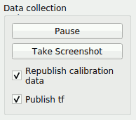
   <figcaption align="center">Fig 23. Data collection UI</figcaption>
</figure>

### Calibration status

The `Calibration status` implement shows several numerical results of the calibration process and also implements save/load capabilities.

1. `Calibration points`: The current number of image-object pairs of points.
2. `Reproj error`: The reprojection error of the current pairs of points. On the left, the reprojection of the calibrated extrinsics is displayed, whereas on the right, the reprojection of the extrinsics used for visualization is displayed (this allows, for example, to compare the reprojection error of the current calibration with the initial one).
3. `Inliers`: The number of points that are considered to be inliers for a specific calibration. Same as with `Reproj error`, the inliers for the calibrated and visualizaion extrinsics are displayed.
4. `Save calibration`: Selects a folder to save the currente calibration. It outputs the image-object calibration pairs of points, the camera-lidar extrinsics (not the one requested by the `Calibration tools`, which is usually the `sensor_kit` to `camera`), and the optimized intrinsics (when they are computed).
5. `Load calibration`: Selects a folder to load a previous calibration from the Interactive calibration tool. This only loads the image-object pairs of points (not the intrinsics/extrinsics).

<figure align="center">
   
   <figcaption align="center">Fig 24. Calibration status UI</figcaption>
</figure>

### Calibration options

The `Calibration options` implement several optional functionalities that affect the calibration process.

1. `Calibrate extrinsics`: Executes the calibration algorithm. Although it is excecuted automatically in some situations, it can also be executed manually (e.g., when points are added or deleted, the calibration is executed automatically).
2. `Calibrate intrinsics (experimental)`: As explained in previous sections, the Interactive calibrator UI offers an alternative way to calibrate the camera intrinsics.
3. `Use RANSAC`: In the case the calibration points are suspected of containing inliers, the user can enable the use of RANSAC, which wil automatically discard outliers and find the best calibration on the largest set of inliers possible.
4. `Use optimized K`: In the case of having optimized the camera intrinsics, whether or not to use the optimized intrinsics for visualization and calibration.
5. `Minimum pnp points`: The minimum number of points used for the calibration algorithm, and the minimum hypothesis size for the RANSAC algorithm.
6. `RANSAC inlier error (px)`: The maximum reprojection error a pair of points can have to be considered as part of the inliers.

<figure align="center">
   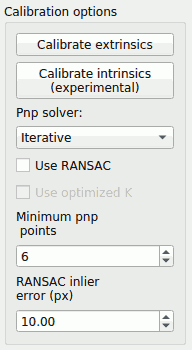
   <figcaption align="center">Fig 25. Calibration options UI</figcaption>
</figure>

### Visualization options

The Interactive calibration tools implements several visualization options to help the calibration process and its evaluation.

1. `TF source points`: To display object points initially in lidar coordinates the extrinsics are required. In this `Combobox` the user can select which tf/extrinsics to use for visualization. The options are: `Initial /tf`: the first camera-lidar extrinsics received from the `/tf` topic. `Current /tf`: the latest camera-lidar extrinsics received from the `/tf` topic. `Calibrator`: the extrinsics obtained from the calibration process (only available after gathering calibration points and performing a calibration).
2. `Marker type`: The marker type used for visualization. Currently circles and squares are implemented
3. `Marker units`: The units used for the markers. These can be either pixels or meters.
4. `Marker color channel`: The channel used for visualizing the point cloud. It can be either cartesian axis or the intensity channel.
5. `Render pointcloud`: Whether or not the point cloud should be rendered.
6. `Render calibration points`: Whether or not thecalibration points should be rendered.
7. `Render inliers`: Whether or not the inlier status of the calibration points should be displayed.
8. `Marker size (px)`: The marker size in pixels (only used when the marker type is pixels).
9. `Marker size (m)`: The marker size in meters (only used when the marker type is meters).
10. `Rainbow distance (m)`: The distance at which the color palete completes s cycle (only works when the color channel is not intensity).
11. `Rainbow offset`: The starting value in the color channel palette (in normalized units between 0 and 1).
12. `Rendering alpha` The transaparency value for the point cloud and other elements (with a numerical value bwtween 0 and 1, which 0 bein transparent and 1 having full opacity):
13. `PC subsample factor`: A subsample factor to render the point cloud. Some point clouds can contain over 10k points, causing unnecessary rendering overload, In those causes an integer value over 1 is useful to reduce this burden. If the complete point cloud is required, this factor should be set to 1.
14. `Min rendering distance (m)`: The minimum distanceat which points will be rendered,
15. `Max rendering distance (m)`: The maximum distance at which points will be rendered.
