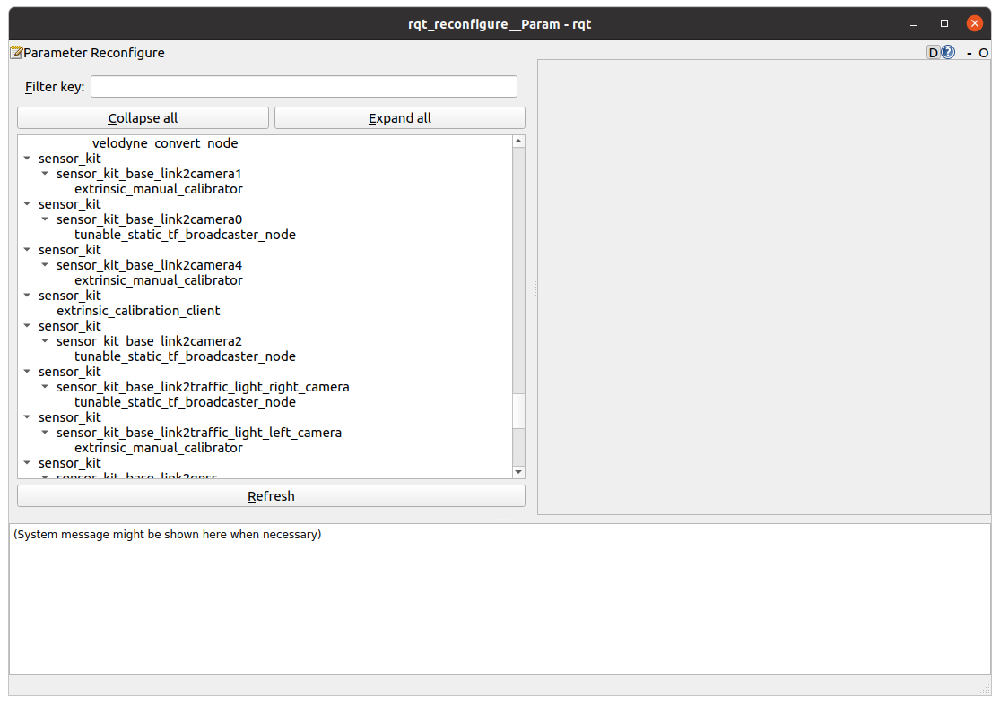
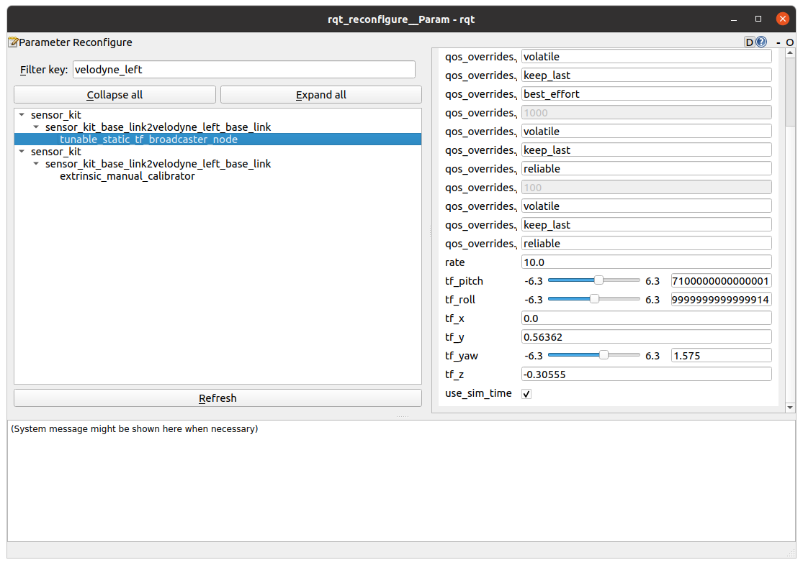
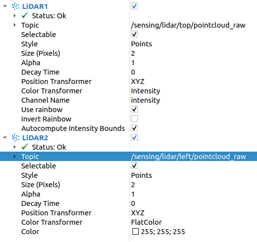
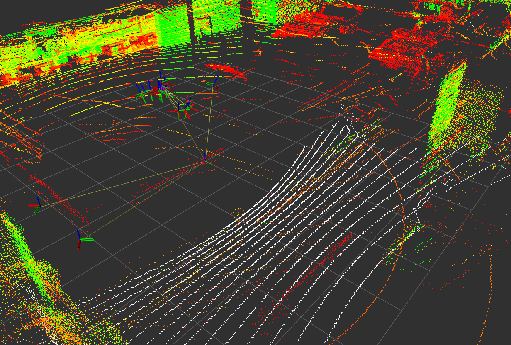
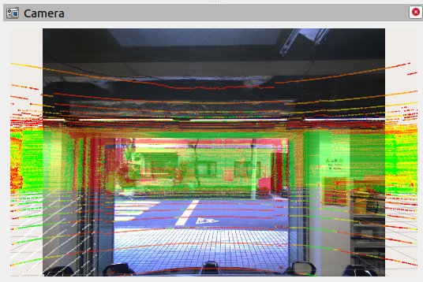

# Extrinsic Manual Calibration

## 1. Capture rosbag

Capture your rosbag including all the sensor topics in a static environment.

The duration is arbitrary, but about some minutes is recommended.

<details><summary>ROSBAG Example</summary>
<p>

```sh
ros2 bag info 211130ae-8a64-4311-95ab-1b8406c4499b_2021-09-27-15-28-46_0.db3

[INFO] [1632971360.501197002] [rosbag2_storage]: Opened database '211130ae-8a64-4311-95ab-1b8406c4499b_2021-09-27-15-28-46_0.db3' for READ_ONLY.

Files:             211130ae-8a64-4311-95ab-1b8406c4499b_2021-09-27-15-28-46_0.db3
Bag size:          1.7 GiB
Storage id:        sqlite3
Duration:          59.999s
Start:             Sep 27 2021 15:28:46.957 (1632724126.957)
End:               Sep 27 2021 15:29:46.957 (1632724186.957)
Messages:          68385
Topic information: Topic: /awapi/autoware/get/status | Type: autoware_api_msgs/msg/AwapiAutowareStatus | Count: 299 | Serialization Format: cdr
                   Topic: /awapi/lane_change/get/status | Type: autoware_api_msgs/msg/LaneChangeStatus | Count: 299 | Serialization Format: cdr
                   Topic: /awapi/object_avoidance/get/status | Type: autoware_api_msgs/msg/ObstacleAvoidanceStatus | Count: 299 | Serialization Format: cdr
                   Topic: /awapi/path_change/put/force | Type: autoware_planning_msgs/msg/PathChangeModule | Count: 598 | Serialization Format: cdr
                   Topic: /awapi/prediction/get/objects | Type: autoware_perception_msgs/msg/DynamicObjectArray | Count: 593 | Serialization Format: cdr
                   Topic: /awapi/traffic_light/get/status | Type: autoware_perception_msgs/msg/TrafficLightStateArray | Count: 593 | Serialization Format: cdr
                   Topic: /awapi/vehicle/get/door | Type: autoware_api_msgs/msg/DoorStatus | Count: 299 | Serialization Format: cdr
                   Topic: /awapi/vehicle/get/status | Type: autoware_api_msgs/msg/AwapiVehicleStatus | Count: 299 | Serialization Format: cdr
                   Topic: /control/current_gate_mode | Type: autoware_control_msgs/msg/GateMode | Count: 596 | Serialization Format: cdr
                   Topic: /control/external_cmd_selector/current_selector_mode | Type: autoware_control_msgs/msg/ExternalCommandSelectorMode | Count: 596 | Serialization Format: cdr
                   Topic: /control/shift_cmd | Type: tier4_vehicle_msgs/msg/ShiftStamped | Count: 596 | Serialization Format: cdr
                   Topic: /control/trajectory_follower/lateral/control_cmd | Type: autoware_control_msgs/msg/ControlCommandStamped | Count: 1984 | Serialization Format: cdr
                   Topic: /control/trajectory_follower/mpc_follower/debug/steering_cmd | Type: tier4_vehicle_msgs/msg/Steering | Count: 1983 | Serialization Format: cdr
                   Topic: /control/trajectory_follower/mpc_follower/input/lateral_offset | Type: std_msgs/msg/Float32 | Count: 1197 | Serialization Format: cdr
                   Topic: /control/turn_signal_cmd | Type: tier4_vehicle_msgs/msg/TurnSignal | Count: 596 | Serialization Format: cdr
                   Topic: /diagnostics | Type: diagnostic_msgs/msg/DiagnosticArray | Count: 11879 | Serialization Format: cdr
                   Topic: /diagnostics_agg | Type: diagnostic_msgs/msg/DiagnosticArray | Count: 598 | Serialization Format: cdr
                   Topic: /localization/twist | Type: geometry_msgs/msg/TwistStamped | Count: 2973 | Serialization Format: cdr
                   Topic: /pacmod/as_tx/all_system_statuses | Type: pacmod_msgs/msg/AllSystemStatuses | Count: 1806 | Serialization Format: cdr
                   Topic: /pacmod/can_rx | Type: can_msgs/msg/Frame | Count: 12592 | Serialization Format: cdr
                   Topic: /perception/object_recognition/detection/objects | Type: autoware_perception_msgs/msg/DynamicObjectWithFeatureArray | Count: 596 | Serialization Format: cdr
                   Topic: /perception/object_recognition/detection/rois0 | Type: autoware_perception_msgs/msg/DynamicObjectWithFeatureArray | Count: 599 | Serialization Format: cdr
                   Topic: /perception/object_recognition/detection/rois1 | Type: autoware_perception_msgs/msg/DynamicObjectWithFeatureArray | Count: 597 | Serialization Format: cdr
                   Topic: /perception/object_recognition/detection/rois2 | Type: autoware_perception_msgs/msg/DynamicObjectWithFeatureArray | Count: 598 | Serialization Format: cdr
                   Topic: /perception/object_recognition/detection/rois3 | Type: autoware_perception_msgs/msg/DynamicObjectWithFeatureArray | Count: 597 | Serialization Format: cdr
                   Topic: /perception/object_recognition/detection/rois4 | Type: autoware_perception_msgs/msg/DynamicObjectWithFeatureArray | Count: 598 | Serialization Format: cdr
                   Topic: /perception/object_recognition/detection/rois5 | Type: autoware_perception_msgs/msg/DynamicObjectWithFeatureArray | Count: 597 | Serialization Format: cdr
                   Topic: /perception/object_recognition/objects | Type: autoware_perception_msgs/msg/DynamicObjectArray | Count: 596 | Serialization Format: cdr
                   Topic: /perception/object_recognition/tracking/objects | Type: autoware_perception_msgs/msg/DynamicObjectArray | Count: 595 | Serialization Format: cdr
                   Topic: /perception/traffic_light_recognition/traffic_light_states | Type: autoware_perception_msgs/msg/TrafficLightStateArray | Count: 597 | Serialization Format: cdr
                   Topic: /rosout | Type: rcl_interfaces/msg/Log | Count: 1023 | Serialization Format: cdr
                   Topic: /sensing/camera/camera0/camera_info | Type: sensor_msgs/msg/CameraInfo | Count: 598 | Serialization Format: cdr
                   Topic: /sensing/camera/camera0/image_rect_color/compressed | Type: sensor_msgs/msg/CompressedImage | Count: 598 | Serialization Format: cdr
                   Topic: /sensing/camera/camera1/camera_info | Type: sensor_msgs/msg/CameraInfo | Count: 599 | Serialization Format: cdr
                   Topic: /sensing/camera/camera1/image_rect_color/compressed | Type: sensor_msgs/msg/CompressedImage | Count: 599 | Serialization Format: cdr
                   Topic: /sensing/camera/camera2/camera_info | Type: sensor_msgs/msg/CameraInfo | Count: 598 | Serialization Format: cdr
                   Topic: /sensing/camera/camera2/image_rect_color/compressed | Type: sensor_msgs/msg/CompressedImage | Count: 598 | Serialization Format: cdr
                   Topic: /sensing/camera/camera3/camera_info | Type: sensor_msgs/msg/CameraInfo | Count: 599 | Serialization Format: cdr
                   Topic: /sensing/camera/camera3/image_rect_color/compressed | Type: sensor_msgs/msg/CompressedImage | Count: 598 | Serialization Format: cdr
                   Topic: /sensing/camera/camera4/camera_info | Type: sensor_msgs/msg/CameraInfo | Count: 598 | Serialization Format: cdr
                   Topic: /sensing/camera/camera4/image_rect_color/compressed | Type: sensor_msgs/msg/CompressedImage | Count: 598 | Serialization Format: cdr
                   Topic: /sensing/camera/camera5/camera_info | Type: sensor_msgs/msg/CameraInfo | Count: 597 | Serialization Format: cdr
                   Topic: /sensing/camera/camera5/image_rect_color/compressed | Type: sensor_msgs/msg/CompressedImage | Count: 597 | Serialization Format: cdr
                   Topic: /sensing/camera/traffic_light/camera_info | Type: sensor_msgs/msg/CameraInfo | Count: 598 | Serialization Format: cdr
                   Topic: /sensing/camera/traffic_light/image_raw/compressed | Type: sensor_msgs/msg/CompressedImage | Count: 585 | Serialization Format: cdr
                   Topic: /sensing/gnss/fixed | Type: tier4_debug_msgs/msg/BoolStamped | Count: 297 | Serialization Format: cdr
                   Topic: /sensing/gnss/ublox/fix_velocity | Type: geometry_msgs/msg/TwistWithCovarianceStamped | Count: 298 | Serialization Format: cdr
                   Topic: /sensing/gnss/ublox/nav_sat_fix | Type: sensor_msgs/msg/NavSatFix | Count: 298 | Serialization Format: cdr
                   Topic: /sensing/gnss/ublox/navpvt | Type: ublox_msgs/msg/NavPVT | Count: 298 | Serialization Format: cdr
                   Topic: /sensing/imu/imu_data | Type: sensor_msgs/msg/Imu | Count: 1694 | Serialization Format: cdr
                   Topic: /sensing/imu/tamagawa/imu_raw | Type: sensor_msgs/msg/Imu | Count: 1694 | Serialization Format: cdr
                   Topic: /sensing/lidar/left/velodyne_packets | Type: velodyne_msgs/msg/VelodyneScan | Count: 592 | Serialization Format: cdr
                   Topic: /sensing/lidar/rear/velodyne_packets | Type: velodyne_msgs/msg/VelodyneScan | Count: 593 | Serialization Format: cdr
                   Topic: /sensing/lidar/right/velodyne_packets | Type: velodyne_msgs/msg/VelodyneScan | Count: 592 | Serialization Format: cdr
                   Topic: /sensing/lidar/top/velodyne_packets | Type: velodyne_msgs/msg/VelodyneScan | Count: 591 | Serialization Format: cdr
                   Topic: /system/emergency/is_emergency | Type: autoware_control_msgs/msg/EmergencyMode | Count: 595 | Serialization Format: cdr
                   Topic: /tf | Type: tf2_msgs/msg/TFMessage | Count: 3569 | Serialization Format: cdr
                   Topic: /tf_static | Type: tf2_msgs/msg/TFMessage | Count: 1188 | Serialization Format: cdr
                   Topic: /webauto/vehicle_info | Type: std_msgs/msg/String | Count: 58 | Serialization Format: cdr
```

</p>
</details>

## 2. Launch Calibration Tools

Launch extrinsic manual calibration with the following command (on terminal 1).

```sh
ros2 launch extrinsic_calibration_manager calibration.launch.xml \
  mode:=manual sensor_model:=<sensor_model> vehicle_model:=<vehicle_model>
```

For example,

```sh
ros2 launch extrinsic_calibration_manager calibration.launch.xml \
  mode:=manual sensor_model:=aip_xx1 vehicle_model:=jpntaxi
```

Play your rosbag (on terminal 2).

```sh
ros2 bag play <rosbag_path> --clock -l -r 0.2 \
  --remap /tf:=/null/tf /tf_static:=/null/tf_static
```

Now you are ready to start.

## 3. Manual Calibration Process

In rqt_reconfigure, the basic usage is as follows.

1. Press `Refresh` button then press `Expand All` button.

   

2. Write the target frame name in `Filter` area and select `tunable_static_tf_broadcaster_node`.
3. Adjust the `tf_*` parameter manually.
4. Press the `Close` button.
5. Repeat steps 2 ~ 5 until all targets have been adjusted.

   

6. When you finish adjusting parameters, dump the results to yaml files with the following command (on terminal 3).

   ```sh
   ros2 topic pub /done std_msgs/Bool "data: true"
   ```

7. Check the output file in `$HOME/*.yaml`.

   The following sections describe how to adjust the external parameters of each sensor.

### Vehicle-to-LiDAR

1. Place two poles on the extension of the vehicle.
2. Modify the frames of the child of `base_link` in rqt_reconfigure so that the pointcloud center of the pole is placed on the extension of the `base_link`.

### Vehicle-to-IMU/GNSS

1. Enter designed values (e.g. based on CAD data) or manually measured values in rqt_reconfigure.

### LiDAR-to-LiDAR

1. Set the topic name of the target pointcloud in rviz.

   

2. Manually adjust parameters in rqt_reconfigure using the rviz visualization as a reference.

   

### LiDAR-to-Camera

1. Set the topic name of the target image in rviz.

   

2. Specify `camera_name` and launch `camera_republisher` to visualize camera image.

   ```sh
   ros2 launch extrinsic_calibration_manager camera_republisher.launch.xml camera_name:=<camera_name>
   ```

   For example,

   ```sh
   ros2 launch extrinsic_calibration_manager camera_republisher.launch.xml camera_name:=camera0
   ```

   For handling the raw image topic (e.g. traffic light recognition camera), use `mode:=raw` option additionally.

   ```sh
   ros2 launch extrinsic_calibration_manager camera_republisher.launch.xml camera_name:=traffic_light mode:=raw
   ```

3. Manually adjust parameters in rqt_reconfigure using the rviz visualization as a reference.

   

   NOTE: After the rosbag loops, press the Reset button in rviz once.
