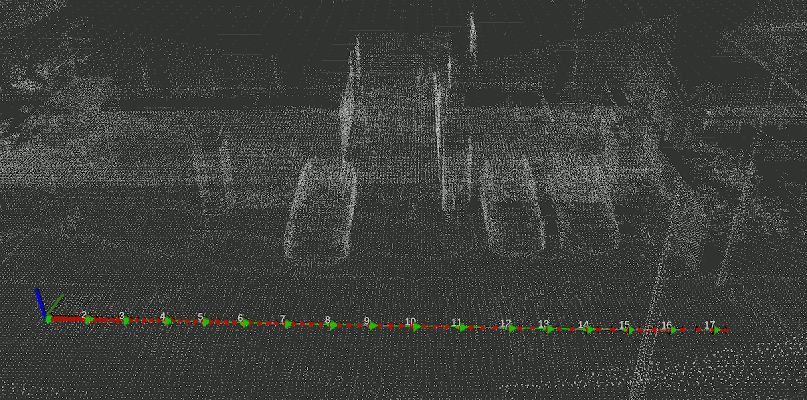
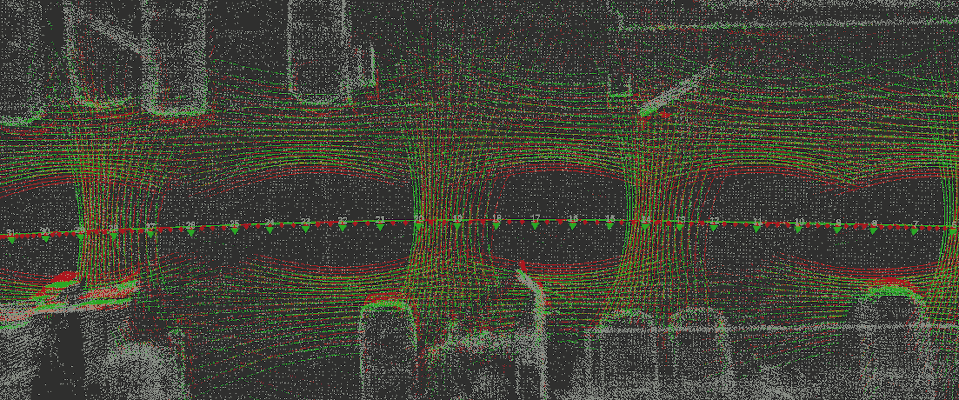

# Extrinsic mapping-based calibration (lidar-lidar)

## 1. Prepare the calibration environment

This calibration method utilizes one lidar for mapping and performs point cloud registration to calibrate the rest of the lidars to the first one, so an environment where there are enough natural landmarks to perform registration-based mapping is required, with enough objects/information present in the calibration lidars (opposed to just lane surfaces, only walls, etc.).
Data does not need to be taken with stationed vehicles, but doing so may increase the accuracy. In the same way, we do not require the lidars' timestamp to be synchronized, but in that case, we perform linear interpolation, which can reduce the calibration performance.

## 2. Capture rosbag

Capture a rosbag including the pointclouds of the lidars to calibrate, as well as the lidar used as a target. The required duration depends on the content of the scene and the trajectory followed by the vehicle. In urban scenes at low speeds in a straight line, trajectories as short as 30 meters are sufficient, but in other situations, several hundreds of meters may be required.

<details><summary>ROSBAG Example</summary>
<p>

```sh
ros2 bag info f8c99b4f-a605-4178-97ef-58bfc39eabe9_2022-02-07-14-23-31_0.db3

[INFO] [1632971360.501197002] [rosbag2_storage]: Opened database 'f8c99b4f-a605-4178-97ef-58bfc39eabe9_2022-02-07-14-23-31_0.db3' for READ_ONLY.

Files:             f8c99b4f-a605-4178-97ef-58bfc39eabe9_2022-02-07-14-23-31_0.db3
Bag size:          3.7 GiB
Storage id:        sqlite3
Duration:          51.59s
Start:             Feb  7 2022 14:23:32.345 (1644211412.345)
End:               Feb  7 2022 14:24:23.404 (1644211463.404)
Messages:          252554
Topic information: Topic: /sensing/lidar/right_upper/pandar_packets | Type: pandar_msgs/msg/PandarScan | Count: 502 | Serialization
Topic information: Topic: /sensing/lidar/left_upper/pandar_packets | Type: pandar_msgs/msg/PandarScan | Count: 502 | Serialization
Format: cdr
```

</p>
</details>

## 3. Launch Calibration Tools

If calibration needs to be performed in an environment other that the vehicle running autoware, the `logging_simulator` is required.
In that case, it can be launched as follows:

```sh
ros2 launch autoware_launch logging_simulator.launch.xml sensor_model:=<sensor_model> vehicle_model:=<vehicle_model> vehicle_id:=<vehicle_id>
```

In another terminal, launch the mapping-based calibration tool:

```sh
ros2 launch extrinsic_calibration_manager calibration.launch.xml \
  mode:=mapping_based sensor_model:=<sensor_model> vehicle_model:=<vehicle_model> vehicle_id:=<vehicle_id> logging_simulator:=false
```

For example,

```sh
ros2 launch extrinsic_calibration_manager calibration.launch.xml \
  mode:=mapping_based sensor_model:=aip_x1 vehicle_model:=lexus vehicle_id:=my_awesome_vehicle logging_simulator:=false
```

Then, play the recorded calibration rosbag on yet another terminal.

```sh
ros2 bag play <rosbag_path> --clock -l -r 0.1 \
  --remap /tf:=/null/tf /tf_static:=/null/tf_static
```

Once the calibration process ends, the results are written in the `$HOME` folder. In order for Autoware to use them, they must be placed in the corresponding `individual_params` package's `config` folder. For example:

```sh
$HOME/autoware/src/autoware/individual_params/individual_params/config/default/aip_xx1
```

## 4. Lidar-lidar calibration

Direct lidar-lidar calibration is most times not possible due to the sparsity of the involved lidars, and the reduced shared field-of-view among them. To circumvent this limitation, we use the reference lidar (target) for standard mapping, which creates dense local point clouds, which with we can later perform point cloud registration with the lidars to calibrate (sources).

## 5. Base-lidar calibration Process

Due to the nature of the calibration method, it can be split into two parts: data collection and calibration

## 5.1 Data collection (mapping and data-pairing)

The mapping is performed using via Normal Distribution Transform (NDT) due to being more robust than other registration methods and is recommended to be run with the lidar with the highest resolution and field-of-view among the available lidars. The mapping itself does not need to be run in real-time like in SLAM which enables us to focus more on the accuracy side of the mapping.

In addition to mapping, in this step pairs of mapping and calibration lidars are matched and several statistics are computed to be used in the calibration step. Data collection ends automatically when a predetermined amount of data is acquired, or it can also be ended prematurely, via the call of the following service:

```sh
ros2 service call /NAMESPACE/stop_mapping std_srvs/srv/Empty {}
```

Figure 1 presents an example of the mapping results produced during this step. Red arrows indicate the different poses during mapping, green arrows are special poses taken uniformly, and white points correspond to a subsampled version constructed map.

<figure align="center">
   
   <figcaption align="center">Fig 1. Mapping result</figcaption>
</figure>

## 5.2 Calibration

Once data collection finishes, we have a set of mapping-calibration pairs of point clouds referenced to a local map. However, not all these pairs are suitable for calibration, so we select those that possess small interpolation errors, slow acceleration, high information, etc.

Once these frames are selected, they are augmented using the nearby point clouds on the map to alleviate both the sparsity and limited field-of-view of the lidar pairs. Once the point clouds are augmented, we perform traditional point cloud registration to calibrate the lidar pairs.

Figure 2 presents an example of this method used to calibrate 3 lidars simultaneously. In white are the points from the map, in red are tge sparse point clouds from the lidars to calibrate using the initial calibration, and in green are the same point clouds using the calibrated poses.

<figure align="center">
   
   <figcaption align="center">Figure 2. Mapping-based calibration</figcaption>
</figure>
