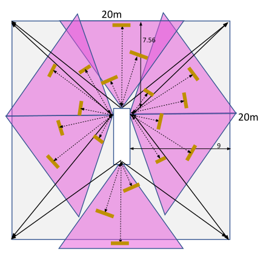
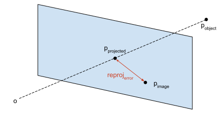
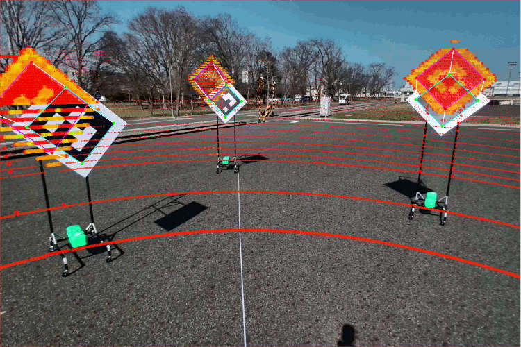
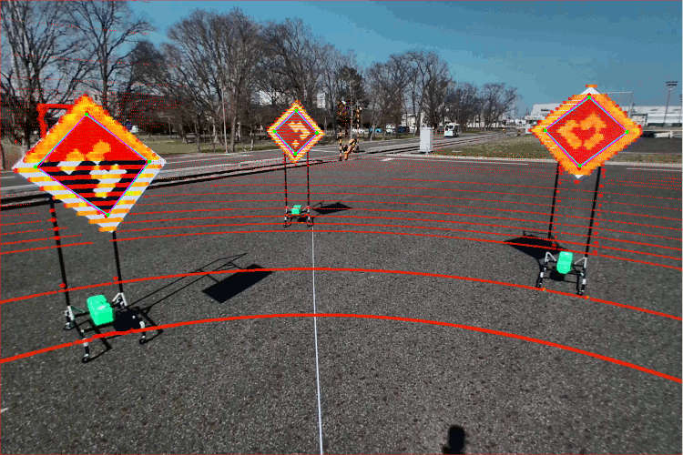
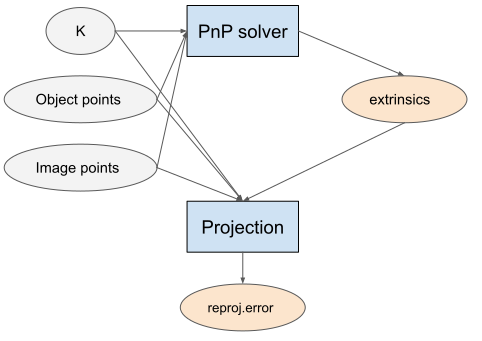
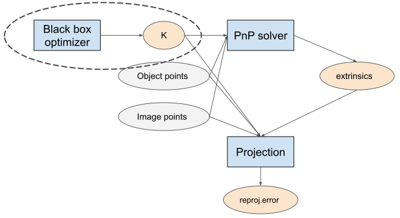
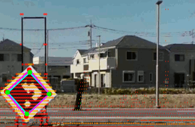
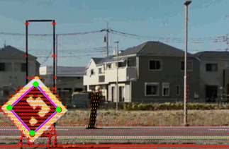

# Extrinsic tag-based calibration (camera-lidar)

## 1. Prepare the calibration environment

In order the perform camera-lidar calibration using this tool, it is necessary to prepare [lidartags](https://github.com/UMich-BipedLab/LiDARTag) and lidars with intensity measures. In order to assure that no objects difficult the tag detection and and obtain the most stable detection possible, it is highly recommended to also prepare fixed mounts for these tags as presented in Figure 1.

<figure align="center">
   
   <figcaption align="center">Fig 1. Examples of lidartag and their mounts</figcaption>
</figure>

The quality of the calibration depends strongly on the placement of the tags with respect to the sensors. As much as possible, consider the following guidelines:

- The tags are placed with a corner facing upwards (strictly speaking, the corners of the tags must be aligned with the axis of the lidar).
- The tags are facing directly the sensors (prioritizing the lidar).
- The tags cover as much as possible of the field of view.
- The tags do not occlude themselves.
- The tags are no farther than 12 meters (depending on the resolution of the lidar).
- Use at least 3 tags.
- Visually the silhouette of the tags can be identified in the lidar observation (especially the four corners).
- Verify that the intensity channel separates the black and white parts of the lidartag (depending on the orientation of the tags with respect to the lidar, the measures can appear uniform for both black and white areas due to the reflections).
- In the case of non-uniform lidars, place the tags in the high-resolution zone as much as possible.
- Remove all objects that can cause problems with the detections from the scene.

One example of lidartag placements can be observed in Figure 2.

<figure align="center">
   
   <figcaption align="center">Fig 2. Example of the placement of the lidartags</figcaption>
</figure>

## 2. Capture rosbag

Capture a rosbag including all the sensor topics. The duration is arbitrary, but due to the tag estimation at least one minute is recommended. Due to the nature of the calibration, the recorded data should have the camera intrinsics already calibrated.

<details><summary>ROSBAG Example</summary>
<p>

```sh
ros2 bag info f8c99b4f-a605-4178-97ef-58bfc39eabe9_2022-02-07-14-23-31_0.db3

[INFO] [1632971360.501197002] [rosbag2_storage]: Opened database 'f8c99b4f-a605-4178-97ef-58bfc39eabe9_2022-02-07-14-23-31_0.db3' for READ_ONLY.

Files:             f8c99b4f-a605-4178-97ef-58bfc39eabe9_2022-02-07-14-23-31_0.db3
Bag size:          3.7 GiB
Storage id:        sqlite3
Duration:          51.59s
Start:             Feb  7 2022 14:23:32.345 (1644211412.345)
End:               Feb  7 2022 14:24:23.404 (1644211463.404)
Messages:          252554
Topic information: Topic: /awapi/autoware/put/engage | Type: autoware_vehicle_msgs/msg/Engage | Count: 0 | Serialization Format: cdr
                   Topic: /sensing/camera/camera1/camera_info | Type: sensor_msgs/msg/CameraInfo | Count: 489 | Serialization Format: cdr
                   Topic: /sensing/camera/camera1/trigger_time | Type: builtin_interfaces/msg/Time | Count: 497 | Serialization Format: cdr
                   Topic: /sensing/camera/camera6/camera_info | Type: sensor_msgs/msg/CameraInfo | Count: 463 | Serialization Format: cdr
                   Topic: /sensing/camera/camera6/trigger_time | Type: builtin_interfaces/msg/Time | Count: 498 | Serialization Format: cdr
                   Topic: /sensing/camera/camera4/camera_info | Type: sensor_msgs/msg/CameraInfo | Count: 479 | Serialization Format: cdr
                   Topic: /sensing/camera/camera0/trigger_time | Type: builtin_interfaces/msg/Time | Count: 498 | Serialization Format: cdr
                   Topic: /sensing/camera/camera4/image_raw/compressed | Type: sensor_msgs/msg/CompressedImage | Count: 446 | Serialization Format: cdr
                   Topic: /sensing/camera/camera1/image_raw/compressed | Type: sensor_msgs/msg/CompressedImage | Count: 491 | Serialization Format: cdr
                   Topic: /sensing/lidar/left_upper/pandar_packets | Type: pandar_msgs/msg/PandarScan | Count: 502 | Serialization Format: cdr
                   Topic: /sensing/lidar/right_lower/pandar_packets | Type: pandar_msgs/msg/PandarScan | Count: 502 | Serialization Format: cdr
                   Topic: /sensing/lidar/right_upper/pandar_packets | Type: pandar_msgs/msg/PandarScan | Count: 502 | Serialization Format: cdr
                   Topic: /sensing/camera/camera3/camera_info | Type: sensor_msgs/msg/CameraInfo | Count: 985 | Serialization Format: cdr
                   Topic: /sensing/camera/camera0/camera_info | Type: sensor_msgs/msg/CameraInfo | Count: 388 | Serialization Format: cdr
                   Topic: /sensing/camera/camera3/image_raw/compressed | Type: sensor_msgs/msg/CompressedImage | Count: 900 | Serialization Format: cdr
                   Topic: /sensing/lidar/front_lower/pandar_packets | Type: pandar_msgs/msg/PandarScan | Count: 506 | Serialization Format: cdr
                   Topic: /sensing/camera/camera2/image_raw/compressed | Type: sensor_msgs/msg/CompressedImage | Count: 436 | Serialization Format: cdr
                   Topic: /sensing/camera/camera4/trigger_time | Type: builtin_interfaces/msg/Time | Count: 498 | Serialization Format: cdr
                   Topic: /sensing/lidar/rear_lower/pandar_packets | Type: pandar_msgs/msg/PandarScan | Count: 507 | Serialization Format: cdr
                   Topic: /sensing/lidar/rear_upper/pandar_packets | Type: pandar_msgs/msg/PandarScan | Count: 506 | Serialization Format: cdr
                   Topic: /sensing/camera/camera6/image_raw/compressed | Type: sensor_msgs/msg/CompressedImage | Count: 380 | Serialization Format: cdr
                   Topic: /sensing/lidar/left_lower/pandar_packets | Type: pandar_msgs/msg/PandarScan | Count: 509 | Serialization Format: cdr
                   Topic: /sensing/camera/camera2/trigger_time | Type: builtin_interfaces/msg/Time | Count: 498 | Serialization Format: cdr
                   Topic: /sensing/lidar/front_upper/pandar_packets | Type: pandar_msgs/msg/PandarScan | Count: 505 | Serialization Format: cdr
                   Topic: /sensing/camera/camera0/image_raw/compressed | Type: sensor_msgs/msg/CompressedImage | Count: 382 | Serialization Format: cdr
                   Topic: /sensing/camera/camera2/camera_info | Type: sensor_msgs/msg/CameraInfo | Count: 473 | Serialization Format: cdr
                   Topic: /sensing/camera/camera3/trigger_time | Type: builtin_interfaces/msg/Time | Count: 503 | Serialization Format: cdr
```

</p>
</details>

## 3. Launch Calibration Tools

To launch the extrinsic tag-based calibration tool, use the following command (on terminal 1).

```sh
ros2 launch extrinsic_calibration_manager calibration.launch.xml \
  mode:=tag_based sensor_model:=<sensor_model> vehicle_model:=<vehicle_model> camera_name:=<camera_name>
```

For example,

```sh
ros2 launch extrinsic_calibration_manager calibration.launch.xml \
  mode:=tag_based sensor_model:=aip_x2 vehicle_model:=gsm8 vehicle_id:=ps1 camera_name:=camera1
```

Then, play the recorded calibration rosbag (on terminal 2).

```sh
ros2 bag play <rosbag_path> --clock -l -r 0.2 \
  --remap /tf:=/null/tf /tf_static:=/null/tf_static
```

The previous commands are needed when performing the calibration on `rosbag` data. However, the calibration can also be performed on the actual vehicles, on which case the commands needs to be modified, since the `logging_simulator` and related functionalities are not needed. To to this, add the `logging_simulator:=false`

For example,

```sh
ros2 launch extrinsic_calibration_manager calibration.launch.xml \
  mode:=tag_based sensor_model:=aip_x2 vehicle_model:=gsm8 vehicle_id:=ps1 camera_name:=camera1 logging_simulator:=false
```

Once the calibration process ends, the results are written in the `$HOME` folder. In order for Autoware to use them, they must be placed in the corresponding `individual_params` package's `config` folder. For example:

```sh
$HOME/pilot-auto/src/autoware/individual_params/individual_params/config/default/aip_x2
```

**\*Notes**: This tool can only calibrate one camera at a time.

## 4. Camera-lidar calibration

Calibrating a camera-lidar pair (i.e., finding the extrinsics) makes the lidar points get projected into the image correctly (See Fig. 3). Conversely, an incorrect calibration culminates in the objects of the point cloud being projected incorrectly (See Fig. 4).

|  |  |
| :---------------------------------------------------------------------: | :-------------------------------------------------------------------------: |
|                       Fig 3. Correct calibration                        |                        Fig 4. Incorrect calibration                         |

The difference between a point in the image (p<sub>image</sub>), and the projection (p<sub>projected</sub>) in the image of its corresponding object point in lidar coordinates (p<sub>object</sub>) is denoted as the reprojection error and can be observed graphically in Figure 5.

<figure align="center">
   
   <figcaption align="center">Fig 5. Reprojection error</figcaption>
</figure>

It follows that to calibrate the extrinsics of the camera-lidar pair of sensors, the reprojection error must be minimized in a set of corresponding pairs of points. The acquisition of the calibration pairs of points can be performed either automatically via a computer vision system or manually, and in this case, the pairs are computed automatically from the corners of the lidartag placed in the field of view of the sensors

## 5. Tag based Calibration Process

Upon launching the tag-based tool, the calibration process is automatic.

The `apriltag` node detects the corners of the tags in the image, the `lidartag` detects the corners of the tags in the lidar, and then the `extrinsic_tag_based_calibrator` matches the detections, filters them, and performs the extrinsic calibration optimization. Once the calibration converges, it automatically sends the result to the `Calibration manager`, which outputs the new calibration files in the `$HOME` folder. An example of the accuracy achieved by the tag-based calibration can be observed in Figure 7.

However, in addition to the automatic calibration process, this tool also launches the Interactive calibrator UI, mainly for visualization purposes, but can also be used to use different optimization options, add additional calibration points, etc. However, the calibrations obtained through the UI can not be sent to the `Calibration manager` and instead must be saved manually (refer to the UI manual for more details).

|  |  |
| :-----------------------------------------------------: | :-----------------------------------------------------: |
|               Fig 6. Initial calibration                |         Fig 7. Automatic tag-based calibration          |

The calibration tool is compatible with one or multiple tags, but a certain amount of camera-lidar detections is needed in order to obtain a correct calibration. In case that the number of tags at hand is not sufficient, the user can move a single tag to multiple locations in order to collect more detections akin to the camera calibration process. The parameters that determine how many detections are required in order for the algorithm to finish and output the final extrinsics are located in the `sensor/extrinsic_tag_based_calibrator/launch/tag_calibrator.launch.xml` launch file and below is an example of the related parameters:

```yaml
<param name="calibration_convergence_min_pairs" value="9" />
<param name="calibration_convergence_min_area_percentage" value="0.1" />
```

## 6. (Experimental) Camera Intrinsics & Extrinsics Joint Calibration

In several cases, no matter how many calibration pairs of points are, the calibration itself does not improve. If the calibration points are correct, it may be then that the camera intrinsics are incorrect, as they affect the calculation of the reprojection error as shown in Figure 8, where the camera intrinsics are represented by the camera matrix `K`.

<figure align="center">

<figcaption align="center">Fig 8. Camera-lidar extrinsics optimization pipeline</figcaption>
</figure>

Normally, the camera intrinsics are previously calibrated and fixed during the camera-lidar calibration process. However, in the cases where the main source of error comes from the camera intrinsics it is possible to calibrate both the intrinsics and extrinsics together as shown in Figure 9, by jointly optimizing them in a nested fashion (black box optimization in an outer loop and PNP optimization in the inner loop).

<figure align="center">

<figcaption align="center">Fig 9. Camera-lidar intrinsics-extrinsics optimization pipeline</figcaption>
</figure>

It is possible to employ the beforementioned joint optimization in the Interactive calibrator UI by clicking `Calibrate Intrinsics (experimental)`, `Use optimized K`, and `Calibrate Extrinsics` sequentially. An example of the effect of calibrating only the extrinsics with slightly incorrect intrinsics can be observed in Figure 10, whereas the same example where both the intrinsics and extrinsics were calibrated by this tool is presented in Figure 11.

<center>

|  |  |
| ------------------------------------------------------------- | :-------------------------------------------------------------: |
| Fig 10. Extrinsic calibration only                            |               Fig 11.Calibration after refinement               |

</center>

**\*Note:** The implementation of this module assumes distortion-less cameras (null distortion coefficients), where essentially the camera matrix `K` and projection matrix `P` are the same (are only populated by `fx`, `fy`, `cx`, and `cy`).
