# Intrinsic camera calibration

This page details the use of the `intrinsic_camera_calibrator` package, as well as its functionalities

## 1 Basic usage

First of all, the `intrinsic_camera_calibrator` package must be built analogous to the other tools of this repository as explained in the [README](https://github.com/tier4/CalibrationTools).

Once the package is properly installed, it can be launched with the following command:

```sh
ros2 launch intrinsic_camera_calibrator calibrator.launch.xml
```

[Section 1.1](#11-calibration) and [Section 1.2](#12-evaluation) present the main uses of this tool, whereas [Section 2](#2-algorithms-and-functionalities) provides more details regarding the inner working of the tools and the respective parameters

### 1.1 Calibration

Once the tool has been launched, the initial configuration menu is displayed as presented in Figure 1.

<p align="center">
   
   <p align="center">Fig 1. Initial configuration menu</figcaption>
</p>

The calibration mode is set by default, and both the data source and calibration board can be configured as presented in [Section 2.1](#21-data-acquisition) and [Section 2.2](#22-board-compatibility) respectively.

Once the beforementioned configurations are set, by clicking the `Start` button, the main window is displayed as shown in Figure 2.

<p align="center">
   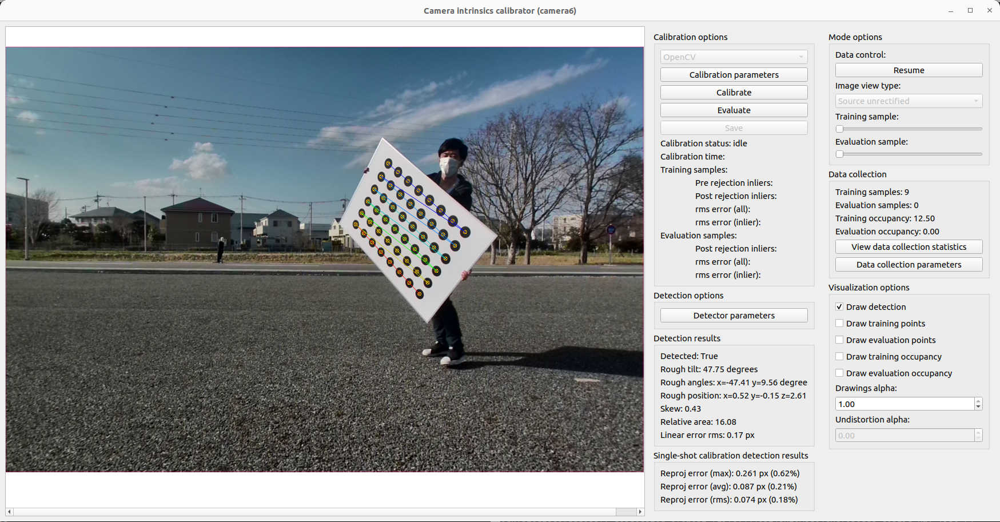
   <p align="center">Fig 2. Main window</figcaption>
</p>

In order to perform intrinsic camera calibration, we require board detections covering the field-of-view as much as possible, so the user must move the calibration board around said area, while checking that the board is detected ([Section 2.3](#23-board-detection)) and that the data is added to the corresponding database ([Section 2.4](#24-data-collection-and-visualization)).

Once enough data has been collected, the user can execute the intrinsic optimization by clicking the `Calibrate button`. The calibration can take up to several minutes depending on the number of detections utilized. To check the status of the calibration, the user can observe the `Calibration status` text in the GUI.

The calibration is over when the `Calibration status` goes back to `Idle`, at which point several calibration statistic visualizations can be generated depending on the calibration configuration ([Section 2.5](#25-calibration-and-visualization)).
A brief overview of the calibration results can always be observed in the main window as seen in Figure 3

<p align="center">
   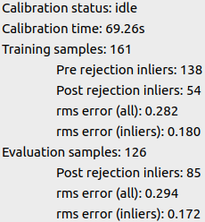
   <p align="center">Fig 3. Calibration results</figcaption>
</p>

After the calibration has finished, is possible to save the results by clicking the `Save` button and selecting and appropriate folder. The saved files correspond to the calibration itself (in the format used by ROS, as explained in [Section 2.5.1](#251-camera-intrinsics-model-and-output-format)) and the calibration images, in case they are needed for further processing.

### 1.2 Evaluation

Similar to calibration, once the tool is launched, the menu from Figure 1 is displayed.
However, in this case, since the objective is to evaluate an existing set of intrinsics, the parameters should be loaded first by clicking the `Load intrinsics` button and selecting the corresponding YAML file.

Once the intrinsics are loaded, the selection of the `evaluation` mode becomes available as shown in Figure 4.

<p align="center">
   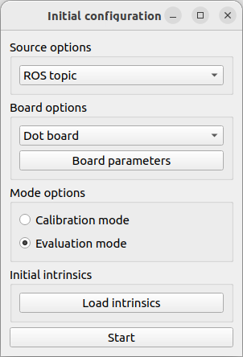
   <p align="center">Fig 4. Initial configuration menu after loading a set of intrinsics</figcaption>
</p>

After selecting the `evaluation` and pressing `Start`, the process is analogous to the `Calibration` process, except that instead of using the `Calibrate` button, the `Evaluate` button is used, upon which the evaluation results are displayed in the same way as presented in Figure 5.

<p align="center">
   
   <p align="center">Fig 5. Initial configuration menu after loading a set of intrinsics</figcaption>
</p>

## 2 Algorithms and functionalities

### 2.1 Data acquisition

In order to perform intrinsic calibration, images from the target camera are needed, and to load them, the `intrinsic_calibration_calibrator` tool implemented 3 methods:

- ROS2 topics
- ROS2 bags
- Image files

The desired data source can be chosen from the `Source options` in the initial configuration menu from Figure 1.
In the case of ROS2 topics or ROS2 bags, the window from Figure 6 is displayed, where the user can select the desired topic corresponding to the camera to be calibrated.

<p align="center">
   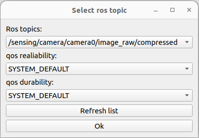
   <p align="center">Fig 6. ROS2 topic selection</figcaption>
</p>

Additionally, in the case that the default QoS profiles don't match, the user can also set them to suit their needs as can be observed in Figure 7.

<p align="center">
   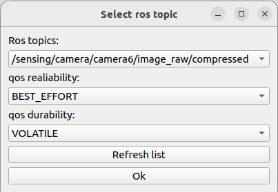
   <p align="center">Fig 7. ROS2 topic QoS configuration</figcaption>
</p>

### 2.2 Board compatibility

In order to calibrate camera intrinsics, objects with known geometry need to be seen from different views.
The most established method to accomplish this is to print boards with easy-to-detect patterns and move them around the camera. The `intrinsic_camera_calibrator` provides support for three kinds of boards:

- Chess boards ([6x8 example](resource/checkerboard_8x6.pdf))
- Circle dot boards ([6x8 example](resource/circle_8x6.pdf))
- Apriltag grid board ([3x4 example](resource/apriltag_grid_3x4.pdf))

The choice of board can be set in the initial configuration menu from Figure 1, and the board parameters (size, cells, etc.) can be modified by clicking on the `Board parameters` button.

\*In the case of the apriltag boards, a script from [kalibr](https://github.com/ethz-asl/kalibr) was modified to generate the pattern. The difference lies in the black squared between tags, which are not compatible with [Apriltag3](https://github.com/AprilRobotics/apriltag)

### 2.3 Board detection

Each of the boards presented in [Section 2.2](#22-board-compatibility) requires an object detector. In our case, we use the standard [OpenCV](https://github.com/opencv/opencv) algorithms for the chess board and circle dot patterns, and a [Apriltag3 wrapper](https://github.com/duckietown/lib-dt-apriltags) for the Apriltag grid boards.

Each detector has several parameters which control its speed, detection rate, and precision. In case the user requires to change the default parameters, it can be done directly from the UI without the need to restart the tool by clicking `Detector parameters` placed in the main window. Once the user does so, the window from Figure 8 is displayed, where the user can freely modify the parameters.

<p align="center">
   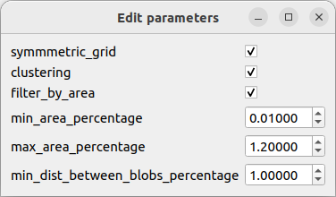
   <p align="center">Fig 8. Detection parameters</figcaption>
</p>

If the detector is property configured, once a board is detected, the pattern's corners or centers are displayed as shown in Figure 9.

<p align="center">
   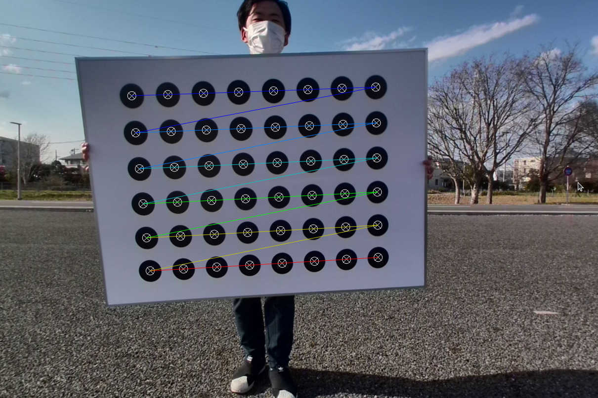
   <p align="center">Fig 9. Board detection</figcaption>
</p>

Additionally, if the user scrolls in the image, sub-pixel level visualization is also available (see Figure 10).

<p align="center">
   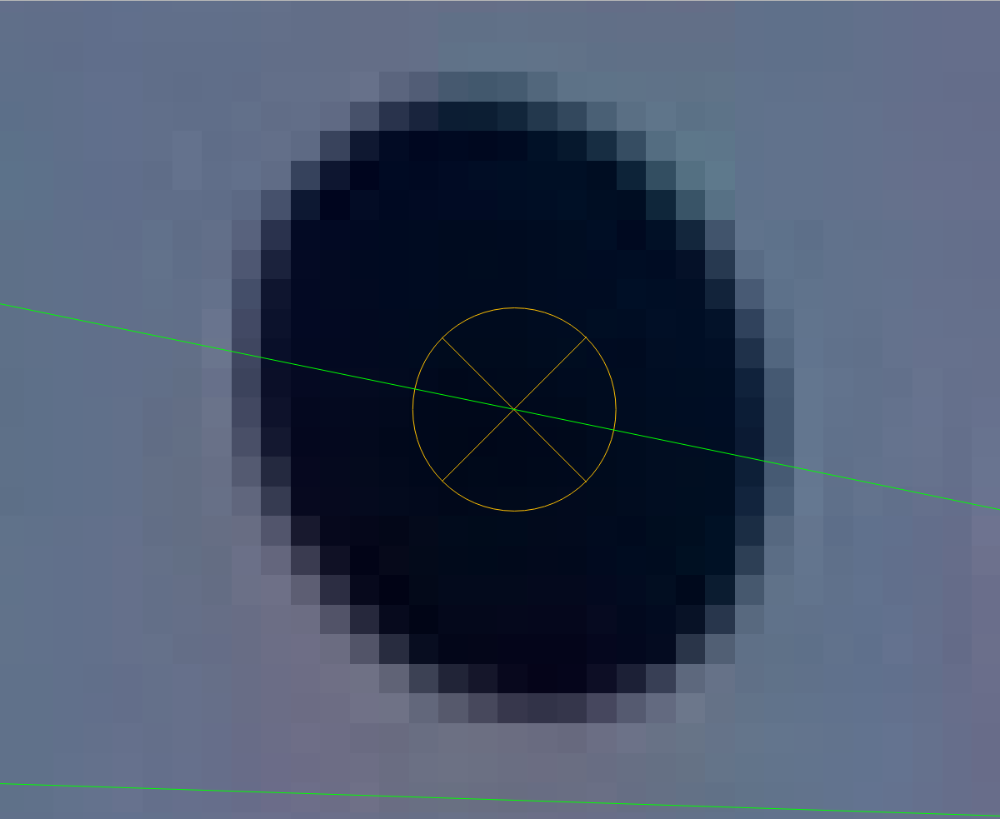
   <p align="center">Fig 10. Zoomed-in visualization</figcaption>
</p>

Finally, the detections' statistics are also displayed in the main window as shown in Figure 11.

<p align="center">
   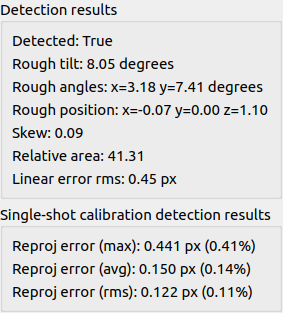
   <p align="center">Fig 11. Detection results</figcaption>
</p>

### 2.4 Data collection and visualization

Board detections can be used directly to form a database to optimize the camera intrinsics. However, bad detections, computational constraints, and redundant data need to be considered in order to produce the best calibration possible. In Sections 2.4.1 and 2.4.2 sections we detail how we implement these aspects, and the parameters that control these processes can be modified by clicking the `Data collection parameters` present in the main window as shown in Figure 12.

<p align="center">
   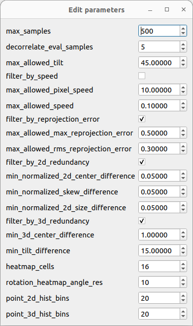
   <p align="center">Fig 12. Data collection parameters</figcaption>
</p>

#### 2.4.1 Bad detection rejection

As shown in Figure 11, we compute several aspects related to the detection. In what follows we list the statistics that we use to accept or reject a detection without considering the rest of the database.

- Far away boards may produce imprecise detections, so we set a limit to the max limit we accept board detections
- Boards facing away from the image plane usually result in higher detection errors, so we also set a limit to the angle of the board with respect to the z-axis seen from the camera.
- In some rare cases, the detectors mistake the order of the corners/centers. In order to filter out these cases, we compute the linear error, defined as the average line-point error from edges in the pattern and intermediate points (See figure 9), and set a threshold to it.
- A good detection should be able to be fitted correctly with a camera intrinsic calibrator. For this reason, we also calibrate the camera intrinsics with each detection, to evaluate how good the detection is by observing the reprojection error produced by this calibration.

#### 2.4.2 Redundant detection rejection

In addition to filtering detections based only on their statistics, it is also necessary to consider the statistics of the database as a whole in order to avoid redundant data, which may induce unbalanced distributions.

In other to add a detection to the database, we impose an innovation threshold with respect to the elements on the database in at least one of the following aspects:

- board center (in pixels)
- board size (in pixels)
- board distance from the camera
- board orientation angle from the camera's z-plane

#### 2.4.2 Data collection visualization

In order to understand the data collection process, and guide the user to place the calibration board in positions where samples are needed, we implement a heatmap visualization that shows the number of board points spatially. which can be enabled by clicking the `Draw training occupancy` and selecting an appropriate `Drawings alpha` value.

Figure 12 shows an example where few samples have been collected and Figure 13 shows an example where more samples have been collected. In order to improve the database, the user should move the board to areas in which the heatmap is displayed in blue.

| 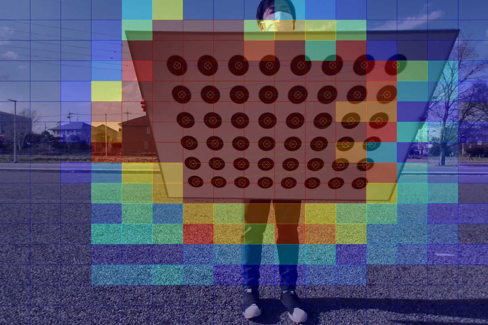 | 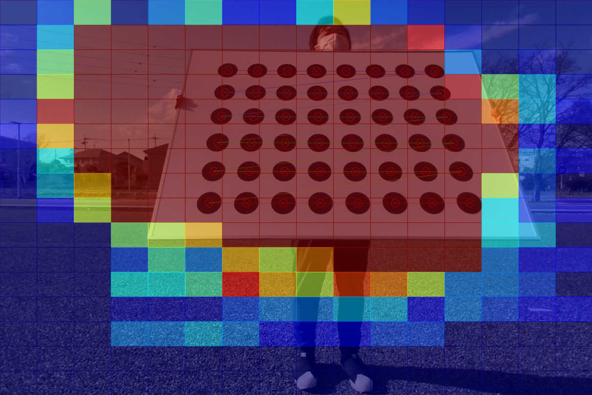 |
| :--------------------------------------------------------------------------------------: | :----------------------------------------------------------------------------------: |
|                      Fig 12. Data collection heatmap (few samples)                       |                           Fig 13. Data collection heatmap                            |

The status of the data collection can also be observed in the main window, where the number of samples collected and the occupancy rate of the previously mentioned heatmaps is displayed (See Figure 14).

<p align="center">
   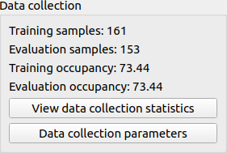
   <p align="center">Fig 14. Detection results</figcaption>
</p>

Finally, we also provide a visualization for the database statistics, which can be enabled by clicking the `View data collection statistics` (an example can be observed in Figure 15).

<p align="center">
   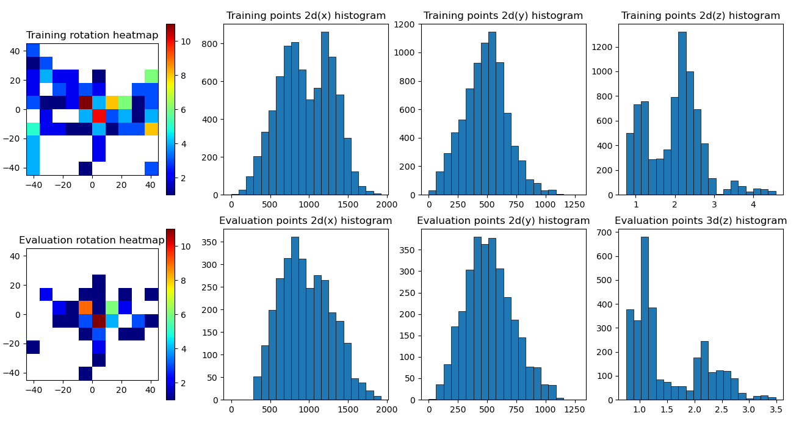
   <p align="center">Fig 15. Detection results</figcaption>
</p>

### 2.5 Calibration and visualization

Once enough data is collected, the user can execute the calibration routine by pressing the `Calibrate` button. Additionally, the parameters of the calibration process can also be modified directly from the GUI by pressing the `Calibration parameters` button (See Figure 16).

<p align="center">
   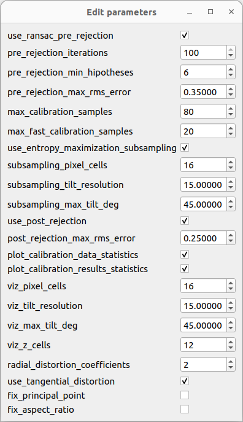
   <p align="center">Fig 16. Calibration parameters</figcaption>
</p>

The calibration routine consists of the following steps (most of these steps are optional and can be configured as explained previously):

- Filter detection outliers using RANSAC
- Subsample the inliers either via greedy entropy maximization or uniformingly in the case that the number of inliers is higher than the max calibration samples.
- Calibrate using the subsamples inliers
- Filter out samples that have high reprojection error
- Calibrate the model again using only the inliers from the last filter

Once the calibration process ends, visualizations of the results are launched automatically (unless disabled by the user).
Figure 17 presents the statistics of the training set along the different steps in the calibration, allowing the user to identify any data issues along the pipeline. Then, Figure 18 displayed error statistics conditioned on the spatial position of the detections and their orientation angle, permitting the user to pinpoint errors in the resulting model and to identify potential outliers. Afterward, Figure 19 presents the reprojection errors for the different sets (training, calibration inliers, and evaluation). Finally, Figure 20 presents the final, summarized statistics of the calibration, which are displayed in the main window.

<p align="center">
   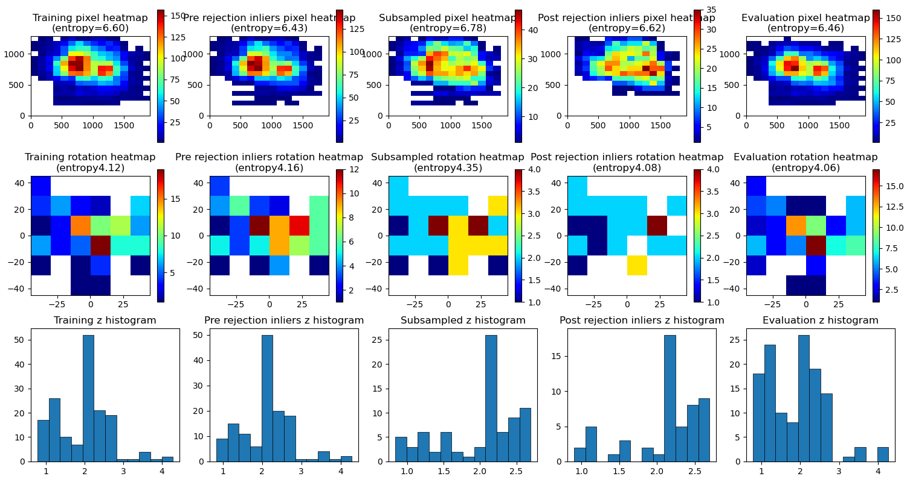
   <p align="center">Fig 17. Data statistics during calibration</figcaption>
</p>

<p align="center">
   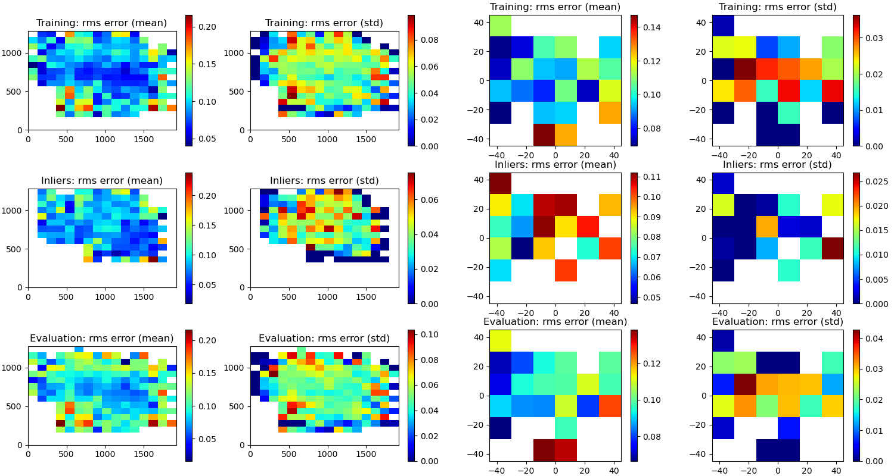
   <p align="center">Fig 18. Reprojection error by spatial location and board orientation</figcaption>
</p>

<p align="center">
   
   <p align="center">Fig 19. Reprojection error among among different sets</figcaption>
</p>

<p align="center">
   
   <p align="center">Fig 20. Detection results</p>
</p>

#### 2.5.1 Camera intrinsics model and output format

The model used to represent the camera intrinsics correspond to the one used in [OpenCV](https://docs.opencv.org/4.x/dc/dbb/tutorial_py_calibration.html), which is adopted by ROS in its `image_pipeline` to perform [rectification](http://wiki.ros.org/image_pipeline/CameraInfo). The output format used by tool corresponds to the same one used in [ROS](http://wiki.ros.org/camera_calibration_parsers), so it can be used directly by most ROS camera drivers.
