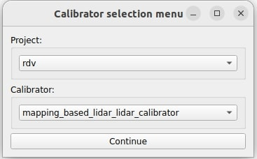
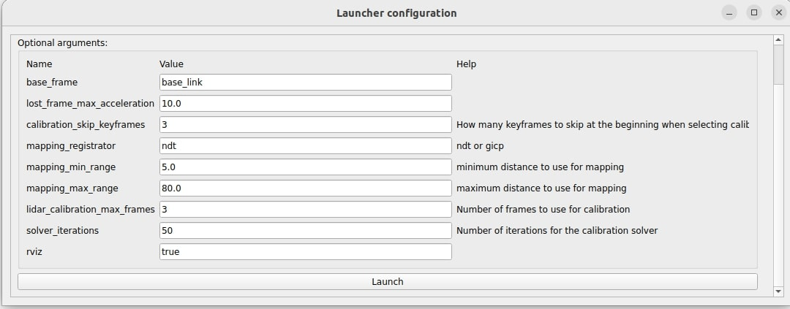
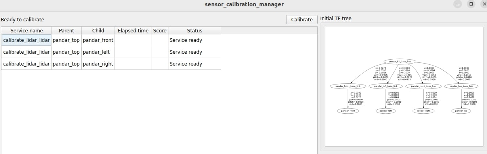
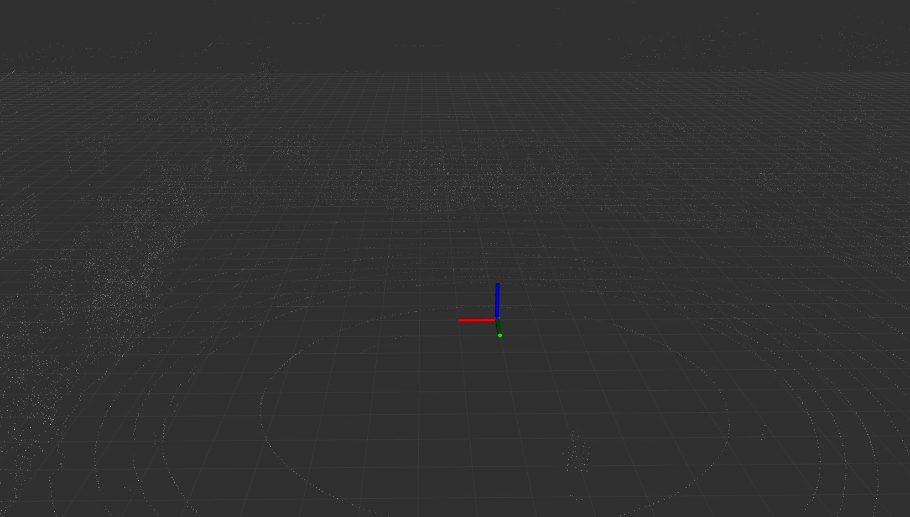
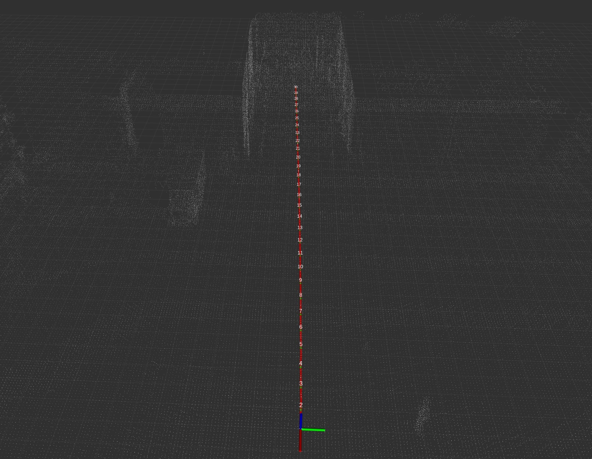
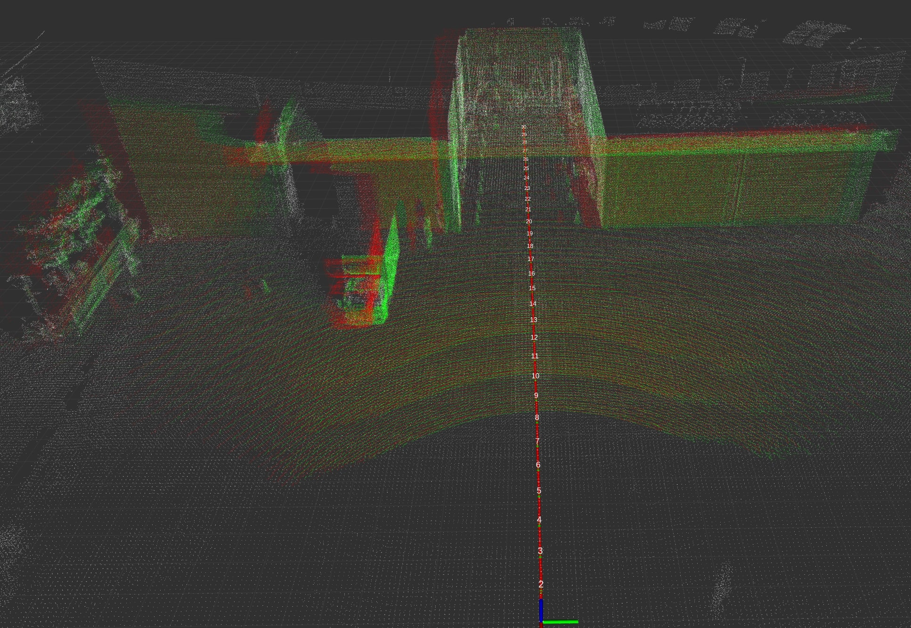
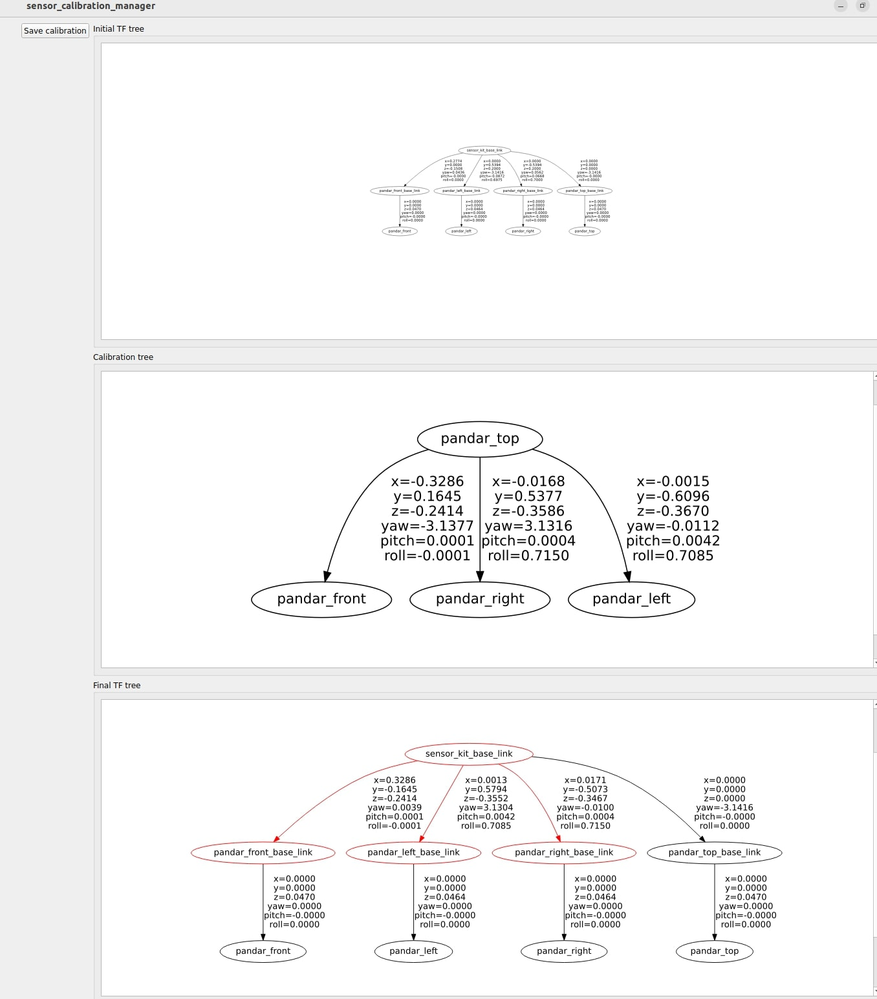
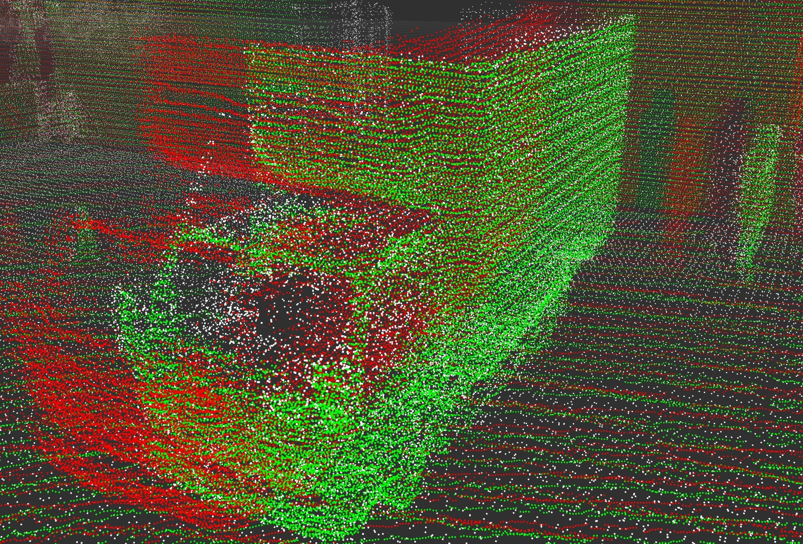

# mapping_based_calibrator

In this tutorial, we will present a hands-on tutorial of the `mapping_based_calibrator`, in particular, of its lidar-lidar calibration capabilities. Although we provide pre-recorded rosbags, the flow of the tutorial is meant to show the user the steps they must perform in their own use cases with live sensors.

General documentation regarding this calibrator can be found [here](../../mapping_based_calibrator/README.md).

## Setup

This tutorial assumes that the user has already built the calibration tools.
Installation instructions can be found [here](../../README.md)

## Data preparation

Please download the data (rosbag) from [here](https://drive.google.com/drive/folders/1e0rajkGfXrKl-6E5oouALdbjeva1c5X1).

The rosbag includes four pointcloud topics published by different lidar sensors and also includes `/tf_static` information.

## Environment preparation

### Overall calibration environment

The required space for calibration depends on the vehicle and sensors used. For a normal consumer-level car, a space of `5m x 30m` should be sufficient.

### Vehicle

When doing the calibration, user needs to drive the vehicle in order to collect the pointcloud for buliding map. While recording the data during the experiment, slow down the vehicle speed as munch as possible. For instance, drive slower than 5 km/hr is a good speed for recording a good data. Also during the experiment, try to avoid people walking around the vehicle, try to make to surrounding static.

## Launching the tool

In this tutorial, we will use the RDV of Tier IV (R&D Vehicle).
First, run the sensor calibration manager:

```bash
ros2 run sensor_calibration_manager sensor_calibration_manager
```

In `project`, select `rdv`, and in `calibrator`, select `mapping_based_calibrator`. Then, press `Continue`.

<p align="center">
    
</p>

A menu titled `Launcher configuration` should appear in the UI, and the user may change any parameter he deems convenient. However, for this tutorial, we will use the default values. After configuring the parameters, click `Launch`.



The following UI should be displayed. When the `Calibrate` button becomes available, click it.
If it does not become available, it means that either the required `tf` or services are not available.

In this tutorial, since the `tf` are published by the provided rosbags, run the rag (`ros2 bag play lidar_lidar.db3 --clock -r 0.1`) first and launch the tools afterward to trigger the `Calibrate` button.



Note: In the default values in the `/calibration_tools/sensor/sensor_calibration_manager/launch/rdv/mapping_based_lidar_lidar_calibrator.launch.xml`, the RDV vehicle set the top_lidar as `mapping lidar`, and other lidars as `calibration lidars`.

## Data collection (Mapping & Data paring)

Once you have clicked the `Calibrate` button, the first step of calibration process will automatically start building the map by using NDT/GICP algorithm with the `mapping lidar`. You can visualize process of building the map on the `rviz`.



You can also see the log in the console showing that the map is building.

```bash
[mapping_based_calibrator-1] [calibration_mapper]: ROS: New pointcloud. Unprocessed=1 Frames=26 Keyframes=2
[mapping_based_calibrator-1] [calibration_mapper]: Registrator innovation=0.00. Score=0.04
[mapping_based_calibrator-1] [calibration_mapper]: New frame (id=26 | kid=-1). Distance=2.04 Delta_distance0.11 Delta_time0.10. Unprocessed=0 Frames=27 Keyframes=2 (mappingThreadWorker())
[mapping_based_calibrator-1] [calibration_mapper]: ROS: New pointcloud. Unprocessed=1 Frames=27 Keyframes=2
[mapping_based_calibrator-1] [calibration_mapper]: Registrator innovation=0.00. Score=0.04
[mapping_based_calibrator-1] [calibration_mapper]: New frame (id=27 | kid=3). Distance=2.15 Delta_distance0.11 Delta_time0.10. Unprocessed=0 Frames=28 Keyframes=3 (mappingThreadWorker())
[mapping_based_calibrator-1] [calibration_mapper]: ROS: New pointcloud. Unprocessed=1 Frames=28 Keyframes=3
[mapping_based_calibrator-1] [calibration_mapper]: Registrator innovation=0.00. Score=0.01
[mapping_based_calibrator-1] [calibration_mapper]: New frame (id=28 | kid=-1). Distance=2.26 Delta_distance0.11 Delta_time0.10. Unprocessed=0 Frames=29 Keyframes=3
```

When the roabag is finished playing, you should see the pointcloud map and the path of the lidar frames like the picture below.



## Calibration

Calibration starts anytime when the user send the command `ros2 service call /stop_mapping std_srvs/srv/Empty`. User can also send this command before the rosbag ended if user think that the data collection is enough for calibration.

In this tutorial, we send the command after the rosbag run until the end. Once the command is sent, the displayed text should be as follows:

```bash
[mapping_based_calibrator-1] [mapping_based_calibrator_node]: Mapper stopped through service (operator()())
[mapping_based_calibrator-1] [calibration_mapper]: Mapping thread is exiting (mappingThreadWorker())
[mapping_based_calibrator-1] [mapping_based_calibrator_node]: Beginning lidar calibration for pandar_front (operator()())
```

The calibration process may take some time as it involves multiple lidars. Users should remain patient and monitor the console output to follow the calibration progress.

Once the calibration process is completed, the displayed text should be as follows:

```bash
[mapping_based_calibrator-1] [lidar_calibrator(pandar_left)]: Calibration result as a tf main lidar -> lidar_calibrator(pandar_left)
[mapping_based_calibrator-1] [lidar_calibrator(pandar_left)]:  translation:
[mapping_based_calibrator-1] [lidar_calibrator(pandar_left)]:   x: -0.001519
[mapping_based_calibrator-1] [lidar_calibrator(pandar_left)]:   y: -0.609573
[mapping_based_calibrator-1] [lidar_calibrator(pandar_left)]:   z: -0.366957
[mapping_based_calibrator-1] [lidar_calibrator(pandar_left)]:  rotation:
[mapping_based_calibrator-1] [lidar_calibrator(pandar_left)]:   x: 0.346912
[mapping_based_calibrator-1] [lidar_calibrator(pandar_left)]:   y: 0.000018
[mapping_based_calibrator-1] [lidar_calibrator(pandar_left)]:   z: -0.005994
[mapping_based_calibrator-1] [lidar_calibrator(pandar_left)]:   w: 0.937887
[mapping_based_calibrator-1] [mapping_based_calibrator_node]: Lidar calibration for pandar_left finished
[mapping_based_calibrator-1] [mapping_based_calibrator_node]: Sending the results to the calibrator manager
```

User can also see the three different colors of pointcloud in the `rviz`. white for the map from the `mapping lidar`, red for the initial map from the `calibration lidars`, and green for the calibrated map from the `calibration lidars`.



## Results

After the calibration process is finished, the sensor_calibration_manager will display the results in the tf tree and allow user to save the calibration data to a file.

<p align="center">
    
</p>

To assess the calibration results, users can precisely measure static objects within the point cloud map, such as stationary vehicles, traffic cones, and walls.

The image below displays the vehicle within the pointcloud, allowing for a comparison of results before and after calibration. It is evident that the initial point cloud from `calibration lidars` (shown in red) has been successfully calibrated (shown in green) and is now aligned with the `mapping lidar` (shown in white).

<p align="center">
    
</p>
