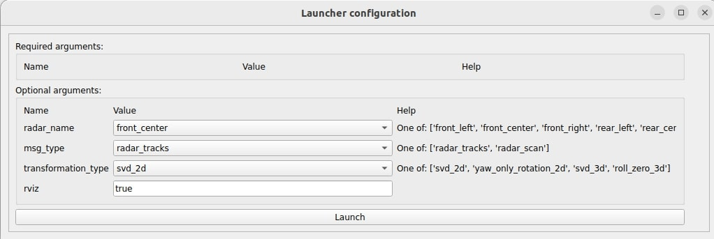
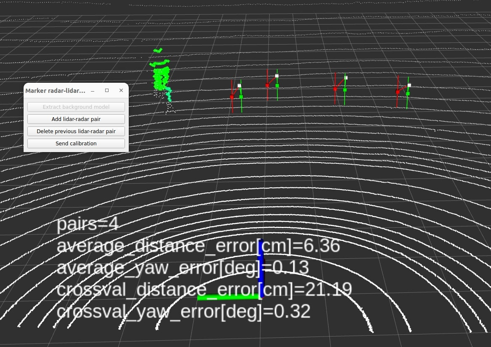

# marker_radar_lidar_calibrator

In this tutorial, we will present a hands-on tutorial of the `marker_radar_lidar_calibrator`. Although we provide pre-recorded rosbag, the flow of the tutorial is meant to show the user the steps they must perform in their own use cases with live sensors.

General documentation regarding this calibrator can be found [here](../../marker_radar_lidar_calibrator/README.md).

## Setup

This tutorial assumes that the user has already built the calibration tools.
Installation instructions can be found [here](../../README.md)

## Data preparation

Please download the data (rosbag) from [here](https://drive.google.com/drive/folders/1S3Cz_VomvHBRgiCSt8JCOgN53UGz5TpZ).

The rosabg includes four different topics including `object_raw`, `pointcloud_raw`, and `tf_static`.

## Environment preparation

### Overall calibration environment

The required space for calibration depends on the vehicle and sensors used. For a normal consumer-level car, a space of `5m x 10m` should be sufficient.

### Radar reflector

The radar reflector is the only moving element during the calibration process and must be detected by both radar and lidar. It is recommended to utilize a tripod to adjust the height of the radar reflector and also modify its center to align with the radar sensor.

## Launching the tool

In this tutorial, we will use the X2 vehicle of Tier IV.
First, run the sensor calibration manager:

```text
ros2 run sensor_calibration_manager sensor_calibration_manager
```

In `project`, select `x2`, and in `calibrator`, select `marker_radar_lidar_calibrator`. Then, press `Continue`.

<p align="center">
    
</p>

A menu titled `Launcher configuration` should appear in the UI, and the user may change any parameter he deems convenient.
For this tutorial, we will modify the default value `radar_name` from `front_left` to `front_center`. After configuring the parameters, click `Launch`.

<p align="center">
    
</p>

The following UI should be displayed. When the `Calibrate` button becomes available, click it.
If it does not become available, it means that either the required `tf` or services are not available.

In this tutorial, since the `tf` are published by the provided rosbag, run the rag (`ros2 bag play radar_lidar.db3 --clock -r 0.1`) first and launch the tools afterward to trigger the `Calibrate` button.

<p align="center">
    
</p>

### Extract background model

Once the user starts running the tutorial rosbag, the pointcloud will appear in `rviz` as shown in the example below. Press the `Extract Background Model button` in the UI to begin extracting the background.

<p align="center">
    
</p>

Once the user clicks the button, it will show like the image below.

<p align="center">
    
</p>

Once the background is extracted, it will show like the image below. The user can see that there are the `Add lidar-radar pair` button is enabled.

<p align="center">
    
</p>

Also, the following text should be shown in the console.

```text
[marker_radar_lidar_calibrator]: Finished background model initialization
```

### Add lidar-radar pair

After the background model has been extracted, the user can carry the radar reflector with the tripod and place it in front of the radar sensor. In the tutorial rosbag, the user will see that both the human and the radar reflector (with tripod) are identified as foreground objects in the image below.

Also, the green points represent the lidar foreground points, while the purple points indicate radar foreground detections. The blue point is the estimated center of the radar reflector derived from the lidar pointcloud.

<p align="center">
    
</p>

When the purple line connects the purple point (the radar estimation of the reflector) and the blue point (the lidar estimation of the reflector), the user can press the `Add lidar-radar pair` button to register them as a pair.

Afterward, if the pair that the user added converges, it will become a converged pair, which will then be used for calibration. Additionally, the colors of the markers will change: the white point indicates the lidar estimation, the red point marks the initial radar estimation, and the green point signifies the calibrated estimation."

<p align="center">
    
</p>

### Delete previous lidar-radar pair

During the calibration, if there are any mismatched pairs (e.g., a human appearing in front of both the radar and lidar), the user can click the `Delete previous lidar-radar pair` button to remove the previous outlier pair.

Using the tutorial rosbag as an example, we can delete the latest radar and lidar pair by clicking this button. The before and after changes should look like the images shown below.

<table>
  <tr>
    <td></td>
    <td></td>
   </tr>
   <tr>
    <td><p style="text-align: center;">Before deletion.</p></td>
    <td><p style="text-align: center;">After deletion.</p></td>
  </tr>
</table>

The console should also show the following text.

```text
[marker_radar_lidar_calibrator]: The last track was successfully deleted. Remaining converged tracks: 4
```

### Metric plotter

The tool also provides a metric plotter for real-time visualization shown below.

<p align="center">
    
</p>

The subplots at the top display the cross-validation errors, while the bottom subplot shows the average errors in the calibration procedure. Plotting for the average errors begins after three pairs have been collected. For the cross-validation errors, plotting starts after four pairs have been collected.

Consider the left-top subplot, which plots the cross-validation errors for distance, as an example of how these errors are calculated. When the x-axis value is 3, it indicates that we estimate the transformation using 3 samples from the 5 converged tracks. We then calculate the distance errors using the remaining 2 samples. This process is repeated for 5 choose 3 (5C3) times, which totals 10 times, and the errors are then averaged. The light blue area represents the standard deviation of the 10 calculated distance errors.

### Send calibration

The user can click the `Send calibration` button once the user is satisfied. It is recommended that the user collect more pairs to increase the accuracy. Therefore, in this tutorial, we will add all of the pairs in the rosbag. Additionally, the user can also stop the calibration when the line in the cross-validation error is converged.

Once the `Send calibration` button is clicked, the result will be sent to the sensor calibration manager. No pairs can be added or deleted afterward like the image shown below. Please make sure you want to end the calibration process when you click the button.

<table>
  <tr>
    <td></td>
    <td></td>
   </tr>
   <tr>
    <td><p style="text-align: center;">Rosbag ended.</p></td>
    <td><p style="text-align: center;">After clicking send calibration.</p></td>
  </tr>
</table>

## Results

After the calibration process is finished, the `sensor_calibration_manager` will display the results in the tf tree and allow the user to save the calibration data to a file.

<p align="center">
    
</p>

To evaluate the calibration result, the user can measure that the calibrated radar points (green) are closer than the initial radar points (red) to the lidar points (white).

## FAQ

- During the calibration, why doesn't the reflector detection show on the rviz?

  1. Make sure the center of the reflector faces toward the radar sensor, and the height of the reflector is enough for the radar to detect.
