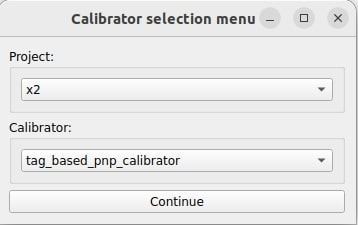
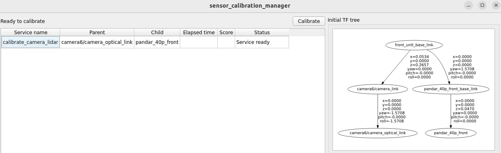
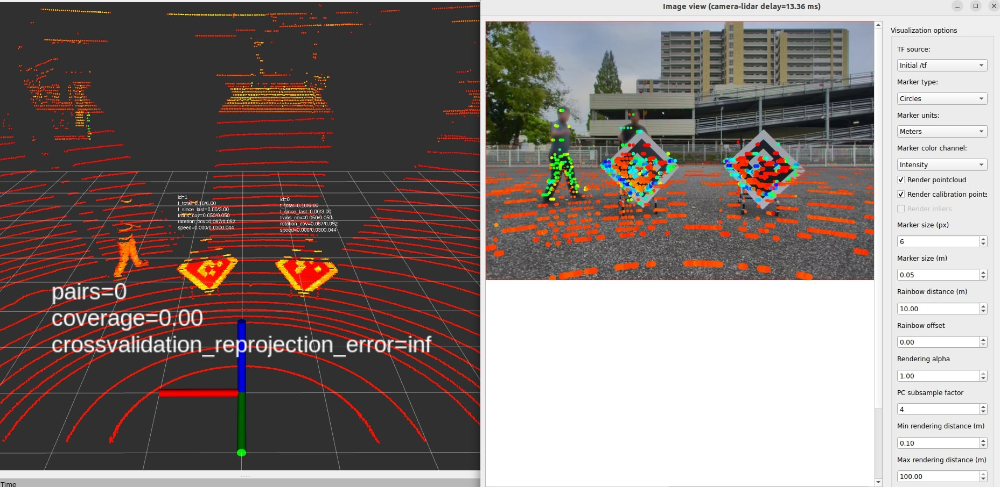
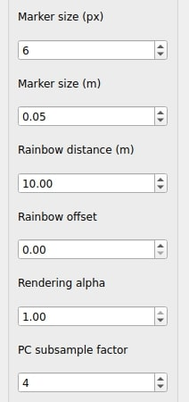

# tag_based_pnp_calibrator

In this tutorial, we present a hands-on tutorial of the `tag_based_pnp_calibrator`. Although we provide pre-recorded rosbag, the flow of the tutorial is meant to show the user the steps they must perform in their own use cases with live sensors.

General documentation regarding this calibrator can be found [here](../../tag_based_pnp_calibrator/README.md).

## Setup

This tutorial assumes that the user has already built the calibration tools.
Installation instructions can be found [here](../../README.md)

## Data preparation

Please download the data (rosbag) from [here](https://drive.google.com/drive/folders/1gFrrchW9mWM1huWMYuJ0nWB2n1BfCJag).

The provided rosbag includes four different topics: `camera_info`, `image_rect_color/compressed`, `pointcloud_raw`, and `tf_static`.

## Environment preparation

### Overall calibration environment

The required space for calibration depends on the vehicle and sensors used. During the calibration, please always make sure that tags are detected by both camera and lidar. The user could always check whether the tags appear in the `rviz` and the `image view` UI.

### AprilTag (LidarTag)

Depending on the lidar model and the available space, the required apriltag size may vary, but so far we have had good results with 0.6m and 0.8m tags (the provided sizes correspond to an edge's size. In these cases the payloads are 0.45m and 0.6m).

In addition to the size of the apriltag, which affects the physical positions where a tag can be detected, the structure on which the apriltag is mounted is equally important. The shape and size of this structure may affect the lidar detection algorithm. Therefore, it is advisable to use a mount that positions the tag in such a way that it remains invisible to the sensor (refer to the provided example).

## Launching the tool

In this tutorial, we will use the X2 project as an example.
First, run the sensor calibration manager:

```text
ros2 run sensor_calibration_manager sensor_calibration_manager
```

In `project`, select `x2`, and in `calibrator`, select `tag_based_pnp_calibrator`. Then, press `Continue`.

<p align="center">
    
</p>

A menu titled `Launcher configuration` should appear in the UI, and the user may change any parameter he deems convenient.
For this tutorial, we will modify the default values `calibration_pairs` from `9` to `8` as the bag has 8 apriltag detections and also modify the `camera_name` from `camera0` to `camera6`. After configuring the parameters, click `Launch`.

<p align="center">
    
</p>

The following UI should be displayed. When the `Calibrate` button becomes available, click it.
If it does not become available, it means that either the required `tf` or services are not available. In this case, since the `tf` are published by the provided rosbags, run it for a few seconds and then pause it (`ros2 bag play camera_lidar.db3 --clock -r 0.5`).

<p align="center">
    
</p>

## Calibration

The calibration starts automatically after clicking the `Calibrate` button. It will keep calibrating the lidartag detections and apriltag detections until the number of the detections fits the user-defined `calibration_pairs` in the `Launcher configuration`.

When the user starts the calibration, `rviz` and the `image view` should be displayed like below.

<p align="center">
    
</p>

After the tools detect the lidartag and apriltag, it will show the detection markers on the `rviz` and the `image view`. The text in rviz will also display the number of pairs of apriltag detections.

<p align="center">
    
</p>

Once the user observes the number of pairs increases in the `rviz`, he can start moving the tag to another position.

While moving the tag to another position, the user should move the tag decisively from one place to the other, not stopping and starting mid-way.
Please make sure the moving distance is larger than the `calibration_min_pair_distance` and the tag is in the FOV of both lidar and camera.

Depending on the mount and the ground surface, the tags can oscillate quite a bit, which can be detrimental to the calibration process. In this case, the user can stop the tag with its hand.

At the end of the calibration, we can get 8 detection pairs which are shown below.


The output in the console should be as follows:

```text
[tag_based_pnp_calibrator_node]:  Initial reprojection error=15.41
[tag_based_pnp_calibrator_node]:  Current reprojection error=1.09
[tag_based_pnp_calibrator_node]:  Filtered reprojection error=1.10
```

## Results

After the calibration process finishes, the `sensor_calibration_manager` will display the results in the UI and allow the user to save the calibration data to a file.

In the UI of the X2 project, three different TF trees are displayed: `Initial TF Tree`, `Calibration Tree`, and `Final TF Tree`. The `Initial TF Tree` presents the initial TF connections between sensors needed for calibration. The `Calibration Tree` shows the calibrated transformation between sensors, in this tutorial, `camera6/camera_optical_link` and `pandar_40p_front`. The `Final TF Tree` depicts the TF tree after incorporating the updated calibrated transformation. Since the transformations represented by the black arrows are fixed, the transformation between `front_unit_base_link` and `camera6/camera_link`, which is represented by the red arrow, can be calculated using the calibrated transformation.

<p align="center">
    
</p>

During the calibration or at the end of the calibration, the user can modify the `visualization options` on the right side of the `image view`. Setting the `Marker size (m)` to `0.04` and setting the `PC subsample factor` to `1` can help the user visualize the projected pointcloud on the image.

<p align="center">
    
</p>

After setting the options above, change the `/initial_tf` (in the `visualization options`) to `/current_tf` to measure the difference after the calibration.

The images below show that with the calibrated transformation, the projected pointcloud aligns correctly with the image.

<table>
  <tr>
    <td></td>
    <td></td>
   </tr>
   <tr>
    <td><p style="text-align: center;">Before Calibration.</p></td>
    <td><p style="text-align: center;">After Calibration.</p></td>
  </tr>
</table>

## FAQ

- Why doesn't the calibrator add calibration pairs?

  1. One possible reason is that the current pair is too close to previously collected data. In that case, the current data is not accepted.
  2. The timestamps of the lidar and camera are not synchronized, this can be checked with `ros2 topic echo [topic_name] --field header.stamp`. Setting the parameter `use_receive_time` to `True` might help to solve the issue but is not recommended as a long term solution.
  3. The detections are not stable enough (detections don’t converge).
  4. The position of the tag is too far away from the camera. The user can move the tag toward the camera until the detection shows on `rviz` or modify the parameter `max_tag_distance` in the launch file.
  5. The tag oscillates quite a bit due to the wind. The user can stop the tag with its hand.

- Why doesn't the UI launch?

  1. Check with `ros2 node list` if the relevant nodes have been started. It is possible that the provided parameters don’t match any of the valid arguments.
  2. If the UI crashes (check the console for details), it is probably due to a bad PySide installation, invalid intrinsic parameters, invalid extrinsic parameters, etc.
  3. The timestamps of the lidar and camera are not synchronized.

- Why does the reprojection error increase when more data is collected?

  1. When there are few samples, the model will fit the available data the best it can, even in the presence of noise (over-fitting). The more data is collected, the error may increase to a certain extent, but that corresponds to the model attempting to fit all the data, this time unable to fit the noise, resulting in a higher error. However, it should reach a more-or-less table peak with about 10-15 pairs (depending on the data collection pattern/sampling).

- Why doesn't the reprojection error seem low enough?

  1. The intrinsics may not be accurate, thus limiting the performance of the method.
  2. The boards are not appropriate (are bent).
  3. The boards moved too much while calibrating.
  4. The lidar detections were not very good. Try collecting detections in areas where there is more resolution.
  5. Check the rviz whether there are some outliers.
