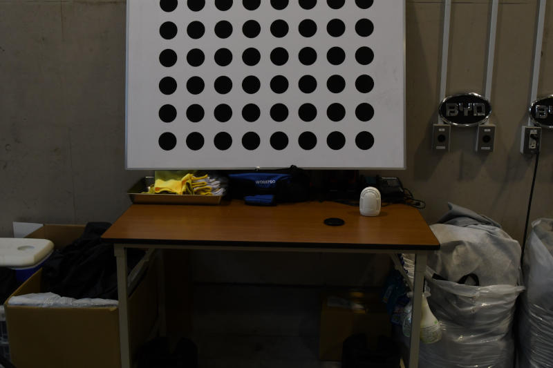
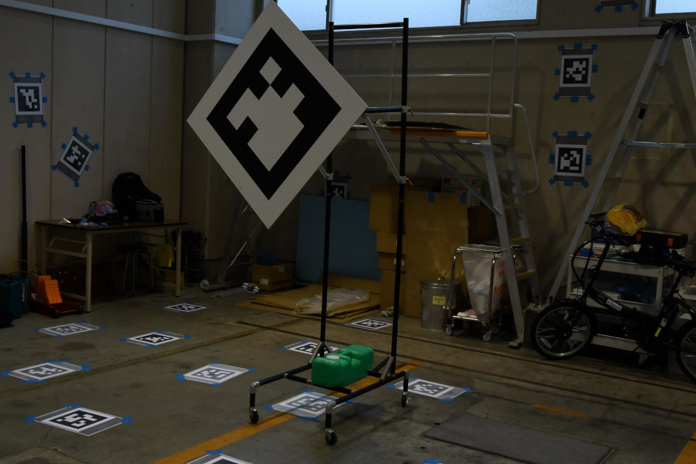
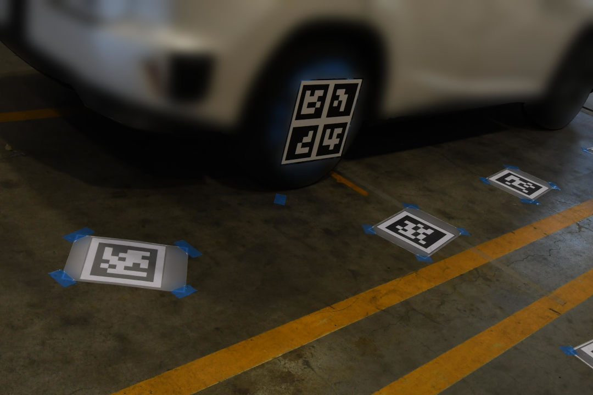
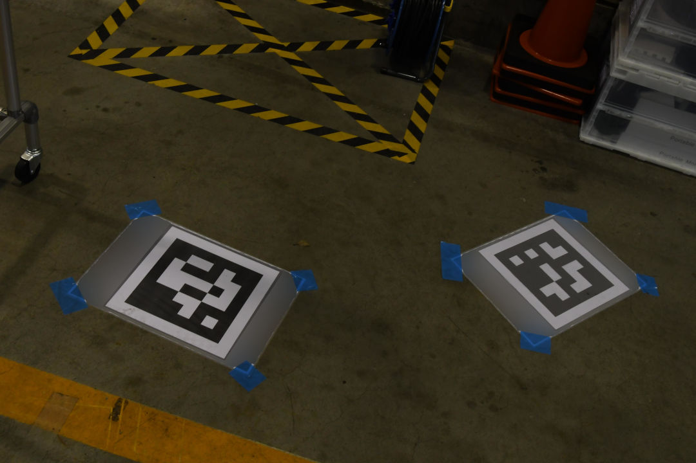

# tag_based_sfm_calibrator

In this tutorial, we will present a hands-on tutorial of the `tag_based_sfm_calibrator`, in particular, of its base-lidar calibration capabilities. Although we provide pre-recorded rosbags, the flow of the tutorial is meant to show the user the steps they must perform in their own use cases with live sensors.

General documentation regarding this calibrator can be found [here](../../tag_based_sfm_calibrator/README.md).

## Setup

This tutorial assumes that the user has already built the calibration tools.
Installation instructions can be found [here](../../README.md)

## Data preparation

Please download the data from [here](https://drive.google.com/drive/folders/1HBKDrLMW-aERfpYSbaI1vRIvNgBhmLuJ).
We provide three types of data:

- intrinsic calibration images for the external camera
- images taken with the external camera for SfM-based reconstruction
- rosbags for calibration

## Environment preparation

### Overall calibration environment

The required space for calibration depends on the vehicle and sensors used. For a normal consumer-level car, a space of `15m x 15m` should be sufficient.
In addition to the space, the floor of the calibration space must be completely leveled, as the algorithm requires the floor to be modeled as a plane (this requirement comes from the definition of `base_link`).
Finally, although not an absolute requirement, having walls, whiteboards, or other vertical structures where tags can be placed improves the calibration process, since it adds important reference points during the scene reconstruction process.

### Intrinsics calibration board

Since we need the initial intrinsics for the external camera, we need a way to calibrate it. This package provides support for circle boards and apriltags for calibration, although the user may choose to provide the intrinsics via other means.

### Calibration tags

Although information on the different types of tags can be found in the [base documentation](../../tag_based_sfm_calibrator/README.md), here we provide additional practical guidelines:

#### Ground tags

In this experiment, we print tags in regular paper/printer in B4 size. The tag size itself maximizes the payload size in the paper while also allowing some margin for robust detection. Since we use regular paper, we assume its thickness is negligible and that the poses of the ground tags match the ground itself.
The tags are affixed to the ground using regular tape and the users should make sure that they do not move at all during the experiment product of people or other objects moving around. Some recommendations in this regard are using strong tape and cleaning the surfaces before placing the tags.

#### Auxiliar tags

Auxiliary tags while not required are highly recommended since between ground tags and waypoints the scene can not be covered with enough tag positions and orientations for a correct reconstruction. It is recommended to use large tag sizes to increase the detection range, but at the same time, larger tags may be different to place in plane surfaces, so the user must find a compromise depending on the available environment.

#### Wheel tags

Wheel tags are the elements that allow the algorithm to find the `base_link`. As such, it is essential to improve its detection precision as much as possible. Some key considerations that the user may want to take into account are:

- Since each tag by itself provides 4 features for SfM (the corners), instead of using a single tag per wheel, it is possible to use grids of tags. The size of the grid must be as large as possible without sacrificing the ability of the external camera to detect the individual tags.
- Since the tags will not be placed in a wall or ground, but fixed via some mechanism to the wheel, they should be made from a rigid material that will not bend with time.
- Great consideration must be paid to the mechanism with which the tag is affixed to the wheel. Since the `base_link` is computed from the intersection between the wheel tags projected to the ground, this aspect is critical.

#### Waypoint tags

Waypoints are the only moving elements during the calibration process and must detected by both cameras and lidars.
Depending on the lidar model and the available space, the required waypoint size may vary, but so far we have had good results with 0.6m and 0.8m tags (the provided sizes correspond to an edge's size. In these cases the payloads are 0.45m and 0.6m).

In addition to the waypoint size, which determines the physical positions in which a tag can be detected, it is of equal importance the structure in which the waypoint is mounted. Depending on the structure's shape and size, it may interfere with the lidar detection algorithm, so it is recommended to prepare a mount that holds the tag in a way that is not visible to the sensor (see the provided example).

### Vehicle

Vehicles have suspension systems that make the `base_link` definition an ambiguous one from the point of view of the sensors. The pose of the `base_link` seen from the sensor will vary depending on the load present in the vehicle, and as such, the user will need to decide whether to calibrate either in a full/empty state. It is highly recommended that during the whole duration of the experiment no person enters or leaves the car!

### External camera

To construct the SfM graph and ultimately connect the calibration sensor (in this case a lidar) with the wheel tags, we make use of an additional camera, which we dub the `external camera`. In principle, the camera can be of any nature as long as it has fixed intrinsics parameters during the experiment. We have so far used Nikon DSLR cameras with good results, but have had also good results with certain point-and-shoot cameras.

Note: we assume the user knows how to use a camera and make no attempt at explaining camera fundamentals in this tutorial.

Camera selection and usage recommendations:

- It is recommended to use cameras with the highest (real) resolution possible and use image formats with as little compression as possible (DLSR cameras have options like normal, fine, ultra-fine, and so on).
- It is recommended to use a wide lens to capture as much of the environment as possible. Otherwise, the camera can not capture a high number of tags in a single image. However, fish-eye lenses are not supported.
- Use the highest F-number possible (smaller aperture). For example, we use at least f/14. This ensures that the tags will be in focus at the relevant distances.
- Use a relatively high shutter speed. The specific number will depend on the user's ability, but while it is acceptable to have underexposed photos, it is not acceptable to have blurred ones (motion while exposing the sensor to light).
- Regarding the ISO value, while in photography it is preferred to have low ISO values, in this problem setting (detecting tags), values over 1000 are not an issue (taking into consideration the fact that we require a small aperture and high shutter speeds, higher ISO values become necessary).
- The use of flash is optional and its use is left up to the user
- Even when using prime lenses, the focus ring modifies the camera intrinsics. For this reason, it is required to have the focus set to manual in both the camera lens (when applicable) and to set its value, it is recommended to either set it to infinity or first use auto-focus once and then fix the focus by setting it to manual.

## Launching the tool

In this tutorial, we will use the RDV of Tier IV (R&D Vehicle).
First, run the sensor calibration manager:

```text
ros2 run sensor_calibration_manager sensor_calibration_manager
```

In `project`, select `rdv`, and in `calibrator`, select `tag_based_sfm_base_lidar_calibrator`. Then, press `Continue`.
A menu titled `Launcher configuration` should appear in the UI, and the user may change any parameter he deems convenient. However, for this tutorial, we will use the default values. After configuring the parameters, click `Launch`.

The following UI should be displayed. When the `Calibrate` button becomes available, click it.
If it does not become available, it means that either the required `tf` or services are not available. In this case, since the `tf` are published by the provided rosbags, run the first one for a few seconds and then pause it (`ros2 bag play scene0.db3 --clock -r 0.5`).


## External camera intrinsic calibration

Before collecting scene images for reconstruction using the `external camera`, its intrinsics need to be computed.
To do so, take photos of a calibration board like the ones in the following images. Focus on different scales (size of the board in the image), out-plane rotations, and positions in the image. There is no hard requirement for the number of images, but around 30 is a good approximation. This calibration can be refined afterward during reconstruction.

<table>
  <tr>
    <td></td>
    <td></td>
   </tr>
   <tr>
    <td><p style="text-align: center;">Good example. The board is in the center and covers the image well</p></td>
    <td><p style="text-align: center;">Good example. Adds variation with an out-of-plane rotation</p></td>
  </tr>
  <tr>
    <td></td>
    <td></td>
   </tr>
   <tr>
    <td><p style="text-align: center;">Good example. Focuses on the corners of the image</p></td>
    <td><p style="text-align: center;">Good example. Adds variation in the distance from the camera</p></td>
  </tr>
  <tr>
    <td></td>
    <td></td>
   </tr>
   <tr>
    <td><p style="text-align: center;">Bad example. The board is not completely covered in the image</p></td>
    <td><p style="text-align: center;">Bad example. The board is not completely covered in the image</p></td>
  </tr>
</table>

Once enough images have been collected, transfer the images from the camera to the computer, and press `Calibrate external camera intrinsics` as shown in the following image:

<p align="center">
  
</p>

If there are no issues, the output in the console should be similar to the following one:

```text
[tag_based_sfm_calibrator-1] [INFO] [1713488090.641210235] [intrinsics_calibrator]: Camera matrix:
[tag_based_sfm_calibrator-1] [4816.165518235453, 0, 2160.348608760617;
[tag_based_sfm_calibrator-1]  0, 4821.30868416463, 1552.554137385826;
[tag_based_sfm_calibrator-1]  0, 0, 1]
[tag_based_sfm_calibrator-1] [INFO] [1713488090.641218916] [intrinsics_calibrator]: Distortion coefficients:
[tag_based_sfm_calibrator-1] [-0.07340778013968814, 0.02950049592323137, 0.005167166916447808, 0.002758631510330731, 0]
[tag_based_sfm_calibrator-1] [INFO] [1713488090.641265465] [intrinsics_calibrator]: Undistorted camera matrix:
[tag_based_sfm_calibrator-1] [4750.68994140625, 0, 2168.846093300279;
[tag_based_sfm_calibrator-1]  0, 4784.35107421875, 1560.251275314979;
[tag_based_sfm_calibrator-1]  0, 0, 1]
[tag_based_sfm_calibrator-1] [INFO] [1713488092.917012306] [tag_based_sfm_calibrator]: k = [4816.165518235453, 0, 2160.348608760617;
[tag_based_sfm_calibrator-1]  0, 4821.30868416463, 1552.554137385826;
[tag_based_sfm_calibrator-1]  0, 0, 1]
[tag_based_sfm_calibrator-1] [INFO] [1713488092.917062856] [tag_based_sfm_calibrator]: d = [-0.07340778013968814, 0.02950049592323137, 0.005167166916447808, 0.002758631510330731, 0]
[tag_based_sfm_calibrator-1] [INFO] [1713488092.917079752] [tag_based_sfm_calibrator]: new_k = [4750.68994140625, 0, 2168.846093300279;
[tag_based_sfm_calibrator-1]  0, 4784.35107421875, 1560.251275314979;
[tag_based_sfm_calibrator-1]  0, 0, 1]
```

## Scene data collection

To reconstruct the scene and find the `base_link`` pose, we need to obtain data from one or more scenes.
In each scene, waypoints are placed in different positions, the sensors record the detections from these waypoints, and using the external camera, photos from the scene, including the waypoints are taken.

The number of required scenes depends on the number of physical waypoints available. We recommend at least 5 waypoint positions in total. In the provided example, we use 2 waypoints and a total of 3 scenes, which correspond to 6 waypoint positions. The placement of the waypoints should be as uniform as possible around the vehicle.

Note: physically, there are 4 waypoints, but only two are visible to the lidar to calibrate in this example. The other waypoints were intended to calibrate side lidars, which we removed from this tutorial.

### Scene preparation

For the first scene, all the tags need to be placed. In the previous guidelines, there are instructions on how to place ground, auxiliar, and wheel tags. Once per scene, at the beginning of it, the tag must be placed in their new positions. In the example data we provide three scenes (one per rosbag). The following images provide a visualization of each scene as it would appear in the default `rviz` profile

<table>
  <tr>
    <td></td>
    <td></td>
    <td></td>
   </tr>
   <tr>
    <td><p style="text-align: center;">Scene 0</p></td>
    <td><p style="text-align: center;">Scene 1</p></td>
    <td><p style="text-align: center;">Scene 2</p></td>
  </tr>
</table>

### Add calibration sensor detections to scene

In each scene, after the waypoint positions have been decided (they must not move for the rest of the scene), the user must confirm that they are being correctly observed by the sensors. This can be done by observing if a cyan frame appears as a marker in the position of the waypoint, as shown in the previous images.

Once the user has confirmed that the waypoints are being detected by the calibration sensor, click the `Add detections to scene` button. The displayed text should be as follows:

```text
(for the first scene)
[tag_based_sfm_calibrator-1] [INFO] [1713487882.091919629] [tag_based_sfm_calibrator]: Added 2 detections to lidar=pandar_top (1 scenes)

(for the second scene)
[tag_based_sfm_calibrator-1] [INFO] [1713487951.874014175] [tag_based_sfm_calibrator]: Added 2 detections to lidar=pandar_top (2 scenes)

(for the third scene)
[tag_based_sfm_calibrator-1] [INFO] [1713487988.319661398] [tag_based_sfm_calibrator]: Added 2 detections to lidar=pandar_top (3 scenes)
```

### Collecting external camera images

After the calibration sensors have added the detections to the scene, the user must start taking photos with the external camera to cover the scene (and enable scene reconstruction).

The user can observe the sample data's external camera images to get a sense of how the scene must be covered while taking photos.
Here we make a list of good and bad photos that the user must keep in mind.

<table>
  <tr>
    <td></td>
    <td></td>
   </tr>
   <tr>
    <td><p style="text-align: center;">In each scene, the waypoints change positions, so it is important to take several photos of them from different angles, linking them to the scene</p></td>
    <td><p style="text-align: center;">The ultimate objective is to link the calibration sensor to the wheels. Since sensors can only detect waypoints (generally), taking photos that contain both wheels and waypoints is very useful to constrain the optimization problem and improve its performance</p></td>
  </tr>
  <tr>
    <td></td>
    <td></td>
   </tr>
   <tr>
    <td><p style="text-align: center;">In the optimization problem there are several ground and auxiliar tags, but only a few waypoints and only two wheel tags. It is important to take photos of the wheel tags from different positions and angles as much as possible</p></td>
    <td><p style="text-align: center;">Photos that contain too few tags do not provide enough information to the graph and internally they may be ignored. Such photos will not cause an issue, but it is better to take photos that contain as many tags as possible</p></td>
  </tr>
  <tr>
    <td></td>
    <td></td>
   </tr>
   <tr>
    <td><p style="text-align: center;">Photos that contain large portions of the scene (and several tags) are useful for the optimization problem. However, tags that are not completely inside the image may cause issues if they confuse the detectors</p></td>
    <td><p style="text-align: center;">Tags with high out-of-plane rotations may incur in bad initial poses, so they may cause issues downstream. Avoid when possible</p></td>
  </tr>
</table>

### Add the external camera images to scenes

Once all the scenes have been collected (3 in this case), download the images from the camera to the computer, and organize them by scenes. The folder structure should be as follows:

```text
scene0/....JPG
scene1/....JPG
scene2/....JPG
```

Then, press `Add external camera images to scene` and select the folder that contains the scene folders. The output should look as follows:

<p align="center">
  
</p>

```text
[tag_based_sfm_calibrator-1] [INFO] [1713488025.748589413] [tag_based_sfm_calibrator]: Attempting to add external camera images to scene id=0
[tag_based_sfm_calibrator-1] [INFO] [1713488025.748655706] [tag_based_sfm_calibrator]: Added 67 external images to scene id=0 (scenes=3)
[tag_based_sfm_calibrator-1] [INFO] [1713488025.748673405] [tag_based_sfm_calibrator]: Attempting to add external camera images to scene id=1
[tag_based_sfm_calibrator-1] [INFO] [1713488025.748689132] [tag_based_sfm_calibrator]: Added 39 external images to scene id=1 (scenes=3)
[tag_based_sfm_calibrator-1] [INFO] [1713488025.748701278] [tag_based_sfm_calibrator]: Attempting to add external camera images to scene id=2
[tag_based_sfm_calibrator-1] [INFO] [1713488025.748716456] [tag_based_sfm_calibrator]: Added 48 external images to scene id=2 (scenes=3)
```

## Data preprocessing

Once the sensor detections, external camera images, and external camera intrinsics have been added, the `Process scenes` button should be enabled as shown in the following image.

<p align="center">
  
</p>

By pressing it, the calibrator will process all the external images, extracting the tag detections from them. The process should last a few minutes, and when it finishes. the `Calibrate base_link` button should become enabled, as shown in the following image:

<p align="center">
  
</p>

## Calibration

Calibration starts when the user presses `Calibrate base_link`. The process itself takes only a few seconds, but drawing the results may take a few minutes.

The output should be as follows:

```text
...
[tag_based_sfm_calibrator-1] [INFO] [1713490703.054605510] [calibration_problem]: s2_e47 <-> a19 error: 0.42
[tag_based_sfm_calibrator-1] [INFO] [1713490703.054614383] [calibration_problem]: s2_e47 <-> a18 error: 0.08
[tag_based_sfm_calibrator-1] [INFO] [1713490703.054623589] [calibration_problem]: s2_e47 <-> s2_w1 error: 0.78
[tag_based_sfm_calibrator-1] [INFO] [1713490703.054639306] [calibration_problem]: s2_e47 <-> t26 error: 1.74
[tag_based_sfm_calibrator-1] [INFO] [1713490703.054648030] [calibration_problem]: s2_e47 <-> g90 error: 0.60
[tag_based_sfm_calibrator-1] [INFO] [1713490703.054656894] [calibration_problem]: s2_e47 <-> g65 error: 0.59
[tag_based_sfm_calibrator-1] [INFO] [1713490703.054665648] [calibration_problem]: s2_e47 <-> g63 error: 0.96
[tag_based_sfm_calibrator-1] [INFO] [1713490703.054674242] [calibration_problem]: s2_e47 <-> g99 error: 0.51
[tag_based_sfm_calibrator-1] [INFO] [1713490703.054683091] [calibration_problem]: s2_e47 <-> g60 error: 0.44
[tag_based_sfm_calibrator-1] [INFO] [1713490703.054692072] [calibration_problem]: s2_e47 <-> g53 error: 1.17
[tag_based_sfm_calibrator-1] [INFO] [1713490703.054700119] [calibration_problem]: Reprojection error statistics per tag type
[tag_based_sfm_calibrator-1] [INFO] [1713490703.054707345] [calibration_problem]:  AuxiliarTag reprojection errors:  mean=0.57 min=0.07 max=1.83 observations=457
[tag_based_sfm_calibrator-1] [INFO] [1713490703.054713259] [calibration_problem]:  WaypointTag reprojection errors:  mean=1.23 min=0.05 max=3.63 observations=123
[tag_based_sfm_calibrator-1] [INFO] [1713490703.054717387] [calibration_problem]:  WheelTag reprojection errors:  mean=1.87 min=0.60 max=3.55 observations=25
[tag_based_sfm_calibrator-1] [INFO] [1713490703.054725950] [calibration_problem]:  GroundTag reprojection errors:  mean=1.05 min=0.21 max=3.54 observations=647
[tag_based_sfm_calibrator-1] [INFO] [1713490703.054730198] [calibration_problem]: Reprojection error statistics per sensor
[tag_based_sfm_calibrator-1] [INFO] [1713490703.054741693] [calibration_problem]:  external_camera reprojection errors:  mean=0.91 min=0.07 max=3.63 observations=1246
[tag_based_sfm_calibrator-1] [INFO] [1713490703.054746855] [calibration_problem]:  l0 reprojection errors:  mean=0.18 min=0.05 max=0.35 observations=6
```

Reprojection errors are usually around the pixel unit. If there are suspiciously high reprojection errors, the user can identify which pair of sensor/tag produced it in an attempt to identify the reason.

```text
[tag_based_sfm_calibrator-1] [INFO] [1713490739.584850939] [tag_based_sfm_calibrator]: Finished optimization
[tag_based_sfm_calibrator-1] [INFO] [1713490739.715880844] [calibration_problem]: sensor_to_base_link: translation=[0.87021, 0.00364, -2.03938] quat=[0.00359, 0.00017, 0.99999, -0.00065]
[tag_based_sfm_calibrator-1] [INFO] [1713490739.715944539] [tag_based_sfm_calibrator]: base_link: initial and calibrated statistics statistics
[tag_based_sfm_calibrator-1] [INFO] [1713490739.715982820] [tag_based_sfm_calibrator]:  initial: x=0.89800 y=0.00000 z=1.61100 roll=0.00000 pitch=-0.00000 yaw=-3.14159
[tag_based_sfm_calibrator-1] [INFO] [1713490739.715999169] [tag_based_sfm_calibrator]:  calibrated: x=0.88486 y=0.00321 z=2.03307 roll=0.00035 pitch=-0.00719 yaw=3.14029
[tag_based_sfm_calibrator-1] [INFO] [1713490739.716015803] [tag_based_sfm_calibrator]: base_link: initial to calibrated statistics
[tag_based_sfm_calibrator-1] [INFO] [1713490739.716025804] [tag_based_sfm_calibrator]:   normal angle difference: 0.412 degrees
[tag_based_sfm_calibrator-1] [INFO] [1713490739.716036266] [tag_based_sfm_calibrator]:   yaw angle difference: 0.075 degrees
[tag_based_sfm_calibrator-1] [INFO] [1713490739.716046824] [tag_based_sfm_calibrator]:   x: 0.028 m
[tag_based_sfm_calibrator-1] [INFO] [1713490739.716057076] [tag_based_sfm_calibrator]:   y: -0.004 m
[tag_based_sfm_calibrator-1] [INFO] [1713490739.716067296] [tag_based_sfm_calibrator]:   z: -0.428 m
[tag_based_sfm_calibrator-1] [INFO] [1713490739.716080333] [tag_based_sfm_calibrator]: Initial ground plane model
[tag_based_sfm_calibrator-1] [INFO] [1713490739.716089603] [tag_based_sfm_calibrator]:  a=0.0000
[tag_based_sfm_calibrator-1] [INFO] [1713490739.716104431] [tag_based_sfm_calibrator]:  b=0.0000
[tag_based_sfm_calibrator-1] [INFO] [1713490739.716114657] [tag_based_sfm_calibrator]:  c=1.0000
[tag_based_sfm_calibrator-1] [INFO] [1713490739.716124234] [tag_based_sfm_calibrator]:  d=1.6110
[tag_based_sfm_calibrator-1] [INFO] [1713490739.716156603] [tag_based_sfm_calibrator]: Calibrated ground plane model
[tag_based_sfm_calibrator-1] [INFO] [1713490739.716167786] [tag_based_sfm_calibrator]:  a=0.0072
[tag_based_sfm_calibrator-1] [INFO] [1713490739.716178809] [tag_based_sfm_calibrator]:  b=0.0004
[tag_based_sfm_calibrator-1] [INFO] [1713490739.716188675] [tag_based_sfm_calibrator]:  c=1.0000
[tag_based_sfm_calibrator-1] [INFO] [1713490739.716198554] [tag_based_sfm_calibrator]:  d=2.0331
```

## Results

Since we can not directly evaluate the `base_link` calibration, to ascertain the correctness of the calibration, albeit indirectly, we can observe the reprojection errors of the different tags. This can be done numerically, by observing the previous console logs, or visually, since the calibrator draws the resulting tag poses (from the SfM) into the external camera images.

<table>
  <tr>
    <td></td>
    <td></td>
   </tr>
</table>

The previous images show an example of the resulting tag poses projected in the image. The red drawings correspond to the initial tag poses, the green drawings are the optimized ones, and the magenta represents the 2D detections (the target during optimization). As can be seen in the example, the reprojection error is almost null.

In addition to the 2D reprojections, it is also possible to visually evaluate the calibration process via 3D rviz markers as shown in the next images:

<table>
  <tr>
    <td></td>
    <td></td>
    <td></td>
   </tr>
   <tr>
    <td><p style="text-align: center;">All tag and sensor poses from a top-view perspective</p></td>
    <td><p style="text-align: center;">Auxiliar tag poses placed in the wall have a pose that <br>matches the wall as seen by the lidar</p></td>
    <td><p style="text-align: center;">Wheel tag poses</p></td>
  </tr>
</table>

## FAQ

- If the detections look all OK but the reprojection errors and poses look bad, the tag sizes may be incorrect.
- If the debug images look incorrect whenever a certain tag appears in the image, the offending tag may have moved during the calibration (excluding waypoints).
- If the base link appears rotated with the x-axis pointing at the back of the vehicle, you may have switched left and right ids.
