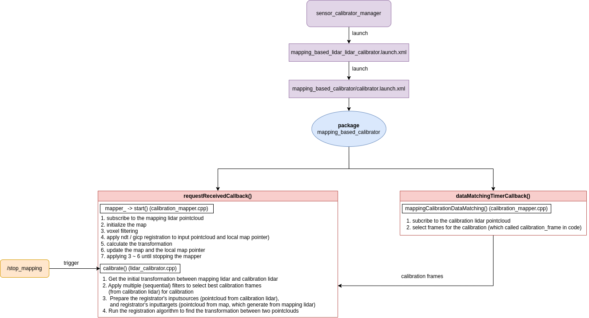

# mapping_based_calibrator

A tutorial for this calibrator can be found [here](../docs/tutorials/mapping_based_calibrator.md)

## Purpose

The package `mapping_based_calibrator` allows extrinsic calibration among lidar sensor and lidar sensor used in autonomous driving and robotics.

Note: depending on how this tool is configured it can perform the following calibrations:

- base-lidar(s)
- lidar-lidar(s)

## Inner-workings / Algorithms

### lidar-lidar calibration

Overview
This algorithm aims to calibrate multiple LiDARs by using registration algorithms. LiDARs are seperated in two categories. The main lidar is named `mapping lidar` which aims for build the map. The rest of the LiDARs are called `calibration lidars`, which are used for calibration, in other words, they are use for finding the transformations between themselves and the mapping lidar.

#### Step 1: Mapping (using Mapping lidar)

First of all, the calibrator will use one of the LiDARs (defined in the launch file) as the mapping lidar for mapping. Pointcloud from this lidar uses NDT of GICP algorithm to calculate the pose and also store pointcloud as a map for future usage.

#### Step 2: Calibration data preparation (using Mapping lidar & Calibration lidars)

After the mapping is done, we need to do some preprocessing before the calibration process. For instance, since we want to apply the registration algorithms on the pointcloud from the mapping lidar and the pointcloud from the calibration LiDARs to find the transformation between two lidar. We need to make sure both of the pointcloud are in the same timestamp. However, the calibration LiDARs may not be synchronized with the mapping lidar, so their respective pointclouds can not be used directly together under movement. To deal with this, we need to first interpolate the pose of the mapping lidar at the timestamp of the calibration LiDARs to get the pointcloud for applying registration algorithms.

#### Step 3: Calibrate (Mapping lidar & Calibration LiDARs)

After preparing data for the calibration, we can now run the registration algorithms (NDT/GICP) to find the transformations between two pointcloud (calibration LiDARs' pointcloud and mapping lidar's pointcloud), then we can get the transformation between two LiDARs.

#### Diagram

Below, you can see the how the algorithm is implemented in the `mapping_based_calibrator` package.

### base lidar calibration

Instead of calibrating the transformation between lidar and lidar, we can also utilize the map generated from the mapping lidar to calibration the transformation between mappiong lidar and the base_link.

Therefore, step 1 would be the same as `lidar-lidar calibration`.

#### Step 1: Mapping (Mapping lidar)

First of all, the calibrator will use one of the LiDARs (defined in the launch file) as the mapping lidar for mapping. Pointcloud from this lidar uses NDT of GICP algorithm to calculate the pose and also store pointcloud as a map for future usage.

#### Step 2: Extract ground from the pointcloud

After we build the map, we get dense pointcloud from the map. Then we utilize the PCA and `pcl::SACSegmentation` for the ground extraction.

#### Step 3: Calibrate (using Mapping lidar & baselink)

Finally, we utilize the initial_base_to_lidar_transform and the ground model to calculate the transformation between base_link and mapping lidar.

## ROS Interfaces

### Input

| Name                              | Type                                                   | Description                                                                                                                                                      |
| --------------------------------- | ------------------------------------------------------ | ---------------------------------------------------------------------------------------------------------------------------------------------------------------- |
| `{calibration_camera_info_topic}` | `sensor_msgs::msg::CameraInfo`                         | Intrinsic parameters for the calibration cameras . The specific topic is provided via parameters                                                                 |
| `{calibration_image_topic}`       | `sensor_msgs::msg::CompressedImage`                    | Compressed images for calibration. The specific topic is configured via parameters.                                                                              |
| `{calibration_pointcloud_topic}`  | `sensor_msgs::msg::PointCloud2`                        | Pointclouds that you want to calibrate with the mapping (main) pointcloud. The specific topic is configured via parameters.                                      |
| `mapping_pointcloud`              | `sensor_msgs::msg::PointCloud2`                        | Subscribes to pointcloud data for mapping processes. Recommend to select the lidar that have higher resolution. The specific topic is configured via parameters. |
| `detected_objects`                | `autoware_auto_perception_msgs::msg::DetectedObjects`  | Subscribes to messages containing detected objects, used in the filtering procedure                                                                              |
| `predicted_objects`               | `autoware_auto_perception_msgs::msg::PredictedObjects` | Subscribes to messages that contain predicted object paths and positions, used in the filtering procedure                                                        |

### Output

| Name                              | Type                                   | Description                                                                                                                                              |
| --------------------------------- | -------------------------------------- | -------------------------------------------------------------------------------------------------------------------------------------------------------- |
| `output_map`                      | `sensor_msgs::msg::PointCloud2`        | Publishes the output map constructed from the `mapping_pointcloud`, providing visualization in RViz.                                                     |
| `frame_path`                      | `nav_msgs::msg::Path`                  | Publishes the actual path of `mapping_pointcloud`, providing visualization in RViz.                                                                      |
| `frame_predicted_path`            | `nav_msgs::msg::Path`                  | Publishes the predicted path of `mapping_pointcloud`, providing visualization in RViz.                                                                   |
| `keyframe_path`                   | `nav_msgs::msg::Path`                  | Publishes the keyframe path of `mapping_pointcloud`, providing visualization in RViz.                                                                    |
| `keyframe_markers`                | `visualization_msgs::msg::MarkerArray` | Publishes markers for keyframes, providing visualization in RViz.                                                                                        |
| `initial_source_aligned_map`      | `sensor_msgs::msg::PointCloud2`        | Publishes initial map from calibration lidar, providing visualization in RViz.                                                                           |
| `calibrated_source_aligned_map`   | `sensor_msgs::msg::PointCloud2`        | Publishes calibrated map from calibration lidar, providing visualization in RViz.                                                                        |
| `target_map`                      | `sensor_msgs::msg::PointCloud2`        | Publishes target map from mapping lidar, used for comparing with the `calibrated_source_aligned_map` and `target_map` , providing visualization in RViz. |
| `target_markers`                  | `visualization_msgs::msg::MarkerArray` | Publishes markers targeted for specific calibration or mapping purposes, aiding in visualization and alignment.                                          |
| `base_lidar_augmented_pointcloud` | `sensor_msgs::msg::PointCloud2`        | Publishes the ground pointcloud from initial pointcloud.                                                                                                 |
| `ground_pointcloud`               | `sensor_msgs::msg::PointCloud2`        | Publishes the ground pointcloud from calibrated pointcloud.                                                                                              |

Note: target_markers is only used by camera calibrators (not using now)

### Services

| Name                    | Type                                                  | Description                                                                                                |
| ----------------------- | ----------------------------------------------------- | ---------------------------------------------------------------------------------------------------------- |
| `extrinsic_calibration` | `tier4_calibration_msgs::` `srv::ExtrinsicCalibrator` | Generic calibration service. The call is blocking until the calibration process finishes                   |
| `stop_mapping`          | `std_srvs::srv::Empty`                                | `mapping_pointcloud stopped` stop to construct map through this service, afterwared calibration will start |
| `load_database`         | `std_srvs::srv::Empty`                                | Load lidar and camera calibration frames from database (deprecated)                                        |
| `save_database`         | `std_srvs::srv::Empty`                                | Save lidar and camera calibration frames to database (deprecated)                                          |

## Parameters

### Core Parameters

| Name                                     | Type                  | Default Value | Description                                                                                                                                                                        |
| ---------------------------------------- | --------------------- | ------------- | ---------------------------------------------------------------------------------------------------------------------------------------------------------------------------------- |
| `calibrate_base_frame`                   | `bool`                | `false`       | Flag to optionally calibrate the base frame (base_link).                                                                                                                           |
| `base_frame`                             | `std::string`         |               | Frame name of the base frame used in base-lidar calibration.                                                                                                                       |
| `map_frame`                              | `std::string`         |               | Frame name of the `map`                                                                                                                                                            |
| `calibration_camera_optical_link_frames` | `std::vector<string>` |               | List of frame names for `calibration camera`.                                                                                                                                      |
| `calibration_lidar_frames`               | `std::vector<string>` |               | List of frame names for `calibration lidar`.                                                                                                                                       |
| `calibration_camera_info_topics`         | `std::vector<string>` |               | List of camera info topics for `calibration camera`. (deprecated)                                                                                                                  |
| `calibration_image_topics`               | `std::vector<string>` |               | List of camera image topics for `calibration camera`. (deprecated)                                                                                                                 |
| `calibration_pointcloud_topics`          | `std::vector<string>` |               | List of pointcloud topics for `calibration lidar`.                                                                                                                                 |
| `mapping_lidar_frame`                    | `std::string`         |               | Frame name of the `mapping_lidar`                                                                                                                                                  |
| `mapping_registrator`                    | `std::string`         |               | Name of the PCL registration algorithm used for mapping processes.                                                                                                                 |
| `mapping_verbose`                        | `bool`                | `false`       | Verbose output flag for mapping processes.                                                                                                                                         |
| `use_rosbag`                             | `bool`                | `true`        | Flag to determine if data should be read from a ROS bag file.                                                                                                                      |
| `mapping_max_frames`                     | `int`                 | `500`         | Maximum number of frames to use for mapping, if the number of frames is larger than this value, mapper stop and start calibrate.                                                   |
| `local_map_num_keyframes`                | `int`                 | `15`          | Number of keyframes in the local map.                                                                                                                                              |
| `dense_pointcloud_num_keyframes`         | `int`                 | `10`          | In this range [keyframe_id - `dense_pointcloud_num_keyframes` , keyframe_id + `dense_pointcloud_num_keyframes`] keyframe will use for generating dense pointclouds in calibration. |
| `mapping_min_range`                      | `double`              | `0.5`         | Minimum range of each lidar pointcloud for mapping map.                                                                                                                            |
| `mapping_max_range`                      | `double`              | `60.0`        | Maximum range of each lidar pointcloud for mapping map.                                                                                                                            |
| `min_mapping_pointcloud_size`            | `int`                 | `10000`       | Minimum size of pointcloud data to consider for mapping.                                                                                                                           |
| `min_calibration_pointcloud_size`        | `int`                 | `500`         | Minimum size of pointcloud data necessary for calibration processes.                                                                                                               |
| `mapping_lost_timeout`                   | `double`              | `1.0`         | Sensor's timeout in seconds to consider the mapping process is failed.                                                                                                             |

### Mapping Parameters

| Name                                 | Type     | Default Value | Description                                                                                                                |
| ------------------------------------ | -------- | ------------- | -------------------------------------------------------------------------------------------------------------------------- |
| `mapper_resolution`                  | `double` | `5.0`         | Resolution for pclomp::NormalDistributionsTransform algorithm.                                                             |
| `mapper_step_size`                   | `double` | `0.1`         | Step size for pclomp::NormalDistributionsTransform algorithm.                                                              |
| `mapper_max_iterations`              | `int`    | `35`          | Maximum number of iterations for pclomp::NormalDistributionsTransform and pcl::GeneralizedIterativeClosestPoint algorithm. |
| `mapper_epsilon`                     | `double` | `0.01`        | Epsilon value for pclomp::NormalDistributionsTransform and pcl::GeneralizedIterativeClosestPoint algorithm.                |
| `mapper_num_threads`                 | `int`    | `8`           | Number of threads to use for pclomp::NormalDistributionsTransform algorithm.                                               |
| `mapper_max_correspondence_distance` | `double` | `0.1`         | Maximum correspondence istance for pcl::GeneralizedIterativeClosestPoint algorithm.                                        |
| `mapping_viz_leaf_size`              | `double` | `0.15`        | Leaf size for pcl::VoxelGrid for voxelize the mapping pointcloud.                                                          |
| `calibration_viz_leaf_size`          | `double` | `0.15`        | Leaf size for pcl::VoxelGridTriplets for voxelize the calibration pointcloud.                                              |
| `leaf_size_input`                    | `double` | `0.1`         | Leaf size for pcl::VoxelGrid for voxelize the input pointcloud.                                                            |
| `leaf_size_local_map`                | `double` | `0.1`         | Leaf size for pcl::VoxelGrid for voxelize the local map                                                                    |
| `leaf_size_dense_map`                | `double` | `0.05`        | Leaf size for pcl::VoxelGrid for voxelize the dense map                                                                    |
| `new_keyframe_min_distance`          | `double` | `1.0`         | Minimum distance between consecutive keyframes.                                                                            |
| `new_frame_min_distance`             | `double` | `0.05`        | Minimum distance of a new frame needs to be apart from the last to be processed.                                           |
| `frame_stopped_distance`             | `double` | `0.02`        | Threshold distance to determine if the frame has stopped moving.                                                           |
| `frames_since_stoped_force_frame`    | `int`    | `5`           | If number of stop frames equal to this value, we set it as keyframe_and_stop frame.                                        |
| `calibration_skip_keyframes`         | `int`    | `5`           | TODO.                                                                                                                      |

### Calibration criteria parameters

| Name                                         | Type     | Default Value | Description                                                                                                                       |
| -------------------------------------------- | -------- | ------------- | --------------------------------------------------------------------------------------------------------------------------------- | --- |
| `max_allowed_interpolated_time`              | `double` | `0.05`        | Maximum allowable time for frame interpolated time in standard criteria.                                                          |
| `max_allowed_interpolated_distance`          | `double` | `0.05`        | Maximum allowable distance for frame interpolated distance in standard criteria.                                                  |
| `max_allowed_interpolated_angle`             | `double` | `1.0`         | Maximum allowable angle for frame interpolated angle in standard criteria.                                                        |
| `max_allowed_interpolated_speed`             | `double` | `3.0`         | Maximum allowable speed for frame interpolated speed in standard criteria.                                                        |
| `max_allowed_interpolated_accel`             | `double` | `0.4`         | Maximum allowable acceleration for frame interpolated acceleration in standard criteria.                                          |
| `max_allowed_interpolated_distance_straight` | `double` | `0.08`        | Maximum allowable distance for frame interpolated distance in straight criteria.                                                  |     |
| `max_allowed_interpolated_angle_straight`    | `double` | `0.5`         | Maximum allowable angle for frame interpolated angle in straight criteria.                                                        |
| `max_allowed_interpolated_speed_straight`    | `double` | `5.0`         | Maximum allowable speed for frame interpolated speed in straight criteria.                                                        |
| `max_allowed_interpolated_accel_straight`    | `double` | `0.1`         | Maximum allowable acceleration for frame interpolated acceleration in straight criteria.                                          |
| `filter_detections`                          | `bool`   | `true`        | Flag to enable filtering of detection to improve calibration accuracy and reduce noise.                                           |
| `detection_max_time_tolerance`               | `double` | `0.5`         | Maximum time tolerance for obtaining all detections close in time to the source pointcloud                                        |
| `detection_size_tolerance`                   | `double` | `0.4`         | Tolerance for detection size to account for measurement errors and environmental factors.                                         |
| `lost_frame_max_angle_diff`                  | `double` | `25.0`        | Maximum allowable angular difference between keyframe to consider a frame as lost, used in handling outliers in frame processing. |
| `lost_frame_interpolation_error`             | `double` | `0.05`        | Maximum allowable interplation error between keyframe to consider a frame as lost, used in handling outliers in frame processing. |
| `lost_frame_max_acceleration`                | `double` | `8.0`         | Maximum allowable acceleration between keyframe to consider a frame as lost, used in handling outliers in frame processing.       |
| `viz_max_range`                              | `double` | `80.0`        | Maximum range for visualization purposes, setting the boundary for displayable data.                                              |
| `crop_z_calibration_pointclouds`             | `bool`   | `true`        | Flag to enable cropping of the Z-axis in calibration pointclouds.                                                                 |
| `crop_z_calibration_pointclouds_value`       | `double` | `2.0`         | Value of cropping the Z-axis in the calibration pointcloud.                                                                       |
| `calibration_use_only_stopped`               | `bool`   | `false`       | Flag to use only data from stopped frames.                                                                                        |
| `calibration_use_only_last_frames`           | `bool`   | `false`       | Consider only the last frames for calibration.                                                                                    |
| `max_calibration_range`                      | `double` | `80.0`        | Maximum range to consider for calibration purposes, defining the spatial boundary for calibration data.                           |
| `min_calibration_range`                      | `double` | `1.5`         | Minimum range to consider for calibration purposes, defining the spatial boundary for calibration data.                           |
| `calibration_min_pca_eigenvalue`             | `double` | `0.25`        | Minimum eigenvalue for PCA in calibration.                                                                                        |
| `calibration_min_distance_between_frames`    | `double` | `5.0`         | Minimum spatial distance between frames for calibration to reduce redundancy and enhance data diversity.                          |
| `calibration_eval_max_corr_distance`         | `double` | `0.1`         | Maximum correspondence distance for source pointcloud and target pointcloud.                                                      |

### Calibration parameters

| Name                       | Type     | Default Value | Description                                                                                                              |
| -------------------------- | -------- | ------------- | ------------------------------------------------------------------------------------------------------------------------ |
| `solver_iterations`        | `int`    | `200`         | Number of iterations for the PCL registration algorithm during calibration, affecting the convergence rate and accuracy. |
| `max_corr_dist_coarse`     | `double` | `0.5`         | Maximum coarse correspondence distance for the PCL registration algorithm during calibration.                            |
| `max_corr_dist_fine`       | `double` | `0.1`         | Maximum fine correspondence distance for the PCL registration algorithm during calibration.                              |
| `max_corr_dist_ultra_fine` | `double` | `0.05`        | Maximum ultra fine correspondence distance for the PCL registration algorithm during calibration.                        |

### Lidar calibration-only parameters

| Name                           | Type  | Default Value | Description                                                 |
| ------------------------------ | ----- | ------------- | ----------------------------------------------------------- |
| `lidar_calibration_min_frames` | `int` | `2`           | Minimum number of frames to consider for lidar calibration. |
| `lidar_calibration_max_frames` | `int` | `10`          | Maximum number of frames to use in lidar calibration.       |

### Camera calibration-only parameters

| Name                            | Type     | Default Value | Description                                                  |
| ------------------------------- | -------- | ------------- | ------------------------------------------------------------ |
| `camera_calibration_min_frames` | `int`    | `1`           | Minimum number of frames to consider for camera calibration. |
| `camera_calibration_max_frames` | `int`    | `10`          | Maximum number of frames to use in camera calibration.       |
| `pc_features_min_distance`      | `double` | `0.2`         | Near plane distance for pcl::FrustumCulling.                 |
| `pc_features_max_distance`      | `double` | `40.0`        | Far plane distance for pcl::FrustumCulling detection.        |

### Base-Lidar calibration parameters

| Name                                     | Type     | Default Value | Description                                                                                                 |
| ---------------------------------------- | -------- | ------------- | ----------------------------------------------------------------------------------------------------------- |
| `base_lidar_crop_box_min_x`              | `double` | `-20.0`       | Minimum X-coordinate for the cropping box in base lidar calibration to focus on relevant data areas.        |
| `base_lidar_crop_box_min_y`              | `double` | `-20.0`       | Minimum Y-coordinate for the cropping box in base lidar calibration to focus on relevant data areas.        |
| `base_lidar_crop_box_min_z`              | `double` | `-20.0`       | Minimum Z-coordinate for the cropping box in base lidar calibration to focus on relevant data areas.        |
| `base_lidar_crop_box_max_x`              | `double` | `20.0`        | Maximum X-coordinate for the cropping box in base lidar calibration to focus on relevant data areas.        |
| `base_lidar_crop_box_max_y`              | `double` | `20.0`        | Maximum Y-coordinate for the cropping box in base lidar calibration to focus on relevant data areas.        |
| `base_lidar_crop_box_max_z`              | `double` | `20.0`        | Maximum Z-coordinate for the cropping box in base lidar calibration to focus on relevant data areas.        |
| `base_lidar_max_inlier_distance`         | `double` | `0.01`        | Maximum inlier distance for ground extraction by using pcl::SACSegmentation.                                |
| `base_lidar_max_iterations`              | `int`    | `1000`        | Maximum number of iterations for ground extraction by using pcl::SACSegmentation.                           |
| `base_lidar_min_plane_points`            | `int`    | `1000`        | Minimum number of points required in a pointcloud, ensuring sufficient data for applying ground extraction. |
| `base_lidar_min_plane_points_percentage` | `double` | `10.0`        | Minimum percentage of ground plane points in a pointcloud.                                                  |
| `base_lidar_max_cos_distance`            | `double` | `0.5`         | Maximum cosine distance for applying ground plane extraction.                                               |
| `base_lidar_overwrite_xy_yaw`            | `bool`   | `false`       | Flag to allow overwriting the x, y, and yaw value during base lidar calibration.                            |

## Known issues/limitations

## Pro tips/recommendations

To get better calibration result, move your vehilce as slow as possible. Also, make sure you use the high-resolution Lidar sensor for mapping.
