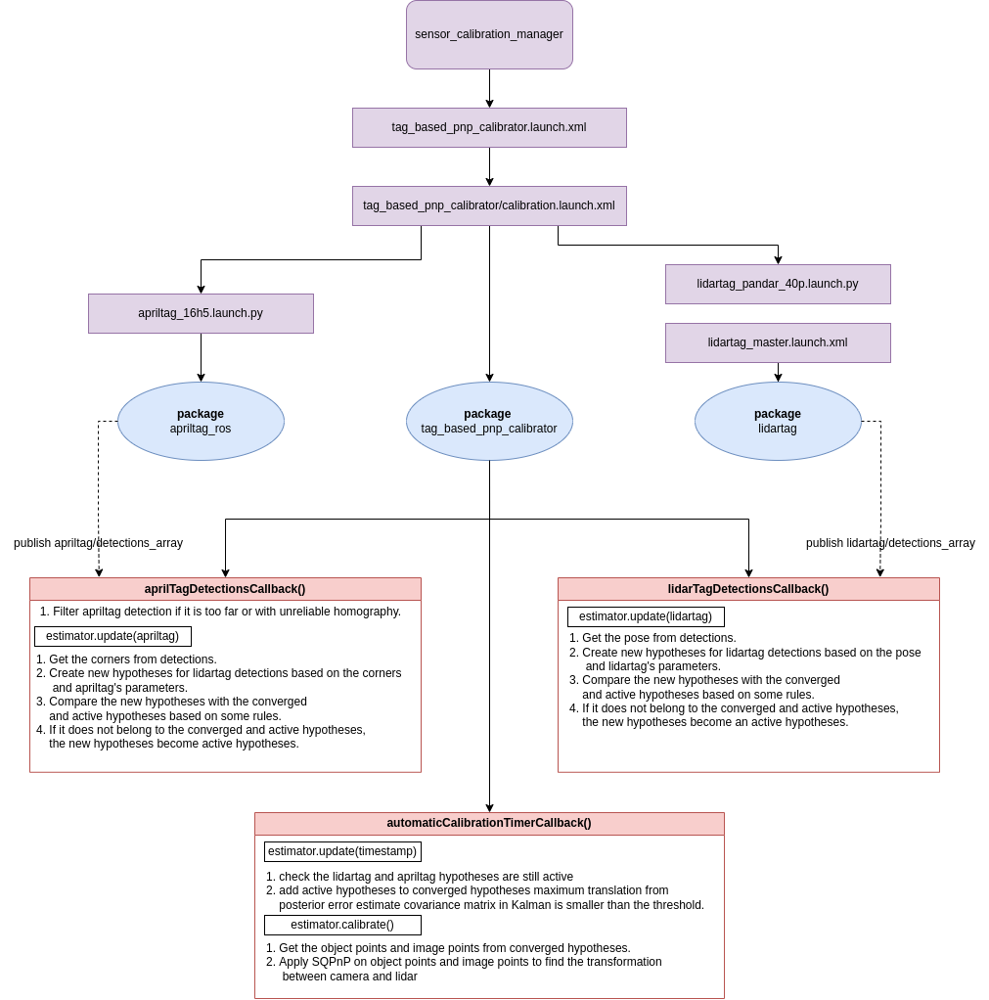

# tag_based_pnp_calibrator

A tutorial for this calibrator can be found [here](../docs/tutorials/tag_based_pnp_calibrator.md)

## Purpose

The package `tag_based_pnp_calibrator` allows extrinsic calibration among Camera sensor and LiDAR sensor used in autonomous driving and robotics.

## Inner-workings / Algorithms

The `tag_based_pnp_calibrator` utilize the PNP algorithm to calculate the transformation between LiDAR and Camera. To run this package, you also need to run `apriltag_ros` package and `lidartag` package to calculate the transformation.

The `apriltag_ros` package will detect the apriltag and output the apriltag detection. On the other hand, `lidartag` package will detect the lidartag and output the lidartag detection.

The `tag_based_pnp_calibrator` utilize the detections from `apriltag_ros` and `lidartag`, and use Kalman Filter to track those detections. If the detections is converged, then the calibrator will apply SQPNP provided by OpenCV to estimate the transformation between image points from apriltag and object points from lidartag.

Below, you can see the how the algorithm is implemented in the `tag_based_pnp_calibrator` package.

## ROS Interfaces

### Input

| Name                        | Type                                         | Description                                                                                 |
| --------------------------- | -------------------------------------------- | ------------------------------------------------------------------------------------------- |
| `{camera_info}`             | `sensor_msgs::msg::CameraInfo`               | Intrinsic parameters for the calibration cameras . `camera_info` is provided via parameters |
| `lidartag/detections_array` | `lidartag_msgs::msg::LidarTagDetectionArray` | Lidartag detections. `lidartag/detections_array` is defined in launcher.                    |
| `apriltag/detection_array`  | `apriltag_msgs::msg::AprilTagDetectionArray` | Apriltag detections. `apriltag/detection_array` is defined in launcher.                     |

### Output

| Name                   | Type                                             | Description                                         |
| ---------------------- | ------------------------------------------------ | --------------------------------------------------- |
| `filtered_projections` | `visualization_msgs::msg::MarkerArray`           | Publishes the calibration markers for visualization |
| `calibration_points`   | `tier4_calibration_msgs::msg::CalibrationPoints` | Publishes the tag points after calibration          |

### Services

| Name                    | Type                                                  | Description                                                                              |
| ----------------------- | ----------------------------------------------------- | ---------------------------------------------------------------------------------------- |
| `extrinsic_calibration` | `tier4_calibration_msgs::` `srv::ExtrinsicCalibrator` | Generic calibration service. The call is blocking until the calibration process finishes |

## Parameters

### Core Parameters

| Name                                          | Type                  | Default Value | Description                                                                                                                         |
| --------------------------------------------- | --------------------- | ------------- | ----------------------------------------------------------------------------------------------------------------------------------- |
| `calib_rate`                                  | `double`              |               | The rate at which the calibration callback is invoked. This controls the frequency of calibration updates.                          |
| `base_frame`                                  | `std::string`         |               | The base_frame is used to compare the initial and calibrated values.                                                                |
| `min_tag_size`                                | `double`              |               | The size of the Apriltag in meters                                                                                                  |
| `max_tag_distance`                            | `double`              |               | Maximum allowable distance from the camera to the tags.                                                                             |
| `max_allowed_homography_error`                | `double`              |               | Discard the Apriltag detection if the homography error is larger than this value.                                                   |
| `use_receive_time`                            | `bool`                |               | Flag to determine whether to use the receive time instead of the header timestamps.                                                 |
| `use_rectified_image`                         | `bool`                |               | Flag to determine whether rectified images should be used in the calibration process.                                               |
| `calibration_crossvalidation_training_ratio`  | `double`              |               | The ratio of data used for training versus testing during the calibration's cross-validation process.                               |
| `calibration_convergence_min_pairs`           | `int`                 |               | The minimum number of Apriltag and LiDARtag detection pairs required to consider the calibration process as potentially converging. |
| `calibration_convergence_min_area_percentage` | `double`              |               | Minimum percentage of the area that needs to be covered by detection.                                                               |
| `min_pnp_points`                              | `int`                 |               | Minimum number of points required for the Perspective-n-Point problem used in calibration to solve the pose estimation.             |
| `min_convergence_time`                        | `double`              |               | Minimum time required for the calibration process to be considered as converged.                                                    |
| `max_no_observation_time`                     | `double`              |               | Maximum allowable time interval without observing any calibration tags before considering the calibration data stale.               |
| `new_hypothesis_distance`                     | `double`              |               | Distance threshold for creating a new hypothesis.                                                                                   |
| `tag_ids`                                     | `std::vector<int>`    |               | List of tag IDs that are used in the calibration process.                                                                           |
| `tag_sizes`                                   | `std::vector<double>` |               | Physical sizes of the tags corresponding to the IDs in meter.                                                                       |
| `lidartag_max_convergence_translation`        | `double`              |               | Maximum translation allowed for a lidar tag detection hypothesis to be considered converging.                                       |
| `lidartag_max_convergence_translation_dot`    | `double`              |               | Maximum translation dot allowed for a lidar tag detection hypothesis to be considered converging.                                   |
| `lidartag_max_convergence_rotation`           | `double`              |               | Maximum rotation allowed for a lidar tag detection hypothesis to be considered converging.                                          |
| `lidartag_max_convergence_rotation_dot`       | `double`              |               | Maximum rotation dot allowed for a lidar tag detection hypothesis to be considered converging.                                      |
| `lidartag_new_hypothesis_translation`         | `double`              |               | Translation threshold for generating a new hypothesis in lidar tag tracking.                                                        |
| `lidartag_new_hypothesis_rotation`            | `double`              |               | Rotation threshold for generating a new hypothesis in lidar tag tracking.                                                           |
| `lidartag_measurement_noise_translation`      | `double`              |               | The square of this value is part of input for cv::KalmanFilter::measurementNoiseCov to measurement noise covariance matrix (R).     |
| `lidartag_measurement_noise_rotation`         | `double`              |               | The square of this value is part of input for cv::KalmanFilter::measurementNoiseCov to measurement noise covariance matrix (R).     |
| `lidartag_process_noise_translation`          | `double`              |               | The square of this value is part of input for cv::KalmanFilter::processNoiseCov to process noise covariance matrix (Q).             |
| `lidartag_process_noise_translation_dot`      | `double`              |               | The square of this value is part of input for cv::KalmanFilter::processNoiseCov to process noise covariance matrix (Q).             |
| `lidartag_process_noise_rotation`             | `double`              |               | The square of this value is part of input for cv::KalmanFilter::processNoiseCov to process noise covariance matrix (Q).             |
| `lidartag_process_noise_rotation_dot`         | `double`              |               | The square of this value is part of input for cv::KalmanFilter::processNoiseCov to process noise covariance matrix (Q).             |
| `apriltag_max_convergence_translation`        | `double`              |               | Maximum translation error allowed for an AprilTag detection hypothesis to be considered converging.                                 |
| `apriltag_new_hypothesis_translation`         | `double`              |               | Translation threshold for generating a new hypothesis in AprilTag tracking.                                                         |
| `apriltag_measurement_noise_translation`      | `double`              |               | Estimated noise level for translation measurements in AprilTag tagging.                                                             |
| `apriltag_process_noise_translation`          | `double`              |               | The square of this value is part of input for cv::KalmanFilter::processNoiseCov to process noise covariance matrix (Q).             |

## Requirements

### Tag

In order the perform camera-lidar calibration using this tool, it is necessary to prepare lidartags and lidars with intensity measures. In order to assure that no objects difficult the tag detection and and obtain the most stable detection possible, it is highly recommended to also prepare fixed mounts for these tags as presented in Figure 1.

## References

References/External links
[1] Jiunn-Kai (Bruce) Huang, Shoutian Wang, Maani Ghaffari, and Jessy W. Grizzle, "LiDARTag: A Real-Time Fiducial Tag System for Point Clouds," in IEEE Robotics and Automation Letters. Volume: 6, Issue: 3, July 2021.

## Known issues/limitations

Our version of lidartag only supports the family `16h5`
Our codebase only supports apriltag detections for `36h11`

## Pro tips/recommendations

To evaluate the quality after the calibration, utilize the GUI and decrease the subsampling to 1.
