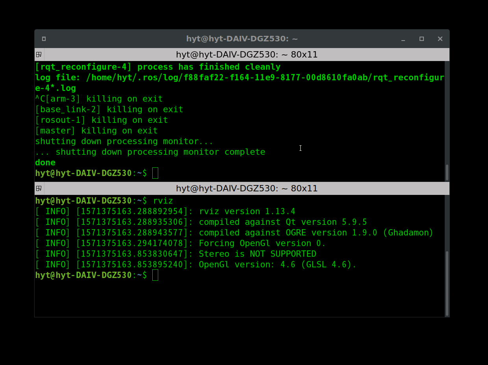
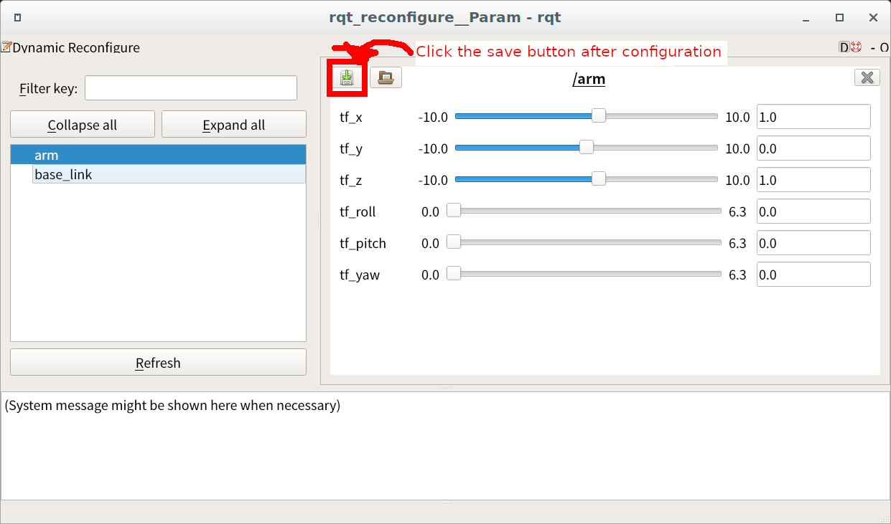

# Tunable static tf broadcaster

The Tunable static tf broadcaster is a node that changes the values of x, y, z, roll, pitch, and yaw using the GUI of the rqt_reconfigure and then publishes them.



## Quick start

```sh
ros2 launch tunable_static_tf_broadcaster sample.launch.xml
```

## How to add tf frames

To increase the number of frames, several instances of the `tunable_static_tf_broadcaster_node` must be launched.

1. Copy the `sample.launch.xml` and assign it a suitable name
2. Add the following lock to the launcher

```xml
  <!-- Add an additional node -->
  <node name="node_name" pkg="tunable_static_tf_broadcaster" exec="tunable_static_tf_broadcaster_node.py" >
    <param name="rate" value="10.0" type="double" /> <!-- Update frequency of the tf [Hz]-->
    <param name="header_frame" value="parent_frame_id" type="string" /> <!-- header frame ID of the tf-->
    <param name="child_frame" value="cild_frame_id" type="string" /> <!-- child frame ID-->
    <param from="$(find-pkg-share tunable_static_tf_broadcaster)/params/initial_values.yaml" /> <!-- YAML file containing the initial values -->
  </node>
```

## How to load the parameters set by the rqt_reconfigure

1. Using `rqt_reconfigure` set the appropriate parameters and save the yaml file from the GUI.

   

2. Configure the previous yaml file so it loads the saved parameters at load time
