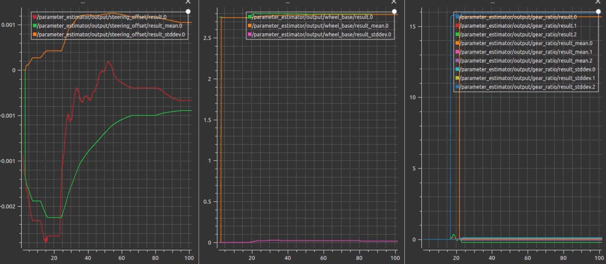
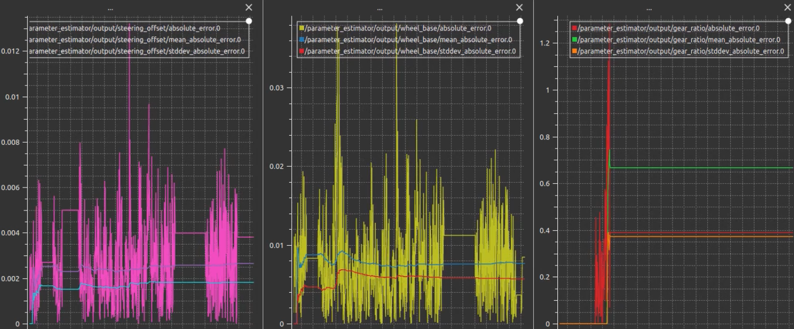

# ParameterEstimation

This parameter estimation node estimates a default parameters from inputs for steer offset,wheel base and gear ratio.

<p align="center">

</p>

## I/O

### input

The following topics are used to estimate the parameters.

- `/sensing/imu/imu_data`: used as vehicle angular velocity
- `/vehicle/status/twist`: used as vehicle velocity
- `/vehicle/status/steering`: used as vehicle steering angle (**Only used in Steer Offset Estimator & Wheel Base Estimator**)
- `/calibration/vehicle/handle_status`: used as vehicle handle angle (**Only used in Gear Estimator**)
- `/vehicle/engage`: used to check the driving operation status

### output

The following topics are the output

- `/vehicle/status/gear_ratio`
- `/vehicle/status/steering_offset`
- `/vehicle/status/wheel_base`

For users, the `EstimationResult.msg` output contains the following items:

- _result_: Estimated result.
- _result_mean_: Average value of result.
- _result_stddev_: Standard deviation value of the estimated parameter
- _absolute_error_: Absolute error of the estimated parameters
- _mean_absolute_error_: Mean absolute error of the estimated parameters
- _stddev_absolute_error_: Standard Deviation of absolute error of the estimated parameters

### These values can be confirmed in [plot_juggler](https://plotjuggler.io/)

- To display in the plot juggler, you need to drag the result into the table, currently plot juggler cannot auto display the value

## How to Run Parameter Estimator

Note: You need to build the Autoware beforehand.

The following command will start the parameter estimation node.

```sh
ros2 launch parameter_estimator parameter_estimator.launch.xml vehicle_model:=lexus
```

- The following arguments are using to select the estimator, default is true
  - select_gear_ratio_estimator
  - select_steer_offset_estimator
  - select_wheel_base_estimator
- To deselect the specific estimator, you need to set estimator to false
- Example, the following command will only launch gear ratio estimator

```sh
ros2 launch parameter_estimator parameter_estimator.launch.xml vehicle_model:=lexus select_steer_offset_estimator:=false select_wheel_base_estimator:=false
```

If you want to launch with Rviz, use the following launch file. **Currently unavailable**

```sh
# Launch parameter Estimator with the Autoware
$ ros2 launch parameter_estimator parameter_estimator_with_simulation.launch.xml map_path:=.../kashiwanoha2/ vehicle_model:=jpntaxi sensor_model:=aip_xx1 rviz:=true
```

### How to check the estimated parameters

The necessary information is plotted in the plot_juggler, which displays the following information from top to bottom.

- First row: Estimation results confirmation
- Second row: error for estimation

You need to adjust the value of `(valid_min_)` or `(valid_max_)`. according to the standard deviation to determine the validity of the data.

#### Estimation results confirmation

Check the estimation results.

- _result_ : parameter estimated at each step
- _result_mean_ : Average of the parameters
- _result_stddev_ : Standard deviation of the estimated parameters

<p align="center">

</p>

It is preferable to use the _\_mean_ for the calibration results.

The parameters estimation starts when enough data is stored. The output value is zero until it is ready.

#### Error for parameters estimation

Check the statistics of the errors in the input/output data after the parameter estimation.

- _absolute_error_ : absolute error of measured and estimated of the parameters estimation
- _mean_absolute_error_ : Mean of the absolute error calculated in each estimation step
- _stddev_absolute_error_ : Standard deviation of the absolute error calculated in each estimation step

<p align="center">

</p>

If these values are large, the model needs to be reconsidered.

## Data preprocessing

### Examine the results of processing the input data

Data that do not satisfy the following conditions are considered invalid and will not be used for estimation.

- Data variation (evaluated by standard deviation) is smaller than the threshold
- The car is not in automatic operation mode (judged from Autoware's Engage, Vehicle's Engage, etc.)
