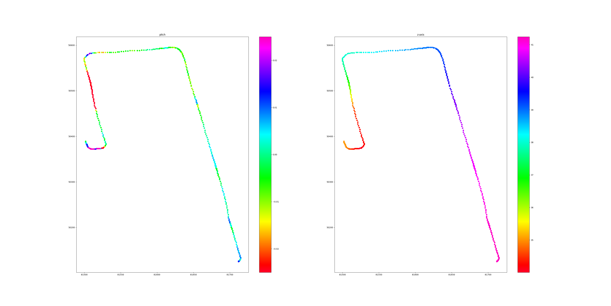

# pitch checker

The role of this node is to visualize pitch of driving route. The source of pitch is tf (`map->base_link`).

## How to visualize

### Collect data

#### launch data collector node

```sh
ros2 launch pitch_checker pitch_checker.launch.xml
```

#### save file to data

```sh
ros2 service call /pitch_checker/save_flag std_srvs/srv/Trigger {}
```

(The pitch data is saved at `<YOUR WORKSPACE>/install/pitch_checker/share/pitch_checker/pitch.csv`)

### Visualize data

```sh
ros2 launch pitch_checker view_pitch.launch.xml
```

The `view_pitch.launch` loads the data stored in the default path and visualize it is as below. The pitch angle [rad] is shown on the left plot, the value of the z-coordinate [m] on the right plot.


