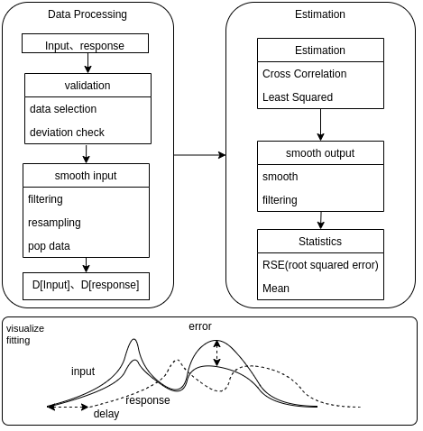
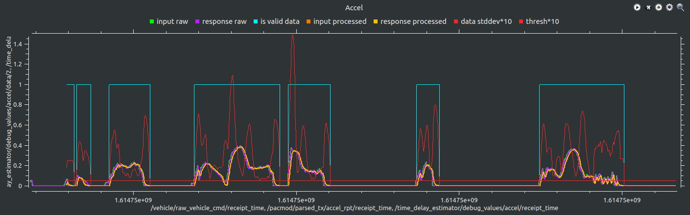
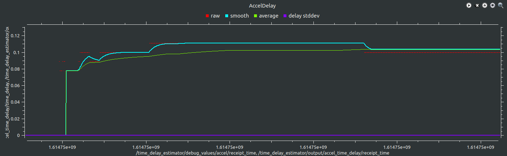
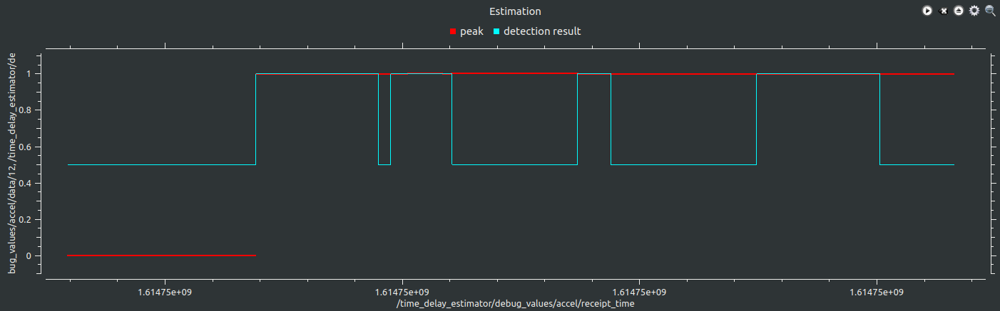
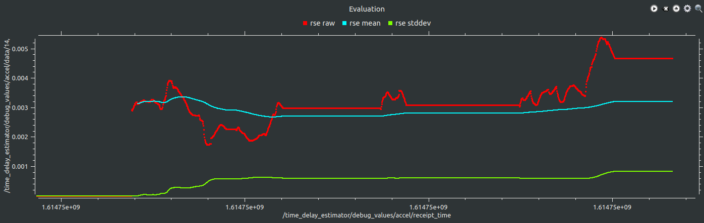
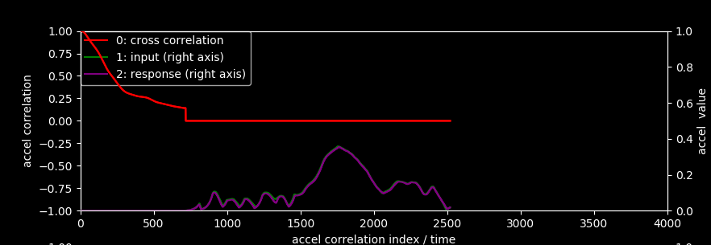

# TimeDelayEstimation

This delay estimation node estimates a time delay from inputs to outputs for accel, brake, and steer.

<p align="center">

</p>

## Input / Response

The following topics are used to estimate the delay.

- `/vehicle/raw_vehicle_cmd`: used as accel/brake target value
- `/control/control_cmd`: used as steer target value
- `/calibration/vehicle/accel_status`: used as accel observed value
- `/calibration/vehicle/brake_status`: used as brake observed value
- `/vehicle/status/steering`: used as steer observed value
- `/calibration/vehicle/is_engage`: used to check the driving operation status

**output**.

For users, the `TimeDelay.msg` output contains the following items:

- _time_delay_: Estimated time delay.
- _mean_: Mean value of the estimated time delay
- _stddev_: Standard deviation of the estimated time delay
- _is_valid_data_: Validity determination of the current data
- _first_order_model_coefficients_：size 2 array of model coefficients(b,k,t)
- _second_order_model_coefficients_：size 2 array of model coefficients(m,b,k,t)

In addition, the following items are output for developers.

- Mean average error of delay estimation
- Standard deviation of the mean error of delay estimation

These values can be confirmed in [rqt_multiplot](http://wiki.ros.org/rqt_multiplot), described below.

## How to Run Time Delay Estimator

Note: You need to build the Autoware beforehand.

The following command will start the delay estimation node.

```bash
ros2 launch time_delay_estimator time_delay_estimator.launch.xml is_showing_debug_graph:=true
```

<p align="center">

</p>

### Change the estimator type

You can decide the estimator_type with the following parameters

- "cc" : Cross Correlation
- "ls" : Least Squared
- "ls2" : Least Squared Second

Note: Only "cc" Cross Correlation will display the debug graph

### How to check the estimated delay

The necessary information is plotted in the rqt_multiplot, which displays the following information from top to bottom.

- First row: Input data processing results examination
- Second row: Estimation results confirmation
- Third row: The confidence level of the estimation results
- Fourth row: Input/output error after delay compensation

### Input data processing results examination

Check the input and output data. It is also used to adjust parameters of the estimation logic.

- _input raw_ : input data
- _response raw_ : response data
- _input processed_ : input data after compensation (\*)
- _response processed_ : response data after compensation (\*)
- _data stddev_ : standard deviation of the data used for estimation (used to determine validity)
- _is valid data_ : Whether the data is valid or not
  - 0.0 : invalid because the standard deviation is less than the threshold (`*_min_stddev_threshold`).
  - 1.0 : valid because the standard deviation is greater than the threshold (`*_min_stddev_threshold`).

(\*) Smoothing, normalization, and resampling are applied as preprocessing.

<p align="center">

</p>

You need to adjust the value of `*_min_stddev_threshold` according to the standard deviation to determine the validity of the data.

#### Estimation results confirmation

Check the estimation results.

- _delay_ : Time delay estimated at each step
- _average_ : Average of the time delays
- _stddev_ : Standard deviation of the estimated delay

<p align="center">

</p>

It is preferable to use the _average_ for the calibration results.

The delay estimation starts when enough data is stored. The output value is zero until it is ready.

#### Confidence level of the estimation results

The reliability of the estimated time delay can be analyzed by the correlation coefficient.

- _correlation peak_ : correlation coefficient between input and output (if this value is low (about 0.7 or less), the estimation may not be successful)
- _detection result_ : Whether the cross-correlation resulted in a good estimation or not.
  - 0.00 : Invalid estimation due to low correlation (output the previous value)
  - 0.50 : Estimation has not started yet or received invalid data
  - 1.00 : Estimation has been done properly

<p align="center">

</p>

#### Input/output error after delay compensation

Check the statistics of the errors in the input/output data after the time delay compensation.

- _mae raw_ : Mean absolute error of input/output after the delay compensation
- _mae mean_ : Mean of the mean absolute error calculated in each estimation step
- _mae stddev_ : Standard deviation of mean absolute error

<p align="center">

</p>

If these values are large, the input/output model needs to be reconsidered.

## Data preprocessing

### Examine the results of processing the input data

Data that do not satisfy the following conditions are considered invalid and will not be used for estimation.

- Data variation (evaluated by standard deviation) is smaller than the threshold
- The car is not in automatic operation mode (judged from Autoware's Engage, Vehicle's Engage, etc.)

### Visualization of delay estimation results

Before running the node, you need to set the `is_showing_debug_info` parameter in the yaml file to true for a visualization.
Then the internal values of accel/brake/steer/test are plotted on the python visualization tool.
If the superposition of input and response is good, we can say that we have a good estimation.

<p align="center">

</p>

### Test **WIP**

Execute the following command to perform an estimation on the sample data.
This test should be used to see the characteristics when the parameters are changed.

```sh
roslaunch time_delay_estimator test_time_delay_estimator.launch
```
